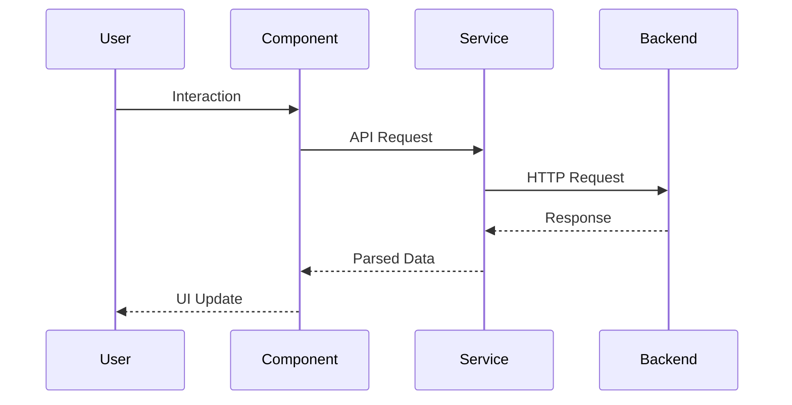
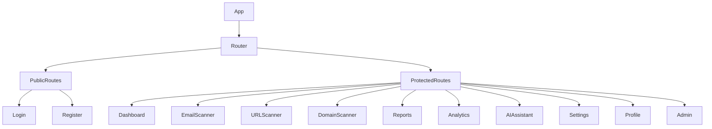
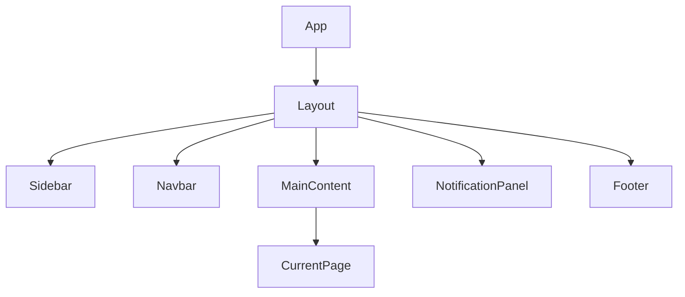
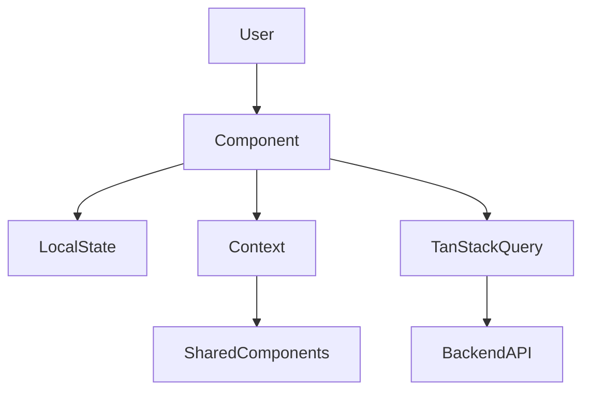
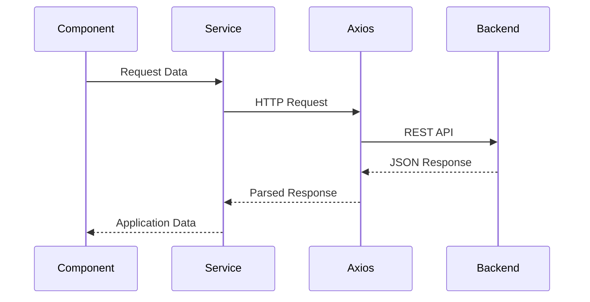

# PhishGuard X

# Volume 3

# Frontend Architecture

**Version:** 1.0  
**Status:** Draft  
**Document Type:** Frontend Architecture Document (FAD)  
**Project:** PhishGuard X – AI-Powered Email Security Platform  
**Prepared By:** Development Team  
**Last Updated:** July 2026

---

# Table of Contents

1. Introduction
2. Frontend Philosophy
3. Frontend Technology Stack
4. Application Architecture
5. Directory Structure
6. Routing Architecture
7. Layout Architecture
8. Design System
9. Theme Architecture
10. Color System
11. Typography
12. Iconography
13. State Management
14. API Layer
15. Authentication Flow
16. Protected Routes
17. Shared Components
18. Dashboard Module
19. Email Scanner Module
20. URL Scanner Module
21. Domain Scanner Module
22. Threat Intelligence Module
23. Reports Module
24. Analytics Module
25. AI Assistant Module
26. Notification Module
27. User Profile Module
28. Settings Module
29. Administration Module
30. Responsive Design
31. Accessibility
32. Performance Optimization
33. Frontend Security
34. Testing Strategy
35. Future Enhancements
36. Conclusion

---

# 1. Introduction

## 1.1 Purpose

This document defines the complete frontend architecture of **PhishGuard X**, an AI-powered phishing detection and email security platform.

The purpose of this document is to provide a comprehensive technical specification for designing and implementing the React-based frontend application. It establishes architectural guidelines, UI organization, design standards, reusable components, routing strategies, state management patterns, API communication principles, and frontend security practices.

Unlike the System Architecture document, which focuses on interactions between system components, this document concentrates exclusively on the presentation layer and user experience.

It serves as the primary reference for frontend developers responsible for implementing the user interface.

---

## 1.2 Objectives

The frontend architecture has been designed to achieve the following objectives.

- Deliver a modern enterprise-grade user interface.
- Maintain clear separation between presentation and business logic.
- Provide a scalable component-based architecture.
- Promote component reusability.
- Ensure responsive layouts across devices.
- Simplify frontend maintenance.
- Support future feature expansion.
- Integrate securely with backend services.
- Deliver an intuitive user experience.

---

## 1.3 Scope

This document covers every major aspect of the frontend implementation, including:

- React application architecture.
- Component organization.
- Routing strategy.
- Layout hierarchy.
- Design system.
- Theme management.
- Authentication flow.
- State management.
- API integration.
- Dashboard implementation.
- Feature modules.
- Shared components.
- Frontend security.
- Performance optimization.
- Accessibility.
- Responsive design.

Backend implementation, database design, AI services, and deployment architecture are documented separately within their respective Development Bible volumes.

---

## 1.4 Intended Audience

This document is intended for:

- Frontend Developers
- UI Engineers
- UX Designers
- Full Stack Developers
- Software Architects
- QA Engineers
- Future Contributors

Readers should possess a working knowledge of React, JavaScript, HTML, CSS, REST APIs, and modern frontend development practices.

---

## 1.5 Relationship with Other Volumes

This document builds upon the architectural foundation established in previous volumes.

| Volume | Relationship |
|---------|--------------|
| Volume 1 | Defines project vision and requirements. |
| Volume 2 | Defines overall system architecture. |
| Volume 4 | Expands backend implementation. |
| Volume 5 | Defines database schema. |
| Volume 6 | Documents API specifications. |
| Volume 17 | Defines UI Design System in greater detail. |

The frontend implementation described within this document communicates with backend services through the REST APIs defined in Volume 6.

---

# 2. Frontend Philosophy

## 2.1 Overview

The frontend of PhishGuard X is designed as a modern Single Page Application (SPA) built using **React**, **Vite**, and **Tailwind CSS**.

The application follows a component-driven architecture where every interface element is constructed from reusable UI components.

The frontend is intentionally designed to remain lightweight by delegating business logic, artificial intelligence, and security analysis to backend services.

This approach improves maintainability, simplifies testing, and enables independent evolution of frontend and backend components.

---

## 2.2 Architectural Philosophy

The frontend architecture follows several guiding principles.

### Component-Driven Development

Every user interface element should be implemented as an independent React component.

Examples include:

- Buttons
- Cards
- Navigation Bars
- Tables
- Charts
- Forms
- Sidebars
- Dialogs

Reusable components reduce code duplication and simplify maintenance.

---

### Separation of Concerns

Presentation logic remains separate from application logic.

React components focus exclusively on:

- Rendering UI
- Handling user interactions
- Managing local state
- Displaying backend responses

Business logic resides within backend services.

---

### API-First Design

The frontend communicates exclusively through documented REST APIs.

The application never accesses databases or AI services directly.

Every interaction follows the sequence:

```
React

↓

Backend API

↓

Business Services

↓

Response

↓

React
```

---

### Reusability

Common functionality should be centralized into reusable components.

Examples include:

- Buttons
- Cards
- Tables
- Input fields
- Modal dialogs
- Loading indicators
- Toast notifications
- Chart wrappers

This minimizes duplication while improving consistency.

---

### Scalability

The frontend structure should support continuous feature expansion without major refactoring.

Future pages, modules, and dashboards should integrate into the existing architecture with minimal changes.

---

### Performance

The frontend should remain responsive under normal operating conditions.

Performance techniques include:

- Lazy loading
- Code splitting
- Memoization
- Efficient rendering
- API caching
- Optimized assets

---

### Accessibility

User interfaces should comply with modern accessibility recommendations.

Examples include:

- Keyboard navigation.
- Screen reader compatibility.
- Semantic HTML.
- High contrast support.
- Focus management.

Accessibility should be considered throughout the development lifecycle.

---

### Consistency

The application should maintain a consistent visual language.

Consistency includes:

- Color usage.
- Typography.
- Spacing.
- Icons.
- Animations.
- Navigation.
- Error messages.
- Loading states.

A unified design language improves usability and user trust.

---

## 2.3 Frontend Design Principles

The frontend implementation follows these engineering principles.

| Rule | Description |
|------|-------------|
| FE-01 | Components should have a single responsibility. |
| FE-02 | Business logic should never reside inside UI components. |
| FE-03 | Shared UI components should be reused throughout the application. |
| FE-04 | All API communication occurs through the Service Layer. |
| FE-05 | The frontend never communicates directly with MongoDB or AI services. |
| FE-06 | State should remain predictable and centralized where appropriate. |
| FE-07 | Performance optimization should be considered during development. |
| FE-08 | Every new module should follow the established project structure. |

---

## 2.4 Frontend Goals

The long-term frontend vision is to provide an enterprise-grade cybersecurity dashboard comparable to commercial security platforms while maintaining a clean, intuitive, and highly responsive user experience.

The frontend should remain:

- Modular
- Responsive
- Secure
- Scalable
- Accessible
- Maintainable
- Developer-friendly

These goals guide every implementation decision described throughout this document.

---
# 3. Frontend Technology Stack

## 3.1 Overview

The frontend of PhishGuard X is built using a modern JavaScript technology stack that emphasizes performance, scalability, maintainability, and developer productivity.

Each technology has been selected based on community adoption, long-term support, integration capabilities, and compatibility with enterprise-grade React applications.

The frontend architecture follows a component-driven development model where independent modules communicate with backend services through secure REST APIs.

---

## 3.2 Technology Stack

| Category | Technology | Purpose |
|-----------|------------|---------|
| Framework | React 19 | User Interface Development |
| Build Tool | Vite | Development Server & Bundling |
| Language | JavaScript (ES6+) | Application Logic |
| Styling | Tailwind CSS | Utility-First Styling |
| Routing | React Router DOM | Client-side Routing |
| API Client | Axios | REST API Communication |
| Data Fetching | TanStack Query | Server State Management |
| Animation | Framer Motion | UI Animations |
| Charts | Recharts | Dashboard Visualization |
| Icons | Lucide React | Icon Library |
| Notifications | React Hot Toast | Toast Notifications |
| Form Validation | React Hook Form + Zod | Form Management |
| State Management | Context API | Global Application State |
| Code Quality | ESLint + Prettier | Code Formatting |

---

## 3.3 Technology Selection Rationale

### React

React provides a modular component architecture that enables reusable UI development while maintaining excellent performance through virtual DOM rendering.

Benefits include:

- Component-based development
- Large ecosystem
- High maintainability
- Strong community support
- Efficient rendering

---

### Vite

Vite is selected as the frontend build tool due to its significantly faster development experience compared to traditional bundlers.

Benefits include:

- Instant startup
- Hot Module Replacement (HMR)
- Optimized production builds
- Faster development cycles

---

### Tailwind CSS

Tailwind CSS enables rapid UI development while maintaining consistent spacing, typography, colors, and responsiveness.

Benefits include:

- Utility-first styling
- Reduced CSS complexity
- Consistent design language
- Excellent responsive utilities

---

### TanStack Query

TanStack Query simplifies communication with backend APIs while automatically handling caching, synchronization, retries, and loading states.

Responsibilities include:

- API caching
- Background refetching
- Automatic retries
- Loading state management

---

### Axios

Axios serves as the centralized HTTP client responsible for all backend communication.

Responsibilities include:

- Request interception
- JWT attachment
- Error handling
- Response parsing

---

## 3.4 Frontend Dependencies

The frontend depends on several backend services.

```mermaid
flowchart LR

React

-->

Backend API

Backend API

-->

Authentication

Backend API

-->

Dashboard

Backend API

-->

Reports

Backend API

-->

AI

Backend API

-->

Threat Intelligence
```

The frontend communicates exclusively with the backend API.

---

## 3.5 Version Management

The project follows semantic versioning.

Example:

```
Major.Minor.Patch

1.0.0

1.1.0

2.0.0
```

Dependencies should be reviewed periodically to ensure compatibility and security.

---

## 3.6 Technology Principles

| Rule | Description |
|------|-------------|
| TECH-01 | Only stable production-ready libraries should be used. |
| TECH-02 | Minimize unnecessary third-party dependencies. |
| TECH-03 | Prefer actively maintained open-source libraries. |
| TECH-04 | Dependencies should be periodically updated. |
| TECH-05 | Library selection should prioritize maintainability over popularity. |

---

# 4. Application Architecture

## 4.1 Overview

The React application follows a modular architecture that separates routing, layouts, components, services, state management, utilities, and feature modules into clearly defined layers.

Each layer has a dedicated responsibility and communicates only through well-defined interfaces.

This architecture simplifies maintenance while enabling independent development of frontend features.

---

## 4.2 High-Level Frontend Architecture

```mermaid
flowchart TD

App

-->

Router

Router

-->

Layouts

Layouts

-->

Pages

Pages

-->

Feature Components

Feature Components

-->

Shared Components

Feature Components

-->

API Services

API Services

-->

Backend
```

---

## 4.3 Architectural Layers

### Application Layer

Responsible for application initialization.

Components include:

- App.jsx
- Main.jsx
- Router
- Global Providers

Responsibilities:

- Bootstrapping
- Routing initialization
- Theme initialization
- Context providers

---

### Layout Layer

Provides consistent application structure.

Components include:

- Dashboard Layout
- Authentication Layout
- Admin Layout

Responsibilities:

- Sidebar
- Navbar
- Footer
- Content Wrapper

---

### Page Layer

Represents complete application pages.

Examples include:

- Dashboard
- Email Scanner
- Reports
- Analytics
- Settings

Each page coordinates multiple reusable components.

---

### Component Layer

Contains reusable UI elements.

Examples:

- Cards
- Buttons
- Tables
- Forms
- Charts
- Modals
- Alerts

---

### Service Layer

Handles backend communication.

Responsibilities:

- API calls
- Authentication requests
- Dashboard data
- Scan requests

Business logic remains outside UI components.

---

### Utility Layer

Contains reusable helper functions.

Examples:

- Validators
- Formatters
- Constants
- Date utilities
- Storage helpers

---

## 4.4 Frontend Request Lifecycle



---

## 4.5 Architectural Characteristics

The frontend architecture exhibits the following characteristics.

### Modular

Each feature exists as an independent module.

---

### Reusable

Shared UI components are reused across multiple pages.

---

### Maintainable

Logical separation improves readability and debugging.

---

### Scalable

Future pages can be integrated with minimal changes.

---

### Testable

Each component can be tested independently.

---

## 4.6 Application Principles

| Rule | Description |
|------|-------------|
| APP-01 | Pages should compose reusable components. |
| APP-02 | Services handle backend communication. |
| APP-03 | Shared components remain presentation-only. |
| APP-04 | Components communicate through props or context. |
| APP-05 | Application state remains predictable. |

---

# 5. Directory Structure

## 5.1 Overview

A well-defined directory structure improves maintainability, simplifies onboarding, and promotes consistency across the frontend codebase.

The project follows a **feature-oriented architecture**, where related files are grouped together based on functionality rather than file type alone.

This organization reduces coupling and enables independent development of application modules.

---

## 5.2 Recommended Directory Structure

```text
src/
│
├── api/
│
├── assets/
│
├── components/
│   ├── common/
│   ├── charts/
│   ├── forms/
│   ├── navigation/
│   ├── feedback/
│   └── layout/
│
├── context/
│
├── hooks/
│
├── layouts/
│
├── pages/
│   ├── dashboard/
│   ├── auth/
│   ├── email-scanner/
│   ├── url-scanner/
│   ├── domain-scanner/
│   ├── reports/
│   ├── analytics/
│   ├── assistant/
│   ├── settings/
│   ├── profile/
│   └── admin/
│
├── routes/
│
├── services/
│
├── store/
│
├── styles/
│
├── theme/
│
├── types/
│
├── utils/
│
├── App.jsx
│
└── main.jsx
```

---

## 5.3 Folder Responsibilities

| Folder | Responsibility |
|---------|---------------|
| api | Axios configuration and API utilities |
| assets | Images, icons, fonts |
| components | Shared reusable UI components |
| context | React Context providers |
| hooks | Custom React Hooks |
| layouts | Application layouts |
| pages | Complete application pages |
| routes | Route definitions |
| services | Backend communication |
| store | Global state management |
| styles | Global CSS |
| theme | Theme configuration |
| types | Shared data models |
| utils | Helper functions |

---

## 5.4 Feature-Based Organization

Every feature module should follow a similar internal structure.

Example:

```text
dashboard/

├── components/

├── hooks/

├── services/

├── constants/

├── utils/

├── Dashboard.jsx

└── index.js
```

This approach keeps all related files together, simplifying maintenance and improving scalability.

---

## 5.5 Naming Conventions

The project follows consistent naming standards.

| Item | Convention |
|------|------------|
| Components | PascalCase |
| Hooks | camelCase prefixed with use |
| Files | PascalCase for components |
| Utilities | camelCase |
| Constants | UPPER_SNAKE_CASE |
| CSS Classes | Tailwind Utility Classes |

Examples:

```
Dashboard.jsx

EmailScanner.jsx

useAuth.js

apiClient.js

AUTH_TOKEN
```

---

## 5.6 Directory Principles

| Rule | Description |
|------|-------------|
| DIR-01 | Features should remain self-contained. |
| DIR-02 | Shared components belong inside the components directory. |
| DIR-03 | API logic remains inside services. |
| DIR-04 | Hooks should remain reusable. |
| DIR-05 | Folder organization should remain consistent across all modules. |

---

## 5.7 Summary

A standardized directory structure establishes consistency throughout the project, simplifies collaboration, and provides a scalable foundation for future frontend development.

---
# 6. Routing Architecture

## 6.1 Overview

The Routing Architecture defines how users navigate throughout the PhishGuard X application.

The application is implemented as a **Single Page Application (SPA)** using **React Router DOM**, enabling seamless navigation without full page reloads.

Routes are organized into logical groups based on authentication requirements, application features, and administrative privileges.

The routing architecture also enforces access control by protecting authenticated pages and restricting administrator-only resources.

---

## 6.2 Routing Objectives

The routing system has been designed to:

- Provide intuitive navigation.
- Separate public and protected pages.
- Simplify route management.
- Support nested layouts.
- Enable lazy loading.
- Improve maintainability.
- Support future feature expansion.

---

## 6.3 Route Hierarchy



---

## 6.4 Route Categories

### Public Routes

Accessible without authentication.

Examples include:

| Route | Purpose |
|---------|----------|
| / | Landing Page |
| /login | User Login |
| /register | User Registration |
| /forgot-password | Password Recovery |
| /reset-password | Password Reset |

---

### Protected Routes

Require valid JWT authentication.

Examples include:

| Route | Purpose |
|---------|----------|
| /dashboard | Dashboard |
| /email-scanner | Email Analysis |
| /url-scanner | URL Analysis |
| /domain-scanner | Domain Analysis |
| /reports | Reports |
| /analytics | Analytics |
| /assistant | AI Assistant |
| /settings | User Settings |
| /profile | User Profile |

---

### Administrative Routes

Accessible only to administrator accounts.

Examples include:

| Route | Purpose |
|---------|----------|
| /admin | Admin Dashboard |
| /admin/users | User Management |
| /admin/logs | Audit Logs |
| /admin/system | System Status |

---

## 6.5 Protected Route Flow

```mermaid
flowchart TD

User

-->

Protected Route

Protected Route

-->

JWT Validation

JWT Validation

-- Valid -->

Page

JWT Validation

-- Invalid -->

Login
```

---

## 6.6 Route Guards

Protected routes use authentication guards.

Responsibilities include:

- Verify JWT.
- Validate user session.
- Check user role.
- Redirect unauthorized users.
- Preserve intended destination.

---

## 6.7 Lazy Loading Strategy

Feature pages should be loaded on demand using React Lazy Loading.

Examples include:

- Reports
- Analytics
- Admin Dashboard
- AI Assistant
- Threat Center

Benefits include:

- Faster initial page load.
- Reduced bundle size.
- Better application performance.

---

## 6.8 Routing Principles

| Rule | Description |
|------|-------------|
| ROUTE-01 | Protected pages require authentication. |
| ROUTE-02 | Administrative pages require administrator privileges. |
| ROUTE-03 | Lazy loading should be used for feature modules. |
| ROUTE-04 | Routes remain organized by feature. |
| ROUTE-05 | Navigation should remain consistent across the application. |

---

# 7. Layout Architecture

## 7.1 Overview

The Layout Architecture defines the overall visual structure shared across multiple pages of the application.

Rather than duplicating navigation components across every page, layouts provide reusable page structures that maintain a consistent user experience throughout the platform.

Each layout is responsible for arranging high-level interface elements while delegating feature-specific content to individual pages.

---

## 7.2 Layout Objectives

The layout architecture aims to:

- Maintain UI consistency.
- Reduce code duplication.
- Improve maintainability.
- Support responsive design.
- Simplify navigation.
- Enable future layout customization.

---

## 7.3 Layout Hierarchy



---

## 7.4 Primary Layouts

### Authentication Layout

Used for authentication-related pages.

Includes:

- Logo
- Authentication Card
- Background Illustration
- Footer

Pages:

- Login
- Register
- Forgot Password
- Reset Password

---

### Dashboard Layout

The primary layout used throughout the application.

Components include:

- Sidebar
- Top Navigation Bar
- Notification Center
- Main Content Area
- Footer

Pages include:

- Dashboard
- Email Scanner
- Reports
- Analytics
- Settings
- Profile

---

### Administration Layout

Dedicated layout for administrative functionality.

Additional features include:

- System Navigation
- User Management
- Audit Logs
- Monitoring
- System Statistics

---

## 7.5 Dashboard Layout Structure

```mermaid
flowchart TD

Dashboard Layout

-->

Sidebar

Dashboard Layout

-->

Navbar

Dashboard Layout

-->

Content

Dashboard Layout

-->

Footer

Content

-->

Current Feature Page
```

---

## 7.6 Sidebar Structure

The Sidebar serves as the primary navigation component.

Navigation items include:

- Dashboard
- Email Scanner
- URL Scanner
- Domain Scanner
- Threat Intelligence
- Reports
- Analytics
- AI Assistant
- Notifications
- Settings
- Profile

Administrator accounts receive additional navigation options.

---

## 7.7 Navbar Components

The Top Navigation Bar contains:

- Search Bar
- Notification Icon
- User Profile
- Theme Toggle
- AI Assistant Shortcut
- User Menu

The navbar remains visible across all authenticated pages.

---

## 7.8 Layout Principles

| Rule | Description |
|------|-------------|
| LAYOUT-01 | Navigation remains consistent across authenticated pages. |
| LAYOUT-02 | Layouts should remain reusable. |
| LAYOUT-03 | Feature pages should never duplicate layout code. |
| LAYOUT-04 | Responsive behavior is mandatory. |
| LAYOUT-05 | Layouts remain independent of business logic. |

---

# 8. Design System

## 8.1 Overview

The Design System establishes a unified visual language for the PhishGuard X frontend.

It defines reusable UI patterns, spacing, colors, typography, components, animations, and interaction behaviors to ensure visual consistency throughout the application.

A centralized design system simplifies development while improving usability, accessibility, and maintainability.

---

## 8.2 Objectives

The Design System aims to:

- Maintain visual consistency.
- Promote reusable UI components.
- Improve accessibility.
- Simplify frontend development.
- Standardize spacing and sizing.
- Create a premium enterprise appearance.

---

## 8.3 Design Philosophy

The visual design of PhishGuard X is inspired by modern enterprise cybersecurity platforms.

Characteristics include:

- Minimalistic interface.
- Dark theme.
- Glassmorphism effects.
- Soft shadows.
- Rounded corners.
- Smooth animations.
- High information density.
- Clear visual hierarchy.

The design prioritizes clarity without sacrificing aesthetics.

---

## 8.4 Core Design Principles

### Consistency

Every page should follow the same design language.

Examples:

- Button styles
- Card spacing
- Typography
- Color usage
- Icons

---

### Simplicity

Interfaces should remain uncluttered.

Only information relevant to the user's current task should be emphasized.

---

### Accessibility

The design system supports:

- High contrast.
- Keyboard navigation.
- Screen readers.
- Clear focus indicators.
- Readable typography.

---

### Responsiveness

Every component should adapt gracefully across:

- Desktop
- Laptop
- Tablet
- Mobile

---

## 8.5 Design Tokens

The application defines reusable design tokens.

Categories include:

- Colors
- Typography
- Border Radius
- Shadows
- Spacing
- Animation Duration
- Icon Sizes
- Component Heights

These tokens ensure consistency throughout the application.

---

## 8.6 Component Categories

The Design System consists of multiple component categories.

### Navigation Components

- Sidebar
- Navbar
- Breadcrumbs
- Pagination

---

### Form Components

- Input
- Password Field
- Dropdown
- Checkbox
- Radio Button
- Toggle Switch
- Textarea

---

### Feedback Components

- Alert
- Toast
- Modal
- Dialog
- Tooltip
- Loading Spinner
- Skeleton Loader

---

### Data Display Components

- Card
- Table
- Badge
- Progress Bar
- Charts
- Timeline
- Statistics Card

---

### Interactive Components

- Buttons
- Tabs
- Accordions
- Drawers
- Floating Action Buttons

---

## 8.7 Design System Principles

| Rule | Description |
|------|-------------|
| DS-01 | Components must follow shared design tokens. |
| DS-02 | Colors remain consistent across modules. |
| DS-03 | Typography follows the defined hierarchy. |
| DS-04 | Interactive elements provide visual feedback. |
| DS-05 | Reusable components should be preferred over custom implementations. |
| DS-06 | Accessibility requirements apply to every component. |

---

## 8.8 Summary

The Design System establishes the visual foundation of PhishGuard X by defining reusable interface standards that promote consistency, usability, and long-term maintainability across the entire frontend application.

---
# 9. Theme Architecture

## 9.1 Overview

The Theme Architecture defines how visual themes are implemented, managed, and applied across the PhishGuard X frontend.

A centralized theme system ensures that colors, typography, spacing, shadows, animations, and component styles remain consistent throughout the application.

Rather than hardcoding styles inside individual components, the application relies on a unified theme configuration that can be updated without modifying component implementations.

The initial release of PhishGuard X adopts a **Dark Enterprise Theme**, with future support for Light Theme and Custom Themes.

---

## 9.2 Theme Objectives

The theme architecture is designed to:

- Maintain visual consistency.
- Support centralized styling.
- Enable future theme switching.
- Improve maintainability.
- Reduce duplicate styling.
- Support accessibility.
- Simplify UI customization.

---

## 9.3 Theme Structure

```mermaid
flowchart TD

Theme Provider

-->

Color Palette

Theme Provider

-->

Typography

Theme Provider

-->

Spacing

Theme Provider

-->

Shadows

Theme Provider

-->

Animations

Theme Provider

-->

Components
```

---

## 9.4 Theme Provider

The entire application is wrapped inside a global Theme Provider.

Responsibilities include:

- Managing active theme.
- Providing design tokens.
- Handling dark mode.
- Supporting future theme switching.
- Synchronizing user preferences.

---

## 9.5 Theme Types

### Dark Theme (Default)

The primary interface for Version 1.

Characteristics:

- Black backgrounds.
- Green accent colors.
- Glassmorphism cards.
- Soft shadows.
- High contrast typography.

---

### Light Theme (Future)

Future releases may support a light appearance while preserving the same component hierarchy and layout.

---

### Custom Themes (Future)

Enterprise deployments may allow organizations to define:

- Primary colors.
- Accent colors.
- Logos.
- Branding.
- Typography.

---

## 9.6 Theme Management Flow

```mermaid
flowchart LR

User

-->

Theme Toggle

-->

Theme Provider

-->

React Context

-->

UI Components
```

---

## 9.7 Theme Principles

| Rule | Description |
|------|-------------|
| THEME-01 | Components never hardcode colors. |
| THEME-02 | Theme tokens are reused across the application. |
| THEME-03 | Theme switching occurs globally. |
| THEME-04 | User preference persists across sessions. |
| THEME-05 | Themes remain independent of business logic. |

---

# 10. Color System

## 10.1 Overview

The Color System establishes the official color palette used throughout the PhishGuard X user interface.

Colors are selected to create a premium cybersecurity aesthetic while maintaining readability, accessibility, and strong visual hierarchy.

The interface emphasizes dark backgrounds with green security-focused accents inspired by enterprise security platforms.

---

## 10.2 Primary Color Palette

| Purpose | Color |
|---------|-------|
| Primary Background | #0B0F14 |
| Secondary Background | #141A22 |
| Card Background | #1B2430 |
| Sidebar | #10161F |
| Navbar | #151C26 |
| Border | #2C3645 |

---

## 10.3 Accent Colors

| Purpose | Color |
|---------|-------|
| Primary Green | #00D084 |
| Secondary Green | #14F195 |
| Success | #22C55E |
| Warning | #FACC15 |
| Error | #EF4444 |
| Information | #3B82F6 |

---

## 10.4 Typography Colors

| Element | Color |
|----------|-------|
| Primary Text | #FFFFFF |
| Secondary Text | #C5CED8 |
| Muted Text | #8B98A9 |
| Disabled Text | #6B7280 |

---

## 10.5 Risk Level Colors

Phishing analysis uses standardized risk indicators.

| Risk Level | Color |
|------------|-------|
| Safe | Green |
| Low Risk | Light Green |
| Medium Risk | Yellow |
| High Risk | Orange |
| Critical | Red |

These colors remain consistent throughout dashboards, reports, charts, and scan results.

---

## 10.6 Chart Colors

Analytics components use a consistent visualization palette.

Examples include:

- Green — Safe Emails
- Yellow — Suspicious Emails
- Red — Confirmed Phishing
- Blue — Total Scans
- Purple — Reports Generated

---

## 10.7 Status Indicators

The following colors represent application states.

| Status | Color |
|---------|-------|
| Online | Green |
| Offline | Gray |
| Processing | Blue |
| Warning | Yellow |
| Error | Red |

---

## 10.8 Color Principles

| Rule | Description |
|------|-------------|
| COLOR-01 | Colors are defined centrally. |
| COLOR-02 | Risk colors remain consistent across all modules. |
| COLOR-03 | Components never hardcode color values. |
| COLOR-04 | Accessibility contrast ratios should be maintained. |
| COLOR-05 | Color alone should never communicate critical information. |

---

# 11. Typography

## 11.1 Overview

Typography establishes the visual hierarchy of textual content throughout the application.

A consistent typography system improves readability, accessibility, and overall user experience while reinforcing the professional appearance of the platform.

---

## 11.2 Typography Objectives

The typography system aims to:

- Improve readability.
- Maintain consistency.
- Establish hierarchy.
- Support accessibility.
- Enhance visual clarity.

---

## 11.3 Font Family

The application uses modern sans-serif typography.

Recommended font stack:

```
Inter

Fallback:

system-ui

Segoe UI

Roboto

Helvetica

Arial
```

---

## 11.4 Typography Scale

| Element | Size | Weight |
|----------|------|---------|
| Display | 48px | Bold |
| H1 | 36px | Bold |
| H2 | 30px | SemiBold |
| H3 | 24px | SemiBold |
| H4 | 20px | Medium |
| H5 | 18px | Medium |
| H6 | 16px | Medium |
| Body Large | 16px | Regular |
| Body | 14px | Regular |
| Small | 12px | Regular |
| Caption | 11px | Regular |

---

## 11.5 Typography Hierarchy

The interface follows a consistent hierarchy.

```
Page Title

↓

Section Heading

↓

Card Title

↓

Body Text

↓

Caption

↓

Metadata
```

This hierarchy improves information scanning and readability.

---

## 11.6 Font Weights

| Weight | Usage |
|---------|------|
| 700 | Primary Headings |
| 600 | Section Titles |
| 500 | Navigation |
| 400 | Body Text |
| 300 | Supporting Information |

---

## 11.7 Line Height

Recommended line heights:

| Text Type | Line Height |
|------------|-------------|
| Headings | 120% |
| Body Text | 150% |
| Small Text | 140% |

Proper spacing improves readability during prolonged dashboard usage.

---

## 11.8 Text Usage

### Headings

Used for:

- Page Titles
- Section Titles
- Dashboard Widgets

---

### Body Text

Used for:

- Reports
- Email Analysis
- Settings
- Descriptions

---

### Metadata

Used for:

- Timestamps
- User IDs
- Status Information
- Labels

---

## 11.9 Typography Principles

| Rule | Description |
|------|-------------|
| TYPO-01 | Typography hierarchy remains consistent. |
| TYPO-02 | Font sizes should follow predefined scales. |
| TYPO-03 | Headings should not exceed necessary emphasis. |
| TYPO-04 | Text must remain readable across devices. |
| TYPO-05 | Typography should support accessibility standards. |

---

## 11.10 Summary

The Typography System provides a consistent textual hierarchy that improves readability, reinforces the enterprise identity of PhishGuard X, and supports accessible user interface design across every feature module.

---
# 12. Iconography

## 12.1 Overview

The Iconography System provides a consistent visual language for navigation, actions, notifications, system status, and cybersecurity-related information throughout the PhishGuard X application.

Icons improve usability by allowing users to quickly recognize actions and features without relying solely on text.

PhishGuard X uses **Lucide React** as its primary icon library due to its lightweight implementation, consistent design language, accessibility, and active maintenance.

---

## 12.2 Objectives

The icon system is designed to:

- Improve navigation.
- Increase interface clarity.
- Maintain visual consistency.
- Reduce cognitive load.
- Support accessibility.
- Enhance dashboard usability.

---

## 12.3 Icon Library

Primary Icon Library:

- Lucide React

Future Support:

- Heroicons
- Custom SVG Icons
- Animated Icons

---

## 12.4 Icon Categories

### Navigation Icons

Examples:

- Dashboard
- Email Scanner
- URL Scanner
- Domain Scanner
- Reports
- Analytics
- AI Assistant
- Notifications
- Settings
- Profile

---

### Action Icons

Examples:

- Scan
- Search
- Download
- Upload
- Refresh
- Save
- Delete
- Edit
- Share
- Filter

---

### Security Icons

Examples:

- Shield
- Lock
- Warning
- Alert Triangle
- Bug
- Eye
- Globe
- Mail
- Link
- QR Code

---

### Status Icons

Examples:

- Success
- Error
- Warning
- Information
- Loading
- Processing
- Offline

---

## 12.5 Icon Sizes

| Usage | Size |
|--------|------|
| Small | 16px |
| Standard | 20px |
| Navigation | 24px |
| Dashboard Cards | 28px |
| Hero Icons | 40px |

---

## 12.6 Icon Usage Principles

- Icons should always have meaningful labels where appropriate.
- Decorative icons should not replace important text.
- Interactive icons should provide hover feedback.
- Icons must remain visually consistent across all modules.
- Security-related icons should use standardized colors.

---

## 12.7 Icon Design Rules

| Rule | Description |
|------|-------------|
| ICON-01 | Use Lucide React icons whenever possible. |
| ICON-02 | Maintain consistent icon sizing. |
| ICON-03 | Interactive icons require hover states. |
| ICON-04 | Icons should align with surrounding typography. |
| ICON-05 | Icons should improve usability rather than decorate unnecessarily. |

---

# 13. State Management

## 13.1 Overview

State Management defines how application data is created, shared, updated, and synchronized throughout the React application.

PhishGuard X distinguishes between **local UI state**, **global application state**, and **server state**.

Separating these responsibilities reduces unnecessary re-renders, simplifies debugging, and improves application performance.

---

## 13.2 State Management Strategy

The application uses multiple state management techniques depending on the type of data.

| State Type | Technology |
|------------|------------|
| Local Component State | React useState |
| Shared UI State | Context API |
| Server State | TanStack Query |
| Derived State | useMemo |
| Temporary References | useRef |

---

## 13.3 State Architecture



---

## 13.4 Local State

Local state is used for UI elements that are isolated to a single component.

Examples include:

- Modal visibility
- Form fields
- Toggle switches
- Search input
- Pagination
- Selected rows

Local state should never contain business data shared across multiple pages.

---

## 13.5 Global State

Global state contains information shared throughout the application.

Examples include:

- Authenticated user
- Current theme
- Sidebar collapse state
- User preferences
- Notification count
- Language settings

Global state is managed using React Context.

---

## 13.6 Server State

Server state is managed using TanStack Query.

Responsibilities include:

- Fetching API data
- Automatic caching
- Background refetching
- Retry handling
- Cache invalidation
- Loading states
- Error states

Examples include:

- Dashboard statistics
- Scan history
- Reports
- Analytics
- Notifications

---

## 13.7 State Flow

```mermaid
flowchart LR

Backend

-->

TanStack Query

-->

React Components

-->

User Interface

-->

User Actions

-->

Backend
```

---

## 13.8 State Management Principles

| Rule | Description |
|------|-------------|
| STATE-01 | Keep local state local whenever possible. |
| STATE-02 | Global state should contain only shared information. |
| STATE-03 | Server state should never be duplicated. |
| STATE-04 | Avoid unnecessary Context Providers. |
| STATE-05 | Prefer derived state over duplicated state. |
| STATE-06 | Cache server responses appropriately. |

---

# 14. API Layer

## 14.1 Overview

The API Layer is responsible for all communication between the frontend application and backend services.

Rather than allowing components to communicate directly with HTTP clients, all requests are centralized into reusable service modules.

This abstraction improves maintainability, testing, and consistency while simplifying future backend modifications.

---

## 14.2 Objectives

The API layer aims to:

- Centralize backend communication.
- Standardize API requests.
- Handle authentication automatically.
- Simplify error handling.
- Improve maintainability.
- Support request interception.
- Enable response caching.

---

## 14.3 API Architecture

```mermaid
flowchart TD

React Component

-->

Service

-->

Axios Client

-->

Backend API

Backend API

-->

Axios Client

-->

Service

-->

Component
```

---

## 14.4 API Client

A centralized Axios client is responsible for:

- Base URL configuration.
- Authentication headers.
- Request interception.
- Response interception.
- Error handling.
- Timeout configuration.

No React component should instantiate Axios directly.

---

## 14.5 Service Organization

```text
services/

├── authService.js
├── dashboardService.js
├── emailService.js
├── urlService.js
├── domainService.js
├── reportService.js
├── analyticsService.js
├── notificationService.js
├── profileService.js
└── settingsService.js
```

Each service corresponds to a backend module.

---

## 14.6 Request Lifecycle



---

## 14.7 Authentication Interceptor

Every authenticated request automatically includes the user's JWT.

Responsibilities include:

- Reading access token.
- Attaching Authorization header.
- Refreshing expired tokens.
- Redirecting unauthorized users.
- Handling authentication failures.

---

## 14.8 Error Handling

The API layer standardizes frontend error handling.

Common scenarios include:

- Network failure
- Unauthorized request
- Validation error
- Server error
- Timeout
- Service unavailable

Components receive user-friendly error messages rather than raw server responses.

---

## 14.9 API Layer Principles

| Rule | Description |
|------|-------------|
| API-UI-01 | Components never communicate directly with Axios. |
| API-UI-02 | Services encapsulate all backend communication. |
| API-UI-03 | Authentication is handled automatically. |
| API-UI-04 | Errors are standardized before reaching UI components. |
| API-UI-05 | Service methods should remain reusable and modular. |
| API-UI-06 | API logic should remain independent of presentation logic. |

---

## 14.10 Summary

The API Layer provides a centralized communication mechanism that simplifies backend integration while maintaining a clean separation between presentation and data access logic. Its modular structure promotes consistency, scalability, and easier maintenance across the entire frontend application.

---
# 15. Authentication Flow

## 15.1 Overview

The frontend authentication flow is responsible for managing user login, logout, session persistence, token refresh, and protected navigation.

Authentication is implemented using **JWT (JSON Web Token)** issued by the backend. The frontend never validates credentials directly; instead, it securely communicates with the backend authentication service.

The authentication workflow is designed to provide a seamless user experience while maintaining strong security and minimizing unnecessary authentication requests.

---

## 15.2 Authentication Workflow

```mermaid
flowchart TD

User

-->

Login Page

-->

Authentication Service

-->

Backend API

Backend API

-->

JWT Token

JWT Token

-->

Local Session

Local Session

-->

Protected Routes

Protected Routes

-->

Dashboard
```

---

## 15.3 Authentication Lifecycle

The authentication process consists of the following stages:

### Login

- User enters credentials.
- Client-side validation is performed.
- Credentials are submitted securely to the backend.
- JWT Access Token is issued.
- Refresh Token is generated.
- User information is retrieved.
- Global authentication state is updated.
- User is redirected to the dashboard.

---

### Session Validation

Whenever the application loads:

- Check authentication status.
- Validate existing access token.
- Refresh expired tokens if possible.
- Restore authenticated session.
- Redirect unauthenticated users.

---

### Logout

Logout performs the following operations:

- Remove access token.
- Remove refresh token.
- Clear application state.
- Clear cached requests.
- Redirect to Login page.

---

## 15.4 Authentication State

The global authentication context stores:

| Property | Description |
|----------|-------------|
| isAuthenticated | User login status |
| user | Authenticated user object |
| accessToken | JWT access token |
| refreshToken | Refresh token |
| loading | Authentication initialization state |

---

## 15.5 Authentication Context

The application exposes a centralized authentication context.

Responsibilities include:

- Login
- Logout
- Session restoration
- Token refresh
- User information
- Authorization checks

Every authenticated component consumes this context rather than directly accessing browser storage.

---

## 15.6 Authentication Principles

| Rule | Description |
|------|-------------|
| AUTH-FE-01 | Authentication state is managed globally. |
| AUTH-FE-02 | Components never manipulate tokens directly. |
| AUTH-FE-03 | Session restoration occurs during application startup. |
| AUTH-FE-04 | Logout clears all sensitive frontend state. |
| AUTH-FE-05 | Authentication logic remains independent of UI components. |

---

# 16. Protected Routes

## 16.1 Overview

Protected Routes ensure that only authenticated users can access secured sections of the application.

Every protected page verifies authentication status before rendering its content.

Unauthorized users are automatically redirected to the login page.

---

## 16.2 Route Protection Flow

```mermaid
flowchart TD

Request Route

-->

Authentication Check

Authentication Check

-- Authenticated -->

Render Page

Authentication Check

-- Not Authenticated -->

Redirect Login
```

---

## 16.3 Protected Pages

The following pages require authentication:

| Page | Protection |
|------|------------|
| Dashboard | Required |
| Email Scanner | Required |
| URL Scanner | Required |
| Domain Scanner | Required |
| Reports | Required |
| Analytics | Required |
| AI Assistant | Required |
| Notifications | Required |
| Profile | Required |
| Settings | Required |

---

## 16.4 Administrator Pages

Certain pages require elevated permissions.

Examples include:

- User Management
- System Configuration
- Audit Logs
- System Monitoring
- Threat Management

Access is determined by the authenticated user's assigned role.

---

## 16.5 Route Wrapper

Every protected route is wrapped by a reusable authentication component.

Responsibilities include:

- Authentication verification
- Authorization validation
- Loading state handling
- Unauthorized redirects

This avoids duplicating authentication logic across pages.

---

## 16.6 Unauthorized Access

If a user attempts to access a protected page without valid authentication:

1. Authentication is verified.
2. User session is checked.
3. Invalid sessions are cleared.
4. User is redirected to Login.
5. Intended destination may be preserved for future redirection.

---

## 16.7 Protected Route Principles

| Rule | Description |
|------|-------------|
| ROUTE-PROTECT-01 | Every secured page requires authentication. |
| ROUTE-PROTECT-02 | Authorization occurs before rendering. |
| ROUTE-PROTECT-03 | Route wrappers remain reusable. |
| ROUTE-PROTECT-04 | Unauthorized users never access protected content. |
| ROUTE-PROTECT-05 | Route protection remains centralized. |

---

# 17. Shared Components

## 17.1 Overview

Shared Components are reusable UI elements used throughout the PhishGuard X frontend.

Rather than recreating similar interface elements across multiple pages, common functionality is implemented once and reused wherever required.

This improves consistency, reduces duplication, and simplifies maintenance.

---

## 17.2 Component Architecture

```mermaid
flowchart TD

Shared Components

-->

Buttons

Shared Components

-->

Cards

Shared Components

-->

Forms

Shared Components

-->

Tables

Shared Components

-->

Charts

Shared Components

-->

Dialogs

Shared Components

-->

Feedback

Shared Components

-->

Navigation
```

---

## 17.3 Component Categories

### Navigation Components

- Sidebar
- Navbar
- Breadcrumbs
- Pagination
- Tabs

---

### Input Components

- Text Field
- Password Field
- Search Field
- Dropdown
- Checkbox
- Radio Button
- Toggle Switch
- Textarea

---

### Button Components

Variants include:

- Primary
- Secondary
- Success
- Warning
- Danger
- Ghost
- Icon Button

Each button supports:

- Loading
- Disabled
- Icons
- Click events

---

### Card Components

Reusable card layouts include:

- Statistics Card
- Dashboard Card
- Analytics Card
- Threat Card
- Report Card

Cards maintain consistent spacing and styling.

---

### Table Components

Shared table functionality includes:

- Sorting
- Pagination
- Search
- Row Selection
- Export
- Responsive Layout

---

### Modal Components

Reusable dialogs include:

- Confirmation Dialog
- Delete Dialog
- Scan Details
- User Profile
- Settings

All dialogs follow a consistent interaction pattern.

---

### Feedback Components

Reusable feedback components include:

- Toast Notifications
- Alerts
- Progress Indicators
- Loading Spinner
- Skeleton Loader
- Empty State
- Error State

---

### Chart Components

Analytics visualizations are implemented as reusable chart wrappers.

Supported chart types:

- Line Chart
- Bar Chart
- Pie Chart
- Area Chart
- Doughnut Chart

Each chart receives standardized data structures from backend APIs.

---

## 17.4 Component Communication

```mermaid
flowchart LR

Parent Component

-->

Shared Component

Shared Component

-->

Props

Props

-->

User Interaction

User Interaction

-->

Callback

Callback

-->

Parent Component
```

Shared components remain presentation-focused and communicate exclusively through props and callback functions.

---

## 17.5 Component Design Standards

Every reusable component should include:

- Well-defined props
- Default values
- Loading state
- Error state
- Empty state
- Accessibility support
- Responsive behavior
- Documentation

---

## 17.6 Shared Component Principles

| Rule | Description |
|------|-------------|
| COMP-01 | Shared components should remain presentation-only. |
| COMP-02 | Business logic belongs in feature modules, not reusable components. |
| COMP-03 | Components communicate through props and callbacks. |
| COMP-04 | Every reusable component supports accessibility. |
| COMP-05 | Styling follows the centralized Design System. |
| COMP-06 | Components should remain framework-independent where possible. |

---

## 17.7 Summary

The Shared Components Library provides the foundation for building a consistent, maintainable, and scalable frontend. By centralizing common UI elements into reusable components, the application minimizes duplication while ensuring a cohesive user experience across every feature module.

---
# 18. Dashboard Module

## 18.1 Overview

The Dashboard serves as the primary landing page after successful authentication. It provides users with a centralized overview of the organization's email security posture, recent phishing activities, scan statistics, threat intelligence, and AI-generated insights.

The dashboard is designed to deliver actionable information at a glance, allowing users to quickly identify security risks, monitor system health, and navigate to relevant modules.

---

## 18.2 Objectives

The Dashboard Module aims to:

- Present key security metrics.
- Display real-time phishing statistics.
- Highlight active threats.
- Provide quick access to scanning tools.
- Visualize trends through charts.
- Surface AI-generated insights.
- Improve decision-making through data visualization.

---

## 18.3 Dashboard Layout

```mermaid
flowchart TD

Dashboard

-->

Top Navigation

Dashboard

-->

Sidebar

Dashboard

-->

Statistics Cards

Dashboard

-->

Charts

Dashboard

-->

Threat Feed

Dashboard

-->

Recent Scans

Dashboard

-->

AI Insights

Dashboard

-->

Quick Actions
```

---

## 18.4 Dashboard Sections

### Welcome Section

Displays:

- User greeting.
- Organization name.
- Current date and time.
- Last login timestamp.
- Security summary.

---

### Statistics Overview

Primary KPI cards include:

| Widget | Description |
|----------|-------------|
| Emails Scanned | Total analyzed emails |
| Phishing Detected | Confirmed phishing emails |
| Suspicious Emails | Emails requiring review |
| Safe Emails | Successfully verified emails |
| URLs Analyzed | URL scan count |
| Domains Checked | Domain analysis count |

Each card displays:

- Icon
- Current value
- Percentage change
- Trend indicator
- Quick navigation link

---

### Threat Level Indicator

Displays the current organizational risk level.

Possible values:

- Safe
- Low
- Moderate
- High
- Critical

The indicator uses standardized color coding defined in the Design System.

---

### Recent Activity

Displays:

- Recent email scans.
- URL scans.
- Domain scans.
- User actions.
- Generated reports.

Each activity item includes:

- Timestamp
- User
- Action
- Result
- Status

---

### AI Security Insights

Generated by the Explainable AI Engine.

Examples:

- Unusual phishing campaign detected.
- Suspicious sender trend identified.
- Increase in QR-based phishing.
- High-risk domains targeting organization.
- Weekly phishing trend summary.

---

### Threat Intelligence Feed

Displays live threat intelligence information.

Examples:

- Newly detected phishing domains.
- Blacklisted URLs.
- Expired SSL certificates.
- Suspicious WHOIS registrations.
- OpenPhish updates.
- PhishTank intelligence.

---

### Analytics Overview

Interactive charts display:

- Daily scan volume.
- Weekly phishing trend.
- Risk distribution.
- Email category distribution.
- Top targeted domains.
- Threat severity.

---

### Quick Actions

Provides direct access to:

- Scan Email
- Scan URL
- Scan Domain
- Upload EML File
- Generate Report
- Open AI Assistant

---

## 18.5 Dashboard API Dependencies

| API Endpoint | Purpose |
|--------------|---------|
| GET /dashboard/summary | Dashboard statistics |
| GET /dashboard/activity | Recent activity |
| GET /dashboard/charts | Analytics data |
| GET /dashboard/threats | Threat feed |
| GET /dashboard/insights | AI insights |

---

## 18.6 Dashboard State

Dashboard state includes:

- Statistics
- Activity feed
- Chart data
- Threat intelligence
- AI recommendations
- Loading state
- Error state
- Refresh timestamp

---

## 18.7 Dashboard Loading States

Every dashboard widget supports:

- Skeleton loading
- Partial refresh
- Empty state
- Retry button
- Error fallback

Widgets load independently to improve perceived performance.

---

## 18.8 Dashboard Principles

| Rule | Description |
|------|-------------|
| DASH-01 | Dashboard widgets load independently. |
| DASH-02 | Critical security information receives visual priority. |
| DASH-03 | Charts should support responsive layouts. |
| DASH-04 | AI insights remain concise and actionable. |
| DASH-05 | Dashboard data refreshes without full page reloads. |

---

# 19. Email Scanner Module

## 19.1 Overview

The Email Scanner Module is the core feature of PhishGuard X. It enables users to analyze email content using artificial intelligence, threat intelligence services, and visual inspection techniques.

Users can paste raw email content, upload `.eml` files, or submit email headers for analysis.

The frontend presents scan progress, detailed analysis results, explainable AI reasoning, and actionable recommendations.

---

## 19.2 Objectives

The Email Scanner Module aims to:

- Analyze suspicious emails.
- Detect phishing attempts.
- Explain AI decisions.
- Display technical threat indicators.
- Generate security reports.
- Improve analyst productivity.

---

## 19.3 Email Scanner Workflow

```mermaid
flowchart TD

User Input

-->

Email Validation

-->

Backend API

-->

AI Analysis

-->

Threat Intelligence

-->

Visual Analysis

-->

Decision Engine

-->

Scan Results
```

---

## 19.4 Input Methods

Users may submit emails through:

- Paste email content.
- Upload `.eml` files.
- Upload `.txt` email files.
- Paste raw email headers.

Future versions may support direct mailbox integration.

---

## 19.5 Scan Result Components

Each scan displays:

### Risk Score

Numerical score ranging from:

```
0 — Safe

100 — Highly Malicious
```

---

### AI Prediction

Possible classifications:

- Safe
- Suspicious
- Phishing

---

### Confidence Score

Displays model confidence percentage.

Example:

```
96.4%
```

---

### Explainable AI

Displays reasons behind the prediction.

Examples:

- Urgent language detected.
- Suspicious sender domain.
- Credential harvesting keywords.
- URL mismatch.
- Attachment anomaly.

---

### Technical Analysis

Displays:

- SPF Status
- DKIM Status
- DMARC Status
- Header Analysis
- Domain Reputation
- SSL Information

---

### Visual Analysis

Displays findings from:

- OCR
- QR Detection
- Image Inspection
- Future Logo Detection

---

### Recommended Actions

Possible recommendations:

- Safe to Open
- Verify Sender
- Delete Email
- Report to Administrator
- Block Sender
- Quarantine Message

---

## 19.6 Email Scanner API Endpoints

| Endpoint | Purpose |
|-----------|----------|
| POST /scan/email | Submit email |
| GET /scan/result | Retrieve analysis |
| GET /scan/history | Scan history |
| POST /report/generate | Generate PDF report |

---

## 19.7 Scanner States

The scanner supports:

- Idle
- Uploading
- Processing
- Completed
- Failed

Each state provides appropriate visual feedback.

---

## 19.8 Module Principles

| Rule | Description |
|------|-------------|
| EMAIL-01 | Email validation occurs before upload. |
| EMAIL-02 | Scan progress remains visible. |
| EMAIL-03 | Explainable AI accompanies every prediction. |
| EMAIL-04 | Reports can be generated directly from results. |
| EMAIL-05 | Results remain available in scan history. |

---

# 20. URL Scanner Module

## 20.1 Overview

The URL Scanner Module enables users to inspect potentially malicious URLs before visiting them.

The module combines artificial intelligence, reputation services, WHOIS analysis, SSL inspection, DNS verification, and blacklist intelligence to determine the safety of submitted URLs.

---

## 20.2 Objectives

The URL Scanner Module aims to:

- Detect malicious URLs.
- Analyze domain reputation.
- Verify SSL certificates.
- Identify URL obfuscation.
- Detect phishing websites.
- Provide explainable security assessments.

---

## 20.3 URL Scan Workflow

```mermaid
flowchart TD

URL Submission

-->

Validation

-->

Backend API

-->

Threat Intelligence

-->

AI Classification

-->

Risk Assessment

-->

Results
```

---

## 20.4 URL Analysis Components

Each scan includes:

### URL Information

- Original URL
- Expanded URL
- Protocol
- Domain
- IP Address

---

### Reputation Analysis

Displays:

- Reputation Score
- Blacklist Status
- Domain Age
- WHOIS Information
- SSL Status

---

### URL Features

Examines:

- URL Length
- Special Characters
- Redirects
- Shortened URLs
- Suspicious Keywords
- Homograph Attacks

---

### AI Classification

Possible outputs:

- Safe
- Suspicious
- Malicious

---

### Explainable AI

Provides reasoning behind the prediction.

Examples:

- Domain recently registered.
- Suspicious redirect chain.
- Similarity to trusted brand.
- Blacklisted reputation.
- Missing HTTPS.

---

## 20.5 URL Scanner API Endpoints

| Endpoint | Purpose |
|-----------|----------|
| POST /scan/url | Submit URL |
| GET /scan/url/history | URL scan history |
| GET /scan/url/report | Scan report |

---

## 20.6 Scanner States

Supported states include:

- Idle
- Validating
- Processing
- Completed
- Error

The UI provides progress indicators and informative feedback throughout the scanning process.

---

## 20.7 URL Scanner Principles

| Rule | Description |
|------|-------------|
| URL-01 | URLs are validated before submission. |
| URL-02 | Threat intelligence is displayed alongside AI results. |
| URL-03 | Explainable AI accompanies every classification. |
| URL-04 | Reports can be exported for future reference. |
| URL-05 | Scan history is retained for authenticated users. |

---
# 21. Domain Scanner Module

## 21.1 Overview

The Domain Scanner Module enables users to perform comprehensive security assessments of internet domains without requiring a complete URL.

Unlike the URL Scanner, which focuses on individual web addresses, the Domain Scanner evaluates the overall trustworthiness of a domain using technical indicators, reputation intelligence, DNS analysis, WHOIS information, SSL certificates, and AI-assisted risk assessment.

This module assists security analysts in identifying suspicious infrastructure before interacting with associated websites or email senders.

---

## 21.2 Objectives

The Domain Scanner Module aims to:

- Assess domain legitimacy.
- Verify domain ownership information.
- Analyze DNS configuration.
- Inspect SSL certificates.
- Detect recently registered domains.
- Evaluate reputation scores.
- Generate comprehensive domain reports.

---

## 21.3 Domain Scan Workflow

```mermaid
flowchart TD

Domain Input

-->

Domain Validation

-->

Backend API

-->

WHOIS Analysis

-->

DNS Analysis

-->

SSL Inspection

-->

Threat Intelligence

-->

AI Risk Assessment

-->

Results
```

---

## 21.4 Input Requirements

Supported inputs include:

- Domain Name
- Subdomain
- Internationalized Domain Name (IDN)

Examples:

```
example.com

mail.example.com

login.company.org
```

---

## 21.5 Analysis Components

### Domain Information

Displays:

- Domain Name
- Registrar
- Registration Date
- Expiration Date
- Domain Age
- Name Servers

---

### DNS Analysis

Displays:

- A Records
- AAAA Records
- MX Records
- TXT Records
- CNAME Records
- NS Records

---

### SSL Analysis

Displays:

- Certificate Authority
- Issue Date
- Expiration Date
- Certificate Validity
- Encryption Protocol
- Security Grade

---

### Reputation Analysis

Displays:

- Reputation Score
- Blacklist Status
- Malware Indicators
- Phishing Indicators
- Abuse Reports

---

### AI Assessment

Possible outputs:

- Trusted
- Suspicious
- Malicious

Each assessment includes a confidence score and explainable reasoning.

---

## 21.6 API Endpoints

| Endpoint | Purpose |
|-----------|----------|
| POST /scan/domain | Submit domain |
| GET /scan/domain/history | Domain history |
| GET /scan/domain/report | Export report |

---

## 21.7 User Interface

The Domain Scanner page includes:

- Domain Input
- Recent Searches
- Scan Progress
- Domain Summary
- DNS Information
- SSL Card
- AI Risk Card
- Technical Details
- Export Options

---

## 21.8 Module Principles

| Rule | Description |
|------|-------------|
| DOMAIN-01 | Validate domain format before submission. |
| DOMAIN-02 | Display technical findings alongside AI predictions. |
| DOMAIN-03 | Separate DNS, SSL, and WHOIS information into dedicated sections. |
| DOMAIN-04 | Reports should be exportable. |
| DOMAIN-05 | Historical scans remain searchable. |

---

# 22. Threat Intelligence Module

## 22.1 Overview

The Threat Intelligence Module aggregates information from multiple security intelligence sources to provide users with real-time visibility into emerging phishing campaigns, malicious domains, suspicious URLs, compromised infrastructure, and security trends.

Rather than functioning as a standalone scanner, this module continuously enriches scan results with contextual threat information gathered from trusted intelligence providers.

---

## 22.2 Objectives

The Threat Intelligence Module aims to:

- Display live threat intelligence.
- Correlate indicators of compromise (IOCs).
- Monitor phishing campaigns.
- Provide contextual security insights.
- Improve phishing detection accuracy.
- Support security investigations.

---

## 22.3 Intelligence Sources

Potential intelligence providers include:

- OpenPhish
- PhishTank
- AbuseIPDB
- VirusTotal
- URLHaus
- Spamhaus

Additional enterprise intelligence feeds may be integrated in future versions.

---

## 22.4 Threat Intelligence Dashboard

The dashboard presents:

### Live Threat Feed

Displays:

- Newly detected phishing URLs
- Active phishing domains
- Recent malware campaigns
- Emerging email threats

---

### IOC Dashboard

Displays:

- Domains
- URLs
- IP Addresses
- Email Addresses
- File Hashes

Each IOC links to associated scan history and threat reports.

---

### Global Threat Statistics

Visualizations include:

- Daily phishing campaigns
- Threat categories
- Geographic distribution
- Attack frequency
- Campaign trends

---

### Threat Alerts

Users receive notifications for:

- High-risk phishing campaigns
- Newly blacklisted domains
- Critical reputation changes
- Emerging attack techniques

---

## 22.5 API Endpoints

| Endpoint | Purpose |
|-----------|----------|
| GET /threat/feed | Live threat feed |
| GET /threat/statistics | Dashboard metrics |
| GET /threat/ioc | IOC database |
| GET /threat/alerts | Active alerts |

---

## 22.6 Threat Feed Refresh

The frontend periodically refreshes:

- Threat feed
- Alerts
- Campaign statistics

Updates occur without requiring manual page refresh.

---

## 22.7 Module Principles

| Rule | Description |
|------|-------------|
| THREAT-01 | Threat data updates automatically. |
| THREAT-02 | Critical alerts receive visual priority. |
| THREAT-03 | Threat intelligence supplements scan results. |
| THREAT-04 | IOC data remains searchable. |
| THREAT-05 | Threat sources should be clearly identified where applicable. |

---

# 23. Reports Module

## 23.1 Overview

The Reports Module enables users to generate, view, export, and manage detailed phishing analysis reports.

Reports consolidate AI predictions, threat intelligence findings, technical analysis, visual inspection results, and recommended mitigation actions into a structured document suitable for operational use, audits, and incident response.

---

## 23.2 Objectives

The Reports Module aims to:

- Generate professional security reports.
- Support PDF export.
- Provide printable reports.
- Maintain report history.
- Simplify incident documentation.
- Improve analyst productivity.

---

## 23.3 Report Types

Supported reports include:

- Email Analysis Report
- URL Analysis Report
- Domain Analysis Report
- Weekly Summary Report
- Monthly Analytics Report
- Incident Investigation Report

Future releases may support customizable report templates.

---

## 23.4 Report Structure

Each report contains:

### Executive Summary

Provides:

- Scan Result
- Overall Risk
- Confidence Score
- Timestamp
- Analyst Information

---

### Technical Analysis

Includes:

- Header Analysis
- Domain Information
- WHOIS Results
- SSL Analysis
- DNS Findings
- Reputation Checks

---

### AI Assessment

Displays:

- AI Prediction
- Confidence Score
- Explainable AI
- Risk Score
- Recommendation

---

### Visual Analysis

Includes:

- OCR Results
- QR Detection
- Image Findings
- Screenshot Evidence (Future)

---

### Recommendations

Suggested actions include:

- Block Domain
- Quarantine Email
- Notify Users
- Escalate Investigation
- Monitor Activity

---

## 23.5 Report History

Users can:

- View previous reports.
- Search reports.
- Filter by scan type.
- Filter by risk level.
- Sort by date.
- Re-export reports.

---

## 23.6 Export Formats

Supported formats:

- PDF
- JSON
- CSV (Future)

Enterprise versions may include automated report delivery.

---

## 23.7 API Endpoints

| Endpoint | Purpose |
|-----------|----------|
| POST /reports/generate | Create report |
| GET /reports | List reports |
| GET /reports/{id} | Report details |
| GET /reports/export | Export report |

---

## 23.8 Module Principles

| Rule | Description |
|------|-------------|
| REPORT-01 | Reports should be generated from verified scan results. |
| REPORT-02 | Reports remain immutable after creation. |
| REPORT-03 | Exported reports preserve formatting and integrity. |
| REPORT-04 | Report history should support filtering and search. |
| REPORT-05 | Reports should present technical findings in a clear and structured manner. |

---

# 24. Analytics Module

## 24.1 Overview

The Analytics Module provides comprehensive visualization of phishing trends, scan activity, organizational security posture, and historical threat data.

Unlike the Dashboard, which emphasizes current operational status, the Analytics Module focuses on long-term trends, performance metrics, and actionable insights through interactive charts and statistical reports.

It enables users to monitor the effectiveness of phishing detection, identify emerging attack patterns, and evaluate security improvements over time.

---

## 24.2 Objectives

The Analytics Module aims to:

- Visualize historical scan data.
- Identify phishing trends.
- Monitor detection performance.
- Measure organizational risk.
- Support executive reporting.
- Enable data-driven decision making.

---

## 24.3 Analytics Dashboard

The Analytics Dashboard contains multiple visualization panels.

### Scan Activity

Displays:

- Daily scans
- Weekly scans
- Monthly scans
- Yearly scans

---

### Risk Distribution

Visualizes:

- Safe emails
- Suspicious emails
- Confirmed phishing
- False positives
- False negatives

---

### Threat Categories

Displays attacks grouped by:

- Credential Phishing
- Business Email Compromise (BEC)
- Malware Delivery
- QR Phishing
- Brand Impersonation
- Financial Fraud

---

### Geographic Threat Map

Displays:

- Origin countries
- Threat hotspots
- Regional attack statistics

Future versions may include interactive map visualization.

---

### Detection Performance

Displays:

- Detection Accuracy
- Precision
- Recall
- F1 Score
- AI Confidence Distribution

---

## 24.4 API Endpoints

| Endpoint | Purpose |
|-----------|----------|
| GET /analytics/overview | Summary metrics |
| GET /analytics/trends | Historical trends |
| GET /analytics/performance | Detection performance |
| GET /analytics/charts | Visualization data |

---

## 24.5 Module Principles

| Rule | Description |
|------|-------------|
| ANALYTICS-01 | Charts should support responsive resizing. |
| ANALYTICS-02 | Data visualizations remain interactive where appropriate. |
| ANALYTICS-03 | Historical data should support filtering by time range. |
| ANALYTICS-04 | Export functionality should preserve chart accuracy. |
| ANALYTICS-05 | Analytics should complement operational dashboards rather than duplicate them. |

---
# 25. AI Assistant Module

## 25.1 Overview

The AI Assistant Module serves as an intelligent cybersecurity companion that helps users understand phishing analysis, interpret scan results, investigate threats, and navigate the PhishGuard X platform.

Rather than replacing the phishing detection engine, the AI Assistant enhances the user experience by providing contextual explanations, answering security-related questions, and assisting during incident investigations.

The assistant communicates with the backend AI service, which integrates Large Language Models (LLMs) with Explainable AI outputs and threat intelligence data.

---

## 25.2 Objectives

The AI Assistant Module aims to:

- Explain phishing scan results.
- Assist during investigations.
- Answer cybersecurity questions.
- Explain technical terminology.
- Recommend remediation actions.
- Improve user productivity.
- Reduce analyst investigation time.

---

## 25.3 Assistant Features

### Natural Language Chat

Users can ask questions such as:

- Why is this email suspicious?
- Explain this phishing score.
- What does SPF failure mean?
- Should I block this domain?
- Summarize today's phishing activity.

---

### Context-Aware Assistance

The assistant can access the current page context.

Examples:

- Dashboard statistics
- Email scan results
- URL analysis
- Domain investigation
- Reports

This eliminates the need for users to repeatedly provide the same information.

---

### Explainable AI Integration

The assistant translates technical findings into human-readable explanations.

Examples:

- Why the AI classified an email as phishing.
- How domain age influenced the score.
- Why SSL validation failed.
- Why a QR code is considered suspicious.

---

### Investigation Assistance

Supports users by:

- Summarizing findings.
- Highlighting critical indicators.
- Suggesting investigation steps.
- Providing remediation recommendations.
- Identifying suspicious patterns.

---

## 25.4 Conversation Interface

The interface includes:

- Chat Window
- Suggested Prompts
- Conversation History
- Typing Indicator
- Copy Response
- Clear Conversation
- Feedback Buttons

---

## 25.5 API Endpoints

| Endpoint | Purpose |
|-----------|----------|
| POST /assistant/chat | Send message |
| GET /assistant/history | Conversation history |
| DELETE /assistant/history | Clear history |

---

## 25.6 Assistant States

The module supports:

- Idle
- Listening
- Processing
- Responding
- Error

Visual indicators communicate the assistant's current status.

---

## 25.7 Module Principles

| Rule | Description |
|------|-------------|
| AI-01 | Assistant responses should remain concise and actionable. |
| AI-02 | Responses should reference available scan data when possible. |
| AI-03 | The assistant should clearly distinguish facts from recommendations. |
| AI-04 | Sensitive information must never be exposed unnecessarily. |
| AI-05 | Every AI explanation should remain understandable to non-expert users. |

---

# 26. Notification Module

## 26.1 Overview

The Notification Module delivers timely alerts and system messages to users regarding phishing detections, completed scans, security events, report generation, and administrative announcements.

Notifications improve user awareness while minimizing disruption through categorized, prioritized, and dismissible alerts.

---

## 26.2 Objectives

The Notification Module aims to:

- Inform users of completed operations.
- Alert users about critical threats.
- Display system announcements.
- Provide real-time scan updates.
- Improve user awareness.
- Support notification history.

---

## 26.3 Notification Categories

### Security Notifications

Examples:

- Phishing detected.
- High-risk domain identified.
- Critical threat intelligence update.
- Suspicious login detected.

---

### Scan Notifications

Examples:

- Email scan completed.
- URL analysis finished.
- Domain investigation completed.
- Report generated successfully.

---

### System Notifications

Examples:

- Maintenance schedule.
- New feature available.
- Backend connectivity restored.
- Database backup completed.

---

## 26.4 Notification Priorities

| Priority | Description |
|----------|-------------|
| Critical | Immediate attention required |
| High | Important security event |
| Medium | Operational information |
| Low | General information |

---

## 26.5 Notification Center

The Notification Center provides:

- Notification list
- Read/unread status
- Search
- Filtering
- Mark all as read
- Delete notifications
- Notification preferences

---

## 26.6 Delivery Methods

Notifications may appear as:

- Toast messages
- In-app notifications
- Notification center
- Browser notifications (future)
- Email notifications (future)

---

## 26.7 API Endpoints

| Endpoint | Purpose |
|-----------|----------|
| GET /notifications | Retrieve notifications |
| PATCH /notifications/read | Mark as read |
| DELETE /notifications | Delete notification |

---

## 26.8 Module Principles

| Rule | Description |
|------|-------------|
| NOTIFY-01 | Critical alerts receive highest visual priority. |
| NOTIFY-02 | Notifications should never interrupt ongoing user tasks unnecessarily. |
| NOTIFY-03 | Duplicate notifications should be avoided. |
| NOTIFY-04 | Notification history should remain searchable. |
| NOTIFY-05 | Users should be able to configure notification preferences. |

---

# 27. User Profile Module

## 27.1 Overview

The User Profile Module allows authenticated users to manage their personal information, account settings, security preferences, and activity history.

The profile page centralizes user-specific configuration while maintaining secure management of sensitive account information.

---

## 27.2 Objectives

The User Profile Module aims to:

- Manage account information.
- Update profile details.
- Configure security settings.
- Review account activity.
- Manage connected sessions.
- Improve account security.

---

## 27.3 Profile Information

Users can manage:

- Full Name
- Email Address
- Organization
- Department
- Profile Picture
- Contact Information

---

## 27.4 Security Settings

Available security options include:

- Change Password
- Enable Multi-Factor Authentication (Future)
- Active Sessions
- Login History
- Trusted Devices
- Security Alerts

---

## 27.5 Account Activity

Displays:

- Recent logins
- Scan activity
- Generated reports
- Account updates
- Security events

---

## 27.6 Preferences

Users may configure:

- Theme
- Language
- Time Zone
- Notification preferences
- Dashboard layout (future)

---

## 27.7 API Endpoints

| Endpoint | Purpose |
|-----------|----------|
| GET /profile | Retrieve profile |
| PUT /profile | Update profile |
| PUT /profile/password | Change password |
| GET /profile/activity | Activity history |

---

## 27.8 Module Principles

| Rule | Description |
|------|-------------|
| PROFILE-01 | Sensitive account information should be protected. |
| PROFILE-02 | Profile updates require validation. |
| PROFILE-03 | Password changes require current password verification. |
| PROFILE-04 | Activity history remains read-only. |
| PROFILE-05 | User preferences persist across sessions. |

---

# 28. Settings Module

## 28.1 Overview

The Settings Module provides centralized configuration for application behavior, user preferences, security options, integrations, and system customization.

Settings are organized into logical categories to simplify navigation and improve usability.

---

## 28.2 Objectives

The Settings Module aims to:

- Centralize application configuration.
- Simplify customization.
- Improve usability.
- Support enterprise deployment.
- Provide secure preference management.

---

## 28.3 Settings Categories

### General Settings

Includes:

- Theme
- Language
- Time Zone
- Date Format
- Default Dashboard

---

### Security Settings

Includes:

- Password Management
- Session Timeout
- MFA Configuration (Future)
- Login Alerts
- Trusted Devices

---

### Notification Settings

Users can configure:

- Email Notifications
- In-App Notifications
- Security Alerts
- Weekly Reports
- Threat Intelligence Updates

---

### Integration Settings

Future integrations include:

- Microsoft 365
- Google Workspace
- Slack
- Microsoft Teams
- SIEM Platforms
- Webhooks

---

### Privacy Settings

Users may configure:

- Data Retention
- Activity Logging
- Consent Preferences
- Export Personal Data

---

## 28.4 API Endpoints

| Endpoint | Purpose |
|-----------|----------|
| GET /settings | Retrieve settings |
| PUT /settings | Update settings |
| POST /settings/reset | Restore defaults |

---

## 28.5 Module Principles

| Rule | Description |
|------|-------------|
| SETTINGS-01 | Settings should be categorized logically. |
| SETTINGS-02 | Configuration changes require validation. |
| SETTINGS-03 | User preferences persist across devices where applicable. |
| SETTINGS-04 | Sensitive settings require authentication confirmation. |
| SETTINGS-05 | Default values should be recoverable through reset functionality. |

---
# 29. Administration Module

## 29.1 Overview

The Administration Module provides privileged users with centralized tools to manage the PhishGuard X platform. It enables administrators to oversee users, monitor platform health, configure application settings, review security events, and maintain operational visibility.

Administrative functionality is isolated from standard user features through Role-Based Access Control (RBAC) to ensure that sensitive operations are performed only by authorized personnel.

---

## 29.2 Objectives

The Administration Module aims to:

- Manage user accounts.
- Monitor system health.
- Configure platform settings.
- Review audit logs.
- Manage user roles and permissions.
- Monitor AI service availability.
- View security events.
- Support operational maintenance.

---

## 29.3 Administrative Dashboard

The Administration Dashboard contains the following sections:

### System Overview

Displays:

- Active Users
- Total Organizations
- Emails Processed
- AI Service Status
- Database Status
- API Health
- Storage Usage
- System Uptime

---

### User Management

Administrators can:

- View users.
- Search users.
- Create users.
- Suspend accounts.
- Activate accounts.
- Reset passwords.
- Assign roles.
- Delete accounts.

---

### Role Management

Supported roles include:

| Role | Permissions |
|------|-------------|
| Administrator | Full system access |
| Security Analyst | Scan and investigation features |
| Standard User | Personal scanning capabilities |
| Auditor | Read-only access to reports and logs |

Future enterprise versions may support custom role definitions.

---

### Audit Logs

Displays:

- User logins
- Failed authentication attempts
- Password changes
- Report generation
- Administrative actions
- System configuration changes
- Security events

Logs support:

- Filtering
- Search
- Export
- Date range selection

---

### System Monitoring

Displays real-time status of:

- Backend API
- AI Service
- MongoDB
- Threat Intelligence Services
- Email Queue
- Scheduled Jobs

---

### Platform Configuration

Administrative configuration includes:

- Default Security Policies
- Scan Limits
- AI Confidence Thresholds
- Threat Feed Configuration
- Session Timeout
- Password Policies
- Data Retention Policies

---

## 29.4 Administrative API Endpoints

| Endpoint | Purpose |
|-----------|----------|
| GET /admin/dashboard | Dashboard statistics |
| GET /admin/users | User management |
| GET /admin/logs | Audit logs |
| GET /admin/system | System health |
| PUT /admin/config | Platform configuration |

---

## 29.5 Administrative Principles

| Rule | Description |
|------|-------------|
| ADMIN-01 | Administrative pages require administrator privileges. |
| ADMIN-02 | Every administrative action should be logged. |
| ADMIN-03 | Sensitive configuration changes require confirmation. |
| ADMIN-04 | Administrative operations should remain auditable. |
| ADMIN-05 | System monitoring should update in near real-time. |

---

# 30. Responsive Design

## 30.1 Overview

PhishGuard X is designed as a responsive web application that delivers a consistent and usable experience across desktops, laptops, tablets, and mobile devices.

The responsive design strategy prioritizes desktop usage, reflecting the needs of cybersecurity professionals, while ensuring that essential functionality remains accessible on smaller screens.

---

## 30.2 Objectives

The responsive design strategy aims to:

- Support multiple screen sizes.
- Maintain usability.
- Preserve visual consistency.
- Optimize layout adaptation.
- Improve accessibility.
- Minimize horizontal scrolling.

---

## 30.3 Supported Breakpoints

| Device | Width |
|---------|------|
| Mobile | < 640px |
| Small Tablet | 640px – 767px |
| Tablet | 768px – 1023px |
| Laptop | 1024px – 1279px |
| Desktop | ≥ 1280px |

---

## 30.4 Responsive Layout Behavior

### Mobile

- Collapsible sidebar.
- Simplified navigation.
- Single-column layouts.
- Touch-friendly controls.
- Optimized forms.

---

### Tablet

- Condensed sidebar.
- Responsive dashboard cards.
- Adaptive tables.
- Flexible chart layouts.

---

### Desktop

- Persistent sidebar.
- Multi-column dashboards.
- Expanded analytics.
- Full navigation.
- Maximum information density.

---

## 30.5 Responsive Components

The following components adapt automatically:

- Sidebar
- Navbar
- Dashboard Cards
- Charts
- Tables
- Forms
- Modals
- Reports

---

## 30.6 Responsive Images

Images should:

- Scale proportionally.
- Support high-DPI displays.
- Use lazy loading where appropriate.
- Avoid layout shifts.

---

## 30.7 Responsive Principles

| Rule | Description |
|------|-------------|
| RESPONSIVE-01 | Mobile-first responsive utilities should be supported. |
| RESPONSIVE-02 | Layouts adapt without losing functionality. |
| RESPONSIVE-03 | Charts remain readable on smaller screens. |
| RESPONSIVE-04 | Touch targets meet accessibility recommendations. |
| RESPONSIVE-05 | Navigation remains intuitive across all devices. |

---

# 31. Accessibility

## 31.1 Overview

Accessibility ensures that PhishGuard X remains usable by individuals with diverse abilities and assistive technologies.

The frontend follows modern accessibility recommendations by emphasizing semantic HTML, keyboard navigation, readable typography, sufficient color contrast, and screen reader compatibility.

Accessibility is integrated throughout the application rather than treated as an afterthought.

---

## 31.2 Objectives

The accessibility strategy aims to:

- Improve usability.
- Support assistive technologies.
- Ensure keyboard accessibility.
- Maintain readable interfaces.
- Promote inclusive design.
- Meet modern accessibility standards.

---

## 31.3 Accessibility Features

Supported features include:

- Keyboard navigation.
- Screen reader compatibility.
- Semantic HTML.
- Focus indicators.
- High contrast support.
- Alternative text for images.
- Accessible form labels.

---

## 31.4 Keyboard Navigation

Every interactive component should support:

- Tab navigation.
- Enter activation.
- Escape for dialogs.
- Arrow key navigation where applicable.

No feature should require a mouse.

---

## 31.5 Forms

Accessible forms include:

- Labels
- Validation messages
- Error descriptions
- Required field indicators
- Logical tab order

---

## 31.6 Color Accessibility

Color should never be the only indicator of status.

Examples:

- Icons
- Labels
- Text
- Tooltips

These accompany color-based indicators.

---

## 31.7 Accessibility Principles

| Rule | Description |
|------|-------------|
| ACCESS-01 | Every interactive element must be keyboard accessible. |
| ACCESS-02 | Semantic HTML should be preferred over generic containers. |
| ACCESS-03 | Images require meaningful alternative text where appropriate. |
| ACCESS-04 | Color should not be the sole communication mechanism. |
| ACCESS-05 | Focus states should remain clearly visible. |

---

# 32. Performance Optimization

## 32.1 Overview

Performance optimization ensures that the frontend remains fast, responsive, and efficient even as application complexity increases.

The architecture incorporates multiple optimization strategies that reduce bundle size, minimize unnecessary rendering, and improve perceived performance.

---

## 32.2 Objectives

The performance strategy aims to:

- Reduce initial load time.
- Improve rendering efficiency.
- Optimize API communication.
- Minimize unnecessary re-renders.
- Improve user experience.
- Support enterprise-scale deployments.

---

## 32.3 Performance Techniques

### Code Splitting

Large feature modules are loaded on demand using lazy loading.

Examples:

- Reports
- Analytics
- Administration
- AI Assistant

---

### Memoization

React optimization techniques include:

- useMemo
- useCallback
- React.memo

These reduce unnecessary component rendering.

---

### API Optimization

Strategies include:

- Response caching.
- Background refetching.
- Request deduplication.
- Pagination.
- Incremental loading.

---

### Asset Optimization

Images and static assets should:

- Be compressed.
- Use modern formats.
- Load lazily.
- Minimize bandwidth usage.

---

### Rendering Optimization

Components should:

- Avoid excessive nesting.
- Minimize state updates.
- Virtualize large tables.
- Render only visible content.

---

## 32.4 Performance Metrics

Key frontend metrics include:

- First Contentful Paint (FCP)
- Largest Contentful Paint (LCP)
- Time to Interactive (TTI)
- Cumulative Layout Shift (CLS)
- Total Blocking Time (TBT)

These metrics should be monitored throughout development.

---

## 32.5 Performance Principles

| Rule | Description |
|------|-------------|
| PERF-01 | Large feature modules should use lazy loading. |
| PERF-02 | Expensive calculations should be memoized. |
| PERF-03 | API requests should be cached where appropriate. |
| PERF-04 | Large datasets should support pagination or virtualization. |
| PERF-05 | Performance monitoring should be part of continuous development. |

---
# 29. Administration Module

## 29.1 Overview

The Administration Module provides privileged users with centralized tools to manage the PhishGuard X platform. It enables administrators to oversee users, monitor platform health, configure application settings, review security events, and maintain operational visibility.

Administrative functionality is isolated from standard user features through Role-Based Access Control (RBAC) to ensure that sensitive operations are performed only by authorized personnel.

---

## 29.2 Objectives

The Administration Module aims to:

- Manage user accounts.
- Monitor system health.
- Configure platform settings.
- Review audit logs.
- Manage user roles and permissions.
- Monitor AI service availability.
- View security events.
- Support operational maintenance.

---

## 29.3 Administrative Dashboard

The Administration Dashboard contains the following sections:

### System Overview

Displays:

- Active Users
- Total Organizations
- Emails Processed
- AI Service Status
- Database Status
- API Health
- Storage Usage
- System Uptime

---

### User Management

Administrators can:

- View users.
- Search users.
- Create users.
- Suspend accounts.
- Activate accounts.
- Reset passwords.
- Assign roles.
- Delete accounts.

---

### Role Management

Supported roles include:

| Role | Permissions |
|------|-------------|
| Administrator | Full system access |
| Security Analyst | Scan and investigation features |
| Standard User | Personal scanning capabilities |
| Auditor | Read-only access to reports and logs |

Future enterprise versions may support custom role definitions.

---

### Audit Logs

Displays:

- User logins
- Failed authentication attempts
- Password changes
- Report generation
- Administrative actions
- System configuration changes
- Security events

Logs support:

- Filtering
- Search
- Export
- Date range selection

---

### System Monitoring

Displays real-time status of:

- Backend API
- AI Service
- MongoDB
- Threat Intelligence Services
- Email Queue
- Scheduled Jobs

---

### Platform Configuration

Administrative configuration includes:

- Default Security Policies
- Scan Limits
- AI Confidence Thresholds
- Threat Feed Configuration
- Session Timeout
- Password Policies
- Data Retention Policies

---

## 29.4 Administrative API Endpoints

| Endpoint | Purpose |
|-----------|----------|
| GET /admin/dashboard | Dashboard statistics |
| GET /admin/users | User management |
| GET /admin/logs | Audit logs |
| GET /admin/system | System health |
| PUT /admin/config | Platform configuration |

---

## 29.5 Administrative Principles

| Rule | Description |
|------|-------------|
| ADMIN-01 | Administrative pages require administrator privileges. |
| ADMIN-02 | Every administrative action should be logged. |
| ADMIN-03 | Sensitive configuration changes require confirmation. |
| ADMIN-04 | Administrative operations should remain auditable. |
| ADMIN-05 | System monitoring should update in near real-time. |

---

# 30. Responsive Design

## 30.1 Overview

PhishGuard X is designed as a responsive web application that delivers a consistent and usable experience across desktops, laptops, tablets, and mobile devices.

The responsive design strategy prioritizes desktop usage, reflecting the needs of cybersecurity professionals, while ensuring that essential functionality remains accessible on smaller screens.

---

## 30.2 Objectives

The responsive design strategy aims to:

- Support multiple screen sizes.
- Maintain usability.
- Preserve visual consistency.
- Optimize layout adaptation.
- Improve accessibility.
- Minimize horizontal scrolling.

---

## 30.3 Supported Breakpoints

| Device | Width |
|---------|------|
| Mobile | < 640px |
| Small Tablet | 640px – 767px |
| Tablet | 768px – 1023px |
| Laptop | 1024px – 1279px |
| Desktop | ≥ 1280px |

---

## 30.4 Responsive Layout Behavior

### Mobile

- Collapsible sidebar.
- Simplified navigation.
- Single-column layouts.
- Touch-friendly controls.
- Optimized forms.

---

### Tablet

- Condensed sidebar.
- Responsive dashboard cards.
- Adaptive tables.
- Flexible chart layouts.

---

### Desktop

- Persistent sidebar.
- Multi-column dashboards.
- Expanded analytics.
- Full navigation.
- Maximum information density.

---

## 30.5 Responsive Components

The following components adapt automatically:

- Sidebar
- Navbar
- Dashboard Cards
- Charts
- Tables
- Forms
- Modals
- Reports

---

## 30.6 Responsive Images

Images should:

- Scale proportionally.
- Support high-DPI displays.
- Use lazy loading where appropriate.
- Avoid layout shifts.

---

## 30.7 Responsive Principles

| Rule | Description |
|------|-------------|
| RESPONSIVE-01 | Mobile-first responsive utilities should be supported. |
| RESPONSIVE-02 | Layouts adapt without losing functionality. |
| RESPONSIVE-03 | Charts remain readable on smaller screens. |
| RESPONSIVE-04 | Touch targets meet accessibility recommendations. |
| RESPONSIVE-05 | Navigation remains intuitive across all devices. |

---

# 31. Accessibility

## 31.1 Overview

Accessibility ensures that PhishGuard X remains usable by individuals with diverse abilities and assistive technologies.

The frontend follows modern accessibility recommendations by emphasizing semantic HTML, keyboard navigation, readable typography, sufficient color contrast, and screen reader compatibility.

Accessibility is integrated throughout the application rather than treated as an afterthought.

---

## 31.2 Objectives

The accessibility strategy aims to:

- Improve usability.
- Support assistive technologies.
- Ensure keyboard accessibility.
- Maintain readable interfaces.
- Promote inclusive design.
- Meet modern accessibility standards.

---

## 31.3 Accessibility Features

Supported features include:

- Keyboard navigation.
- Screen reader compatibility.
- Semantic HTML.
- Focus indicators.
- High contrast support.
- Alternative text for images.
- Accessible form labels.

---

## 31.4 Keyboard Navigation

Every interactive component should support:

- Tab navigation.
- Enter activation.
- Escape for dialogs.
- Arrow key navigation where applicable.

No feature should require a mouse.

---

## 31.5 Forms

Accessible forms include:

- Labels
- Validation messages
- Error descriptions
- Required field indicators
- Logical tab order

---

## 31.6 Color Accessibility

Color should never be the only indicator of status.

Examples:

- Icons
- Labels
- Text
- Tooltips

These accompany color-based indicators.

---

## 31.7 Accessibility Principles

| Rule | Description |
|------|-------------|
| ACCESS-01 | Every interactive element must be keyboard accessible. |
| ACCESS-02 | Semantic HTML should be preferred over generic containers. |
| ACCESS-03 | Images require meaningful alternative text where appropriate. |
| ACCESS-04 | Color should not be the sole communication mechanism. |
| ACCESS-05 | Focus states should remain clearly visible. |

---

# 32. Performance Optimization

## 32.1 Overview

Performance optimization ensures that the frontend remains fast, responsive, and efficient even as application complexity increases.

The architecture incorporates multiple optimization strategies that reduce bundle size, minimize unnecessary rendering, and improve perceived performance.

---

## 32.2 Objectives

The performance strategy aims to:

- Reduce initial load time.
- Improve rendering efficiency.
- Optimize API communication.
- Minimize unnecessary re-renders.
- Improve user experience.
- Support enterprise-scale deployments.

---

## 32.3 Performance Techniques

### Code Splitting

Large feature modules are loaded on demand using lazy loading.

Examples:

- Reports
- Analytics
- Administration
- AI Assistant

---

### Memoization

React optimization techniques include:

- useMemo
- useCallback
- React.memo

These reduce unnecessary component rendering.

---

### API Optimization

Strategies include:

- Response caching.
- Background refetching.
- Request deduplication.
- Pagination.
- Incremental loading.

---

### Asset Optimization

Images and static assets should:

- Be compressed.
- Use modern formats.
- Load lazily.
- Minimize bandwidth usage.

---

### Rendering Optimization

Components should:

- Avoid excessive nesting.
- Minimize state updates.
- Virtualize large tables.
- Render only visible content.

---

## 32.4 Performance Metrics

Key frontend metrics include:

- First Contentful Paint (FCP)
- Largest Contentful Paint (LCP)
- Time to Interactive (TTI)
- Cumulative Layout Shift (CLS)
- Total Blocking Time (TBT)

These metrics should be monitored throughout development.

---

## 32.5 Performance Principles

| Rule | Description |
|------|-------------|
| PERF-01 | Large feature modules should use lazy loading. |
| PERF-02 | Expensive calculations should be memoized. |
| PERF-03 | API requests should be cached where appropriate. |
| PERF-04 | Large datasets should support pagination or virtualization. |
| PERF-05 | Performance monitoring should be part of continuous development. |

---
# 35. Future Enhancements

## 35.1 Overview

The frontend architecture of PhishGuard X has been designed with long-term scalability and extensibility in mind. While Version 1.0 delivers a comprehensive phishing detection platform, the modular architecture allows future capabilities to be integrated with minimal disruption to the existing codebase.

This section outlines potential enhancements that may be incorporated in future releases based on technological advancements, user feedback, and evolving cybersecurity requirements.

---

## 35.2 Frontend Roadmap

Future development is planned across multiple phases.

### Version 1.x

Focus Areas:

- Performance improvements
- UI refinements
- Accessibility enhancements
- Dashboard customization
- Improved analytics
- Enhanced reporting

---

### Version 2.x

Focus Areas:

- Multi-tenant support
- Team collaboration
- Organization management
- AI Assistant improvements
- Browser extension integration
- Threat hunting dashboard

---

### Version 3.x

Focus Areas:

- Mobile application
- Offline functionality
- Progressive Web App (PWA)
- Real-time collaboration
- Voice-enabled AI Assistant
- Advanced visualization

---

## 35.3 Planned UI Enhancements

Potential improvements include:

- Custom dashboard layouts.
- Drag-and-drop widgets.
- User-defined themes.
- Interactive onboarding.
- Personalized home screens.
- Workspace customization.

---

## 35.4 AI Enhancements

Future AI capabilities may include:

- Conversational incident investigations.
- Automatic phishing report summaries.
- AI-generated remediation plans.
- Multi-language support.
- Threat prediction models.
- AI-assisted security recommendations.

---

## 35.5 Visualization Improvements

Future analytics enhancements include:

- Interactive threat maps.
- Attack timeline visualization.
- Campaign relationship graphs.
- Organization-wide risk heatmaps.
- AI confidence distribution dashboards.
- Real-time security monitoring.

---

## 35.6 Browser Extension Integration

Future frontend versions will integrate tightly with the Chrome Extension.

Potential capabilities include:

- One-click email scanning.
- Right-click URL analysis.
- Automatic phishing detection.
- Browser warning overlays.
- Secure browsing recommendations.
- Shared scan history.

---

## 35.7 Enterprise Features

Enterprise deployments may introduce:

- Multi-organization management.
- Single Sign-On (SSO).
- LDAP / Active Directory integration.
- SIEM integration.
- Security policy management.
- Compliance dashboards.

---

## 35.8 Mobile Experience

Future mobile support may include:

- Native Android application.
- Native iOS application.
- Push notifications.
- Mobile dashboards.
- Quick phishing reporting.
- Mobile AI Assistant.

---

## 35.9 Advanced Reporting

Future reporting enhancements include:

- Scheduled reports.
- Email delivery.
- Executive dashboards.
- Compliance reports.
- Threat intelligence summaries.
- Automated weekly briefings.

---

## 35.10 Internationalization

Future versions may support:

- Multiple languages.
- Localized date formats.
- Regional formatting.
- Right-to-left (RTL) layouts.
- Accessibility localization.

---

## 35.11 Design Evolution

The design system will continue evolving to support:

- Additional themes.
- Custom branding.
- Component variants.
- Animation improvements.
- Enhanced accessibility.
- Modern UI patterns.

---

## 35.12 Architectural Vision

Future frontend evolution should preserve the following principles:

- Component reusability.
- Modular architecture.
- API-first development.
- Accessibility by design.
- Security by default.
- Performance optimization.
- Scalability.
- Maintainability.

---

## 35.13 Future Enhancement Principles

| Rule | Description |
|------|-------------|
| FUTURE-01 | New features should integrate without major architectural changes. |
| FUTURE-02 | Backward compatibility should be maintained whenever practical. |
| FUTURE-03 | User experience should remain the primary design consideration. |
| FUTURE-04 | Security requirements must evolve alongside new functionality. |
| FUTURE-05 | Architectural consistency should be preserved across future releases. |

---

# 36. Conclusion

## 36.1 Document Summary

This document has presented the complete frontend architecture for the **PhishGuard X** platform.

The architecture defines the structure, technologies, design principles, reusable components, feature modules, security practices, testing strategy, and future evolution of the React-based frontend application.

Rather than serving solely as implementation guidance, this document establishes a long-term architectural foundation that promotes consistency, maintainability, scalability, and high-quality software engineering practices.

---

## 36.2 Architectural Achievements

The proposed frontend architecture provides:

- A modular component-based structure.
- Clear separation of concerns.
- Reusable UI components.
- Secure API communication.
- Scalable feature organization.
- Responsive layouts.
- Accessible user interfaces.
- Enterprise-grade dashboard design.
- AI-assisted user interactions.
- Long-term maintainability.

Together, these characteristics enable the frontend to support both current project requirements and future platform expansion.

---

## 36.3 Relationship to Other Volumes

This volume complements the other documents within the PhishGuard X Development Bible.

| Volume | Purpose |
|---------|---------|
| Volume 1 | Software Requirements Specification (SRS) |
| Volume 2 | System Architecture Document |
| **Volume 3** | Frontend Architecture Document |
| Volume 4 | Backend Architecture & Implementation |
| Volume 5 | Database Design |
| Volume 6 | REST API Specification |
| Volume 7 | Authentication & Authorization |
| Volume 8 | AI Service Architecture |
| Additional Volumes | Specialized implementation and operational documentation |

Each volume addresses a distinct aspect of the platform while maintaining consistency with the overall architectural vision.

---

## 36.4 Implementation Guidance

Frontend development should follow the architectural standards defined throughout this document.

Developers are encouraged to:

- Reuse shared components whenever possible.
- Maintain separation between presentation and business logic.
- Follow the Design System.
- Adhere to accessibility recommendations.
- Implement responsive layouts.
- Integrate exclusively through documented REST APIs.
- Write automated tests for new functionality.
- Prioritize security and performance during implementation.

Following these guidelines will promote a consistent, maintainable, and extensible codebase.

---

## 36.5 Document Maintenance

This document should be reviewed and updated whenever significant frontend architectural changes occur.

Recommended review triggers include:

- Introduction of major frontend features.
- Significant framework or dependency upgrades.
- Changes to the Design System.
- New architectural patterns.
- Major UI redesigns.
- Security or accessibility improvements.

Version history should be maintained to ensure traceability of architectural decisions.

---

## 36.6 Final Remarks

The Frontend Architecture Document establishes the blueprint for developing a modern, secure, and scalable user interface for PhishGuard X. By combining a modular React architecture, a consistent design system, robust security practices, and comprehensive feature specifications, the frontend is well-positioned to support enterprise-scale phishing detection and email security operations.

The architecture is intentionally designed to evolve alongside future technological advancements while preserving consistency, usability, and maintainability. As additional capabilities such as advanced AI assistance, enterprise integrations, and mobile platforms are introduced, this document provides the architectural foundation required to implement those enhancements without compromising the overall integrity of the system.

---

## 36.7 Document Status

**Document Name:** Frontend Architecture Document (FAD)

**Project:** PhishGuard X – AI-Powered Email Security Platform

**Volume:** 3

**Version:** 1.0

**Status:** Draft

**Approval:** Pending

**Next Volume:** Volume 4 – Backend Architecture & Implementation

---

**End of Volume 3**