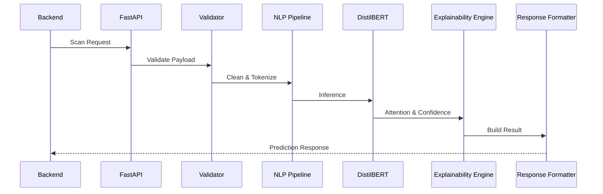

# PhishGuard X

# Volume 5

# AI Architecture & Machine Learning Implementation (AAMLI)

**Version:** 1.0

**Status:** Draft

---

# Document Information

| Property | Value |
|----------|-------|
| Project | PhishGuard X |
| Volume | 5 |
| Document Title | AI Architecture & Machine Learning Implementation |
| Version | 1.0 |
| Status | Draft |
| Primary Audience | AI Engineers, ML Engineers, NLP Engineers, Data Scientists, MLOps Engineers, Software Architects |
| Companion Documents | Volume 1 – SRS, Volume 2 – System Architecture, Volume 3 – Frontend Architecture, Volume 4 – Backend Architecture |

---

# Purpose

The purpose of this document is to define the complete Artificial Intelligence architecture of **PhishGuard X**.

This volume specifies the design, implementation strategy, machine learning workflows, NLP pipeline, model lifecycle, inference architecture, Explainable AI framework, MLOps practices, and operational standards required to build and maintain the AI subsystem.

Unlike previous volumes that focus on software engineering, this document focuses exclusively on the AI ecosystem that powers phishing detection and intelligent cybersecurity analysis.

The document serves as the primary engineering specification for AI engineers, machine learning engineers, data scientists, NLP engineers, and MLOps engineers.

---

# Objectives

The objectives of this document are to:

- Define the complete AI architecture.
- Document the machine learning pipeline.
- Describe the NLP processing workflow.
- Standardize dataset management.
- Define model training procedures.
- Document inference architecture.
- Establish Explainable AI standards.
- Define model lifecycle management.
- Describe deployment strategies.
- Support future AI evolution.

---

# Scope

This document covers:

- AI System Architecture
- Dataset Engineering
- NLP Pipeline
- Feature Engineering
- Transformer Models
- DistilBERT Implementation
- Training Pipeline
- Hyperparameter Optimization
- Evaluation Metrics
- Explainable AI
- FastAPI Inference Service
- MLOps
- AI Security
- Model Monitoring
- Continuous Training
- Future AI Enhancements

---

# Estimated Document Size

| Metric | Estimate |
|---------|----------|
| Major Sections | 80 |
| Subsections | 250+ |
| Markdown Lines | 15,000–25,000+ |
| Architecture Diagrams | 25+ |
| Workflow Diagrams | 40+ |
| Sequence Diagrams | 30+ |
| Tables | 50+ |

---

# Table of Contents

# Part I — AI Foundation

## 1. Introduction

- Purpose
- Objectives
- Scope
- Audience
- Definitions
- Relationship with Other Volumes

---

## 2. AI Philosophy

- Explainable AI
- Responsible AI
- Human-Centered AI
- Trustworthy AI
- Ethical AI
- Security-First AI
- Privacy by Design
- Continuous Learning Philosophy

---

## 3. AI System Overview

- High-Level AI Architecture
- AI Components
- AI Workflow
- AI Request Lifecycle
- AI Deployment Model
- AI Design Principles

---

## 4. AI Technology Stack

- Python
- FastAPI
- PyTorch
- HuggingFace Transformers
- Scikit-learn
- CUDA
- NumPy
- Pandas
- ONNX
- MLflow
- Docker
- Kubernetes
- Redis
- Prometheus
- Grafana

---

## 5. AI Project Directory Structure

- Folder Organization
- Package Structure
- Naming Conventions
- Dependency Organization
- Module Responsibilities

---

# Part II — Data Engineering

## 6. Dataset Architecture

- Dataset Philosophy
- Dataset Organization
- Dataset Standards
- Data Sources
- Storage Architecture

---

## 7. Dataset Sources

- SpamAssassin
- Enron
- Nazario Phishing Corpus
- CEAS
- Kaggle Datasets
- OpenPhish
- PhishTank
- VirusTotal
- Custom Enterprise Data

---

## 8. Dataset Versioning

- Version Control
- Dataset Metadata
- Dataset Lineage
- Dataset Releases
- Version Compatibility

---

## 9. Dataset Storage

- Storage Architecture
- Directory Layout
- Data Formats
- Compression
- Backup Strategy

---

## 10. Dataset Schema

- Email Schema
- Metadata
- Labels
- Features
- Annotation Structure

---

## 11. Data Collection Pipeline

- Data Acquisition
- Data Validation
- Data Normalization
- Data Storage

---

## 12. Data Cleaning

- Duplicate Removal
- Missing Values
- Corrupted Samples
- Noise Reduction

---

## 13. Data Validation

- Schema Validation
- Label Validation
- Format Validation
- Quality Assurance

---

## 14. Data Labeling

- Binary Labels
- Multi-Class Labels
- Annotation Workflow
- Label Quality

---

## 15. Data Augmentation

- Synthetic Samples
- Text Augmentation
- Adversarial Samples
- Noise Injection

---

## 16. Dataset Balancing

- Class Imbalance
- Oversampling
- Undersampling
- SMOTE
- Weighted Sampling

---

## 17. Dataset Splitting

- Train Dataset
- Validation Dataset
- Test Dataset
- Cross Validation

---

## 18. Feature Store

- Feature Repository
- Feature Metadata
- Feature Reuse
- Versioning

---

# Part III — NLP Pipeline

## 19. NLP Architecture

---

## 20. Email Parsing

---

## 21. Header Extraction

---

## 22. HTML Processing

---

## 23. URL Extraction

---

## 24. Attachment Processing

---

## 25. Text Cleaning

---

## 26. Tokenization

---

## 27. Vocabulary Management

---

## 28. Attention Masks

---

## 29. Input Embeddings

---

## 30. Feature Engineering

- Sender Features
- Domain Features
- URL Features
- Header Features
- NLP Features
- Statistical Features

---

# Part IV — Model Engineering

## 31. DistilBERT Architecture

- Transformer Overview
- Encoder Layers
- Self Attention
- Multi-Head Attention
- Feed Forward Networks
- Layer Normalization
- Positional Embeddings
- Classification Head
- Fine-Tuning Strategy

---

## 32. Training Pipeline

- Dataset Loading
- Tokenization
- DataLoader
- GPU Training
- Validation
- Checkpoints

---

## 33. GPU Architecture

- CUDA
- Mixed Precision
- Multi-GPU Support
- Memory Optimization

---

## 34. Hyperparameter Optimization

- Learning Rate
- Batch Size
- Epochs
- Warmup
- Weight Decay
- Schedulers

---

## 35. Training Monitoring

- TensorBoard
- Metrics
- Loss Curves
- GPU Monitoring

---

## 36. Checkpoint Management

- Saving
- Loading
- Recovery
- Version Control

---

## 37. Model Registry

- Registry Architecture
- Metadata
- Promotion Workflow

---

## 38. Model Versioning

- Semantic Versioning
- Compatibility
- Rollback

---

## 39. Experiment Tracking

- MLflow
- Metrics
- Parameters
- Artifacts

---

## 40. Fine-Tuning Strategy

- Domain Adaptation
- Incremental Learning
- Transfer Learning

---

# Part V — Model Evaluation

## 41. Evaluation Pipeline

---

## 42. Accuracy Metrics

---

## 43. Precision, Recall & F1 Score

---

## 44. Confusion Matrix

---

## 45. ROC Curve

---

## 46. Precision-Recall Curve

---

## 47. Calibration

---

## 48. Explainable AI

- SHAP
- LIME
- Attention Visualization
- Feature Importance
- Confidence Scores
- Decision Explanation

---

# Part VI — AI Inference

## 49. FastAPI Architecture

---

## 50. Inference Pipeline

---

## 51. Request Validation

---

## 52. Batch Processing

---

## 53. Model Loading

---

## 54. Memory Management

---

## 55. GPU Scheduling

---

## 56. Inference Optimization

---

## 57. AI Response Format

---

# Part VII — MLOps

## 58. MLOps Architecture

---

## 59. CI/CD Pipeline

---

## 60. Docker Deployment

---

## 61. Kubernetes Deployment

---

## 62. Monitoring

---

## 63. Drift Detection

---

## 64. Automated Retraining

---

## 65. Model Rollback

---

## 66. Model Governance

---

# Part VIII — AI Security

## 67. AI Security Architecture

---

## 68. Adversarial Attacks

---

## 69. Prompt Injection Protection

---

## 70. Model Theft Prevention

---

## 71. Data Poisoning Defense

---

## 72. Privacy Protection

---

# Part IX — Future AI

## 73. Multimodal AI

---

## 74. Vision Models

---

## 75. Large Language Models

---

## 76. Agentic AI

---

## 77. Federated Learning

---

## 78. AI Roadmap

---

## 79. Future Enhancements

---

## 80. Conclusion

---

# Expected Outcomes

Upon completion of this volume, the AI subsystem should provide:

- Enterprise-grade phishing detection.
- Explainable AI predictions.
- Modular machine learning architecture.
- Scalable inference services.
- Continuous model improvement.
- Production-ready MLOps workflows.
- Secure AI deployment.
- Future-ready extensibility.

---

# Document Status

| Property | Value |
|----------|-------|
| Document Title | AI Architecture & Machine Learning Implementation |
| Project | PhishGuard X |
| Volume | 5 |
| Version | 1.0 |
| Status | Draft |
| Major Sections | 80 |
| Intended Audience | AI Engineers, ML Engineers, NLP Engineers, Data Scientists, MLOps Engineers |
| Estimated Size | 15,000–25,000+ Markdown Lines |

---

**End of Volume 5 Table of Contents**
# 1. Introduction

## 1.1 Overview

Artificial Intelligence forms the core intelligence layer of the PhishGuard X platform. While the frontend and backend provide the user interface, business logic, and system orchestration, the AI subsystem is responsible for understanding, analyzing, and classifying potentially malicious content.

This document defines the complete architecture, implementation strategy, operational workflow, and lifecycle management of the Artificial Intelligence ecosystem powering PhishGuard X. It serves as the authoritative technical specification for designing, implementing, deploying, maintaining, and evolving the machine learning infrastructure used for phishing detection.

Unlike the previous volumes of the Development Bible, which primarily describe software architecture, this volume focuses exclusively on the engineering of intelligent systems. It covers every stage of the AI lifecycle—from data acquisition and preprocessing to model training, deployment, monitoring, explainability, and continuous improvement.

The architecture presented in this document is designed to support enterprise-scale deployments while remaining modular enough to accommodate future research, emerging machine learning techniques, and evolving cybersecurity threats.

---

## 1.2 Purpose

The purpose of this document is to provide a comprehensive blueprint for the AI subsystem of PhishGuard X.

Specifically, this volume aims to:

- Define the overall AI architecture.
- Establish engineering standards for machine learning development.
- Document the NLP processing pipeline.
- Describe dataset engineering practices.
- Define model training and evaluation workflows.
- Specify the inference architecture.
- Establish Explainable AI (XAI) principles.
- Define MLOps processes.
- Document AI security considerations.
- Support long-term maintainability and future expansion.

---

## 1.3 Objectives

The objectives of the AI architecture are to:

- Deliver highly accurate phishing detection.
- Reduce false positives and false negatives.
- Produce explainable and trustworthy predictions.
- Support scalable inference under production workloads.
- Maintain reproducible model training.
- Enable continuous model improvement.
- Simplify deployment across environments.
- Support integration with the backend platform.
- Maintain modular AI components.
- Provide operational observability throughout the model lifecycle.

---

## 1.4 Scope

This document includes the design and implementation of:

### Data Engineering

- Dataset collection
- Dataset validation
- Dataset versioning
- Data cleaning
- Data balancing
- Feature storage

---

### Natural Language Processing

- Email parsing
- Tokenization
- Text preprocessing
- Embedding generation
- Feature extraction

---

### Machine Learning

- DistilBERT architecture
- Model training
- Hyperparameter optimization
- Fine-tuning
- Model evaluation
- Model versioning

---

### AI Infrastructure

- FastAPI inference service
- GPU utilization
- Model loading
- Batch inference
- Memory optimization

---

### Explainable AI

- Attention visualization
- Feature importance
- Confidence scoring
- Decision explanations

---

### MLOps

- Continuous Integration
- Continuous Deployment
- Model Registry
- Experiment Tracking
- Drift Detection
- Automated Retraining

---

### AI Security

- Model security
- Data privacy
- Adversarial robustness
- Secure inference
- Model governance

---

## 1.5 Intended Audience

This document is intended for:

| Role | Responsibility |
|------|----------------|
| AI Engineers | AI architecture and implementation |
| Machine Learning Engineers | Model development and optimization |
| NLP Engineers | Natural language processing pipeline |
| Data Engineers | Dataset engineering and feature pipelines |
| MLOps Engineers | Deployment and lifecycle management |
| Backend Engineers | AI integration and inference services |
| Software Architects | Overall platform architecture |
| Security Engineers | AI security and governance |

---

## 1.6 Relationship with Other Volumes

This volume builds upon the architectural foundation established by the previous documents in the PhishGuard X Development Bible.

| Volume | Purpose |
|---------|---------|
| Volume 1 | Software Requirements Specification |
| Volume 2 | System Architecture |
| Volume 3 | Frontend Architecture |
| Volume 4 | Backend Architecture |
| **Volume 5** | AI Architecture & Machine Learning Implementation |

The backend described in Volume 4 communicates directly with the AI subsystem documented in this volume through a dedicated FastAPI inference service.

---

## 1.7 Architectural Goals

The AI subsystem is designed according to the following architectural goals:

- Modularity
- Explainability
- Scalability
- Maintainability
- Reproducibility
- Security
- Reliability
- Extensibility
- Performance
- Continuous Improvement

These goals guide every architectural and implementation decision throughout this document.

---

## 1.8 Document Structure

The document is organized into nine major parts:

1. AI Foundation
2. Data Engineering
3. NLP Pipeline
4. Model Engineering
5. Model Evaluation
6. AI Inference
7. MLOps
8. AI Security
9. Future AI

Each part progressively builds upon the previous one, moving from foundational concepts to implementation and operational practices.

---

## 1.9 AI Architecture Principles

| Rule | Description |
|------|-------------|
| AI-ARCH-01 | AI components should remain modular and independently deployable. |
| AI-ARCH-02 | Model decisions should be explainable whenever practical. |
| AI-ARCH-03 | AI services should remain stateless. |
| AI-ARCH-04 | Models should be reproducible from documented datasets and configurations. |
| AI-ARCH-05 | AI infrastructure should support continuous improvement. |

---

# 2. AI Philosophy

## 2.1 Overview

The Artificial Intelligence subsystem of PhishGuard X is founded on the principle that AI should enhance cybersecurity decision-making rather than replace human judgment.

The objective is not merely to classify emails as phishing or legitimate, but to produce accurate, explainable, trustworthy, and operationally useful intelligence that security analysts and end users can confidently rely upon.

The AI philosophy therefore extends beyond model accuracy to encompass transparency, robustness, fairness, security, and long-term maintainability.

---

## 2.2 Core Philosophy

The AI subsystem follows six foundational principles:

1. Explainability First
2. Human-Centered Intelligence
3. Security by Design
4. Responsible AI
5. Continuous Learning
6. Modular Intelligence

Together, these principles define how AI components should be designed, trained, deployed, and evolved.

---

## 2.3 Explainability First

Every prediction should include sufficient supporting evidence to enable users to understand why the model reached a particular conclusion.

Explainability improves:

- User trust.
- Analyst confidence.
- Security investigations.
- Regulatory compliance.
- Model debugging.

Predictions should not function as opaque "black box" decisions whenever meaningful explanations can be provided.

---

## 2.4 Human-Centered Intelligence

Artificial Intelligence should augment human expertise rather than replace it.

The AI subsystem is designed to:

- Assist analysts.
- Reduce repetitive work.
- Prioritize threats.
- Explain reasoning.
- Recommend actions.

Final operational decisions remain under human control.

---

## 2.5 Security by Design

Every AI component should assume that both input data and surrounding environments may be hostile.

Security considerations include:

- Secure model deployment.
- Secure inference.
- Dataset integrity.
- Input validation.
- Adversarial robustness.
- Model access control.

Security is integrated into every stage of the AI lifecycle.

---

## 2.6 Responsible AI

The AI subsystem should operate responsibly by emphasizing:

- Transparency.
- Accountability.
- Fairness.
- Privacy.
- Reliability.
- Safety.

Models should be regularly evaluated to ensure they continue to perform consistently as phishing techniques evolve.

---

## 2.7 Continuous Learning

Cyber threats evolve continuously.

The AI platform should therefore support:

- Dataset expansion.
- Periodic retraining.
- Drift detection.
- Performance monitoring.
- Incremental improvement.

The objective is to maintain detection effectiveness over time without requiring architectural redesign.

---

## 2.8 Modular Intelligence

Every AI capability should exist as an independent component whenever practical.

Examples include:

- NLP Engine
- Classification Engine
- Explainability Engine
- Feature Extraction Engine
- Threat Intelligence Engine

Modularity simplifies maintenance, testing, scaling, and future model replacement.

---

## 2.9 AI Design Principles

| Rule | Description |
|------|-------------|
| PHILOSOPHY-01 | AI augments human decision-making. |
| PHILOSOPHY-02 | Explainability is a primary design objective. |
| PHILOSOPHY-03 | Security is integrated throughout the AI lifecycle. |
| PHILOSOPHY-04 | Models should evolve through continuous learning. |
| PHILOSOPHY-05 | AI components remain modular and independently maintainable. |

---

# 3. AI System Overview

## 3.1 Overview

The AI subsystem is a dedicated microservice responsible for intelligent phishing analysis within the PhishGuard X platform.

Rather than embedding machine learning directly into the backend application, AI capabilities are isolated within an independent Python-based service that communicates with the backend through REST APIs.

This separation enables independent development, deployment, scaling, and versioning of AI components while preserving a clean separation of concerns between software engineering and machine learning engineering.

---

## 3.2 High-Level Architecture

```mermaid
flowchart LR

User

-->

React Frontend

-->

Node.js Backend

-->

FastAPI AI Service

-->

NLP Pipeline

-->

DistilBERT Model

-->

Explainability Engine

-->

Prediction Response

Prediction Response

-->

Node.js Backend

-->

React Frontend
```

---

## 3.3 AI Components

The AI subsystem consists of the following major components:

| Component | Responsibility |
|-----------|----------------|
| FastAPI Gateway | Receives inference requests |
| Request Validator | Validates incoming payloads |
| NLP Pipeline | Cleans and prepares textual data |
| Feature Extraction Engine | Generates structured features |
| DistilBERT Model | Performs phishing classification |
| Explainability Engine | Produces model explanations |
| Response Formatter | Standardizes AI responses |
| Model Registry | Manages model versions |
| Monitoring Module | Tracks AI performance |

---

## 3.4 AI Request Lifecycle

Every inference request follows a standardized processing pipeline.



---

## 3.5 AI Processing Stages

The AI workflow consists of the following stages:

### Stage 1 — Request Validation

Validate:

- Request format.
- Required fields.
- Supported scan type.
- Payload integrity.

---

### Stage 2 — NLP Processing

Prepare textual content by:

- Cleaning.
- Normalization.
- Tokenization.
- Encoding.

---

### Stage 3 — Feature Engineering

Generate structured features including:

- Sender characteristics.
- Domain information.
- URL metadata.
- Header indicators.
- Statistical features.

---

### Stage 4 — Model Inference

The DistilBERT model performs phishing classification and generates:

- Prediction.
- Confidence score.
- Probability distribution.

---

### Stage 5 — Explainability

Generate supporting information including:

- Important tokens.
- Attention weights.
- Feature contributions.
- Decision rationale.

---

### Stage 6 — Response Construction

Assemble a standardized AI response containing:

- Classification.
- Confidence.
- Explainability.
- Model version.
- Processing time.

---

## 3.6 AI Service Characteristics

The AI service is designed to be:

- Stateless.
- Independently deployable.
- Horizontally scalable.
- Version controlled.
- GPU compatible.
- Observable.
- Secure.
- Fault tolerant.

---

## 3.7 Integration with Backend

The backend communicates with the AI service using HTTP-based REST APIs.

Responsibilities remain clearly separated:

### Backend

- User authentication.
- Business logic.
- Database operations.
- Threat intelligence aggregation.
- Report generation.

### AI Service

- NLP processing.
- Machine learning inference.
- Explainability.
- Model management.
- Prediction generation.

---

## 3.8 AI System Principles

| Rule | Description |
|------|-------------|
| AI-SYSTEM-01 | The AI subsystem operates as an independent microservice. |
| AI-SYSTEM-02 | NLP processing precedes model inference. |
| AI-SYSTEM-03 | Every prediction includes explainability metadata. |
| AI-SYSTEM-04 | AI services remain stateless and horizontally scalable. |
| AI-SYSTEM-05 | Backend and AI responsibilities remain strictly separated. |

---
# 4. AI Technology Stack

## 4.1 Overview

The Artificial Intelligence subsystem of PhishGuard X is built using a modern, production-oriented technology stack optimized for Natural Language Processing (NLP), transformer-based deep learning, scalable inference, and enterprise deployment.

Technology selection prioritizes:

- Performance
- Maintainability
- Community support
- Production maturity
- Scalability
- Compatibility with modern MLOps workflows

Every component within the AI stack has a clearly defined responsibility and may evolve independently as technologies mature.

---

## 4.2 Objectives

The AI technology stack aims to:

- Support state-of-the-art NLP.
- Enable efficient GPU training.
- Provide scalable inference.
- Simplify deployment.
- Support Explainable AI.
- Enable reproducible experimentation.
- Integrate seamlessly with the backend.

---

## 4.3 Technology Stack Overview

| Category | Technology | Purpose |
|----------|------------|---------|
| Programming Language | Python 3.11+ | AI development |
| API Framework | FastAPI | Inference microservice |
| Deep Learning | PyTorch | Model training & inference |
| NLP Library | HuggingFace Transformers | Transformer models |
| Tokenization | HuggingFace Tokenizers | Fast tokenization |
| Traditional ML | Scikit-learn | Metrics & preprocessing |
| Data Processing | Pandas | Dataset engineering |
| Numerical Computing | NumPy | Matrix operations |
| Visualization | Matplotlib | Training visualization |
| Experiment Tracking | MLflow | Model lifecycle |
| Model Serialization | Safetensors | Secure model storage |
| GPU Runtime | CUDA | GPU acceleration |
| Deployment | Docker | Containerization |
| Orchestration | Kubernetes (Future) | Scaling |
| Monitoring | Prometheus | Metrics |
| Dashboard | Grafana | Visualization |
| Caching | Redis (Future) | AI caching |

---

## 4.4 Programming Language

Python is selected due to its mature AI ecosystem and extensive scientific computing libraries.

Advantages include:

- Rich ML ecosystem.
- Extensive documentation.
- Strong community support.
- Rapid prototyping.
- Production readiness.

---

## 4.5 Deep Learning Framework

PyTorch serves as the primary deep learning framework.

Responsibilities include:

- Model construction.
- GPU training.
- Automatic differentiation.
- Tensor computation.
- Model optimization.
- Inference execution.

---

## 4.6 NLP Framework

HuggingFace Transformers provides:

- DistilBERT
- BERT
- RoBERTa
- Tokenizers
- Pretrained checkpoints
- Fine-tuning utilities

This framework significantly accelerates development while providing access to state-of-the-art transformer architectures.

---

## 4.7 FastAPI

FastAPI provides:

- REST APIs.
- Request validation.
- Automatic OpenAPI documentation.
- High-performance asynchronous inference.
- Dependency injection.

The AI subsystem exposes inference functionality exclusively through FastAPI.

---

## 4.8 Experiment Management

MLflow manages:

- Experiments.
- Parameters.
- Metrics.
- Artifacts.
- Model registry.
- Version history.

Experiment tracking ensures complete reproducibility of model development.

---

## 4.9 Deployment Technologies

Current deployment includes:

- Docker
- FastAPI
- Uvicorn

Future deployments may include:

- Kubernetes
- Istio
- Helm
- NVIDIA Triton Inference Server

---

## 4.10 AI Technology Principles

| Rule | Description |
|------|-------------|
| TECH-AI-01 | Python is the primary AI programming language. |
| TECH-AI-02 | PyTorch is the standard deep learning framework. |
| TECH-AI-03 | Transformer models are managed through HuggingFace. |
| TECH-AI-04 | FastAPI serves as the inference gateway. |
| TECH-AI-05 | Experiment tracking is mandatory for all production models. |

---

# 5. AI Project Directory Structure

## 5.1 Overview

The AI subsystem follows a modular, feature-oriented directory structure that separates datasets, preprocessing pipelines, models, inference services, utilities, and MLOps components.

The structure is designed to:

- Improve maintainability.
- Simplify navigation.
- Encourage modular development.
- Support future model expansion.
- Facilitate automated deployment.

---

## 5.2 Root Directory Structure

```text
ai-service/

├── app/
│   ├── api/
│   ├── core/
│   ├── models/
│   ├── inference/
│   ├── preprocessing/
│   ├── feature_engineering/
│   ├── explainability/
│   ├── services/
│   ├── utils/
│   ├── schemas/
│   ├── middleware/
│   └── config/
│
├── datasets/
│
├── notebooks/
│
├── experiments/
│
├── checkpoints/
│
├── registry/
│
├── mlruns/
│
├── scripts/
│
├── tests/
│
├── docker/
│
├── monitoring/
│
└── docs/
```

---

## 5.3 Directory Responsibilities

### app/

Contains the production AI application.

---

### api/

FastAPI routes and request handlers.

---

### preprocessing/

Responsible for:

- Cleaning.
- Normalization.
- Tokenization.
- Encoding.

---

### feature_engineering/

Generates engineered features such as:

- Domain age.
- URL statistics.
- Header anomalies.
- Sender reputation.

---

### models/

Contains:

- DistilBERT.
- Classification heads.
- Model wrappers.

---

### inference/

Responsible for:

- Model loading.
- Prediction.
- Batch inference.
- GPU execution.

---

### explainability/

Implements:

- SHAP.
- LIME.
- Attention visualization.
- Feature importance.

---

### datasets/

Stores:

- Raw datasets.
- Processed datasets.
- Validation sets.
- Test sets.

---

### checkpoints/

Stores:

- Training checkpoints.
- Fine-tuned models.
- Recovery snapshots.

---

### registry/

Production-ready models.

Includes:

- Model versions.
- Metadata.
- Release history.

---

### monitoring/

Monitoring configuration for:

- Prometheus.
- Grafana.
- AI metrics.

---

## 5.4 Naming Conventions

Recommended naming:

```
snake_case
```

Examples:

```
email_parser.py

distilbert_classifier.py

feature_extractor.py

training_pipeline.py
```

Model names:

```
distilbert_v1

distilbert_v2

ensemble_v1
```

---

## 5.5 Directory Principles

| Rule | Description |
|------|-------------|
| DIR-AI-01 | Modules remain feature-oriented. |
| DIR-AI-02 | Training artifacts remain outside application code. |
| DIR-AI-03 | Experiments remain reproducible. |
| DIR-AI-04 | Production models are version controlled. |
| DIR-AI-05 | Dataset storage remains isolated from inference code. |

---

# 6. Dataset Architecture

## 6.1 Overview

The quality of any machine learning system is fundamentally determined by the quality of the data used to train it.

For PhishGuard X, the Dataset Architecture defines how phishing and legitimate email samples are collected, organized, validated, versioned, stored, and consumed throughout the AI lifecycle.

The architecture emphasizes reproducibility, scalability, traceability, and data integrity to ensure that every trained model can be recreated from documented datasets.

---

## 6.2 Objectives

The Dataset Architecture aims to:

- Standardize dataset organization.
- Maintain dataset quality.
- Enable reproducible experiments.
- Support dataset versioning.
- Preserve metadata.
- Simplify future dataset expansion.

---

## 6.3 Dataset Architecture

```mermaid
flowchart TD

Raw Data

-->

Validation

-->

Cleaning

-->

Labeling

-->

Augmentation

-->

Versioning

-->

Storage

-->

Training

Training

-->

Evaluation

Evaluation

-->

Production
```

---

## 6.4 Dataset Categories

The AI subsystem manages several dataset categories.

### Raw Dataset

Contains:

- Original email files.
- Original metadata.
- Original labels.

No modifications are performed.

---

### Processed Dataset

Contains:

- Cleaned text.
- Normalized data.
- Standardized formats.

Ready for preprocessing.

---

### Feature Dataset

Contains:

- Engineered features.
- Numerical attributes.
- Metadata.
- NLP embeddings.

---

### Training Dataset

Used exclusively for model learning.

---

### Validation Dataset

Used during model optimization.

---

### Test Dataset

Reserved for unbiased model evaluation.

---

## 6.5 Dataset Lifecycle

The complete lifecycle consists of:

1. Data acquisition.
2. Data validation.
3. Cleaning.
4. Labeling.
5. Feature generation.
6. Versioning.
7. Storage.
8. Model training.
9. Evaluation.
10. Archiving.

Every stage should be fully documented.

---

## 6.6 Dataset Metadata

Every dataset version should include:

- Dataset ID.
- Version.
- Creation date.
- Source.
- Sample count.
- Label distribution.
- Feature schema.
- Responsible engineer.

Metadata enables complete experiment reproducibility.

---

## 6.7 Storage Principles

Datasets should remain:

- Immutable.
- Versioned.
- Traceable.
- Documented.
- Backed up.
- Access controlled.

Training data should never be modified directly after publication.

---

## 6.8 Dataset Principles

| Rule | Description |
|------|-------------|
| DATASET-01 | Raw datasets remain immutable. |
| DATASET-02 | Every dataset version receives unique identifiers. |
| DATASET-03 | Metadata accompanies every dataset release. |
| DATASET-04 | Training datasets remain reproducible. |
| DATASET-05 | Dataset quality directly influences model quality and must be continuously monitored. |

---

# 7. Dataset Sources

## 7.1 Overview

PhishGuard X relies on multiple publicly available, research-grade, and organization-specific datasets to build a robust phishing detection model.

Using multiple independent sources improves data diversity, reduces bias, and enhances the model's ability to generalize to real-world phishing campaigns.

Dataset selection prioritizes:

- Data quality.
- Label reliability.
- Diversity.
- Public availability.
- Research acceptance.
- Long-term maintainability.

---

## 7.2 Objectives

The Dataset Sources strategy aims to:

- Build diverse datasets.
- Improve model generalization.
- Reduce dataset bias.
- Support continuous expansion.
- Maintain legal and ethical compliance.

---

## 7.3 Primary Dataset Sources

Recommended sources include:

| Dataset | Primary Purpose |
|----------|-----------------|
| SpamAssassin Public Corpus | Legitimate and spam email samples |
| Enron Email Dataset | Real-world legitimate business emails |
| Nazario Phishing Corpus | Phishing email examples |
| CEAS 2008 Spam Dataset | Academic spam research |
| OpenPhish | Active phishing URLs |
| PhishTank | Community-verified phishing URLs |
| VirusTotal Intelligence | Reputation enrichment (subject to licensing) |
| Internal Enterprise Dataset | Organization-specific phishing samples |

---

## 7.4 Dataset Selection Criteria

Datasets should satisfy the following criteria:

- Clearly labeled samples.
- High-quality annotations.
- Diverse phishing techniques.
- Multiple industries represented.
- Modern phishing campaigns.
- Minimal duplicate content.

Datasets failing quality standards should be excluded from production training.

---

## 7.5 Source Validation

Before inclusion, each dataset should be evaluated for:

- Licensing and usage rights.
- Label accuracy.
- Duplicate samples.
- Corrupted records.
- Missing fields.
- Dataset completeness.

Validation results should be documented alongside dataset metadata.

---

## 7.6 Data Diversity

To improve robustness, datasets should include:

- Business emails.
- Personal emails.
- Marketing emails.
- Transactional emails.
- Credential phishing.
- Malware delivery campaigns.
- Business Email Compromise (BEC) attempts.
- Spear-phishing examples.

Balanced diversity reduces overfitting to specific phishing styles.

---

## 7.7 Dataset Source Principles

| Rule | Description |
|------|-------------|
| SOURCE-01 | Multiple independent datasets should be combined where appropriate. |
| SOURCE-02 | Dataset licensing must be verified before use. |
| SOURCE-03 | Data diversity is prioritized over dataset size alone. |
| SOURCE-04 | All sources require quality validation before training. |
| SOURCE-05 | Organization-specific datasets should complement, not replace, public datasets. |

---
# 8. Dataset Versioning

## 8.1 Overview

Dataset Versioning ensures that every machine learning experiment is reproducible by maintaining immutable snapshots of the datasets used during training, validation, and evaluation.

Since machine learning models continuously evolve, the underlying datasets must also be versioned with complete traceability. Every trained model should reference the exact dataset version from which it was produced.

Dataset versioning is a critical component of MLOps and supports auditing, rollback, collaboration, and experiment reproducibility.

---

## 8.2 Objectives

The Dataset Versioning strategy aims to:

- Maintain reproducible experiments.
- Preserve historical datasets.
- Track dataset evolution.
- Enable model rollback.
- Improve collaboration.
- Support regulatory auditing.

---

## 8.3 Versioning Workflow

```mermaid
flowchart TD

Raw Dataset

-->

Validation

-->

Cleaning

-->

Version Creation

-->

Metadata Generation

-->

Storage

-->

Training Pipeline
```

---

## 8.4 Version Identifier

Every dataset release should include:

- Dataset ID
- Semantic Version
- Release Date
- Author
- Description
- Source Information
- Label Distribution
- Sample Count

Example:

```
Dataset ID:
PHISHGUARD-DATASET

Version:
v1.2.0

Release:
2027-01-15
```

---

## 8.5 Semantic Versioning

Dataset versions follow:

```
MAJOR.MINOR.PATCH
```

Example:

```
v1.0.0

v1.1.0

v2.0.0
```

Meaning:

### Major

Breaking dataset changes

Examples:

- New schema
- New labels

---

### Minor

Additional samples

Examples:

- New phishing campaigns
- More legitimate emails

---

### Patch

Corrections

Examples:

- Label corrections
- Metadata updates
- Duplicate removal

---

## 8.6 Version Metadata

Each version should record:

- Total Samples
- Phishing Samples
- Legitimate Samples
- Dataset Sources
- Feature Schema
- Label Schema
- Hash Value
- Storage Location

---

## 8.7 Versioning Principles

| Rule | Description |
|------|-------------|
| DATASET-VERSION-01 | Every published dataset is immutable. |
| DATASET-VERSION-02 | Every model references a dataset version. |
| DATASET-VERSION-03 | Version metadata must remain complete. |
| DATASET-VERSION-04 | Semantic versioning is mandatory. |
| DATASET-VERSION-05 | Historical datasets remain available for reproducibility. |

---

# 9. Dataset Storage

## 9.1 Overview

The Dataset Storage Architecture defines how training data is physically organized, secured, backed up, and accessed throughout the AI lifecycle.

The storage system should support efficient retrieval while ensuring long-term integrity, scalability, and reproducibility.

Storage architecture must separate raw, processed, and production datasets to prevent accidental modification.

---

## 9.2 Objectives

The storage architecture aims to:

- Protect dataset integrity.
- Support efficient retrieval.
- Enable dataset versioning.
- Simplify expansion.
- Improve maintainability.
- Facilitate backups.

---

## 9.3 Storage Architecture

```mermaid
flowchart TD

Raw Data

-->

Raw Storage

Raw Storage

-->

Processing

Processing

-->

Processed Storage

Processed Storage

-->

Training Storage

Training Storage

-->

Archive
```

---

## 9.4 Directory Organization

```text
datasets/

├── raw/

├── processed/

├── training/

├── validation/

├── testing/

├── archived/

├── metadata/

└── backups/
```

---

## 9.5 Storage Categories

### Raw Storage

Contains original datasets.

Never modified.

---

### Processed Storage

Contains cleaned datasets.

Used during preprocessing.

---

### Training Storage

Contains finalized training data.

---

### Validation Storage

Contains validation datasets.

---

### Testing Storage

Contains immutable evaluation datasets.

---

### Archive

Stores historical releases.

---

## 9.6 Backup Strategy

Datasets should support:

- Daily incremental backups.
- Weekly full backups.
- Integrity verification.
- Disaster recovery.

---

## 9.7 Dataset Storage Principles

| Rule | Description |
|------|-------------|
| STORAGE-01 | Raw datasets remain immutable. |
| STORAGE-02 | Processed datasets remain versioned. |
| STORAGE-03 | Archived datasets remain accessible. |
| STORAGE-04 | Backup integrity should be verified regularly. |
| STORAGE-05 | Dataset storage should support future cloud migration. |

---

# 10. Dataset Schema

## 10.1 Overview

The Dataset Schema defines the standardized structure of every phishing sample used throughout the AI pipeline.

A consistent schema simplifies preprocessing, feature engineering, training, inference, and future dataset expansion.

Every dataset source should be transformed into this unified schema before entering the training pipeline.

---

## 10.2 Objectives

The dataset schema aims to:

- Standardize samples.
- Simplify preprocessing.
- Enable feature extraction.
- Support future datasets.
- Improve interoperability.

---

## 10.3 Email Sample Schema

Each email record contains:

| Field | Description |
|--------|-------------|
| Email ID | Unique identifier |
| Subject | Email subject |
| Sender | Sender email |
| Recipient | Recipient email |
| Body | Email body |
| HTML Body | HTML content |
| URLs | Extracted URLs |
| Attachments | Attachment metadata |
| Headers | Parsed headers |
| Label | Phishing or Legitimate |
| Source | Dataset origin |
| Timestamp | Collection time |

---

## 10.4 Label Schema

Binary labels:

| Label | Meaning |
|--------|---------|
| 0 | Legitimate |
| 1 | Phishing |

Future multi-class labels may include:

- Credential Phishing
- Malware Delivery
- BEC
- Spam
- Scam

---

## 10.5 Metadata Schema

Metadata includes:

- Dataset Version
- Language
- Region
- Encoding
- Feature Version
- Annotation Version

---

## 10.6 Schema Validation

Validation verifies:

- Required fields.
- Correct types.
- Valid labels.
- Missing values.
- Encoding consistency.

---

## 10.7 Schema Principles

| Rule | Description |
|------|-------------|
| SCHEMA-01 | All datasets use a unified schema. |
| SCHEMA-02 | Labels follow standardized definitions. |
| SCHEMA-03 | Metadata accompanies every sample. |
| SCHEMA-04 | Schema validation precedes preprocessing. |
| SCHEMA-05 | Future schema evolution maintains backward compatibility where practical. |

---

# 11. Data Collection Pipeline

## 11.1 Overview

The Data Collection Pipeline defines how phishing and legitimate email samples are acquired, validated, normalized, and prepared for long-term storage.

Data collection forms the first operational stage of the AI lifecycle and directly influences model quality.

The pipeline should support both manual and automated acquisition while maintaining traceability for every collected sample.

---

## 11.2 Objectives

The collection pipeline aims to:

- Acquire diverse samples.
- Maintain dataset quality.
- Validate incoming data.
- Preserve source metadata.
- Eliminate duplicates.
- Support continuous expansion.

---

## 11.3 Collection Workflow

```mermaid
flowchart TD

External Source

-->

Collection Service

-->

Validation

-->

Deduplication

-->

Normalization

-->

Metadata Generation

-->

Storage
```

---

## 11.4 Collection Sources

Supported sources include:

- Public datasets.
- Enterprise email archives.
- Threat intelligence feeds.
- Community reports.
- Security research repositories.

---

## 11.5 Collection Validation

Incoming samples are checked for:

- Completeness.
- Encoding.
- Corruption.
- Duplicate identifiers.
- Missing fields.

---

## 11.6 Normalization

Normalize:

- Character encoding.
- Date formats.
- Email formatting.
- Header structures.

---

## 11.7 Data Collection Principles

| Rule | Description |
|------|-------------|
| COLLECTION-01 | Every collected sample must be traceable. |
| COLLECTION-02 | Duplicate samples should be removed. |
| COLLECTION-03 | Metadata accompanies every collected record. |
| COLLECTION-04 | Validation precedes storage. |
| COLLECTION-05 | Collection processes remain reproducible. |

---

# 12. Data Cleaning

## 12.1 Overview

Raw email datasets frequently contain inconsistent formatting, duplicate records, corrupted samples, malformed headers, HTML artifacts, and incomplete metadata.

The Data Cleaning stage transforms raw inputs into high-quality, standardized samples suitable for machine learning.

Cleaning improves model accuracy by reducing noise and ensuring consistency across multiple data sources.

---

## 12.2 Objectives

The data cleaning process aims to:

- Remove noise.
- Standardize formatting.
- Eliminate duplicates.
- Repair malformed records.
- Improve data quality.
- Prepare samples for preprocessing.

---

## 12.3 Cleaning Workflow

```mermaid
flowchart TD

Raw Dataset

-->

Duplicate Removal

-->

Missing Value Handling

-->

Encoding Correction

-->

HTML Cleaning

-->

Header Standardization

-->

Clean Dataset
```

---

## 12.4 Cleaning Operations

### Duplicate Removal

Remove:

- Exact duplicates.
- Near duplicates.
- Repeated campaigns.

---

### Missing Values

Handle:

- Missing subjects.
- Missing sender fields.
- Missing body text.
- Missing metadata.

---

### Encoding Correction

Normalize:

- UTF-8
- Unicode
- Character escaping

---

### HTML Cleanup

Remove:

- Excessive whitespace.
- Invalid tags.
- Hidden scripts.
- Broken formatting.

---

### Header Standardization

Normalize:

- Header capitalization.
- Date formatting.
- Sender fields.
- Routing headers.

---

## 12.5 Quality Checks

Cleaning quality metrics include:

- Duplicate percentage.
- Missing value percentage.
- Invalid record count.
- HTML artifact count.
- Encoding consistency.

---

## 12.6 Data Cleaning Principles

| Rule | Description |
|------|-------------|
| CLEAN-01 | Cleaning should preserve semantic meaning. |
| CLEAN-02 | Duplicate samples are removed before training. |
| CLEAN-03 | Cleaning operations are fully documented. |
| CLEAN-04 | Encoding is standardized across all datasets. |
| CLEAN-05 | Cleaning quality is measured and reported. |

---
# 13. Data Validation

## 13.1 Overview

Data Validation ensures that every dataset entering the machine learning pipeline satisfies predefined quality, structural, and semantic requirements.

Before any dataset is used for preprocessing, feature engineering, model training, or evaluation, it must pass a comprehensive validation process to prevent poor-quality data from degrading model performance.

Validation should be fully automated wherever possible and integrated into the dataset ingestion pipeline.

---

## 13.2 Objectives

The data validation process aims to:

- Detect corrupted records.
- Verify schema compliance.
- Ensure label consistency.
- Identify duplicate samples.
- Validate feature integrity.
- Improve overall dataset quality.

---

## 13.3 Validation Pipeline

```mermaid
flowchart TD

Dataset

-->

Schema Validation

-->

Metadata Validation

-->

Label Validation

-->

Feature Validation

-->

Quality Assessment

-->

Approved Dataset
```

---

## 13.4 Validation Categories

### Schema Validation

Checks:

- Required fields
- Data types
- Field constraints
- Structural consistency

---

### Metadata Validation

Verifies:

- Dataset version
- Source information
- Collection timestamp
- Language
- Encoding

---

### Label Validation

Checks:

- Allowed label values
- Missing labels
- Invalid classes
- Label consistency

---

### Feature Validation

Ensures:

- Correct feature types
- Valid numerical ranges
- Missing feature detection
- Feature completeness

---

### Content Validation

Examines:

- Empty email bodies
- Invalid headers
- Corrupted attachments
- Invalid URLs

---

## 13.5 Validation Metrics

Typical quality metrics include:

- Schema compliance rate
- Missing value percentage
- Duplicate percentage
- Invalid sample count
- Label consistency
- Metadata completeness

---

## 13.6 Validation Principles

| Rule | Description |
|------|-------------|
| VALIDATE-01 | Every dataset undergoes automated validation. |
| VALIDATE-02 | Invalid records are isolated for review. |
| VALIDATE-03 | Validation results are documented. |
| VALIDATE-04 | Quality metrics accompany every dataset version. |
| VALIDATE-05 | Validation occurs before preprocessing. |

---

# 14. Data Labeling

## 14.1 Overview

Data Labeling assigns the correct classification to each email sample, enabling supervised machine learning models to distinguish phishing content from legitimate communication.

Accurate labeling is one of the most influential factors affecting model performance. Poor-quality labels introduce noise into the training process, reduce model accuracy, and increase false predictions.

Labeling standards should remain consistent across all dataset sources.

---

## 14.2 Objectives

The data labeling process aims to:

- Produce reliable ground truth.
- Maintain label consistency.
- Reduce annotation errors.
- Support future multi-class classification.
- Enable reproducible training.

---

## 14.3 Labeling Workflow

```mermaid
flowchart TD

Email Sample

-->

Manual Review

-->

Label Assignment

-->

Quality Review

-->

Dataset Integration
```

---

## 14.4 Label Categories

### Binary Labels

| Label | Meaning |
|--------|---------|
| 0 | Legitimate |
| 1 | Phishing |

---

### Future Multi-Class Labels

Potential categories include:

- Credential Phishing
- Business Email Compromise (BEC)
- Malware Distribution
- Spam
- Scam
- Financial Fraud
- Social Engineering

---

## 14.5 Annotation Guidelines

Annotators should evaluate:

- Sender legitimacy
- Domain authenticity
- Embedded URLs
- Attachment behavior
- Social engineering indicators
- Urgency language
- Credential requests

Standardized guidelines help reduce subjectivity.

---

## 14.6 Quality Assurance

Label quality should be verified through:

- Double annotation
- Expert review
- Conflict resolution
- Random sampling
- Periodic audits

---

## 14.7 Labeling Principles

| Rule | Description |
|------|-------------|
| LABEL-01 | Every sample receives exactly one valid label. |
| LABEL-02 | Label definitions remain consistent across datasets. |
| LABEL-03 | Annotation guidelines are documented. |
| LABEL-04 | Label quality is periodically reviewed. |
| LABEL-05 | Future label expansion preserves backward compatibility. |

---

# 15. Data Augmentation

## 15.1 Overview

Data Augmentation expands the diversity of the training dataset by generating additional realistic samples while preserving their semantic meaning.

In phishing detection, augmentation improves model generalization by exposing the model to a broader range of writing styles, phishing techniques, formatting variations, and linguistic patterns.

Augmentation should enhance diversity without introducing unrealistic or misleading samples.

---

## 15.2 Objectives

The augmentation process aims to:

- Increase dataset diversity.
- Improve model robustness.
- Reduce overfitting.
- Enhance generalization.
- Address class imbalance.

---

## 15.3 Augmentation Pipeline

```mermaid
flowchart TD

Original Dataset

-->

Augmentation Engine

-->

Quality Validation

-->

Augmented Dataset

-->

Training Pipeline
```

---

## 15.4 Augmentation Techniques

Supported techniques include:

### Synonym Replacement

Replace selected words with semantically similar alternatives.

---

### Sentence Reordering

Modify sentence ordering while preserving meaning.

---

### Noise Injection

Introduce minor formatting variations.

Examples:

- Additional whitespace
- HTML formatting
- Character encoding variations

---

### URL Variations

Generate realistic URL structures for phishing simulation.

---

### Header Variations

Create realistic email header combinations.

---

### AI-Generated Samples (Future)

Future versions may use LLMs to generate synthetic phishing examples for research and controlled training scenarios.

---

## 15.5 Quality Controls

Every augmented sample should be:

- Grammatically coherent.
- Semantically correct.
- Label preserving.
- Realistic.
- Traceable.

---

## 15.6 Augmentation Principles

| Rule | Description |
|------|-------------|
| AUGMENT-01 | Augmentation preserves original labels. |
| AUGMENT-02 | Synthetic samples remain realistic. |
| AUGMENT-03 | Every augmentation method is documented. |
| AUGMENT-04 | Artificial samples are distinguishable through metadata. |
| AUGMENT-05 | Augmentation complements, not replaces, real-world data. |

---

# 16. Dataset Balancing

## 16.1 Overview

Real-world phishing datasets often exhibit significant class imbalance, with legitimate emails greatly outnumbering phishing samples.

Dataset Balancing addresses this imbalance to prevent the model from becoming biased toward the majority class.

Balancing strategies should be selected based on empirical evaluation rather than fixed assumptions.

---

## 16.2 Objectives

The balancing process aims to:

- Reduce class imbalance.
- Improve minority class learning.
- Increase phishing detection accuracy.
- Reduce false negatives.
- Improve model fairness.

---

## 16.3 Balancing Workflow

```mermaid
flowchart TD

Training Dataset

-->

Distribution Analysis

-->

Balancing Strategy

-->

Balanced Dataset

-->

Training
```

---

## 16.4 Balancing Techniques

### Random Undersampling

Reduce majority class samples.

---

### Random Oversampling

Duplicate minority class samples.

---

### SMOTE

Generate synthetic minority samples.

---

### Class Weighting

Adjust loss functions to emphasize minority classes during training.

---

### Data Augmentation

Generate additional phishing samples using approved augmentation techniques.

---

## 16.5 Distribution Monitoring

Monitor:

- Class ratios
- Minority representation
- Label distribution
- Sample diversity

Balancing should avoid excessive duplication that may lead to overfitting.

---

## 16.6 Dataset Balancing Principles

| Rule | Description |
|------|-------------|
| BALANCE-01 | Class distributions are evaluated before training. |
| BALANCE-02 | Balancing techniques are documented. |
| BALANCE-03 | Minority classes receive adequate representation. |
| BALANCE-04 | Overfitting due to oversampling is minimized. |
| BALANCE-05 | Balancing effectiveness is measured through evaluation metrics. |

---

# 17. Dataset Splitting

## 17.1 Overview

Dataset Splitting partitions the available data into independent subsets for model training, validation, and testing.

Proper separation prevents information leakage between datasets and ensures that evaluation metrics accurately reflect real-world model performance.

The testing dataset must remain isolated until final evaluation.

---

## 17.2 Objectives

The dataset splitting strategy aims to:

- Prevent data leakage.
- Enable unbiased evaluation.
- Support hyperparameter tuning.
- Improve reproducibility.
- Standardize experimentation.

---

## 17.3 Splitting Workflow

```mermaid
flowchart TD

Complete Dataset

-->

Randomization

-->

Training Set

Complete Dataset

-->

Validation Set

Complete Dataset

-->

Testing Set
```

---

## 17.4 Standard Distribution

Recommended split:

| Dataset | Percentage |
|----------|-----------:|
| Training | 70% |
| Validation | 15% |
| Testing | 15% |

Alternative distributions may be adopted based on dataset size and research requirements.

---

## 17.5 Splitting Strategies

Supported strategies include:

### Random Split

Suitable for balanced datasets.

---

### Stratified Split

Preserves label distribution across subsets.

---

### Time-Based Split

Useful for evaluating performance on evolving phishing campaigns.

---

### Cross Validation

Used during research and hyperparameter optimization.

---

## 17.6 Data Leakage Prevention

To prevent leakage:

- Duplicate emails should not appear across subsets.
- Related campaign samples should be reviewed.
- Metadata leakage should be avoided.
- Test data remains inaccessible during training.

---

## 17.7 Dataset Splitting Principles

| Rule | Description |
|------|-------------|
| SPLIT-01 | Training, validation, and testing datasets remain independent. |
| SPLIT-02 | Test datasets remain untouched until final evaluation. |
| SPLIT-03 | Stratified splitting is preferred for imbalanced datasets. |
| SPLIT-04 | Data leakage is continuously monitored. |
| SPLIT-05 | Dataset splits remain reproducible. |

---
# 18. Feature Store

## 18.1 Overview

The Feature Store is the centralized repository responsible for managing, versioning, storing, and serving engineered features used throughout the PhishGuard X AI ecosystem.

Rather than repeatedly generating features during every experiment or inference request, the Feature Store provides standardized, reusable, and version-controlled feature definitions that ensure consistency between model training and production inference.

It serves as the bridge between raw data engineering and machine learning, enabling feature reuse, reducing duplication, and improving reproducibility across the AI lifecycle.

---

## 18.2 Objectives

The Feature Store aims to:

- Centralize engineered features.
- Eliminate duplicate feature generation.
- Ensure feature consistency.
- Support feature versioning.
- Improve experiment reproducibility.
- Simplify future model development.

---

## 18.3 Feature Store Architecture

```mermaid
flowchart TD

Raw Dataset

-->

Feature Engineering

-->

Feature Store

Feature Store

-->

Training Pipeline

Feature Store

-->

Inference Pipeline

Training Pipeline

-->

Model Training

Inference Pipeline

-->

Prediction
```

---

## 18.4 Feature Categories

### Text Features

Examples:

- Token Count
- Character Count
- Average Word Length
- Uppercase Ratio
- Punctuation Density

---

### Email Features

Examples:

- Subject Length
- HTML Ratio
- Attachment Count
- Sender Domain
- Reply-To Presence

---

### URL Features

Examples:

- URL Count
- URL Length
- Suspicious Keywords
- Redirect Count
- Top-Level Domain

---

### Domain Features

Examples:

- Domain Age
- Registrar
- WHOIS Availability
- SSL Status
- Reputation Score

---

### Header Features

Examples:

- SPF Result
- DKIM Result
- DMARC Result
- Routing Count
- Authentication Failures

---

### Behavioral Features

Examples:

- Urgency Score
- Credential Request Score
- Financial Language
- Threat Indicators

---

## 18.5 Feature Metadata

Every feature should include:

- Feature Name
- Feature Type
- Description
- Data Type
- Generation Method
- Version
- Owner
- Creation Date

---

## 18.6 Feature Versioning

Feature changes should follow semantic versioning.

Changes requiring new versions include:

- Modified calculation logic.
- New normalization methods.
- Updated extraction rules.

Historical feature definitions remain available for reproducibility.

---

## 18.7 Feature Store Principles

| Rule | Description |
|------|-------------|
| FEATURE-01 | Features are generated once and reused consistently. |
| FEATURE-02 | Training and inference use identical feature definitions. |
| FEATURE-03 | Every feature includes descriptive metadata. |
| FEATURE-04 | Feature versions remain immutable. |
| FEATURE-05 | Deprecated features remain documented for historical reproducibility. |

---

# Part III — Natural Language Processing Pipeline

# 19. NLP Architecture

## 19.1 Overview

Natural Language Processing (NLP) is the foundational stage of the PhishGuard X AI pipeline.

Its purpose is to transform raw email content into structured numerical representations that can be processed by transformer-based deep learning models.

The NLP pipeline performs linguistic normalization, tokenization, feature extraction, and contextual encoding while preserving the semantic meaning of the original message.

This stage significantly influences model performance, inference speed, and explainability.

---

## 19.2 Objectives

The NLP Architecture aims to:

- Standardize textual input.
- Remove unnecessary noise.
- Preserve semantic meaning.
- Generate model-compatible representations.
- Improve transformer performance.
- Support multilingual expansion.

---

## 19.3 NLP Processing Pipeline

```mermaid
flowchart TD

Raw Email

-->

Email Parser

-->

Text Cleaner

-->

Normalizer

-->

Tokenizer

-->

Embedding Generator

-->

Transformer Input
```

---

## 19.4 NLP Components

The NLP subsystem consists of:

| Component | Responsibility |
|-----------|----------------|
| Email Parser | Extract structured content |
| Text Cleaner | Remove unwanted artifacts |
| Normalizer | Standardize text |
| Tokenizer | Convert text into tokens |
| Embedding Generator | Produce numerical representations |
| Feature Extractor | Generate engineered features |
| Input Formatter | Build model input tensors |

---

## 19.5 NLP Workflow

The complete NLP workflow includes:

1. Email parsing.
2. Header extraction.
3. HTML processing.
4. URL extraction.
5. Attachment analysis.
6. Text cleaning.
7. Normalization.
8. Tokenization.
9. Embedding generation.
10. Transformer input preparation.

---

## 19.6 NLP Principles

| Rule | Description |
|------|-------------|
| NLP-01 | Semantic meaning should be preserved throughout preprocessing. |
| NLP-02 | Noise reduction should not remove useful phishing indicators. |
| NLP-03 | Tokenization follows transformer-specific requirements. |
| NLP-04 | NLP processing remains deterministic and reproducible. |
| NLP-05 | Every preprocessing step is fully documented. |

---

# 20. Email Parsing

## 20.1 Overview

Email Parsing is the first operational stage of the NLP pipeline.

Its purpose is to transform raw email messages into structured objects that separate headers, body content, attachments, metadata, and embedded resources.

Accurate parsing is essential because downstream components—including feature engineering, transformer inference, and explainable AI—depend on correctly extracted information.

---

## 20.2 Objectives

The Email Parser aims to:

- Interpret email structure.
- Extract all relevant components.
- Preserve metadata.
- Support multiple email formats.
- Prepare data for NLP processing.

---

## 20.3 Email Parsing Workflow

```mermaid
flowchart TD

Raw Email

-->

Parser

Parser

-->

Headers

Parser

-->

Body

Parser

-->

Attachments

Parser

-->

Metadata

-->

NLP Pipeline
```

---

## 20.4 Supported Email Formats

Current support:

- `.eml`

Future support:

- `.msg`
- MIME multipart messages
- Cloud email exports

---

## 20.5 Extracted Components

The parser extracts:

### Headers

- From
- To
- CC
- Subject
- Date
- Reply-To
- Return-Path

---

### Body

- Plain Text
- HTML
- Embedded Images
- Formatting Information

---

### Attachments

- File Name
- MIME Type
- File Size
- Extension
- Metadata

---

### Embedded Resources

- URLs
- Images
- Scripts
- External References

---

## 20.6 Parsing Principles

| Rule | Description |
|------|-------------|
| PARSER-01 | Email structure must be preserved. |
| PARSER-02 | Parsing supports multipart emails. |
| PARSER-03 | Metadata is retained for later analysis. |
| PARSER-04 | Parsing failures are logged. |
| PARSER-05 | Parsed output remains standardized across formats. |

---

# 21. Header Extraction

## 21.1 Overview

Email headers contain valuable technical information that often reveals phishing indicators unavailable within the email body.

Header Extraction isolates and structures these fields for downstream feature engineering, technical analysis, and AI inference.

This stage also provides critical evidence used by Explainable AI and Threat Intelligence modules.

---

## 21.2 Objectives

Header extraction aims to:

- Extract routing information.
- Preserve authentication records.
- Identify suspicious metadata.
- Generate structured header features.
- Support technical investigations.

---

## 21.3 Header Processing Workflow

```mermaid
flowchart TD

Parsed Email

-->

Header Extractor

-->

Authentication Fields

Header Extractor

-->

Routing Fields

Header Extractor

-->

Sender Fields

Header Extractor

-->

Feature Engineering
```

---

## 21.4 Header Categories

Supported headers include:

### Sender Information

- From
- Reply-To
- Return-Path
- Sender

---

### Routing Information

- Received
- Message-ID
- X-Originating-IP

---

### Authentication

- SPF
- DKIM
- DMARC
- ARC

---

### Delivery Metadata

- Date
- MIME-Version
- Content-Type
- Content-Transfer-Encoding

---

## 21.5 Generated Features

Examples:

- SPF Pass/Fail
- DKIM Pass/Fail
- DMARC Result
- Routing Count
- Authentication Failures
- Suspicious Sender Domains

---

## 21.6 Header Extraction Principles

| Rule | Description |
|------|-------------|
| HEADER-01 | Authentication headers are preserved. |
| HEADER-02 | Header ordering remains intact where relevant. |
| HEADER-03 | Routing information supports forensic analysis. |
| HEADER-04 | Header anomalies are exposed as engineered features. |
| HEADER-05 | Header extraction remains deterministic across formats. |

---

# 22. HTML Processing

## 22.1 Overview

Many phishing campaigns rely heavily on HTML formatting to disguise malicious intent through deceptive hyperlinks, hidden content, visual impersonation, and obfuscated code.

The HTML Processing module analyzes and normalizes HTML email content while preserving indicators useful for phishing detection.

Rather than rendering HTML for display, this stage focuses on extracting meaningful structural and semantic information for downstream machine learning.

---

## 22.2 Objectives

The HTML Processing module aims to:

- Parse HTML safely.
- Remove unnecessary markup.
- Preserve visible text.
- Identify suspicious HTML constructs.
- Extract structural features.
- Prepare content for NLP processing.

---

## 22.3 HTML Processing Workflow

```mermaid
flowchart TD

HTML Email

-->

HTML Parser

-->

DOM Analysis

-->

Text Extraction

-->

Feature Generation

-->

Clean Text

-->

Tokenizer
```

---

## 22.4 HTML Analysis

The processor examines:

- HTML tags.
- Inline styles.
- Hidden elements.
- Embedded forms.
- JavaScript references.
- External resources.
- Images.
- Hyperlinks.

---

## 22.5 Generated Features

Examples include:

- HTML-to-text ratio.
- Number of hyperlinks.
- Hidden text count.
- Embedded image count.
- External resource count.
- Suspicious HTML elements.

---

## 22.6 HTML Processing Principles

| Rule | Description |
|------|-------------|
| HTML-01 | Visible text is preserved for NLP. |
| HTML-02 | Suspicious HTML structures become engineered features. |
| HTML-03 | Active content is never executed during processing. |
| HTML-04 | HTML normalization remains deterministic. |
| HTML-05 | Structural metadata supports downstream explainability. |

---
# 23. URL Extraction

## 23.1 Overview

URLs are among the strongest indicators of phishing activity. Attackers frequently use deceptive domains, URL shorteners, homograph attacks, excessive redirections, and obfuscated query parameters to mislead users.

The URL Extraction module identifies, validates, normalizes, and analyzes every URL embedded within an email before it enters the AI inference pipeline.

Extracted URLs are used by:

- Feature Engineering
- Threat Intelligence
- Explainable AI
- Domain Analysis
- Risk Scoring

---

## 23.2 Objectives

The URL Extraction module aims to:

- Identify embedded URLs.
- Normalize URL formats.
- Detect suspicious URL patterns.
- Generate URL-based features.
- Preserve URL metadata.
- Support downstream security analysis.

---

## 23.3 URL Processing Pipeline

```mermaid
flowchart TD

Email Body

-->

URL Extractor

-->

URL Validator

-->

Normalization

-->

Feature Generator

-->

Threat Intelligence

-->

AI Pipeline
```

---

## 23.4 Extraction Sources

URLs may originate from:

- Plain text
- HTML hyperlinks
- Embedded images
- Buttons
- QR code references (Future)
- Attachments (Future)

---

## 23.5 URL Normalization

Normalization includes:

- Lowercase hostnames
- Percent-decoding
- Removing redundant slashes
- Canonical formatting
- Internationalized Domain Name (IDN) normalization

---

## 23.6 URL Features

Generated features include:

### Structural Features

- URL Length
- Path Length
- Query Length
- Fragment Presence
- Port Usage

---

### Domain Features

- Domain Age
- TLD
- Subdomain Count
- Registrar
- SSL Status

---

### Behavioral Features

- Redirect Count
- URL Shortener Usage
- Suspicious Keywords
- IP-based URLs
- Encoded Characters

---

## 23.7 URL Extraction Principles

| Rule | Description |
|------|-------------|
| URL-01 | Every URL is normalized before analysis. |
| URL-02 | URLs remain linked to their originating email. |
| URL-03 | Suspicious patterns become engineered features. |
| URL-04 | URL extraction is deterministic. |
| URL-05 | Future extraction supports additional content sources. |

---

# 24. Attachment Processing

## 24.1 Overview

Email attachments frequently serve as malware delivery mechanisms or phishing lures. Although the initial version of PhishGuard X focuses primarily on email text analysis, the architecture includes a dedicated Attachment Processing module to support attachment metadata analysis and future deep content inspection.

This module extracts metadata while maintaining compatibility with future malware analysis engines.

---

## 24.2 Objectives

The Attachment Processing module aims to:

- Detect attachments.
- Extract metadata.
- Generate attachment features.
- Identify suspicious attachment types.
- Support future malware analysis.

---

## 24.3 Attachment Workflow

```mermaid
flowchart TD

Email

-->

Attachment Extractor

-->

Metadata Parser

-->

Feature Generator

-->

Threat Analysis

-->

AI Pipeline
```

---

## 24.4 Supported Metadata

Collected information includes:

- Filename
- Extension
- MIME Type
- File Size
- Hash Value
- Attachment Count

---

## 24.5 Suspicious Indicators

Examples:

- Executable extensions
- Double extensions
- Password-protected archives
- Macro-enabled documents
- Embedded scripts
- Uncommon MIME types

---

## 24.6 Future Enhancements

Future attachment capabilities may include:

- Static malware analysis
- Sandbox execution
- OCR for image attachments
- PDF analysis
- Office document inspection
- Archive extraction

---

## 24.7 Attachment Processing Principles

| Rule | Description |
|------|-------------|
| ATTACHMENT-01 | Metadata extraction precedes analysis. |
| ATTACHMENT-02 | Attachments remain linked to the originating email. |
| ATTACHMENT-03 | Suspicious attachment properties become engineered features. |
| ATTACHMENT-04 | Future malware analysis integrates without architectural changes. |
| ATTACHMENT-05 | Attachment processing remains isolated from NLP components. |

---

# 25. Text Cleaning

## 25.1 Overview

Raw email text often contains formatting artifacts, HTML remnants, inconsistent whitespace, encoding issues, and other noise that can negatively impact downstream NLP tasks.

The Text Cleaning module standardizes textual content while preserving the linguistic and semantic cues required for phishing detection.

Unlike aggressive text preprocessing used in traditional NLP, phishing detection requires preserving many seemingly insignificant patterns because they may represent valuable attack indicators.

---

## 25.2 Objectives

The Text Cleaning module aims to:

- Remove unnecessary artifacts.
- Preserve semantic meaning.
- Improve tokenizer efficiency.
- Standardize formatting.
- Reduce processing noise.

---

## 25.3 Cleaning Workflow

```mermaid
flowchart TD

Raw Text

-->

Encoding Normalization

-->

Whitespace Cleanup

-->

HTML Artifact Removal

-->

Unicode Normalization

-->

Clean Text
```

---

## 25.4 Cleaning Operations

Supported operations include:

### Encoding Normalization

Convert all text to UTF-8.

---

### Whitespace Standardization

Normalize:

- Spaces
- Tabs
- Line breaks

---

### HTML Artifact Removal

Remove:

- Residual tags
- Broken markup
- Invisible formatting

---

### Unicode Normalization

Standardize:

- Unicode characters
- Accented letters
- Special symbols

---

### Control Character Removal

Remove unsupported control characters while preserving meaningful punctuation.

---

## 25.5 Cleaning Considerations

The following should generally be preserved:

- URLs
- Email addresses
- Currency symbols
- Numbers
- Capitalization patterns
- Punctuation used in phishing attempts

These elements frequently contribute to phishing detection accuracy.

---

## 25.6 Text Cleaning Principles

| Rule | Description |
|------|-------------|
| CLEAN-TEXT-01 | Cleaning preserves phishing indicators. |
| CLEAN-TEXT-02 | Unicode normalization is applied consistently. |
| CLEAN-TEXT-03 | URLs and email addresses remain intact. |
| CLEAN-TEXT-04 | Cleaning remains reproducible across environments. |
| CLEAN-TEXT-05 | Noise reduction should never alter semantic meaning. |

---

# 26. Tokenization

## 26.1 Overview

Tokenization converts cleaned textual input into discrete tokens that can be processed by transformer-based language models.

For DistilBERT, tokenization is significantly more sophisticated than simple word splitting. It converts text into subword units while preserving contextual information, enabling the model to understand previously unseen words and complex phishing terminology.

Tokenization represents one of the most critical stages of the NLP pipeline because every downstream operation—including embeddings, attention mechanisms, and inference—depends on correctly generated tokens.

---

## 26.2 Objectives

The Tokenization module aims to:

- Convert text into model-compatible tokens.
- Preserve semantic context.
- Support unknown vocabulary.
- Generate transformer inputs.
- Optimize inference performance.

---

## 26.3 Tokenization Pipeline

```mermaid
flowchart TD

Clean Text

-->

Tokenizer

-->

Subword Tokens

-->

Special Tokens

-->

Attention Masks

-->

Input IDs

-->

Transformer
```

---

## 26.4 DistilBERT Tokenizer

PhishGuard X adopts the HuggingFace DistilBERT tokenizer.

Responsibilities include:

- Vocabulary lookup.
- WordPiece tokenization.
- Unknown token handling.
- Padding.
- Truncation.
- Special token insertion.

---

## 26.5 Special Tokens

Standard transformer tokens include:

| Token | Purpose |
|--------|---------|
| `[CLS]` | Sequence classification |
| `[SEP]` | Sequence separation |
| `[PAD]` | Input padding |
| `[UNK]` | Unknown token |
| `[MASK]` | Masked language modeling (training only) |

---

## 26.6 Token Generation

Example:

Original sentence:

```
Verify your account immediately.
```

Generated tokens:

```
[CLS]

verify

your

account

immediate

##ly

.

[SEP]
```

Subword tokenization improves vocabulary efficiency and enables the model to process previously unseen words.

---

## 26.7 Padding & Truncation

To support batch processing:

Padding:

- Short sequences receive `[PAD]`.

Truncation:

- Long emails are truncated to the model's maximum sequence length.

Future research may evaluate hierarchical processing for extremely long emails.

---

## 26.8 Generated Outputs

The tokenizer produces:

- Input IDs
- Attention Masks
- Token Type IDs (when applicable)
- Offset Mapping
- Special Token Masks

---

## 26.9 Tokenization Principles

| Rule | Description |
|------|-------------|
| TOKEN-01 | Tokenization follows the pretrained DistilBERT vocabulary. |
| TOKEN-02 | Special tokens are inserted consistently. |
| TOKEN-03 | Padding and truncation remain deterministic. |
| TOKEN-04 | Unknown words use subword decomposition whenever possible. |
| TOKEN-05 | Tokenization remains identical during training and inference. |

---

# 27. Vocabulary Management

## 27.1 Overview

Vocabulary Management defines how textual tokens are mapped to numerical identifiers understood by the transformer model.

Unlike traditional NLP systems that construct custom vocabularies, DistilBERT uses a pretrained WordPiece vocabulary developed during large-scale language model pretraining.

Maintaining vocabulary consistency is essential because changing token mappings would invalidate pretrained model weights.

---

## 27.2 Objectives

Vocabulary management aims to:

- Preserve tokenizer compatibility.
- Maintain consistent token mappings.
- Support reproducible inference.
- Enable vocabulary versioning.
- Prevent token inconsistencies.

---

## 27.3 Vocabulary Architecture

```mermaid
flowchart TD

Text

-->

Tokenizer

-->

Vocabulary Lookup

-->

Token IDs

-->

Embedding Layer
```

---

## 27.4 Vocabulary Characteristics

The pretrained vocabulary contains:

- Common English words.
- Subword fragments.
- Numbers.
- Symbols.
- Punctuation.
- Frequently occurring word pieces.

Unknown words are decomposed into meaningful subword units whenever possible.

---

## 27.5 Vocabulary Versioning

Every production model should record:

- Tokenizer Version
- Vocabulary Version
- Model Version
- Checksum
- Source Repository

Vocabulary changes require retraining or compatible migration strategies.

---

## 27.6 Vocabulary Principles

| Rule | Description |
|------|-------------|
| VOCAB-01 | Production vocabularies remain immutable. |
| VOCAB-02 | Training and inference share identical vocabularies. |
| VOCAB-03 | Vocabulary versions accompany every model release. |
| VOCAB-04 | Token mappings remain deterministic. |
| VOCAB-05 | Vocabulary modifications require documented compatibility assessment. |

---
# 28. Attention Masks

## 28.1 Overview

Attention Masks determine which tokens should participate in the transformer's attention mechanism during inference and training.

Since emails vary significantly in length, shorter sequences require padding to create fixed-size batches. Without attention masks, the transformer would incorrectly treat padding tokens as meaningful input, degrading prediction quality.

Attention masks ensure that only valid tokens contribute to contextual understanding while padded positions are ignored.

---

## 28.2 Objectives

The Attention Mask module aims to:

- Ignore padding tokens.
- Preserve contextual learning.
- Improve inference accuracy.
- Support efficient batch processing.
- Maintain transformer compatibility.

---

## 28.3 Attention Mask Workflow

```mermaid
flowchart TD

Input IDs

-->

Padding

-->

Attention Mask Generator

-->

Transformer Encoder
```

---

## 28.4 Mask Generation

Each token receives a binary value.

| Value | Meaning |
|--------|---------|
| 1 | Valid token |
| 0 | Padding token |

Example:

Input IDs

```
[CLS]
verify
your
account
[SEP]
[PAD]
[PAD]
```

Attention Mask

```
1
1
1
1
1
0
0
```

---

## 28.5 Importance

Attention masks:

- Prevent attention to padding.
- Improve GPU efficiency.
- Preserve contextual embeddings.
- Support consistent batching.

---

## 28.6 Attention Mask Principles

| Rule | Description |
|------|-------------|
| MASK-01 | Padding tokens never influence model predictions. |
| MASK-02 | Masks remain synchronized with token sequences. |
| MASK-03 | Training and inference generate identical mask formats. |
| MASK-04 | Mask generation is deterministic. |
| MASK-05 | Every sequence includes a valid attention mask. |

---

# 29. Input Embeddings

## 29.1 Overview

Transformer models cannot process textual tokens directly. Instead, tokens are converted into high-dimensional numerical vectors called **embeddings**.

Embeddings capture semantic relationships between words, allowing the model to understand contextual meaning rather than treating text as isolated symbols.

DistilBERT combines token embeddings with positional embeddings before feeding the resulting representation into the transformer encoder.

---

## 29.2 Objectives

The Input Embedding module aims to:

- Convert tokens into vectors.
- Preserve semantic information.
- Encode token position.
- Prepare transformer input.
- Support contextual learning.

---

## 29.3 Embedding Architecture

```mermaid
flowchart TD

Token IDs

-->

Token Embeddings

Position IDs

-->

Positional Embeddings

Token Embeddings

-->

Embedding Addition

Positional Embeddings

-->

Embedding Addition

Embedding Addition

-->

Transformer Encoder
```

---

## 29.4 Embedding Components

### Token Embeddings

Represent:

- Words
- Subwords
- Special tokens

---

### Positional Embeddings

Represent:

- Word order.
- Sequence position.
- Context flow.

---

### Final Embeddings

Generated by combining:

```
Token Embedding

+

Positional Embedding
```

---

## 29.5 Embedding Dimensions

DistilBERT typically represents each token using a fixed-length embedding vector.

These vectors remain consistent throughout the encoder while contextual meaning evolves through self-attention.

---

## 29.6 Embedding Principles

| Rule | Description |
|------|-------------|
| EMBED-01 | Every token receives a numerical representation. |
| EMBED-02 | Position information accompanies every token. |
| EMBED-03 | Embeddings remain compatible with pretrained weights. |
| EMBED-04 | Embedding generation is deterministic. |
| EMBED-05 | Embeddings are generated identically during training and inference. |

---

# 30. Feature Engineering

## 30.1 Overview

Feature Engineering transforms raw email data into structured numerical information that complements transformer-based language understanding.

Although DistilBERT learns contextual representations directly from text, phishing detection benefits significantly from additional handcrafted cybersecurity features that describe email behavior, technical metadata, sender characteristics, and infrastructure indicators.

The Feature Engineering subsystem enriches the AI model with domain-specific cybersecurity knowledge that pure NLP models may overlook.

---

## 30.2 Objectives

The Feature Engineering module aims to:

- Extract structured cybersecurity indicators.
- Improve phishing detection accuracy.
- Reduce false positives.
- Support explainable predictions.
- Enhance model robustness.
- Integrate technical evidence with NLP features.

---

## 30.3 Feature Engineering Pipeline

```mermaid
flowchart TD

Parsed Email

-->

Header Features

Parsed Email

-->

Text Features

Parsed Email

-->

URL Features

Parsed Email

-->

Domain Features

Parsed Email

-->

Behavior Features

-->

Feature Store

-->

Model Training
```

---

## 30.4 Feature Categories

### Textual Features

Examples:

- Subject Length
- Body Length
- Character Count
- Word Count
- Uppercase Ratio
- Punctuation Density

---

### Sender Features

Examples:

- Sender Domain
- Display Name Similarity
- Domain Reputation
- Domain Age
- SPF Result

---

### URL Features

Examples:

- Number of URLs
- Suspicious Keywords
- URL Length
- Redirect Count
- Shortened URLs

---

### Domain Features

Examples:

- WHOIS Age
- Registrar
- SSL Status
- DNS Configuration
- Blacklist Status

---

### Header Features

Examples:

- SPF
- DKIM
- DMARC
- Received Header Count
- Authentication Failures

---

### Behavioral Features

Examples:

- Urgency Score
- Credential Request Score
- Financial Language
- Social Engineering Indicators
- Threat Intelligence Matches

---

## 30.5 Feature Selection

Candidate features should be evaluated using:

- Information Gain
- Mutual Information
- Correlation Analysis
- Feature Importance
- SHAP Analysis

Only features demonstrating measurable predictive value should remain in production.

---

## 30.6 Feature Engineering Principles

| Rule | Description |
|------|-------------|
| FEATURE-ENG-01 | Features complement transformer embeddings rather than replace them. |
| FEATURE-ENG-02 | Every engineered feature has documented generation logic. |
| FEATURE-ENG-03 | Feature extraction remains deterministic. |
| FEATURE-ENG-04 | Redundant features should be minimized. |
| FEATURE-ENG-05 | Feature importance is continuously evaluated. |

---

# Part IV — Model Engineering

# 31. DistilBERT Architecture

## 31.1 Overview

DistilBERT is the primary deep learning model responsible for phishing email classification within PhishGuard X.

It is a lightweight transformer architecture derived from BERT through knowledge distillation, retaining much of BERT's language understanding capabilities while significantly reducing computational requirements.

The model is selected because it offers an effective balance between prediction accuracy, inference speed, memory consumption, and deployment efficiency, making it well suited for real-time phishing detection.

Rather than relying solely on manually engineered rules, DistilBERT learns contextual representations directly from email content, enabling it to identify subtle linguistic patterns, deceptive phrasing, and semantic relationships commonly used in phishing attacks.

---

## 31.2 Objectives

The DistilBERT architecture aims to:

- Accurately classify phishing emails.
- Learn contextual language representations.
- Support real-time inference.
- Enable transfer learning.
- Minimize computational overhead.
- Produce explainable predictions.

---

## 31.3 High-Level Architecture

```mermaid
flowchart LR

Email Text

-->

Tokenizer

-->

Embeddings

-->

Transformer Encoder

-->

Classification Head

-->

Phishing Prediction
```

---

## 31.4 Internal Architecture

The DistilBERT model consists of the following components:

- Input Embeddings
- Positional Embeddings
- Transformer Encoder Layers
- Multi-Head Self Attention
- Feed Forward Networks
- Layer Normalization
- Residual Connections
- Classification Head

Each component contributes to contextual understanding and final classification.

---

## 31.5 Model Characteristics

| Property | Description |
|----------|-------------|
| Architecture | Transformer Encoder |
| Model Family | DistilBERT |
| Pretraining | Knowledge Distillation from BERT |
| Fine-Tuning | Binary Classification |
| Deployment | FastAPI Microservice |
| Framework | PyTorch |

---

## 31.6 Input Representation

The model receives:

- Input IDs
- Attention Masks
- Optional engineered features (combined downstream)

The tokenizer prepares textual sequences before inference.

---

## 31.7 DistilBERT Principles

| Rule | Description |
|------|-------------|
| DISTILBERT-01 | The pretrained backbone remains unchanged during inference. |
| DISTILBERT-02 | Fine-tuning occurs using phishing-specific datasets. |
| DISTILBERT-03 | Model architecture remains version controlled. |
| DISTILBERT-04 | Explainability accompanies every prediction. |
| DISTILBERT-05 | Future transformer architectures may replace DistilBERT while preserving service interfaces. |

---

# 32. Training Pipeline

## 32.1 Overview

The Training Pipeline defines the complete workflow used to transform validated datasets into production-ready phishing detection models.

This pipeline ensures that every stage—from dataset loading through evaluation—is reproducible, traceable, and automated.

Training should produce consistent, measurable improvements while maintaining compatibility with the deployment pipeline.

---

## 32.2 Objectives

The training pipeline aims to:

- Standardize model training.
- Improve reproducibility.
- Support experiment tracking.
- Automate checkpoint creation.
- Enable reliable evaluation.
- Prepare models for deployment.

---

## 32.3 Training Workflow

```mermaid
flowchart TD

Dataset

-->

Tokenizer

-->

DataLoader

-->

GPU Training

-->

Validation

-->

Checkpoint

-->

Evaluation

-->

Model Registry
```

---

## 32.4 Training Stages

### Stage 1 — Dataset Loading

Load:

- Training dataset.
- Validation dataset.
- Configuration.

---

### Stage 2 — Tokenization

Generate:

- Input IDs.
- Attention Masks.

---

### Stage 3 — DataLoader Construction

Prepare:

- Batches.
- Shuffling.
- Sampling.
- Parallel loading.

---

### Stage 4 — GPU Training

Execute:

- Forward propagation.
- Loss calculation.
- Backpropagation.
- Optimizer update.

---

### Stage 5 — Validation

Evaluate:

- Validation Loss.
- Accuracy.
- Precision.
- Recall.
- F1 Score.

---

### Stage 6 — Checkpointing

Store:

- Model weights.
- Optimizer state.
- Epoch.
- Configuration.
- Metrics.

---

### Stage 7 — Model Registration

Promote successful models into the Model Registry for deployment consideration.

---

## 32.5 Training Principles

| Rule | Description |
|------|-------------|
| TRAIN-01 | Every experiment is reproducible. |
| TRAIN-02 | Training configurations are version controlled. |
| TRAIN-03 | Validation occurs after every training epoch. |
| TRAIN-04 | Checkpoints enable recovery and rollback. |
| TRAIN-05 | Successful models are registered before deployment. |

---
## 31.2 Why DistilBERT?

### 31.2.1 Overview

Selecting the appropriate machine learning model is one of the most significant architectural decisions within PhishGuard X. The phishing detection engine must satisfy multiple, often competing, requirements including prediction accuracy, inference latency, computational efficiency, scalability, and ease of deployment.

While numerous machine learning and deep learning algorithms can be applied to text classification, DistilBERT was selected after considering the operational requirements of a production-grade phishing detection platform rather than focusing solely on benchmark accuracy.

The chosen architecture must support:

- Real-time inference.
- High prediction accuracy.
- Low memory consumption.
- Horizontal scalability.
- Efficient GPU utilization.
- Cloud-native deployment.
- Future extensibility.

DistilBERT provides the most balanced solution for these requirements.

---

### 31.2.2 Model Selection Criteria

The following criteria guided the selection of the primary phishing classification model.

| Criterion | Description |
|-----------|-------------|
| Prediction Accuracy | Correct identification of phishing and legitimate emails |
| Inference Speed | Ability to classify emails in real time |
| Memory Footprint | Efficient resource utilization during deployment |
| Scalability | Ability to support high request volumes |
| Transfer Learning | Capability to leverage pretrained language knowledge |
| Explainability | Compatibility with explainable AI techniques |
| Deployment Simplicity | Ease of integration into the production architecture |

No single criterion alone determines model suitability. Instead, the selected model must provide an optimal balance across all operational requirements.

---

### 31.2.3 Evaluation of Traditional Machine Learning Models

Traditional machine learning algorithms such as Logistic Regression, Naïve Bayes, Support Vector Machines (SVM), and Random Forest classifiers have historically been effective for spam and phishing detection when combined with manually engineered features.

These approaches offer several advantages:

- Fast training.
- Low computational cost.
- Simple deployment.
- High interpretability.

However, they also present notable limitations:

- Heavy dependence on handcrafted features.
- Limited contextual understanding.
- Reduced ability to capture semantic relationships.
- Difficulty adapting to evolving phishing language.
- Performance degradation on sophisticated phishing campaigns.

Because modern phishing attacks increasingly rely on natural language manipulation rather than obvious keyword patterns, traditional machine learning models alone do not provide sufficient contextual understanding for enterprise deployment.

---

### 31.2.4 Evaluation of Recurrent Neural Networks

Recurrent Neural Networks (RNNs), Long Short-Term Memory (LSTM) networks, and Gated Recurrent Units (GRUs) represented a significant improvement over traditional approaches by enabling sequential language modeling.

Advantages include:

- Sequential context modeling.
- Better language understanding.
- Improved handling of variable-length text.

Despite these improvements, recurrent architectures exhibit several limitations:

- Sequential computation reduces parallelism.
- Longer training times.
- Difficulty modeling long-range dependencies.
- Higher inference latency.
- Reduced GPU utilization compared with transformer architectures.

For production systems requiring rapid inference at scale, recurrent architectures are generally less efficient than transformers.

---

### 31.2.5 Evaluation of Convolutional Neural Networks

Convolutional Neural Networks (CNNs) have also been successfully applied to text classification tasks.

Benefits include:

- Efficient computation.
- Strong local feature extraction.
- Relatively fast inference.

However, CNNs primarily capture local contextual information and struggle to model complex long-distance relationships within language.

Phishing emails often rely on contextual relationships that span multiple sentences or paragraphs, making transformer-based attention mechanisms more suitable.

---

### 31.2.6 Evaluation of BERT

Bidirectional Encoder Representations from Transformers (BERT) significantly advanced natural language understanding through bidirectional contextual learning.

Strengths include:

- Excellent contextual understanding.
- Strong benchmark performance.
- Robust transfer learning.
- Deep semantic representation.

However, full BERT introduces operational challenges for production deployment:

- Large model size.
- Increased GPU memory requirements.
- Higher inference latency.
- Greater infrastructure costs.
- Reduced scalability under heavy workloads.

While BERT offers outstanding predictive capability, its computational requirements exceed the operational goals of PhishGuard X.

---

### 31.2.7 Why DistilBERT Was Selected

DistilBERT preserves much of BERT's language understanding capability while significantly reducing computational complexity through knowledge distillation.

Compared with the original BERT model, DistilBERT provides:

- Reduced model size.
- Faster inference.
- Lower memory consumption.
- Lower deployment cost.
- Excellent contextual understanding.
- High compatibility with Hugging Face tooling.

This balance makes DistilBERT particularly well suited for enterprise cybersecurity applications where both prediction quality and response time are critical.

---

### 31.2.8 Comparative Analysis

| Model | Context Understanding | Inference Speed | Memory Usage | Production Suitability |
|--------|-----------------------|-----------------|--------------|------------------------|
| Logistic Regression | Low | Excellent | Very Low | Medium |
| Naïve Bayes | Low | Excellent | Very Low | Medium |
| Random Forest | Medium | Good | Medium | Medium |
| LSTM | High | Moderate | High | Good |
| CNN | Moderate | Good | Medium | Good |
| BERT | Excellent | Moderate | Very High | Good |
| **DistilBERT** | **Excellent** | **High** | **Moderate** | **Excellent** |

---

### 31.2.9 Architectural Decision

After evaluating multiple architectures, DistilBERT was selected as the core phishing classification model because it delivers the most effective compromise between predictive performance and operational efficiency.

Its architecture aligns with the key design principles established throughout the PhishGuard X platform:

- Real-time responsiveness.
- Cloud-native deployment.
- Efficient GPU utilization.
- Explainable predictions.
- Modular AI services.
- Scalable inference.

The model also integrates seamlessly with the surrounding AI ecosystem, including the preprocessing pipeline, feature engineering subsystem, explainability engine, and model lifecycle management processes.

---

### 31.2.10 Design Principles

| Rule | Description |
|------|-------------|
| DISTIL-SELECT-01 | Model selection prioritizes operational efficiency alongside predictive performance. |
| DISTIL-SELECT-02 | Production models shall support real-time inference requirements. |
| DISTIL-SELECT-03 | Transformer-based contextual understanding is preferred over manually engineered language representations. |
| DISTIL-SELECT-04 | Selected models shall integrate with explainable AI mechanisms. |
| DISTIL-SELECT-05 | Future model replacements shall preserve service interfaces to maintain architectural compatibility. |

---
## 31.3 Transformer Fundamentals

### 31.3.1 Overview

The Transformer architecture represents one of the most significant advancements in Natural Language Processing (NLP). Introduced in the research paper **"Attention Is All You Need" (Vaswani et al., 2017)**, transformers replaced sequential language processing with a parallel attention-based mechanism, dramatically improving both performance and computational efficiency.

Unlike traditional machine learning models that rely heavily on handcrafted features or recurrent processing, transformers learn contextual relationships directly from data using self-attention mechanisms.

Within PhishGuard X, DistilBERT leverages the Transformer Encoder architecture to understand the semantic meaning of emails, identify phishing indicators, and classify malicious content with high accuracy.

---

### 31.3.2 Objectives

The Transformer architecture aims to:

- Understand contextual relationships between words.
- Process entire sequences in parallel.
- Capture long-range dependencies.
- Improve language understanding.
- Enable transfer learning through pretraining.
- Support scalable inference in production environments.

---

### 31.3.3 Evolution of NLP Architectures

The progression of NLP models reflects increasing capability in understanding language context.

| Generation | Architecture | Characteristics |
|------------|--------------|-----------------|
| First Generation | Rule-Based Systems | Manually defined linguistic rules |
| Second Generation | Traditional Machine Learning | Feature engineering with classifiers such as SVM and Logistic Regression |
| Third Generation | Recurrent Neural Networks (RNN/LSTM/GRU) | Sequential language modeling |
| Fourth Generation | Transformer Models | Attention-based contextual understanding |
| Fifth Generation | Large Language Models (LLMs) | Massive pretrained transformer architectures |

Transformers provide a substantial improvement over previous architectures by learning contextual relationships without relying on sequential computation.

---

### 31.3.4 Traditional Sequential Processing

Earlier neural network architectures processed text sequentially.

Example sentence:

```text
Verify your account immediately.
```

Processing order:

```text
Verify

↓

your

↓

account

↓

immediately
```

Each word depends on the hidden state produced by the previous word.

Although effective for short sequences, this approach introduces several limitations:

- Sequential execution prevents full parallelization.
- Long-term dependencies become difficult to learn.
- Training becomes slower as sequence length increases.
- Gradient propagation becomes less stable.

These limitations become significant when analyzing lengthy phishing emails.

---

### 31.3.5 Parallel Processing with Transformers

Transformers process every token simultaneously rather than sequentially.

```mermaid
flowchart LR

Verify --> Attention
your --> Attention
account --> Attention
immediately --> Attention

Attention --> ContextualRepresentation
```

Every token can attend to every other token within the sequence.

Benefits include:

- Full GPU parallelization.
- Faster training.
- Faster inference.
- Better contextual understanding.
- Improved scalability.

This design is particularly valuable for enterprise systems processing thousands of emails concurrently.

---

### 31.3.6 Encoder and Decoder Architecture

The original Transformer consists of two primary components:

```mermaid
flowchart LR

Input --> Encoder

Encoder --> Decoder

Decoder --> Output
```

#### Encoder

The Encoder is responsible for understanding the input sequence.

Responsibilities include:

- Contextual representation.
- Semantic understanding.
- Feature extraction.

---

#### Decoder

The Decoder generates output sequences.

Typical applications include:

- Machine translation.
- Text generation.
- Summarization.
- Conversational AI.

---

### 31.3.7 Why DistilBERT Uses Only the Encoder

PhishGuard X performs **text classification**, not text generation.

Therefore, only the Encoder component is required.

```mermaid
flowchart LR

Email

-->

Encoder

-->

Classification Head

-->

Prediction
```

Advantages include:

- Lower computational cost.
- Faster inference.
- Reduced memory usage.
- Simpler deployment.
- Better suitability for classification tasks.

---

### 31.3.8 Core Components of a Transformer Encoder

Each encoder layer consists of several interconnected modules.

```mermaid
flowchart TD

Input Embeddings

-->

Multi-Head Self Attention

-->

Add & Layer Normalization

-->

Feed Forward Network

-->

Add & Layer Normalization

-->

Output
```

Major components include:

- Input Embeddings
- Positional Embeddings
- Multi-Head Self-Attention
- Residual Connections
- Layer Normalization
- Feed Forward Networks

These components work together to generate contextual representations of each token.

---

### 31.3.9 Contextual Understanding

Unlike traditional embeddings where a word always has the same representation, transformers generate **context-dependent embeddings**.

Consider the following examples:

**Example 1**

```text
Please verify your account.
```

**Example 2**

```text
Your bank account balance is available.
```

Although the word **"account"** appears in both sentences, its meaning differs based on surrounding context.

The self-attention mechanism enables the model to distinguish these meanings automatically.

This contextual understanding is essential for phishing detection, where attackers often manipulate language to imitate legitimate communication.

---

### 31.3.10 Advantages for Phishing Detection

Transformer architectures provide several advantages specifically relevant to cybersecurity.

They can:

- Understand semantic meaning instead of relying solely on keywords.
- Detect subtle social engineering language.
- Recognize contextual urgency.
- Learn relationships between sender information and email content.
- Generalize to previously unseen phishing campaigns.
- Reduce dependence on manually engineered linguistic rules.

These capabilities significantly improve resilience against evolving phishing techniques.

---

### 31.3.11 Limitations

Despite their strengths, transformer models also have limitations.

Examples include:

- High computational requirements compared to traditional machine learning.
- Fixed maximum sequence length.
- Increased GPU memory consumption.
- Longer training times.
- Reduced interpretability compared with rule-based systems.

PhishGuard X addresses many of these limitations by adopting DistilBERT, which reduces computational overhead while maintaining strong language understanding.

---

### 31.3.12 Transformer Design Principles

| Rule | Description |
|------|-------------|
| TRANSFORMER-01 | Transformer models shall process tokens using parallel attention mechanisms. |
| TRANSFORMER-02 | Contextual understanding shall take precedence over isolated keyword matching. |
| TRANSFORMER-03 | The Encoder architecture shall be used for phishing classification tasks. |
| TRANSFORMER-04 | Transformer processing shall remain compatible with pretrained DistilBERT weights. |
| TRANSFORMER-05 | Future transformer architectures shall preserve the existing inference interface wherever possible. |

---
## 31.4 Knowledge Distillation

### 31.4.1 Overview

Knowledge Distillation is the model compression technique used to create DistilBERT from the original BERT architecture. Rather than training a smaller model from scratch, DistilBERT learns by imitating the behavior of a larger, pretrained model known as the **Teacher Model**.

The objective of knowledge distillation is to retain most of the teacher model's language understanding capabilities while significantly reducing computational complexity, memory consumption, and inference latency.

For PhishGuard X, this approach provides an excellent balance between prediction accuracy and real-time performance, making DistilBERT well suited for production phishing detection.

---

### 31.4.2 Objectives

Knowledge Distillation aims to:

- Reduce model size.
- Preserve contextual language understanding.
- Improve inference speed.
- Lower infrastructure costs.
- Maintain high classification accuracy.
- Enable deployment on resource-constrained environments.

---

### 31.4.3 Teacher–Student Architecture

Knowledge Distillation involves two neural networks.

```mermaid
flowchart LR

LargeBERT["Teacher Model (BERT)"]

-->

SoftTargets["Soft Probability Distribution"]

-->

Student["Student Model (DistilBERT)"]

-->

FineTuning["Task-Specific Fine-Tuning"]
```

---

### 31.4.4 Teacher Model

The Teacher Model is a fully pretrained BERT network that possesses strong contextual language understanding.

Responsibilities include:

- Producing contextual embeddings.
- Learning semantic relationships.
- Generating probability distributions.
- Providing soft supervision.

The teacher model is computationally expensive but serves as the reference during distillation.

---

### 31.4.5 Student Model

The Student Model is DistilBERT.

Compared with the Teacher Model, it is:

- Smaller.
- Faster.
- Less memory intensive.
- Easier to deploy.
- Better suited for real-time inference.

Instead of learning only from ground-truth labels, the student also learns from the teacher's predictions.

---

### 31.4.6 Soft Labels

Traditional supervised learning uses **hard labels**.

Example:

| Email | Label |
|--------|------|
| Phishing Email | 1 |
| Legitimate Email | 0 |

Knowledge distillation introduces **soft labels**, which contain richer information.

Example:

| Class | Probability |
|--------|------------:|
| Legitimate | 0.07 |
| Phishing | 0.93 |

These probability distributions reveal how confident the teacher model is, allowing the student model to learn more nuanced decision boundaries.

---

### 31.4.7 Distillation Process

```mermaid
flowchart TD

Training Dataset

-->

Teacher Model

Teacher Model

-->

Soft Labels

Training Dataset

-->

Student Model

Soft Labels

-->

Distillation Loss

Student Model

-->

Distillation Loss

Distillation Loss

-->

Optimized DistilBERT
```

The student model minimizes the difference between its predictions and the teacher model's output while also learning from the true labels.

---

### 31.4.8 Benefits of Knowledge Distillation

The primary benefits include:

- Smaller model size.
- Faster inference.
- Lower latency.
- Reduced GPU memory usage.
- Lower deployment cost.
- Comparable prediction accuracy.
- Improved scalability.

These characteristics align closely with the operational requirements of PhishGuard X.

---

### 31.4.9 Distillation Principles

| Rule | Description |
|------|-------------|
| DISTILL-01 | Student models learn from both ground-truth labels and teacher predictions. |
| DISTILL-02 | Model compression shall preserve contextual language understanding. |
| DISTILL-03 | Distillation reduces computational cost without significantly sacrificing performance. |
| DISTILL-04 | Distilled models shall remain compatible with downstream fine-tuning. |
| DISTILL-05 | Knowledge distillation decisions shall be documented for reproducibility. |

---

## 31.5 Model Architecture Overview

### 31.5.1 Overview

DistilBERT is a transformer encoder-based neural network composed of multiple interconnected layers that progressively transform raw textual input into contextual representations suitable for phishing classification.

Each component within the architecture has a specific responsibility, beginning with token representation and ending with binary classification.

Understanding this architecture is essential because every inference request processed by PhishGuard X follows this computational path.

---

### 31.5.2 High-Level Processing Flow

```mermaid
flowchart TD

InputEmail["Email Text"]

-->

Tokenizer

-->

InputIDs["Input IDs + Attention Masks"]

-->

EmbeddingLayer["Embedding Layer"]

-->

Encoder1["Transformer Encoder Layer 1"]

-->

Encoder2["Transformer Encoder Layer 2"]

-->

Encoder3["Transformer Encoder Layer 3"]

-->

Encoder4["Transformer Encoder Layer 4"]

-->

Encoder5["Transformer Encoder Layer 5"]

-->

Encoder6["Transformer Encoder Layer 6"]

-->

CLS["CLS Representation"]

-->

Classifier["Classification Head"]

-->

Prediction["Phishing Probability"]
```

---

### 31.5.3 Major Architectural Components

The DistilBERT inference pipeline consists of the following major components:

| Stage | Responsibility |
|--------|----------------|
| Tokenizer | Converts text into model-compatible tokens |
| Input IDs | Numerical token representation |
| Attention Masks | Identify valid tokens |
| Embedding Layer | Generates dense vector representations |
| Transformer Encoder | Learns contextual relationships |
| Classification Head | Produces phishing probability |
| Prediction Layer | Generates final classification |

Each stage contributes to progressively transforming unstructured email content into structured numerical representations.

---

### 31.5.4 Layered Architecture

The internal architecture can be viewed as a layered processing pipeline.

```mermaid
flowchart TD

A["Raw Email"]

-->

B["Tokenizer"]

-->

C["Embedding Layer"]

-->

D["Encoder Stack"]

-->

E["Contextual Representation"]

-->

F["Classification Head"]

-->

G["Prediction"]
```

Each layer builds upon the output generated by the previous layer, allowing the model to progressively extract increasingly abstract linguistic features.

---

### 31.5.5 Encoder Stack

Unlike the original BERT Base architecture, DistilBERT contains **six Transformer Encoder layers**, reducing computational complexity while retaining strong contextual understanding.

Each encoder layer consists of:

- Multi-Head Self-Attention.
- Residual Connection.
- Layer Normalization.
- Feed Forward Network.
- Residual Connection.
- Layer Normalization.

This repeated structure enables the model to refine contextual representations at every stage of processing.

---

### 31.5.6 Information Flow

During inference, information flows through the architecture as follows:

1. Email text is tokenized.
2. Tokens are converted into numerical IDs.
3. Embeddings are generated.
4. Encoder layers learn contextual relationships.
5. The final contextual representation of the `[CLS]` token is extracted.
6. The classification head predicts the phishing probability.
7. The prediction is returned to the AI service.

This standardized pipeline ensures deterministic and reproducible inference across all deployment environments.

---

### 31.5.7 Architectural Characteristics

The DistilBERT architecture used in PhishGuard X provides:

- Context-aware language understanding.
- Efficient GPU execution.
- High inference throughput.
- Low latency.
- Transfer learning capability.
- Seamless integration with Hugging Face Transformers.
- Compatibility with Explainable AI techniques.

---

### 31.5.8 Architecture Principles

| Rule | Description |
|------|-------------|
| MODEL-ARCH-01 | The inference pipeline shall follow a deterministic processing sequence. |
| MODEL-ARCH-02 | Every architectural component shall have a clearly defined responsibility. |
| MODEL-ARCH-03 | Encoder layers shall preserve contextual information throughout processing. |
| MODEL-ARCH-04 | Architectural modifications shall remain backward compatible where possible. |
| MODEL-ARCH-05 | The model architecture shall support future transformer upgrades without changing external APIs. |

---
## 31.6 Input Embedding Layer

### 31.6.1 Overview

The Input Embedding Layer is the first computational stage of the DistilBERT model after tokenization. Its primary responsibility is to convert discrete token identifiers into continuous, high-dimensional numerical vectors that capture semantic meaning.

Neural networks cannot process textual data directly. Instead, every token generated by the tokenizer is mapped to a dense vector representation called an **embedding**. These embeddings allow the transformer to learn semantic relationships between words rather than treating them as independent symbols.

Within PhishGuard X, the embedding layer provides the foundation upon which the entire phishing detection model is built. Every subsequent transformer encoder layer refines these embeddings into increasingly context-aware representations.

---

### 31.6.2 Objectives

The Input Embedding Layer aims to:

- Convert tokens into numerical vectors.
- Preserve semantic relationships.
- Prepare data for transformer processing.
- Maintain compatibility with pretrained DistilBERT weights.
- Provide consistent input representations during training and inference.

---

### 31.6.3 Embedding Pipeline

```mermaid
flowchart LR

Email Text

-->

Tokenizer

-->

Token IDs

-->

Embedding Lookup

-->

Embedding Vectors

-->

Transformer Encoder
```

---

### 31.6.4 Token-to-Vector Conversion

Each token generated by the tokenizer corresponds to a unique integer identifier.

Example:

| Token | Token ID |
|--------|---------:|
| `[CLS]` | 101 |
| verify | 2045 |
| your | 2115 |
| account | 4070 |
| immediately | 3202 |
| `[SEP]` | 102 |

These integer values are **not** meaningful to the neural network by themselves.

The embedding layer transforms each token ID into a dense vector.

Example:

| Token | Embedding (Illustrative) |
|--------|--------------------------|
| verify | `[0.42, -0.18, 0.91, ...]` |
| account | `[0.65, 0.12, -0.44, ...]` |

Each vector contains hundreds of learned numerical values representing semantic characteristics.

---

### 31.6.5 Embedding Matrix

The embedding layer consists of a large lookup table called the **Embedding Matrix**.

Conceptually:

```text
Vocabulary

↓

Embedding Matrix

↓

Dense Vector
```

Every row of the matrix represents a token in the vocabulary.

Every column represents one learned feature dimension.

When a token ID is provided, the corresponding row is retrieved and supplied to the transformer.

---

### 31.6.6 Semantic Representation

Words with similar meanings tend to occupy nearby regions within the embedding space.

For example:

```
bank
financial
payment
transaction
```

may produce embeddings that are numerically similar because they frequently occur within related contexts.

Likewise,

```
password
login
verify
authentication
credential
```

may naturally cluster together, enabling the model to recognize phishing-related language without manually defining explicit rules.

---

### 31.6.7 Advantages of Dense Embeddings

Compared with traditional one-hot encoding, dense embeddings provide several advantages.

| One-Hot Encoding | Dense Embeddings |
|------------------|------------------|
| Extremely sparse | Compact representation |
| No semantic similarity | Captures semantic relationships |
| High memory usage | Memory efficient |
| Independent tokens | Context-aware after transformer processing |

Dense embeddings significantly improve the model's ability to generalize to previously unseen phishing campaigns.

---

### 31.6.8 Role Within PhishGuard X

Within the phishing detection pipeline, the embedding layer enables the model to:

- Learn phishing vocabulary.
- Understand semantic similarity.
- Detect contextual manipulation.
- Capture cybersecurity terminology.
- Support multilingual expansion in future versions.

The embedding layer serves as the numerical foundation for all downstream transformer computations.

---

### 31.6.9 Embedding Layer Principles

| Rule | Description |
|------|-------------|
| EMBEDDING-01 | Every token shall be mapped to a dense numerical representation. |
| EMBEDDING-02 | Embeddings shall remain compatible with pretrained DistilBERT weights. |
| EMBEDDING-03 | Embedding lookup shall be deterministic. |
| EMBEDDING-04 | Training and inference shall use identical embedding matrices. |
| EMBEDDING-05 | Embedding updates shall occur only during approved fine-tuning procedures. |

---

## 31.7 Positional Embeddings

### 31.7.1 Overview

Unlike Recurrent Neural Networks (RNNs), transformer architectures process all tokens simultaneously rather than sequentially.

Although this parallel processing significantly improves computational efficiency, it introduces an important challenge: the model has no inherent understanding of word order.

For example, the following two sentences contain identical words but convey different meanings.

```
Your account was verified.
```

```
Verify your account now.
```

Without positional information, these sentences would appear nearly identical to the transformer.

To address this limitation, DistilBERT incorporates **Positional Embeddings**, allowing the model to understand the relative position of every token within the sequence.

---

### 31.7.2 Objectives

Positional Embeddings aim to:

- Preserve word order.
- Encode sequence structure.
- Improve contextual understanding.
- Enable parallel transformer processing.
- Maintain compatibility with pretrained architectures.

---

### 31.7.3 Position Encoding Pipeline

```mermaid
flowchart LR

Token IDs

-->

Token Embeddings

Position IDs

-->

Positional Embeddings

Token Embeddings

-->

Vector Addition

Positional Embeddings

-->

Vector Addition

Vector Addition

-->

Transformer Encoder
```

---

### 31.7.4 Position Identifiers

Each token receives a position index.

Example:

| Token | Position |
|--------|---------:|
| `[CLS]` | 0 |
| verify | 1 |
| your | 2 |
| account | 3 |
| immediately | 4 |
| `[SEP]` | 5 |

These indices are converted into learned positional vectors.

---

### 31.7.5 Combining Token and Position Information

The final embedding supplied to the transformer is calculated conceptually as:

```text
Final Embedding

=

Token Embedding

+

Positional Embedding
```

This combined representation allows the model to understand both:

- **What** the word is.
- **Where** it appears in the sentence.

---

### 31.7.6 Importance for Phishing Detection

Word order often changes the meaning of phishing emails.

Consider the following examples:

**Example 1**

```
Your account has been suspended.
```

**Example 2**

```
Your account information has been updated.
```

Although both sentences contain similar vocabulary, the arrangement of words changes the intent and urgency of the message.

Positional embeddings help the transformer distinguish these subtle contextual differences, improving phishing classification accuracy.

---

### 31.7.7 Learned Positional Embeddings

DistilBERT uses **learned positional embeddings** rather than fixed mathematical encodings.

Advantages include:

- Greater flexibility.
- Improved adaptation during pretraining.
- Better compatibility with downstream fine-tuning.
- Higher performance across diverse NLP tasks.

These positional vectors are optimized alongside the rest of the model during training.

---

### 31.7.8 Positional Embedding Principles

| Rule | Description |
|------|-------------|
| POSITION-01 | Every token shall receive positional information before transformer processing. |
| POSITION-02 | Positional embeddings shall preserve sequence order. |
| POSITION-03 | Token and positional embeddings shall be combined consistently. |
| POSITION-04 | Position encoding shall remain identical during training and inference. |
| POSITION-05 | Future transformer architectures shall preserve positional compatibility wherever practical. |

---
## 31.8 Multi-Head Self-Attention

### 31.8.1 Overview

Multi-Head Self-Attention is the core computational mechanism that enables DistilBERT to understand language context. Unlike traditional neural networks that process words independently or sequentially, self-attention allows every token in a sequence to examine every other token and determine which words are most relevant for understanding its meaning.

For phishing detection, this capability is particularly valuable because malicious intent is rarely conveyed by a single word. Instead, phishing emails rely on relationships between multiple words, phrases, hyperlinks, sender information, and contextual cues.

For example, the word **"account"** alone is not suspicious. However, when combined with words such as **"verify"**, **"immediately"**, and **"login"**, the overall context becomes highly indicative of a phishing attempt.

Multi-Head Self-Attention enables the model to automatically learn these relationships without manually engineered rules.

---

### 31.8.2 Objectives

The Multi-Head Self-Attention module aims to:

- Learn contextual relationships between tokens.
- Capture long-range dependencies.
- Focus on the most informative words.
- Improve semantic understanding.
- Process sequences efficiently in parallel.
- Generate context-aware token representations.

---

### 31.8.3 High-Level Attention Workflow

```mermaid
flowchart LR

InputTokens

-->

Embeddings

-->

QueryKeyValue

-->

AttentionScores

-->

WeightedContext

-->

ContextualEmbeddings
```

---

### 31.8.4 Why Self-Attention?

Traditional NLP models process words one after another.

Example:

```
Verify

↓

your

↓

account

↓

immediately
```

Earlier words influence later words through hidden states, making long-distance relationships difficult to learn.

Self-attention removes this limitation.

Every word can directly interact with every other word simultaneously.

Example:

```text
verify  ←──────────────→ account

verify  ←──────────────→ immediately

your    ←──────────────→ account

account ←──────────────→ immediately
```

This parallel interaction enables significantly richer contextual understanding.

---

### 31.8.5 Query, Key, and Value

Every input token is transformed into three learned vectors.

| Vector | Purpose |
|---------|---------|
| Query (Q) | Represents what the token is searching for. |
| Key (K) | Represents the information available in a token. |
| Value (V) | Represents the contextual information carried by the token. |

Each token therefore produces:

```text
Token

↓

Query

Key

Value
```

These vectors are learned automatically during model training.

---

### 31.8.6 Computing Attention Scores

The attention mechanism determines how strongly one token should focus on another.

Conceptually, each Query vector is compared against every Key vector.

If the vectors are highly similar, the corresponding token receives greater attention.

Example:

```
Verify

↓

Account

High Attention
```

```
Verify

↓

Meeting

Low Attention
```

This allows the model to automatically identify relationships that contribute to phishing detection.

---

### 31.8.7 Scaled Dot-Product Attention

The attention score is calculated using the Scaled Dot-Product Attention mechanism.

Mathematically:

```text
Attention(Q,K,V)

=

Softmax(

(Q × Kᵀ)

/ √dk

)

×

V
```

Where:

| Symbol | Meaning |
|---------|---------|
| Q | Query Matrix |
| K | Key Matrix |
| V | Value Matrix |
| dk | Dimension of the Key vectors |
| Softmax | Converts scores into probabilities |

The scaling factor prevents excessively large values that could destabilize training.

---

### 31.8.8 Attention Matrix

During processing, every token computes an attention score for every other token.

Example sentence:

```
Verify your account immediately
```

Illustrative attention matrix:

| Token | Verify | Your | Account | Immediately |
|--------|--------|------|----------|-------------|
| Verify | High | Medium | High | High |
| Your | Medium | High | High | Medium |
| Account | High | High | High | Medium |
| Immediately | High | Medium | Medium | High |

These values are illustrative and demonstrate how tokens dynamically influence one another.

---

### 31.8.9 Weighted Context Generation

Once attention scores are computed, they are used to generate a weighted combination of the Value vectors.

```mermaid
flowchart TD

Attention Scores

-->

Weighted Sum

-->

Context Vector

-->

Updated Token Representation
```

Instead of relying only on its own embedding, each token now incorporates information from the surrounding context.

---

### 31.8.10 Multi-Head Attention

Rather than using a single attention mechanism, DistilBERT performs multiple attention operations simultaneously.

```mermaid
flowchart LR

Input

-->

Head1

Input

-->

Head2

Input

-->

Head3

Input

-->

Head4

Input

-->

Head5

Input

-->

Head6

Head1 --> Concatenate

Head2 --> Concatenate

Head3 --> Concatenate

Head4 --> Concatenate

Head5 --> Concatenate

Head6 --> Concatenate

Concatenate

-->

LinearProjection

-->

Output
```

Each attention head learns different types of linguistic relationships.

For example:

- One head may focus on grammatical structure.
- Another may identify phishing keywords.
- Another may detect urgency language.
- Another may analyze sender-recipient relationships.
- Another may capture semantic similarity.
- Another may learn long-range contextual dependencies.

Together, these heads produce a richer representation than any single attention mechanism.

---

### 31.8.11 Contextual Understanding Example

Consider the following email:

> **"Your account has been suspended. Verify your identity immediately to restore access."**

A simple keyword-based system may only identify the word **"verify"**.

The self-attention mechanism, however, learns relationships among:

- account
- suspended
- verify
- identity
- immediately
- restore

The combination of these terms forms a strong phishing signal, even though none of the individual words alone definitively indicates malicious intent.

---

### 31.8.12 Advantages for Phishing Detection

Multi-Head Self-Attention provides several advantages within PhishGuard X.

It enables the model to:

- Understand sentence-level meaning.
- Detect sophisticated social engineering language.
- Capture long-distance word relationships.
- Recognize subtle contextual changes.
- Improve classification accuracy.
- Reduce dependence on handcrafted rules.
- Adapt to evolving phishing campaigns.

These capabilities significantly enhance resilience against modern phishing techniques.

---

### 31.8.13 Limitations

Although highly effective, self-attention also introduces several challenges.

Examples include:

- Higher computational complexity than traditional machine learning.
- Increased memory usage for long sequences.
- Quadratic attention complexity with sequence length.
- Reduced efficiency for extremely large documents.

Future versions of PhishGuard X may evaluate efficient attention mechanisms such as:

- Sparse Attention
- Linear Attention
- FlashAttention
- Longformer
- BigBird

for handling exceptionally long email conversations.

---

### 31.8.14 Multi-Head Self-Attention Principles

| Rule | Description |
|------|-------------|
| ATTENTION-01 | Every token shall compute contextual relationships with all relevant tokens in the sequence. |
| ATTENTION-02 | Attention mechanisms shall preserve semantic context throughout inference. |
| ATTENTION-03 | Multi-head attention shall learn diverse linguistic relationships simultaneously. |
| ATTENTION-04 | Attention computations shall remain deterministic for identical inputs. |
| ATTENTION-05 | Future attention optimizations shall preserve compatibility with the existing inference pipeline. |

---
## 31.9 Feed Forward Network (FFN)

### 31.9.1 Overview

Following the Multi-Head Self-Attention mechanism, each token representation is passed through a **Position-wise Feed Forward Network (FFN)**.

While self-attention is responsible for learning relationships between different tokens, the Feed Forward Network refines the representation of each token independently by applying a series of nonlinear transformations.

This stage enables the model to learn increasingly abstract semantic features that are useful for phishing classification.

Within PhishGuard X, the FFN enhances contextual representations produced by the attention mechanism before they are forwarded to the next Transformer Encoder layer.

---

### 31.9.2 Objectives

The Feed Forward Network aims to:

- Refine contextual embeddings.
- Learn higher-level semantic features.
- Increase model expressiveness.
- Introduce non-linearity.
- Improve phishing detection accuracy.

---

### 31.9.3 FFN Workflow

```mermaid
flowchart LR

Contextual Embedding

-->

Linear Layer 1

-->

Activation Function

-->

Linear Layer 2

-->

Updated Embedding
```

---

### 31.9.4 Architecture

The Position-wise Feed Forward Network consists of two fully connected (dense) layers.

```text
Input

↓

Linear Layer

↓

Activation Function (GELU)

↓

Linear Layer

↓

Output
```

Unlike self-attention, which considers relationships between multiple tokens, the FFN processes **each token independently**.

Every token passes through the same network using shared parameters.

---

### 31.9.5 Mathematical Representation

Conceptually, the Feed Forward Network performs:

```text
FFN(x)

=

Linear₂(

Activation(

Linear₁(x)

)

)
```

Where:

| Symbol | Meaning |
|---------|---------|
| x | Contextual embedding |
| Linear₁ | First dense layer |
| Activation | GELU activation |
| Linear₂ | Second dense layer |

The output remains the same dimensionality as the input, allowing it to flow into the next encoder layer.

---

### 31.9.6 Activation Function (GELU)

DistilBERT uses the **Gaussian Error Linear Unit (GELU)** activation function.

Compared with traditional activation functions such as ReLU, GELU provides smoother nonlinear transformations and has become the standard activation function for transformer architectures.

Advantages include:

- Smooth gradients.
- Improved convergence.
- Better language representation.
- Strong empirical performance on NLP tasks.

---

### 31.9.7 Role in Phishing Detection

The Feed Forward Network enhances contextual information by learning increasingly abstract phishing-related features.

Examples include:

- Credential request patterns.
- Financial fraud language.
- Social engineering cues.
- Urgency expressions.
- Impersonation terminology.

While attention identifies relationships between words, the FFN transforms these relationships into richer feature representations suitable for classification.

---

### 31.9.8 Interaction with Encoder Layers

Each Transformer Encoder layer follows the same sequence:

```mermaid
flowchart TD

Input

-->

Multi-Head Self-Attention

-->

Residual Connection

-->

Layer Normalization

-->

Feed Forward Network

-->

Residual Connection

-->

Layer Normalization

-->

Output
```

This repeated structure enables progressive refinement of contextual embeddings across the encoder stack.

---

### 31.9.9 FFN Design Principles

| Rule | Description |
|------|-------------|
| FFN-01 | Every encoder layer shall include a position-wise Feed Forward Network. |
| FFN-02 | GELU shall be used as the default activation function. |
| FFN-03 | FFN processing shall preserve embedding dimensionality. |
| FFN-04 | Identical FFN parameters shall be applied consistently across tokens within a layer. |
| FFN-05 | Future architectural enhancements shall remain compatible with pretrained transformer weights where practical. |

---

## 31.10 Residual Connections

### 31.10.1 Overview

As transformer architectures become deeper, neural networks encounter increasing difficulty during training due to problems such as vanishing gradients and unstable optimization.

Residual Connections, also known as **Skip Connections**, address these challenges by allowing information to bypass intermediate layers and flow directly to later stages of the network.

Instead of forcing every layer to completely relearn information, residual connections preserve useful representations while allowing subsequent layers to focus on incremental improvements.

Within DistilBERT, residual connections are applied after both the Multi-Head Self-Attention module and the Feed Forward Network.

---

### 31.10.2 Objectives

Residual Connections aim to:

- Improve gradient flow.
- Stabilize deep neural network training.
- Preserve previously learned information.
- Accelerate convergence.
- Improve overall model performance.

---

### 31.10.3 Residual Workflow

```mermaid
flowchart LR

Input

-->

Transformer Layer

Transformer Layer

-->

Addition

Input

-->

Addition

Addition

-->

Layer Normalization

-->

Output
```

---

### 31.10.4 Skip Connection Concept

Instead of computing only:

```text
Output = Layer(Input)
```

Residual learning computes:

```text
Output = Input + Layer(Input)
```

The original input is added directly to the transformed output before normalization.

This simple addition greatly improves optimization in deep neural networks.

---

### 31.10.5 Benefits

Residual connections provide several advantages:

- Stable gradient propagation.
- Easier optimization.
- Faster convergence.
- Better feature preservation.
- Improved training stability.
- Reduced degradation in deeper networks.

These benefits become increasingly important as transformer models scale in depth and complexity.

---

### 31.10.6 Residual Connections in DistilBERT

Each encoder layer contains two residual pathways:

1. After the Multi-Head Self-Attention module.
2. After the Feed Forward Network.

Conceptually:

```text
Input

↓

Attention

↓

Add Input

↓

LayerNorm

↓

Feed Forward

↓

Add Previous Output

↓

LayerNorm

↓

Next Encoder Layer
```

This design ensures that contextual information is preserved throughout the encoder stack.

---

### 31.10.7 Importance for Phishing Detection

Phishing emails often contain subtle contextual indicators that must remain intact across multiple encoder layers.

Residual connections help preserve:

- Security-related terminology.
- Sender identity cues.
- Authentication references.
- Financial language.
- Urgency indicators.
- Credential request patterns.

By maintaining these features during deep processing, the model can make more reliable phishing classifications.

---

### 31.10.8 Residual Connection Principles

| Rule | Description |
|------|-------------|
| RESIDUAL-01 | Residual connections shall be applied after attention and feed-forward modules. |
| RESIDUAL-02 | Skip connections shall preserve information flow across encoder layers. |
| RESIDUAL-03 | Residual operations shall maintain dimensional compatibility. |
| RESIDUAL-04 | Residual learning shall improve optimization stability during fine-tuning. |
| RESIDUAL-05 | Future transformer architectures shall preserve residual pathways unless justified by architectural redesign. |

---
## 31.11 Layer Normalization

### 31.11.1 Overview

Layer Normalization is a critical component of the Transformer architecture that stabilizes the numerical values flowing through the neural network. As information passes through multiple encoder layers, activation values may become unstable, making optimization more difficult and slowing model convergence.

Layer Normalization standardizes the hidden representations produced by each encoder layer, ensuring that numerical values remain within a stable range throughout training and inference.

Within DistilBERT, Layer Normalization is applied immediately after each Residual Connection, allowing the model to learn efficiently while maintaining stable gradients across all encoder layers.

---

### 31.11.2 Objectives

Layer Normalization aims to:

- Stabilize neural network training.
- Improve convergence speed.
- Prevent unstable activations.
- Enhance numerical consistency.
- Improve model generalization.

---

### 31.11.3 Layer Normalization Workflow

```mermaid
flowchart LR

Input

-->

Transformer Module

-->

Residual Addition

-->

Layer Normalization

-->

Normalized Output
```

---

### 31.11.4 Why Normalization is Required

Deep neural networks repeatedly transform numerical representations.

Without normalization, these representations may:

- Grow excessively large.
- Become extremely small.
- Produce unstable gradients.
- Slow optimization.
- Reduce training accuracy.

Layer Normalization mitigates these issues by maintaining stable activation distributions across every encoder layer.

---

### 31.11.5 Normalization Process

Conceptually, Layer Normalization performs the following operations:

1. Compute the mean of the hidden representation.
2. Compute the standard deviation.
3. Normalize each feature.
4. Apply learnable scaling and bias parameters.

The resulting output maintains a consistent numerical distribution while preserving the underlying semantic information.

---

### 31.11.6 Placement Within the Encoder

Each encoder layer performs Layer Normalization twice.

```mermaid
flowchart TD

Input

-->

Multi-Head Self-Attention

-->

Residual Connection

-->

Layer Normalization

-->

Feed Forward Network

-->

Residual Connection

-->

Layer Normalization

-->

Output
```

The first normalization stabilizes the output of the attention mechanism.

The second normalization stabilizes the output of the Feed Forward Network before passing information to the next encoder layer.

---

### 31.11.7 Benefits

Layer Normalization provides several advantages.

These include:

- Faster convergence.
- Stable optimization.
- Improved gradient flow.
- Better generalization.
- Increased training reliability.
- Consistent inference behavior.

These characteristics are particularly important when fine-tuning pretrained transformer models on cybersecurity datasets.

---

### 31.11.8 Importance for PhishGuard X

Within the phishing detection pipeline, Layer Normalization helps ensure that contextual representations remain stable across all six encoder layers.

This stability improves the model's ability to:

- Detect subtle phishing language.
- Learn complex contextual relationships.
- Generalize to unseen phishing campaigns.
- Produce reliable confidence scores.

---

### 31.11.9 Layer Normalization Principles

| Rule | Description |
|------|-------------|
| LAYERNORM-01 | Layer Normalization shall follow every residual connection. |
| LAYERNORM-02 | Hidden representations shall remain numerically stable throughout the encoder stack. |
| LAYERNORM-03 | Normalization shall preserve semantic information while improving optimization stability. |
| LAYERNORM-04 | Training and inference shall use identical normalization behavior. |
| LAYERNORM-05 | Future architectural modifications shall maintain normalization compatibility unless explicitly redesigned. |

---

## 31.12 Encoder Stack

### 31.12.1 Overview

The Encoder Stack forms the computational core of DistilBERT.

Rather than relying on a single Transformer Encoder, DistilBERT processes textual information through **six sequential encoder layers**. Each layer progressively refines the contextual representation of every token, allowing the model to build increasingly sophisticated semantic understanding.

Lower encoder layers primarily capture lexical and syntactic information, while deeper layers learn higher-level semantic concepts such as intent, relationships, and contextual meaning.

For phishing detection, this hierarchical processing enables the model to identify complex social engineering techniques that cannot be recognized through isolated keyword matching.

---

### 31.12.2 Objectives

The Encoder Stack aims to:

- Build contextual representations.
- Learn hierarchical language features.
- Refine semantic understanding.
- Improve classification accuracy.
- Support transfer learning.

---

### 31.12.3 Encoder Stack Architecture

```mermaid
flowchart TD

Input Embeddings

-->

Encoder Layer 1

-->

Encoder Layer 2

-->

Encoder Layer 3

-->

Encoder Layer 4

-->

Encoder Layer 5

-->

Encoder Layer 6

-->

Contextual Representation
```

Each encoder layer receives the output generated by the previous layer and further enhances the contextual understanding of the sequence.

---

### 31.12.4 Internal Structure of an Encoder Layer

Every encoder layer follows the same computational sequence.

```mermaid
flowchart TD

Input

-->

Multi-Head Self-Attention

-->

Residual Connection

-->

Layer Normalization

-->

Feed Forward Network

-->

Residual Connection

-->

Layer Normalization

-->

Output
```

This modular design simplifies implementation, improves maintainability, and enables efficient optimization.

---

### 31.12.5 Hierarchical Feature Learning

As information progresses through the encoder stack, different levels of language understanding emerge.

| Encoder Layer | Primary Focus |
|---------------|---------------|
| Layer 1 | Token recognition and lexical patterns |
| Layer 2 | Local grammatical relationships |
| Layer 3 | Phrase-level semantics |
| Layer 4 | Sentence-level meaning |
| Layer 5 | Contextual intent |
| Layer 6 | High-level semantic representation for classification |

This hierarchy is conceptual and illustrates the increasing abstraction learned by deeper encoder layers.

---

### 31.12.6 Information Flow

During inference, the contextual representation becomes progressively richer.

```text
Raw Tokens

↓

Basic Word Meaning

↓

Contextual Meaning

↓

Sentence Understanding

↓

Semantic Representation

↓

Classification Features
```

Each encoder layer contributes incremental improvements rather than completely replacing earlier representations.

---

### 31.12.7 Contextual Refinement Example

Consider the following email excerpt:

> **"Your account has been suspended. Verify your credentials immediately to restore access."**

The encoder stack progressively refines its understanding:

- **Layer 1:** Identifies individual tokens.
- **Layer 2:** Learns grammatical relationships.
- **Layer 3:** Connects "verify" with "credentials."
- **Layer 4:** Recognizes account recovery context.
- **Layer 5:** Detects urgency and social engineering language.
- **Layer 6:** Produces a contextual representation suitable for phishing classification.

This progressive refinement allows DistilBERT to identify sophisticated phishing attempts even when obvious keywords are absent.

---

### 31.12.8 Benefits of Multiple Encoder Layers

Using multiple encoder layers provides several advantages.

These include:

- Rich contextual understanding.
- Progressive semantic refinement.
- Improved transfer learning.
- Robust language modeling.
- Better generalization across phishing campaigns.
- Higher classification accuracy.

---

### 31.12.9 Encoder Stack Principles

| Rule | Description |
|------|-------------|
| ENCODER-01 | The encoder stack shall consist of six sequential Transformer Encoder layers. |
| ENCODER-02 | Each encoder layer shall preserve contextual information while refining semantic understanding. |
| ENCODER-03 | Encoder layers shall maintain identical internal architecture. |
| ENCODER-04 | Contextual representations shall become progressively more abstract throughout the encoder stack. |
| ENCODER-05 | Future transformer upgrades shall preserve encoder interface compatibility wherever practical. |

---
## 31.13 Classification Head

### 31.13.1 Overview

The Classification Head is the final component of the DistilBERT architecture responsible for converting contextual language representations into phishing predictions.

While the Transformer Encoder generates rich contextual embeddings that capture the semantic meaning of an email, these embeddings are not directly interpretable as phishing or legitimate classifications. The Classification Head transforms these embeddings into prediction scores suitable for binary classification.

Within PhishGuard X, the Classification Head is fine-tuned specifically for phishing email detection while the pretrained DistilBERT backbone provides general language understanding.

---

### 31.13.2 Objectives

The Classification Head aims to:

- Convert contextual embeddings into prediction scores.
- Support binary email classification.
- Produce confidence probabilities.
- Minimize classification error.
- Integrate seamlessly with Explainable AI modules.

---

### 31.13.3 Classification Workflow

```mermaid
flowchart TD

Transformer Encoder

-->

CLS Representation

-->

Dropout Layer

-->

Fully Connected Layer

-->

Sigmoid Activation

-->

Phishing Probability
```

---

### 31.13.4 CLS Representation

The `[CLS]` (Classification) token is inserted at the beginning of every input sequence during tokenization.

Example:

```text
[CLS]

Verify

your

account

immediately

[SEP]
```

After passing through the encoder stack, the contextual embedding associated with the `[CLS]` token represents the overall semantic meaning of the entire email.

Rather than evaluating every token individually, the Classification Head uses this embedding as the primary representation for decision-making.

---

### 31.13.5 Dropout Layer

Before classification, a Dropout layer is applied to reduce overfitting during training.

Responsibilities include:

- Randomly disabling selected neurons during training.
- Improving model generalization.
- Reducing dependency on individual features.
- Increasing robustness to unseen phishing campaigns.

During inference, Dropout is automatically disabled to ensure deterministic predictions.

---

### 31.13.6 Fully Connected Layer

The Fully Connected (Linear) Layer transforms the `[CLS]` embedding into a single prediction score.

Responsibilities include:

- Feature aggregation.
- Decision boundary learning.
- Binary classification.

The parameters of this layer are learned during task-specific fine-tuning.

---

### 31.13.7 Output Probability

The Linear Layer output is passed through a Sigmoid activation function.

Output example:

| Email | Probability |
|--------|------------:|
| Legitimate Newsletter | 0.03 |
| Password Reset Scam | 0.96 |
| Banking Notification | 0.87 |

These probabilities represent the model's confidence that an email belongs to the phishing class.

---

### 31.13.8 Classification Head Principles

| Rule | Description |
|------|-------------|
| CLASSIFIER-01 | The Classification Head shall operate on the contextual representation of the `[CLS]` token. |
| CLASSIFIER-02 | Dropout shall be applied only during training. |
| CLASSIFIER-03 | Output probabilities shall be normalized using Sigmoid activation for binary classification. |
| CLASSIFIER-04 | The Classification Head shall remain modular and replaceable without altering the Transformer backbone. |
| CLASSIFIER-05 | Prediction outputs shall integrate with downstream explainability components. |

---

## 31.14 Binary Classification Strategy

### 31.14.1 Overview

PhishGuard X Version 1.0 performs **binary classification**, where every email is assigned to one of two mutually exclusive categories:

- Legitimate
- Phishing

This simplified classification strategy aligns with the project's primary objective of identifying phishing attempts while minimizing computational complexity and inference latency.

The architecture remains extensible, allowing future migration to multi-class classification without significant architectural changes.

---

### 31.14.2 Objectives

The Binary Classification Strategy aims to:

- Distinguish phishing from legitimate emails.
- Produce interpretable confidence scores.
- Support rapid inference.
- Reduce decision ambiguity.
- Enable future class expansion.

---

### 31.14.3 Classification Flow

```mermaid
flowchart TD

Email

-->

Transformer

-->

Probability Score

-->

Threshold Evaluation

-->

Legitimate

Threshold Evaluation

-->

Phishing
```

---

### 31.14.4 Output Classes

| Class | Label | Description |
|-------|------:|-------------|
| Legitimate | 0 | Trusted email with no phishing indicators. |
| Phishing | 1 | Email exhibiting phishing characteristics. |

---

### 31.14.5 Decision Threshold

After the model generates a probability, the prediction is compared against a configurable threshold.

Example:

| Probability | Prediction |
|-------------|------------|
| 0.12 | Legitimate |
| 0.34 | Legitimate |
| 0.81 | Phishing |
| 0.97 | Phishing |

The threshold may be adjusted during model evaluation to optimize operational objectives such as precision or recall.

---

### 31.14.6 Confidence Scores

Every prediction includes a confidence value.

Example API response:

```json
{
  "prediction": "Phishing",
  "confidence": 0.97
}
```

Confidence scores support:

- Explainable AI.
- Risk prioritization.
- Security analyst review.
- Automated response policies.

---

### 31.14.7 Future Multi-Class Expansion

Future versions may support additional categories, including:

- Credential Phishing
- Business Email Compromise (BEC)
- Malware Delivery
- Financial Fraud
- Spam
- Scam
- Promotional Email

The inference interface should remain compatible with this future expansion.

---

### 31.14.8 Binary Classification Principles

| Rule | Description |
|------|-------------|
| BINARY-01 | Version 1.0 shall perform binary email classification. |
| BINARY-02 | Every prediction shall include a confidence score. |
| BINARY-03 | Classification thresholds shall remain configurable. |
| BINARY-04 | Future multi-class expansion shall preserve API compatibility. |
| BINARY-05 | Classification outputs shall support explainability and analyst review. |

---

## 31.15 Fine-Tuning Strategy

### 31.15.1 Overview

Although DistilBERT is pretrained on large-scale general language corpora, it does not inherently understand phishing-specific language, cybersecurity terminology, or modern social engineering techniques.

Fine-tuning adapts the pretrained model to the phishing detection domain by continuing training on curated phishing and legitimate email datasets.

This process enables the model to retain its general language understanding while specializing in phishing classification.

---

### 31.15.2 Objectives

The Fine-Tuning Strategy aims to:

- Adapt pretrained knowledge to phishing detection.
- Improve domain-specific accuracy.
- Preserve language understanding.
- Reduce training time.
- Support reproducible experimentation.

---

### 31.15.3 Fine-Tuning Workflow

```mermaid
flowchart TD

Pretrained DistilBERT

-->

Phishing Dataset

-->

Task-Specific Training

-->

Validation

-->

Fine-Tuned Model

-->

Model Registry
```

---

### 31.15.4 Transfer Learning

Fine-tuning follows the principles of transfer learning.

Instead of training a transformer from scratch:

- General language knowledge is retained.
- Domain-specific knowledge is learned.
- Computational requirements are reduced.
- Training converges more quickly.

This significantly lowers development cost while improving prediction quality.

---

### 31.15.5 Fine-Tuning Process

The training workflow typically includes:

1. Load pretrained DistilBERT weights.
2. Replace or initialize the Classification Head.
3. Load phishing training datasets.
4. Perform supervised training.
5. Validate model performance after each epoch.
6. Save checkpoints.
7. Register successful models.

---

### 31.15.6 Fine-Tuning Considerations

Important considerations include:

- Learning rate selection.
- Batch size.
- Number of epochs.
- Dataset quality.
- Class imbalance.
- Early stopping.
- Regularization.

These hyperparameters are evaluated systematically during experimentation.

---

### 31.15.7 Fine-Tuning Principles

| Rule | Description |
|------|-------------|
| FINETUNE-01 | Fine-tuning shall begin from pretrained DistilBERT weights. |
| FINETUNE-02 | Task-specific datasets shall be validated before training. |
| FINETUNE-03 | Validation shall occur after every training epoch. |
| FINETUNE-04 | Fine-tuning configurations shall be version controlled. |
| FINETUNE-05 | Successful fine-tuned models shall be promoted to the Model Registry. |

---

## 31.16 Loss Function

### 31.16.1 Overview

The Loss Function quantifies the difference between the model's predicted probability and the true class label.

During training, the optimization process continuously minimizes this loss, enabling the model to improve its phishing detection capability over successive epochs.

A well-designed loss function is essential for stable convergence and accurate classification.

---

### 31.16.2 Objectives

The Loss Function aims to:

- Measure prediction error.
- Guide parameter optimization.
- Improve convergence.
- Support stable training.
- Reduce classification mistakes.

---

### 31.16.3 Training Loop

```mermaid
flowchart TD

Predictions

-->

Loss Calculation

Ground Truth

-->

Loss Calculation

Loss Calculation

-->

Backpropagation

-->

Parameter Update

-->

Next Epoch
```

---

### 31.16.4 Binary Cross-Entropy Loss

For binary phishing classification, the primary objective function is **Binary Cross-Entropy (BCE) Loss**.

Binary Cross-Entropy measures how closely the predicted probability matches the true class.

Lower loss values indicate better model performance.

---

### 31.16.5 Optimization Objective

During every iteration:

- Compute prediction.
- Calculate loss.
- Perform backpropagation.
- Update model parameters.
- Repeat until convergence.

The optimization process continues until predefined stopping criteria are met.

---

### 31.16.6 Monitoring Loss

Training should monitor:

- Training Loss
- Validation Loss
- Epoch Loss Trends

Sudden divergence or increasing validation loss may indicate:

- Overfitting.
- Learning rate instability.
- Dataset quality issues.

---

### 31.16.7 Loss Function Principles

| Rule | Description |
|------|-------------|
| LOSS-01 | Binary Cross-Entropy shall be the default loss function for binary classification. |
| LOSS-02 | Loss shall be monitored throughout training. |
| LOSS-03 | Validation loss shall guide model selection. |
| LOSS-04 | Loss trends shall be logged for reproducibility. |
| LOSS-05 | Future classification strategies may adopt alternative loss functions when justified. |

---

## 31.17 Optimizer & Learning Rate Scheduling

### 31.17.1 Overview

The Optimizer updates model parameters during training by minimizing the selected loss function.

For transformer models such as DistilBERT, optimization plays a crucial role in achieving stable convergence, efficient learning, and strong generalization.

In addition to optimizer selection, learning rate scheduling dynamically adjusts the learning rate throughout training, improving convergence and preventing unstable parameter updates.

---

### 31.17.2 Objectives

The optimization strategy aims to:

- Minimize training loss.
- Improve convergence.
- Stabilize fine-tuning.
- Prevent oscillation.
- Maximize generalization.

---

### 31.17.3 Optimization Workflow

```mermaid
flowchart TD

Loss

-->

Backpropagation

-->

Gradient Computation

-->

Optimizer

-->

Learning Rate Scheduler

-->

Updated Model Parameters
```

---

### 31.17.4 AdamW Optimizer

PhishGuard X adopts the **AdamW** optimizer for transformer fine-tuning.

Key benefits include:

- Adaptive learning rates.
- Weight decay regularization.
- Stable convergence.
- Excellent empirical performance on transformer architectures.

AdamW has become the de facto optimization algorithm for modern NLP models.

---

### 31.17.5 Learning Rate Scheduling

Rather than using a fixed learning rate, scheduling strategies gradually adjust the learning rate during training.

Common approaches include:

- Linear decay.
- Cosine annealing.
- Warm-up schedules.
- Step decay.

Learning rate warm-up is particularly beneficial when fine-tuning pretrained transformer models.

---

### 31.17.6 Gradient Clipping

Gradient clipping limits excessively large parameter updates.

Benefits include:

- Stable optimization.
- Prevention of exploding gradients.
- Improved reproducibility.
- Better convergence during fine-tuning.

---

### 31.17.7 Optimization Principles

| Rule | Description |
|------|-------------|
| OPTIMIZER-01 | AdamW shall be the default optimizer for DistilBERT fine-tuning. |
| OPTIMIZER-02 | Learning rate schedules shall be documented for every experiment. |
| OPTIMIZER-03 | Gradient clipping shall be applied when necessary to improve training stability. |
| OPTIMIZER-04 | Optimization parameters shall be version controlled. |
| OPTIMIZER-05 | Future optimization strategies shall be evaluated through controlled experimentation before production adoption. |

---
## 31.18 Advantages & Limitations

### 31.18.1 Overview

Every machine learning architecture presents trade-offs between predictive performance, computational efficiency, scalability, and operational complexity.

DistilBERT was selected for PhishGuard X because it offers an effective balance between contextual language understanding and real-time inference performance. While it inherits many strengths from the original BERT architecture, it also introduces certain limitations that must be considered during system design, deployment, and future development.

Understanding both the strengths and weaknesses of the model enables informed architectural decisions and establishes realistic expectations regarding production performance.

---

### 31.18.2 Advantages

DistilBERT provides several advantages that make it well suited for enterprise phishing detection.

#### High Contextual Understanding

Unlike traditional machine learning models that rely heavily on handcrafted features or keyword matching, DistilBERT learns contextual relationships between words.

This enables the model to detect phishing emails that use sophisticated language patterns rather than obvious phishing keywords.

---

#### Fast Inference

Knowledge Distillation significantly reduces model complexity, allowing DistilBERT to perform inference considerably faster than the original BERT model.

Benefits include:

- Lower response latency.
- Improved API throughput.
- Better user experience.
- Efficient cloud deployment.

---

#### Reduced Memory Consumption

The compressed architecture requires substantially less memory than the original BERT model.

Advantages include:

- Lower GPU memory requirements.
- Reduced infrastructure cost.
- Higher model density per server.
- Improved scalability.

---

#### Strong Transfer Learning

Because DistilBERT is pretrained on large-scale language corpora, only task-specific fine-tuning is required for phishing detection.

Benefits include:

- Faster training.
- Lower computational cost.
- Better generalization.
- Reduced data requirements.

---

#### Explainability Support

The transformer architecture integrates well with modern Explainable AI (XAI) techniques.

Supported methods include:

- SHAP
- LIME
- Integrated Gradients
- Attention Visualization

These capabilities improve analyst trust and support security investigations.

---

#### Production Readiness

DistilBERT integrates seamlessly with:

- Hugging Face Transformers
- PyTorch
- FastAPI
- Docker
- Kubernetes
- ONNX Runtime (Future)

This ecosystem simplifies deployment and long-term maintenance.

---

### 31.18.3 Limitations

Despite its strengths, DistilBERT is not without limitations.

---

#### Maximum Sequence Length

Transformer models operate on fixed-length input sequences.

Very long email conversations may require:

- Truncation
- Sliding windows
- Hierarchical processing
- Future long-context transformer models

---

#### Computational Requirements

Although significantly lighter than BERT, DistilBERT still requires substantially greater computational resources than traditional machine learning algorithms.

Training typically benefits from dedicated GPU hardware.

---

#### Domain Adaptation

General pretraining does not automatically provide expertise in cybersecurity.

Continuous fine-tuning is required to maintain performance as phishing techniques evolve.

---

#### Adversarial Vulnerability

Like most NLP models, DistilBERT may be affected by adversarial text manipulation.

Examples include:

- Character substitutions
- Homograph attacks
- Prompt obfuscation
- Token manipulation

Future adversarial training strategies should improve robustness.

---

#### Limited Explainability

Although explainability tools provide useful insights, transformer predictions remain more difficult to interpret than rule-based systems.

Consequently, explainability should complement—not replace—human analyst review.

---

### 31.18.4 Risk Mitigation

PhishGuard X addresses these limitations through several architectural strategies.

| Limitation | Mitigation Strategy |
|------------|--------------------|
| Long Emails | Truncation, future hierarchical processing |
| GPU Requirements | Efficient DistilBERT architecture, batching |
| Evolving Phishing Campaigns | Periodic retraining |
| Adversarial Text | Future adversarial training |
| Limited Explainability | SHAP, LIME, attention visualization |

---

### 31.18.5 Summary

The advantages of DistilBERT substantially outweigh its limitations for the operational objectives of PhishGuard X.

Its combination of contextual understanding, computational efficiency, deployment flexibility, and mature tooling makes it an excellent foundation for enterprise phishing detection.

---

### 31.18.6 Advantages & Limitations Principles

| Rule | Description |
|------|-------------|
| ADV-01 | Architectural decisions shall consider both strengths and limitations of the selected model. |
| ADV-02 | Identified limitations shall have documented mitigation strategies. |
| ADV-03 | Performance improvements shall not compromise inference reliability. |
| ADV-04 | Explainability shall accompany model predictions wherever practical. |
| ADV-05 | Model evolution shall continuously address known limitations. |

---

## 31.19 Future Model Evolution

### 31.19.1 Overview

Artificial Intelligence evolves rapidly, with new transformer architectures and language models emerging regularly.

Although DistilBERT satisfies the current operational requirements of PhishGuard X, the overall AI architecture has been intentionally designed to support future model replacement and incremental enhancement without requiring major changes to the surrounding platform.

This modular approach protects long-term maintainability while allowing the system to benefit from advances in Natural Language Processing.

---

### 31.19.2 Objectives

Future model evolution aims to:

- Improve phishing detection accuracy.
- Reduce inference latency.
- Enhance scalability.
- Support larger context windows.
- Expand multilingual capabilities.
- Preserve API compatibility.

---

### 31.19.3 Planned Evolution Path

```mermaid
flowchart LR

DistilBERT

-->

ModernBERT

ModernBERT

-->

DeBERTa

DeBERTa

-->

Security-Specific Transformer

Security-Specific Transformer

-->

Enterprise AI Platform
```

---

### 31.19.4 Candidate Models

Future model evaluations may include:

#### ModernBERT

Potential advantages:

- Longer context windows.
- Improved efficiency.
- Better optimization.

---

#### RoBERTa

Potential advantages:

- Improved pretraining methodology.
- Strong language understanding.
- Robust downstream performance.

---

#### DeBERTa

Potential advantages:

- Enhanced attention mechanisms.
- Improved contextual representation.
- State-of-the-art NLP performance.

---

#### Security-Specific Transformers

Future research may evaluate transformer models pretrained specifically on:

- Security reports.
- Threat intelligence feeds.
- Phishing campaigns.
- Malware analysis.
- Email security datasets.

These specialized models may outperform general-purpose language models within cybersecurity domains.

---

#### Large Language Models

Future releases may selectively integrate:

- Llama
- Mistral
- Qwen
- Gemma

Potential applications include:

- Threat explanation.
- Incident summarization.
- AI analyst assistance.
- Security recommendations.

Real-time phishing classification may continue using lightweight transformer models due to latency requirements.

---

### 31.19.5 Architectural Compatibility

Regardless of future model selection, the following interfaces should remain stable:

- REST API
- Prediction schema
- Confidence format
- Explainability interface
- Authentication
- Monitoring
- Logging

Maintaining these interfaces minimizes downstream changes across the platform.

---

### 31.19.6 Migration Strategy

Future model migration should follow these stages:

1. Candidate evaluation.
2. Benchmark comparison.
3. Controlled experimentation.
4. Security validation.
5. Performance testing.
6. Shadow deployment.
7. Production rollout.

Each migration should include rollback procedures to ensure operational continuity.

---

### 31.19.7 Future Evolution Principles

| Rule | Description |
|------|-------------|
| EVOLUTION-01 | AI models shall remain replaceable through modular architecture. |
| EVOLUTION-02 | Public inference APIs shall remain stable across model upgrades. |
| EVOLUTION-03 | Candidate models shall undergo comprehensive benchmarking before deployment. |
| EVOLUTION-04 | Production upgrades shall support rollback procedures. |
| EVOLUTION-05 | Model evolution shall prioritize measurable improvements in security and performance. |

---

## 31.20 Architecture Principles

### 31.20.1 Overview

The following architectural principles define the design philosophy governing the DistilBERT implementation within PhishGuard X.

These principles provide a consistent framework for future development, maintenance, optimization, and architectural evolution while ensuring alignment with the broader AI platform.

---

### 31.20.2 Core Architecture Principles

| Principle ID | Principle | Description |
|--------------|-----------|-------------|
| DISTIL-01 | Context First | Predictions prioritize contextual understanding over isolated keyword matching. |
| DISTIL-02 | Performance Balanced | Accuracy, latency, and scalability are considered together during architectural decisions. |
| DISTIL-03 | Explainability by Design | Every prediction should support transparent explanation mechanisms. |
| DISTIL-04 | Modular Architecture | AI components remain loosely coupled and independently replaceable. |
| DISTIL-05 | Reproducible Training | Every experiment must be reproducible using documented configurations and datasets. |
| DISTIL-06 | Secure AI | Model development shall follow secure AI engineering practices. |
| DISTIL-07 | Continuous Improvement | Models shall evolve through ongoing monitoring and retraining. |
| DISTIL-08 | Operational Reliability | AI services shall support fault tolerance, monitoring, and rollback. |
| DISTIL-09 | Future Compatibility | Interfaces shall remain stable during future model upgrades. |
| DISTIL-10 | Human Oversight | AI predictions support—but do not replace—security analysts in critical decision-making. |

---

### 31.20.3 Architectural Summary

The DistilBERT implementation within PhishGuard X combines:

- Transformer-based contextual understanding.
- Efficient knowledge distillation.
- Modular AI architecture.
- Enterprise deployment readiness.
- Explainable predictions.
- Future extensibility.

Together, these characteristics establish a robust foundation for production-scale phishing detection while allowing the platform to adapt to future advances in Natural Language Processing and AI security.

---

### 31.20.4 Conclusion

The DistilBERT architecture serves as the intelligence core of the PhishGuard X AI platform.

By combining pretrained language understanding with phishing-specific fine-tuning, the model delivers a balance of accuracy, efficiency, scalability, and maintainability suitable for enterprise cybersecurity applications.

Its modular design ensures that future transformer architectures can be integrated with minimal disruption, enabling the platform to evolve alongside advances in artificial intelligence while preserving operational stability and user trust.

---
# 33. GPU Architecture

## 33.1 Overview

The GPU Architecture defines the hardware acceleration strategy used for training and inference within the PhishGuard X AI platform.

Transformer-based models such as DistilBERT require significant computational resources due to matrix multiplications, attention mechanisms, and large-scale tensor operations. GPU acceleration enables these computations to be executed efficiently through massively parallel processing.

While CPU execution is supported for development and lightweight inference, production training and high-throughput inference are designed to leverage NVIDIA CUDA-enabled GPUs.

---

## 33.2 Objectives

The GPU Architecture aims to:

- Accelerate model training.
- Reduce inference latency.
- Maximize hardware utilization.
- Support scalable AI services.
- Enable efficient resource allocation.
- Minimize operational cost.

---

## 33.3 GPU Processing Architecture

```mermaid
flowchart TD

Training Dataset

-->

DataLoader

-->

GPU Memory

-->

DistilBERT

-->

Loss Calculation

-->

Backpropagation

-->

Optimizer

-->

Updated Model
```

---

## 33.4 GPU Components

The GPU training environment consists of the following major components.

| Component | Responsibility |
|-----------|----------------|
| CUDA | Parallel computation platform |
| GPU Memory (VRAM) | Stores tensors and model parameters |
| Tensor Cores | Accelerate matrix operations |
| PyTorch CUDA Backend | Executes GPU kernels |
| cuDNN | Optimized deep learning primitives |

---

## 33.5 Memory Management

Efficient GPU memory utilization is essential for stable model training.

Memory is allocated for:

- Model parameters.
- Input batches.
- Attention tensors.
- Gradient buffers.
- Optimizer states.
- Temporary activations.

Memory usage should be continuously monitored to prevent Out-of-Memory (OOM) errors.

---

## 33.6 Training Strategies

Supported strategies include:

### Single GPU

Suitable for:

- Local development.
- Small datasets.
- Experimental training.

---

### Multi-GPU

Supports:

- Faster training.
- Larger batch sizes.
- Distributed computation.
- Enterprise-scale experimentation.

---

### Mixed Precision Training

Mixed precision uses both FP16 and FP32 arithmetic.

Benefits include:

- Lower memory consumption.
- Faster computation.
- Improved GPU utilization.

Automatic Mixed Precision (AMP) is recommended for supported hardware.

---

## 33.7 GPU Monitoring

Training infrastructure should monitor:

- GPU utilization.
- VRAM usage.
- GPU temperature.
- Training throughput.
- Memory allocation.
- Kernel execution time.

Monitoring data supports capacity planning and performance optimization.

---

## 33.8 GPU Architecture Principles

| Rule | Description |
|------|-------------|
| GPU-01 | GPU acceleration shall be used for production model training. |
| GPU-02 | Memory utilization shall be continuously monitored. |
| GPU-03 | Mixed precision training shall be preferred when supported. |
| GPU-04 | Training infrastructure shall support future distributed execution. |
| GPU-05 | GPU resource allocation shall maximize throughput while maintaining stability. |

---

# 34. Hyperparameter Optimization

## 34.1 Overview

Hyperparameters control the behavior of the training process but are not learned directly by the neural network.

Selecting appropriate hyperparameter values is essential for maximizing model performance while preventing underfitting, overfitting, and unstable convergence.

The Hyperparameter Optimization process systematically evaluates multiple parameter configurations to identify the most effective training strategy.

---

## 34.2 Objectives

Hyperparameter Optimization aims to:

- Improve model accuracy.
- Reduce validation loss.
- Accelerate convergence.
- Improve generalization.
- Minimize overfitting.
- Standardize experimentation.

---

## 34.3 Optimization Workflow

```mermaid
flowchart TD

Initial Configuration

-->

Training

-->

Validation

-->

Performance Evaluation

-->

Parameter Update

-->

Retraining

-->

Best Configuration
```

---

## 34.4 Major Hyperparameters

Typical hyperparameters include:

| Hyperparameter | Purpose |
|----------------|---------|
| Learning Rate | Controls optimization speed |
| Batch Size | Number of samples per iteration |
| Epochs | Number of complete training cycles |
| Weight Decay | Regularization |
| Dropout Rate | Overfitting prevention |
| Warm-up Steps | Stabilize early optimization |
| Gradient Clipping | Prevent exploding gradients |

---

## 34.5 Optimization Methods

Supported optimization techniques include:

### Manual Search

Advantages:

- Simple implementation.
- Useful during initial experimentation.

Limitations:

- Time-consuming.
- Difficult to scale.

---

### Grid Search

Systematically evaluates predefined parameter combinations.

Advantages:

- Comprehensive evaluation.
- Reproducible.

Limitations:

- Computationally expensive.

---

### Random Search

Randomly samples the hyperparameter space.

Advantages:

- Efficient exploration.
- Lower computational cost.

---

### Bayesian Optimization (Future)

Future versions may evaluate Bayesian Optimization for intelligent parameter selection.

Potential benefits include:

- Faster convergence.
- Reduced experimentation cost.
- Better parameter discovery.

---

## 34.6 Evaluation Metrics

Each experiment should record:

- Training Loss.
- Validation Loss.
- Accuracy.
- Precision.
- Recall.
- F1 Score.
- Training Time.
- GPU Utilization.

Hyperparameter decisions should be driven by objective performance metrics.

---

## 34.7 Hyperparameter Optimization Principles

| Rule | Description |
|------|-------------|
| HPO-01 | Hyperparameter searches shall be reproducible. |
| HPO-02 | Every experiment shall record configuration metadata. |
| HPO-03 | Validation metrics shall guide parameter selection. |
| HPO-04 | Experiment tracking shall support comparison across runs. |
| HPO-05 | Production configurations shall be benchmarked before deployment. |

---

# 35. Training Monitoring

## 35.1 Overview

Training Monitoring provides continuous visibility into the model training process, enabling engineers to identify convergence issues, performance bottlenecks, and data quality problems before they affect production deployments.

Monitoring ensures that every training run is observable, measurable, and reproducible.

The monitoring subsystem integrates with experiment tracking platforms, visualization dashboards, and logging infrastructure.

---

## 35.2 Objectives

Training Monitoring aims to:

- Track model performance.
- Detect training anomalies.
- Monitor hardware utilization.
- Improve reproducibility.
- Support debugging.
- Enable informed decision-making.

---

## 35.3 Monitoring Architecture

```mermaid
flowchart TD

Training Process

-->

Metric Collector

Metric Collector

-->

Experiment Tracker

Metric Collector

-->

Visualization Dashboard

Metric Collector

-->

Logs

Experiment Tracker

-->

Model Registry
```

---

## 35.4 Training Metrics

Training metrics include:

### Loss Metrics

- Training Loss.
- Validation Loss.

---

### Classification Metrics

- Accuracy.
- Precision.
- Recall.
- F1 Score.
- ROC-AUC.

---

### Optimization Metrics

- Learning Rate.
- Gradient Norm.
- Weight Updates.

---

### Hardware Metrics

- GPU Utilization.
- GPU Memory Usage.
- CPU Utilization.
- RAM Consumption.
- Training Throughput.

---

## 35.5 Visualization

Training dashboards should provide:

- Loss curves.
- Accuracy curves.
- Precision and Recall trends.
- Learning rate schedules.
- GPU utilization graphs.
- Epoch comparisons.

These visualizations assist engineers in understanding training behavior and identifying optimization opportunities.

---

## 35.6 Alerting

Automated alerts should notify engineers when:

- Validation loss increases significantly.
- GPU memory approaches capacity.
- Training unexpectedly terminates.
- Hardware failures occur.
- Performance degrades.

Alert thresholds should be configurable according to operational requirements.

---

## 35.7 Integration

Training Monitoring integrates with:

- MLflow.
- TensorBoard.
- Prometheus.
- Grafana.
- Centralized Logging Infrastructure.

This integration provides end-to-end observability across the machine learning lifecycle.

---

## 35.8 Training Monitoring Principles

| Rule | Description |
|------|-------------|
| MONITOR-01 | Every training run shall be fully observable. |
| MONITOR-02 | Metrics shall be collected automatically. |
| MONITOR-03 | Training dashboards shall visualize key performance indicators. |
| MONITOR-04 | Critical failures shall generate automated alerts. |
| MONITOR-05 | Monitoring data shall be retained for experiment reproducibility. |

---
# 36. Checkpoint Management

## 36.1 Overview

Checkpoint Management defines how intermediate training states are saved, restored, and managed throughout the model development lifecycle.

Training large transformer models is computationally expensive and may require several hours or even days depending on dataset size, hardware configuration, and experimentation strategy. Saving checkpoints at regular intervals protects training progress from unexpected interruptions while enabling model comparison, rollback, and reproducibility.

Within PhishGuard X, checkpoints serve as recoverable snapshots of the complete training state rather than merely storing model weights.

---

## 36.2 Objectives

Checkpoint Management aims to:

- Prevent loss of training progress.
- Enable experiment recovery.
- Support reproducible research.
- Simplify model comparison.
- Improve operational reliability.
- Facilitate rollback procedures.

---

## 36.3 Checkpoint Lifecycle

```mermaid
flowchart TD

Training Start

-->

Epoch Completion

-->

Checkpoint Creation

-->

Validation

Validation

-->

Best Model

Validation

-->

Continue Training

Best Model

-->

Model Registry
```

---

## 36.4 Checkpoint Contents

Every checkpoint should include:

| Component | Description |
|-----------|-------------|
| Model Weights | Learned neural network parameters |
| Optimizer State | Optimizer variables and momentum |
| Learning Rate Scheduler | Scheduler progress |
| Current Epoch | Completed training epoch |
| Training Metrics | Accuracy, loss, precision, recall |
| Configuration | Hyperparameters and experiment settings |
| Random Seed | Ensures reproducibility |

---

## 36.5 Checkpoint Types

### Epoch Checkpoints

Created after every training epoch.

Purpose:

- Recovery.
- Progress tracking.
- Historical comparison.

---

### Best Model Checkpoints

Saved only when validation performance improves.

Selection may be based on:

- Validation Loss.
- F1 Score.
- Precision.
- Recall.
- ROC-AUC.

---

### Final Production Checkpoint

Represents the completed training process and serves as the deployment candidate.

---

## 36.6 Storage Strategy

Checkpoint storage should follow an organized directory structure.

```text
checkpoints/

├── experiment_001/

│   ├── epoch_01.pt

│   ├── epoch_02.pt

│   ├── epoch_03.pt

│   ├── best_model.pt

│   └── final_model.pt
```

Each checkpoint should include metadata describing:

- Experiment ID.
- Dataset version.
- Model version.
- Timestamp.
- Validation metrics.

---

## 36.7 Recovery Workflow

```mermaid
flowchart TD

Training Failure

-->

Load Checkpoint

-->

Restore Optimizer

-->

Restore Scheduler

-->

Resume Training
```

Recovery should restore the complete training state to ensure continuity.

---

## 36.8 Checkpoint Principles

| Rule | Description |
|------|-------------|
| CHECKPOINT-01 | Training checkpoints shall be created automatically. |
| CHECKPOINT-02 | Best-performing checkpoints shall be retained. |
| CHECKPOINT-03 | Checkpoints shall include complete training state information. |
| CHECKPOINT-04 | Recovery shall restore training deterministically. |
| CHECKPOINT-05 | Production models shall originate only from validated checkpoints. |

---

# 37. Model Registry

## 37.1 Overview

The Model Registry serves as the centralized repository for managing trained machine learning models throughout their lifecycle.

Rather than storing models as isolated files, the registry maintains versioned records containing model artifacts, metadata, evaluation results, deployment status, and approval history.

The registry establishes a single source of truth for all production and experimental models within PhishGuard X.

---

## 37.2 Objectives

The Model Registry aims to:

- Centralize model management.
- Track model lifecycle.
- Support deployment workflows.
- Maintain version history.
- Enable governance.
- Simplify rollback procedures.

---

## 37.3 Registry Architecture

```mermaid
flowchart TD

Training Pipeline

-->

Checkpoint

-->

Model Registry

Model Registry

-->

Testing

Model Registry

-->

Staging

Model Registry

-->

Production

Model Registry

-->

Archived Models
```

---

## 37.4 Stored Metadata

Each registered model should include:

| Field | Description |
|-------|-------------|
| Model Name | Unique identifier |
| Version | Semantic version |
| Framework | PyTorch |
| Dataset Version | Training dataset identifier |
| Training Date | Timestamp |
| Evaluation Metrics | Accuracy, Precision, Recall, F1 |
| Checkpoint Reference | Source checkpoint |
| Deployment Status | Development, Staging, Production |
| Owner | Responsible engineer or team |

---

## 37.5 Model Lifecycle

Every model progresses through defined lifecycle stages.

```mermaid
flowchart LR

Development

-->

Validation

-->

Testing

-->

Staging

-->

Production

-->

Archived
```

Only validated models should be promoted to production.

---

## 37.6 Approval Workflow

Promotion to production should require:

- Successful evaluation.
- Performance benchmarking.
- Security review.
- Documentation verification.
- Deployment approval.

This governance process reduces operational risk.

---

## 37.7 Registry Integration

The registry integrates with:

- MLflow.
- CI/CD Pipeline.
- Deployment Services.
- Monitoring Platform.
- Drift Detection.
- Rollback System.

This integration enables automated model lifecycle management.

---

## 37.8 Model Registry Principles

| Rule | Description |
|------|-------------|
| REGISTRY-01 | Every production model shall be registered. |
| REGISTRY-02 | Registry entries shall contain complete metadata. |
| REGISTRY-03 | Model promotion shall follow documented approval workflows. |
| REGISTRY-04 | Archived models shall remain recoverable. |
| REGISTRY-05 | The registry shall serve as the authoritative source for deployed models. |

---

# 38. Model Versioning

## 38.1 Overview

Model Versioning defines the systematic approach for identifying, tracking, and managing successive iterations of machine learning models.

Unlike conventional software, machine learning models evolve not only because of source code changes but also due to updates in datasets, preprocessing pipelines, hyperparameters, training strategies, and evaluation methodologies.

Versioning ensures that every deployed model can be traced back to the exact training conditions under which it was created.

---

## 38.2 Objectives

Model Versioning aims to:

- Ensure reproducibility.
- Track model evolution.
- Support rollback.
- Improve governance.
- Simplify auditing.
- Enable controlled deployments.

---

## 38.3 Versioning Workflow

```mermaid
flowchart TD

Dataset Update

-->

Model Training

-->

Evaluation

-->

Version Assignment

-->

Model Registry

-->

Deployment
```

---

## 38.4 Semantic Versioning

PhishGuard X adopts Semantic Versioning.

```
Major.Minor.Patch
```

Example:

```
v1.3.2
```

Meaning:

| Component | Description |
|-----------|-------------|
| Major | Significant architectural changes |
| Minor | New features or performance improvements |
| Patch | Bug fixes or minor corrections |

---

## 38.5 Version Metadata

Each model version should record:

- Model Version.
- Dataset Version.
- Feature Version.
- Tokenizer Version.
- Hyperparameter Configuration.
- Git Commit Hash.
- Experiment ID.
- Training Timestamp.

This metadata enables complete experiment traceability.

---

## 38.6 Compatibility Management

Version compatibility should be maintained across:

- AI Service.
- Model Registry.
- REST APIs.
- Explainability Engine.
- Monitoring System.

Backward compatibility should be preserved whenever possible.

---

## 38.7 Rollback Strategy

If a deployed model exhibits degraded performance:

```mermaid
flowchart TD

Production Issue

-->

Monitoring Alert

-->

Previous Stable Version

-->

Rollback

-->

Production Restored
```

Rollback decisions should rely on objective performance metrics rather than subjective judgment.

---

## 38.8 Model Versioning Principles

| Rule | Description |
|------|-------------|
| VERSION-01 | Every trained model shall receive a unique version identifier. |
| VERSION-02 | Version metadata shall support complete experiment traceability. |
| VERSION-03 | Production deployments shall reference immutable model versions. |
| VERSION-04 | Rollback shall restore previously validated versions without modification. |
| VERSION-05 | Version compatibility shall be maintained across the AI ecosystem wherever practical. |

---
# 39. Experiment Tracking

## 39.1 Overview

Experiment Tracking provides a structured mechanism for recording, comparing, and reproducing machine learning experiments throughout the development lifecycle.

Developing high-performing phishing detection models requires numerous training runs involving different datasets, preprocessing strategies, hyperparameters, model architectures, and optimization techniques. Without systematic tracking, reproducing successful experiments becomes difficult and comparing results across iterations becomes unreliable.

Within PhishGuard X, every experiment is treated as a traceable engineering artifact with complete metadata, metrics, configuration, and model lineage.

---

## 39.2 Objectives

Experiment Tracking aims to:

- Ensure experiment reproducibility.
- Compare model performance across runs.
- Record training configurations.
- Maintain complete experiment history.
- Support collaboration between AI engineers.
- Simplify auditing and debugging.

---

## 39.3 Experiment Lifecycle

```mermaid
flowchart TD

Experiment Configuration

-->

Training Execution

-->

Metric Collection

-->

Artifact Storage

-->

Performance Evaluation

-->

Model Registry
```

---

## 39.4 Experiment Metadata

Each experiment should record the following information.

| Category | Examples |
|-----------|----------|
| Experiment ID | Unique identifier |
| Model Version | DistilBERT version |
| Dataset Version | Training dataset |
| Feature Version | Feature Store release |
| Tokenizer Version | DistilBERT tokenizer |
| Git Commit | Source code revision |
| Random Seed | Reproducibility |
| Start Time | Training start timestamp |
| End Time | Training completion timestamp |

---

## 39.5 Recorded Metrics

Each experiment should automatically log:

### Training Metrics

- Training Loss
- Validation Loss
- Epoch Duration

---

### Classification Metrics

- Accuracy
- Precision
- Recall
- F1 Score
- ROC-AUC
- PR-AUC

---

### Resource Metrics

- GPU Utilization
- VRAM Usage
- CPU Utilization
- RAM Consumption
- Training Throughput

---

### Model Metrics

- Parameter Count
- Checkpoint Size
- Training Duration
- Inference Latency

---

## 39.6 Experiment Artifacts

Every experiment should store:

- Model checkpoints.
- Configuration files.
- Training logs.
- Evaluation reports.
- Confusion matrices.
- Performance graphs.
- Explainability outputs.
- Dataset references.

Artifacts should remain immutable once an experiment has completed.

---

## 39.7 Comparison Dashboard

Experiment tracking platforms should support side-by-side comparison.

Example comparison attributes:

| Metric | Run A | Run B | Run C |
|--------|-------:|-------:|-------:|
| Accuracy | 96.1% | 97.3% | 97.0% |
| Precision | 95.8% | 97.1% | 96.8% |
| Recall | 94.9% | 96.7% | 96.2% |
| F1 Score | 95.3% | 96.9% | 96.5% |

Such comparisons enable objective model selection.

---

## 39.8 MLflow Integration

PhishGuard X adopts MLflow as the primary experiment tracking platform.

MLflow responsibilities include:

- Experiment logging.
- Parameter tracking.
- Metric visualization.
- Artifact management.
- Model registration.
- Run comparison.

Future experiment management tools may be integrated provided they preserve compatibility with existing metadata.

---

## 39.9 Experiment Tracking Principles

| Rule | Description |
|------|-------------|
| EXPERIMENT-01 | Every training run shall receive a unique experiment identifier. |
| EXPERIMENT-02 | All experiment metadata shall be recorded automatically. |
| EXPERIMENT-03 | Model selection shall be based on recorded evaluation metrics. |
| EXPERIMENT-04 | Experiment artifacts shall remain immutable after completion. |
| EXPERIMENT-05 | Experiment history shall remain accessible for future auditing and reproducibility. |

---

# 40. Fine-Tuning Strategy (Advanced Implementation)

## 40.1 Overview

While Section 31 introduced the conceptual principles of fine-tuning, this section defines the production implementation strategy used within PhishGuard X.

The objective is to adapt the pretrained DistilBERT model to phishing detection using controlled experimentation, standardized training procedures, and reproducible configurations.

The strategy emphasizes consistent model quality, stable convergence, and efficient utilization of computational resources while minimizing overfitting.

---

## 40.2 Objectives

The advanced fine-tuning strategy aims to:

- Maximize phishing detection accuracy.
- Preserve pretrained language understanding.
- Improve generalization.
- Standardize training workflows.
- Reduce overfitting.
- Support reproducible deployments.

---

## 40.3 Fine-Tuning Workflow

```mermaid
flowchart TD

Pretrained DistilBERT

-->

Training Dataset

-->

Tokenization

-->

Fine-Tuning

-->

Validation

-->

Checkpoint

-->

Model Registry
```

---

## 40.4 Training Configuration

Typical production configuration includes:

| Parameter | Purpose |
|-----------|---------|
| Learning Rate | Stable optimization |
| Batch Size | Efficient GPU utilization |
| Epoch Count | Complete model convergence |
| Weight Decay | Regularization |
| Dropout | Reduce overfitting |
| Gradient Clipping | Training stability |
| Mixed Precision | GPU optimization |

Actual values should be determined through controlled experimentation rather than fixed assumptions.

---

## 40.5 Early Stopping

Early stopping prevents unnecessary training after performance plateaus.

Monitoring typically includes:

- Validation Loss.
- F1 Score.
- Precision.
- Recall.

Training terminates when no meaningful improvement is observed over a predefined patience window.

Benefits include:

- Reduced overfitting.
- Lower computational cost.
- Faster experimentation.

---

## 40.6 Regularization

Regularization strategies include:

### Dropout

Reduces overfitting by randomly disabling neurons during training.

---

### Weight Decay

Discourages excessively large parameter values.

---

### Gradient Clipping

Improves optimization stability during transformer fine-tuning.

---

### Data Augmentation

Increases dataset diversity while preserving label integrity.

---

## 40.7 Model Selection

The production candidate should satisfy predefined evaluation criteria.

Example requirements:

- Highest F1 Score.
- Stable validation loss.
- Acceptable inference latency.
- Explainability compatibility.
- Successful security validation.

The highest accuracy alone should not determine production readiness.

---

## 40.8 Fine-Tuning Pipeline Integration

The fine-tuning workflow integrates with:

- Dataset Versioning.
- Feature Store.
- Experiment Tracking.
- Checkpoint Management.
- Model Registry.
- CI/CD Pipeline.
- Deployment Infrastructure.

This integration ensures a consistent machine learning lifecycle from development through production deployment.

---

## 40.9 Fine-Tuning Principles

| Rule | Description |
|------|-------------|
| FINETUNE-ADV-01 | Production fine-tuning shall follow standardized training procedures. |
| FINETUNE-ADV-02 | Validation metrics shall determine training completion. |
| FINETUNE-ADV-03 | Early stopping shall prevent unnecessary training. |
| FINETUNE-ADV-04 | Model promotion shall require successful evaluation and governance approval. |
| FINETUNE-ADV-05 | Fine-tuning workflows shall remain reproducible across environments. |

---

# Part V — Model Evaluation

# 41. Evaluation Pipeline

## 41.1 Overview

Model Evaluation verifies that trained models satisfy predefined performance, reliability, robustness, and operational requirements before deployment into production.

Evaluation extends beyond measuring prediction accuracy. It assesses the model's ability to generalize to unseen phishing campaigns, maintain stable performance across diverse datasets, and produce reliable confidence scores suitable for security decision-making.

Within PhishGuard X, evaluation serves as the final quality assurance stage before model promotion to the production environment.

---

## 41.2 Objectives

The Evaluation Pipeline aims to:

- Measure predictive performance.
- Verify model generalization.
- Detect overfitting.
- Compare candidate models.
- Support deployment decisions.
- Ensure reproducibility.

---

## 41.3 Evaluation Workflow

```mermaid
flowchart TD

Trained Model

-->

Testing Dataset

-->

Prediction Generation

-->

Metric Calculation

-->

Performance Report

-->

Deployment Decision
```

---

## 41.4 Evaluation Stages

The evaluation process consists of several sequential stages.

### Stage 1 — Model Loading

Load:

- Production candidate.
- Tokenizer.
- Configuration.
- Feature definitions.

---

### Stage 2 — Dataset Preparation

Load:

- Independent testing dataset.
- Metadata.
- Labels.

The testing dataset must remain isolated from training activities.

---

### Stage 3 — Inference

Generate predictions for every testing sample.

Collected outputs include:

- Predicted class.
- Confidence score.
- Inference latency.

---

### Stage 4 — Metric Computation

Calculate:

- Accuracy.
- Precision.
- Recall.
- F1 Score.
- ROC-AUC.
- PR-AUC.
- Calibration metrics.

---

### Stage 5 — Report Generation

Generate:

- Evaluation report.
- Performance graphs.
- Confusion matrix.
- Model comparison.
- Explainability outputs.

---

### Stage 6 — Deployment Recommendation

Based on evaluation results, the model is classified as:

- Approved.
- Requires Further Validation.
- Rejected.

---

## 41.5 Evaluation Outputs

Every completed evaluation should produce:

- Evaluation summary.
- Detailed metric report.
- Visualizations.
- Configuration metadata.
- Model version.
- Dataset version.
- Timestamp.

These artifacts become part of the permanent model record.

---

## 41.6 Evaluation Principles

| Rule | Description |
|------|-------------|
| EVALUATE-01 | Evaluation shall use an independent testing dataset. |
| EVALUATE-02 | Deployment decisions shall rely on objective evaluation metrics. |
| EVALUATE-03 | Evaluation reports shall be reproducible and version controlled. |
| EVALUATE-04 | Every production model shall undergo comprehensive evaluation before release. |
| EVALUATE-05 | Evaluation artifacts shall be permanently retained for auditing and comparison. |

---
# 42. Accuracy Metrics

## 42.1 Overview

Accuracy is one of the most commonly reported evaluation metrics for classification models. It measures the proportion of correctly classified samples relative to the total number of evaluated samples.

Although accuracy provides a useful high-level overview of model performance, it should not be used as the sole evaluation metric for phishing detection because real-world phishing datasets are often highly imbalanced.

Within PhishGuard X, accuracy serves as a baseline metric and is evaluated alongside more informative metrics such as Precision, Recall, F1 Score, ROC-AUC, and Precision-Recall AUC.

---

## 42.2 Objectives

Accuracy evaluation aims to:

- Measure overall classification performance.
- Compare candidate models.
- Detect significant performance degradation.
- Support benchmarking.
- Complement other evaluation metrics.

---

## 42.3 Accuracy Evaluation Workflow

```mermaid
flowchart TD

Ground Truth

-->

Prediction Comparison

Predictions

-->

Prediction Comparison

Prediction Comparison

-->

Correct Predictions

-->

Accuracy Calculation

-->

Evaluation Report
```

---

## 42.4 Accuracy Formula

Accuracy is calculated as:

```text
Accuracy

=

(TP + TN)

/

(TP + TN + FP + FN)
```

Where:

| Symbol | Meaning |
|--------|----------|
| TP | True Positives |
| TN | True Negatives |
| FP | False Positives |
| FN | False Negatives |

---

## 42.5 Example Calculation

Suppose the evaluation dataset contains:

| Metric | Count |
|--------|------:|
| True Positives | 470 |
| True Negatives | 500 |
| False Positives | 15 |
| False Negatives | 15 |

Total samples:

```
470 + 500 + 15 + 15 = 1000
```

Accuracy:

```
(470 + 500)

/

1000

=

97%
```

---

## 42.6 Advantages

Accuracy offers several benefits:

- Easy to understand.
- Quick comparison between experiments.
- Useful for balanced datasets.
- Widely recognized benchmark metric.

---

## 42.7 Limitations

Accuracy alone can be misleading.

Example:

Dataset:

- 99,000 legitimate emails
- 1,000 phishing emails

A model predicting **every email as legitimate** achieves:

```
99%
Accuracy
```

Despite this apparently excellent result, the model completely fails to detect phishing attacks.

Therefore, additional evaluation metrics are essential.

---

## 42.8 Interpretation Guidelines

| Accuracy | Interpretation |
|-----------|---------------|
| >99% | Outstanding (requires validation against imbalance) |
| 97–99% | Excellent |
| 94–97% | Good |
| 90–94% | Acceptable |
| <90% | Requires improvement |

Accuracy should always be interpreted alongside other classification metrics.

---

## 42.9 Accuracy Principles

| Rule | Description |
|------|-------------|
| ACCURACY-01 | Accuracy shall be reported for every experiment. |
| ACCURACY-02 | Accuracy shall never be used as the sole deployment criterion. |
| ACCURACY-03 | Accuracy shall be interpreted together with Precision, Recall, and F1 Score. |
| ACCURACY-04 | Dataset imbalance shall be considered when evaluating accuracy. |
| ACCURACY-05 | Accuracy calculations shall use an independent testing dataset. |

---

# 43. Precision, Recall & F1 Score

## 43.1 Overview

Precision, Recall, and F1 Score provide a more comprehensive evaluation of phishing detection performance than accuracy alone.

Because phishing datasets are naturally imbalanced, these metrics better reflect the operational effectiveness of the AI system by measuring false alarms, missed attacks, and overall detection quality.

Within PhishGuard X, these metrics serve as the primary indicators of production readiness.

---

## 43.2 Objectives

These metrics aim to:

- Evaluate phishing detection effectiveness.
- Quantify false positives.
- Quantify false negatives.
- Balance detection performance.
- Guide model selection.

---

## 43.3 Metric Relationships

```mermaid
flowchart TD

Predictions

-->

Precision

Predictions

-->

Recall

Precision

-->

F1 Score

Recall

-->

F1 Score
```

---

## 43.4 Precision

Precision answers the question:

> **"When the model predicts phishing, how often is it correct?"**

Formula:

```text
Precision

=

TP

/

(TP + FP)
```

High Precision indicates:

- Few false alarms.
- Greater analyst confidence.
- Reduced unnecessary investigations.

---

## 43.5 Recall

Recall answers:

> **"How many phishing emails did the model successfully detect?"**

Formula:

```text
Recall

=

TP

/

(TP + FN)
```

High Recall indicates:

- Few missed phishing attacks.
- Better security coverage.
- Improved threat detection.

---

## 43.6 F1 Score

F1 Score combines Precision and Recall into a single metric.

Formula:

```text
F1

=

2 ×

(Precision × Recall)

/

(Precision + Recall)
```

F1 Score is especially useful when:

- Dataset imbalance exists.
- Both Precision and Recall are important.
- A balanced evaluation is required.

---

## 43.7 Example

Suppose:

| Metric | Value |
|--------|------:|
| Precision | 97% |
| Recall | 95% |

The resulting F1 Score is approximately:

```
96%
```

This indicates strong overall phishing detection capability.

---

## 43.8 Operational Trade-Offs

| High Precision | High Recall |
|----------------|-------------|
| Fewer false positives | Fewer missed phishing emails |
| Reduced analyst workload | Improved security coverage |
| Higher confidence | Higher detection rate |

Selecting the appropriate balance depends on organizational risk tolerance.

---

## 43.9 Metric Prioritization

For enterprise phishing detection:

1. F1 Score
2. Recall
3. Precision
4. Accuracy

This prioritization reflects the importance of minimizing missed phishing attacks while maintaining acceptable false-positive rates.

---

## 43.10 Precision, Recall & F1 Principles

| Rule | Description |
|------|-------------|
| METRIC-01 | Precision shall quantify false-positive performance. |
| METRIC-02 | Recall shall quantify phishing detection capability. |
| METRIC-03 | F1 Score shall be the primary optimization metric for balanced evaluation. |
| METRIC-04 | Metric selection shall align with operational security objectives. |
| METRIC-05 | All three metrics shall accompany every production evaluation report. |

---

# 44. Confusion Matrix

## 44.1 Overview

The Confusion Matrix provides a detailed breakdown of classification performance by comparing predicted labels against the true labels.

Rather than summarizing performance into a single value, it reveals exactly where the model succeeds and where it makes mistakes.

Within PhishGuard X, the confusion matrix serves as the foundation for calculating nearly every other classification metric.

---

## 44.2 Objectives

The Confusion Matrix aims to:

- Visualize prediction outcomes.
- Identify classification errors.
- Support metric computation.
- Guide model improvement.
- Assist security analysts in performance interpretation.

---

## 44.3 Confusion Matrix Structure

| Actual / Predicted | Legitimate | Phishing |
|--------------------|-----------:|----------:|
| Legitimate | True Negative (TN) | False Positive (FP) |
| Phishing | False Negative (FN) | True Positive (TP) |

---

## 44.4 Meaning of Each Outcome

### True Positive (TP)

A phishing email correctly identified as phishing.

**Desired Outcome**

---

### True Negative (TN)

A legitimate email correctly identified as legitimate.

**Desired Outcome**

---

### False Positive (FP)

A legitimate email incorrectly classified as phishing.

Potential impact:

- User frustration.
- Increased analyst workload.
- Delayed communication.

---

### False Negative (FN)

A phishing email incorrectly classified as legitimate.

Potential impact:

- Successful phishing attack.
- Credential theft.
- Financial loss.
- Organizational compromise.

For cybersecurity applications, False Negatives are generally considered the most severe classification error.

---

## 44.5 Example Matrix

| Actual / Predicted | Legitimate | Phishing |
|--------------------|-----------:|----------:|
| Legitimate | 500 | 12 |
| Phishing | 18 | 470 |

From this matrix, all evaluation metrics—including Accuracy, Precision, Recall, and F1 Score—can be calculated.

---

## 44.6 Interpretation

An ideal confusion matrix would maximize:

- True Positives.
- True Negatives.

While minimizing:

- False Positives.
- False Negatives.

Security-focused deployments often prioritize reducing False Negatives, even if this results in a modest increase in False Positives.

---

## 44.7 Visualization

```mermaid
flowchart TD

Ground Truth

-->

Confusion Matrix

Predictions

-->

Confusion Matrix

Confusion Matrix

-->

Performance Metrics

Confusion Matrix

-->

Error Analysis

Performance Metrics

-->

Deployment Decision
```

---

## 44.8 Confusion Matrix Principles

| Rule | Description |
|------|-------------|
| CONFUSION-01 | Every evaluation shall generate a confusion matrix. |
| CONFUSION-02 | False Negatives shall receive highest priority during error analysis. |
| CONFUSION-03 | Confusion matrices shall support calculation of all derived metrics. |
| CONFUSION-04 | Error distributions shall guide future model improvements. |
| CONFUSION-05 | Confusion matrix reports shall be retained with evaluation artifacts. |

---
# 45. ROC Curve

## 45.1 Overview

The Receiver Operating Characteristic (ROC) Curve is a graphical evaluation technique used to assess the discrimination capability of a binary classification model across multiple decision thresholds.

Unlike Accuracy or F1 Score, which evaluate performance at a single classification threshold, the ROC Curve illustrates how the True Positive Rate (TPR) changes relative to the False Positive Rate (FPR) as the decision threshold varies.

Within PhishGuard X, the ROC Curve is used to evaluate the model's ability to distinguish phishing emails from legitimate emails under different operating conditions.

---

## 45.2 Objectives

The ROC evaluation aims to:

- Measure classification performance across thresholds.
- Compare multiple models objectively.
- Evaluate model discrimination capability.
- Support threshold selection.
- Complement other evaluation metrics.

---

## 45.3 ROC Evaluation Workflow

```mermaid
flowchart TD

Prediction Probabilities

-->

Threshold Sweep

-->

TPR Calculation

Threshold Sweep

-->

FPR Calculation

TPR Calculation

-->

ROC Curve

FPR Calculation

-->

ROC Curve

ROC Curve

-->

Model Evaluation
```

---

## 45.4 Key Metrics

### True Positive Rate (TPR)

Also known as **Recall**.

Formula:

```text
TPR

=

TP

/

(TP + FN)
```

A higher TPR indicates that the model correctly identifies a greater proportion of phishing emails.

---

### False Positive Rate (FPR)

Formula:

```text
FPR

=

FP

/

(FP + TN)
```

A lower FPR indicates that fewer legitimate emails are incorrectly flagged as phishing.

---

## 45.5 ROC Curve Interpretation

An ideal ROC Curve rises quickly toward the upper-left corner of the graph.

General interpretation:

| ROC Shape | Interpretation |
|-----------|----------------|
| Near Upper Left | Excellent classifier |
| Moderate Curve | Acceptable classifier |
| Near Diagonal | Random guessing |

A model whose ROC Curve closely follows the diagonal line provides little practical value.

---

## 45.6 Area Under the Curve (ROC-AUC)

The Area Under the ROC Curve (ROC-AUC) summarizes overall classification performance.

| ROC-AUC | Interpretation |
|---------:|---------------|
| 1.00 | Perfect discrimination |
| 0.95–0.99 | Excellent |
| 0.90–0.95 | Very Good |
| 0.80–0.90 | Good |
| 0.50 | Random guessing |

Higher ROC-AUC values indicate stronger separation between phishing and legitimate emails.

---

## 45.7 Operational Considerations

ROC-AUC is particularly useful when:

- Comparing multiple candidate models.
- Evaluating threshold-independent performance.
- Benchmarking experiments.

However, ROC-AUC alone should not determine deployment decisions because phishing datasets are often imbalanced.

---

## 45.8 ROC Curve Principles

| Rule | Description |
|------|-------------|
| ROC-01 | Every production candidate shall include ROC analysis. |
| ROC-02 | ROC-AUC shall support model comparison across experiments. |
| ROC-03 | Threshold selection shall consider operational requirements. |
| ROC-04 | ROC analysis shall complement—not replace—other evaluation metrics. |
| ROC-05 | ROC artifacts shall be retained with evaluation reports. |

---

# 46. Precision–Recall Curve

## 46.1 Overview

The Precision–Recall (PR) Curve evaluates the relationship between Precision and Recall across multiple classification thresholds.

Unlike the ROC Curve, which considers True Positive Rate and False Positive Rate, the Precision–Recall Curve focuses directly on the performance of the positive (phishing) class.

For cybersecurity applications involving highly imbalanced datasets, the Precision–Recall Curve often provides a more informative assessment than ROC analysis.

Within PhishGuard X, the PR Curve is considered one of the primary evaluation tools for selecting production-ready models.

---

## 46.2 Objectives

The Precision–Recall evaluation aims to:

- Assess positive-class performance.
- Evaluate threshold sensitivity.
- Support phishing detection optimization.
- Compare competing models.
- Improve deployment decisions.

---

## 46.3 Precision–Recall Workflow

```mermaid
flowchart TD

Prediction Probabilities

-->

Threshold Sweep

-->

Precision Calculation

Threshold Sweep

-->

Recall Calculation

Precision Calculation

-->

PR Curve

Recall Calculation

-->

PR Curve

PR Curve

-->

Performance Evaluation
```

---

## 46.4 Precision–Recall Relationship

Changing the classification threshold affects both Precision and Recall.

Examples:

- Lower threshold:
  - Higher Recall.
  - Lower Precision.

- Higher threshold:
  - Higher Precision.
  - Lower Recall.

The objective is to identify an operating point that aligns with organizational security requirements.

---

## 46.5 Area Under the PR Curve (PR-AUC)

PR-AUC summarizes the overall balance between Precision and Recall.

Higher PR-AUC values indicate that the model consistently maintains strong phishing detection while minimizing false alarms.

PR-AUC is particularly valuable when phishing emails represent only a small percentage of the overall dataset.

---

## 46.6 Operational Importance

For phishing detection:

- Missing a phishing email (False Negative) can have severe consequences.
- Excessive false positives increase analyst workload.

The Precision–Recall Curve helps identify an operating threshold that appropriately balances these competing objectives.

---

## 46.7 Model Comparison

When comparing multiple candidate models, preference should generally be given to models with:

- Higher PR-AUC.
- Higher F1 Score.
- Stable Recall.
- Acceptable Precision.

Model selection should always consider organizational risk tolerance and operational requirements.

---

## 46.8 Precision–Recall Principles

| Rule | Description |
|------|-------------|
| PR-01 | Precision–Recall analysis shall accompany ROC analysis. |
| PR-02 | PR-AUC shall be emphasized for imbalanced phishing datasets. |
| PR-03 | Threshold selection shall balance Precision and Recall according to security objectives. |
| PR-04 | Precision–Recall artifacts shall be retained for future comparison. |
| PR-05 | Deployment decisions shall consider PR performance alongside other evaluation metrics. |

---

# 47. Calibration

## 47.1 Overview

Calibration evaluates how well the model's predicted probabilities correspond to real-world outcomes.

A classification model may correctly identify phishing emails while producing confidence scores that are systematically overconfident or underconfident. Such probability estimates can negatively affect automated response systems, analyst decision-making, and risk prioritization.

Within PhishGuard X, calibration ensures that prediction confidence accurately reflects the true likelihood of phishing.

---

## 47.2 Objectives

Calibration aims to:

- Improve confidence reliability.
- Support risk-based decision making.
- Enhance analyst trust.
- Improve automated response policies.
- Evaluate probability quality.

---

## 47.3 Calibration Workflow

```mermaid
flowchart TD

Prediction Probabilities

-->

Calibration Analysis

Calibration Analysis

-->

Reliability Metrics

Calibration Analysis

-->

Reliability Diagram

Reliability Metrics

-->

Deployment Evaluation

Reliability Diagram

-->

Deployment Evaluation
```

---

## 47.4 Calibration Interpretation

Example:

Suppose the model assigns:

```
90% Probability
```

to 100 different emails.

A well-calibrated model should correctly classify approximately **90 of those emails** as phishing.

If significantly fewer emails are actually phishing, the model is overconfident.

If significantly more are phishing, the model is underconfident.

---

## 47.5 Calibration Metrics

Typical evaluation metrics include:

- Reliability Diagram.
- Expected Calibration Error (ECE).
- Maximum Calibration Error (MCE).
- Brier Score.

These metrics quantify the difference between predicted confidence and observed outcomes.

---

## 47.6 Benefits

Proper calibration provides:

- Reliable confidence scores.
- Better explainability.
- Improved analyst decision support.
- More effective automated security policies.
- Increased trust in AI predictions.

---

## 47.7 Future Calibration Improvements

Future versions of PhishGuard X may evaluate:

- Temperature Scaling.
- Platt Scaling.
- Isotonic Regression.
- Bayesian Calibration.

These techniques may improve confidence estimation without retraining the underlying transformer model.

---

## 47.8 Calibration Principles

| Rule | Description |
|------|-------------|
| CALIBRATION-01 | Prediction confidence shall be evaluated independently of classification accuracy. |
| CALIBRATION-02 | Calibration metrics shall accompany production evaluation reports. |
| CALIBRATION-03 | Confidence scores shall support operational decision-making. |
| CALIBRATION-04 | Calibration techniques shall preserve classification performance wherever possible. |
| CALIBRATION-05 | Future probability calibration methods shall be benchmarked before production adoption. |

---
# 48. Explainable AI (XAI)

## 48.1 Overview

Explainable Artificial Intelligence (XAI) enables the PhishGuard X platform to provide transparent, interpretable, and trustworthy phishing predictions.

While transformer-based models achieve high predictive performance, they are often considered "black-box" systems because their internal decision-making process is difficult to interpret. In cybersecurity, predictions alone are insufficient. Security analysts require evidence explaining *why* an email was classified as phishing before taking remediation actions.

The Explainable AI subsystem bridges this gap by combining model outputs with interpretable explanations, feature importance scores, attention visualizations, and human-readable reasoning.

Within PhishGuard X, explainability is treated as a first-class architectural component rather than an optional feature.

---

## 48.2 Objectives

The Explainable AI subsystem aims to:

- Improve prediction transparency.
- Increase analyst trust.
- Support security investigations.
- Provide interpretable AI decisions.
- Assist compliance and auditing.
- Improve model debugging.

---

## 48.3 Explainability Architecture

```mermaid
flowchart TD

Email

-->

Tokenizer

-->

DistilBERT

-->

Prediction

Prediction

-->

Explainability Engine

Explainability Engine

-->

Feature Attribution

Explainability Engine

-->

Token Importance

Explainability Engine

-->

Attention Visualization

Explainability Engine

-->

Human Readable Explanation

Human Readable Explanation

-->

Security Analyst
```

---

## 48.4 Explainability Workflow

The explainability pipeline consists of the following stages:

1. Generate model prediction.
2. Compute explanation artifacts.
3. Rank influential features.
4. Identify important tokens.
5. Generate analyst-friendly explanation.
6. Return explanation alongside prediction.

This workflow ensures that every prediction can be interpreted and validated.

---

## 48.5 Core Components

| Component | Responsibility |
|-----------|----------------|
| Feature Attribution | Determine influential features |
| Token Importance | Rank important words |
| Attention Visualization | Display contextual focus |
| Explanation Generator | Produce natural language explanation |
| Confidence Analyzer | Interpret prediction confidence |
| Explainability API | Deliver explanations to clients |

---

## 48.6 Types of Explanations

PhishGuard X supports multiple complementary explanation methods.

### Global Explanations

Describe overall model behavior.

Examples:

- Important phishing indicators.
- Overall feature importance.
- Common attack patterns.
- Model decision boundaries.

---

### Local Explanations

Describe why a specific email received its prediction.

Examples:

- Influential words.
- Suspicious URLs.
- Authentication failures.
- Domain reputation.
- Urgency language.

---

## 48.7 Explainability Outputs

Every prediction may include:

- Prediction.
- Confidence Score.
- Important Tokens.
- Important Features.
- Suspicious URLs.
- Authentication Summary.
- Domain Analysis.
- Human-readable explanation.

These outputs enable security analysts to validate AI decisions quickly.

---

## 48.8 Benefits

Explainable AI provides:

- Increased analyst confidence.
- Faster incident investigation.
- Better model debugging.
- Improved governance.
- Regulatory support.
- Enhanced operational transparency.

---

## 48.9 Explainable AI Principles

| Rule | Description |
|------|-------------|
| XAI-01 | Every production prediction shall support explainability. |
| XAI-02 | Explanations shall be understandable by security analysts. |
| XAI-03 | Explainability methods shall complement prediction accuracy. |
| XAI-04 | Explanation artifacts shall be reproducible. |
| XAI-05 | Explainability shall remain independent of model architecture whenever possible. |

---

# Part VI — AI Inference

# 49. FastAPI Architecture

## 49.1 Overview

The AI Inference Service is implemented as an independent FastAPI microservice responsible for serving trained machine learning models.

Separating AI inference from the primary backend provides architectural flexibility, independent scaling, simplified deployment, and improved fault isolation.

The FastAPI service exposes RESTful endpoints that receive email analysis requests, execute the complete inference pipeline, generate explainability artifacts, and return structured prediction results.

---

## 49.2 Objectives

The FastAPI Architecture aims to:

- Serve trained models efficiently.
- Support low-latency inference.
- Enable independent scaling.
- Simplify deployment.
- Improve maintainability.
- Integrate seamlessly with backend services.

---

## 49.3 High-Level Architecture

```mermaid
flowchart LR

Frontend

-->

Node.js Backend

-->

FastAPI Gateway

-->

Inference Engine

Inference Engine

-->

DistilBERT

Inference Engine

-->

Explainability Engine

Inference Engine

-->

Threat Intelligence

Inference Engine

-->

Prediction Response
```

---

## 49.4 Directory Structure

```text
ai-service/

├── app/

├── api/

├── inference/

├── models/

├── preprocessing/

├── explainability/

├── services/

├── schemas/

├── middleware/

├── config/

├── utils/

└── main.py
```

---

## 49.5 API Responsibilities

The FastAPI service is responsible for:

- Request validation.
- Authentication.
- Email preprocessing.
- Tokenization.
- Model inference.
- Explainability generation.
- Response formatting.
- Logging.

Business logic remains within the Node.js backend while AI-specific computation is isolated within the inference service.

---

## 49.6 Service Endpoints

Typical endpoints include:

| Endpoint | Purpose |
|----------|---------|
| `/predict` | Analyze a single email |
| `/batch-predict` | Analyze multiple emails |
| `/health` | Health monitoring |
| `/metrics` | Performance metrics |
| `/version` | Model version information |

Future endpoints may include explainability-specific APIs and asynchronous processing.

---

## 49.7 Deployment Characteristics

The FastAPI service supports:

- Docker deployment.
- Horizontal scaling.
- GPU acceleration.
- Load balancing.
- Kubernetes orchestration.
- Health monitoring.

These characteristics enable production-grade AI inference.

---

## 49.8 FastAPI Architecture Principles

| Rule | Description |
|------|-------------|
| FASTAPI-01 | AI inference shall remain isolated from business logic. |
| FASTAPI-02 | Services shall expose versioned REST APIs. |
| FASTAPI-03 | Endpoints shall support authentication and request validation. |
| FASTAPI-04 | AI services shall remain horizontally scalable. |
| FASTAPI-05 | Health monitoring shall be available for orchestration platforms. |

---

# 50. Inference Pipeline

## 50.1 Overview

The Inference Pipeline defines the end-to-end process used to transform incoming email data into phishing predictions.

Unlike the training pipeline, inference prioritizes low latency, deterministic execution, and operational reliability. Every request follows an identical sequence of preprocessing, model execution, explainability generation, and response construction.

The inference pipeline forms the operational core of the PhishGuard X AI service.

---

## 50.2 Objectives

The Inference Pipeline aims to:

- Produce deterministic predictions.
- Minimize response latency.
- Support high request throughput.
- Generate explainability outputs.
- Ensure reliable production inference.

---

## 50.3 Inference Workflow

```mermaid
flowchart TD

Incoming Request

-->

Request Validation

-->

Email Parsing

-->

Text Cleaning

-->

Tokenization

-->

Feature Engineering

-->

DistilBERT Inference

-->

Explainability Engine

-->

Risk Assessment

-->

API Response
```

---

## 50.4 Processing Stages

The inference pipeline consists of:

### Stage 1 — Request Validation

Verify:

- Input format.
- Authentication.
- Required fields.

---

### Stage 2 — Email Preprocessing

Perform:

- Email parsing.
- Header extraction.
- HTML processing.
- URL extraction.
- Text cleaning.

---

### Stage 3 — Tokenization

Generate:

- Input IDs.
- Attention Masks.

---

### Stage 4 — Model Inference

Execute:

- Transformer forward pass.
- Classification.
- Confidence estimation.

---

### Stage 5 — Explainability

Generate:

- Important tokens.
- Feature attribution.
- Human-readable explanation.

---

### Stage 6 — Response Construction

Return:

- Prediction.
- Confidence.
- Explanation.
- Metadata.
- Processing statistics.

---

## 50.5 Performance Requirements

The production inference pipeline should prioritize:

- Low latency.
- High throughput.
- Deterministic execution.
- Fault tolerance.
- Resource efficiency.

Performance targets should be validated continuously through monitoring and benchmarking.

---

## 50.6 Inference Pipeline Principles

| Rule | Description |
|------|-------------|
| INFERENCE-01 | Every inference request shall follow a deterministic execution pipeline. |
| INFERENCE-02 | Prediction latency shall remain within defined service objectives. |
| INFERENCE-03 | Explainability artifacts shall accompany production predictions. |
| INFERENCE-04 | Inference services shall remain stateless to support horizontal scaling. |
| INFERENCE-05 | Performance metrics shall be continuously monitored in production. |

---
# 51. Request Validation

## 51.1 Overview

Request Validation is the first stage of the AI inference pipeline and serves as the primary safeguard against malformed, incomplete, or unauthorized requests.

Before any computationally expensive preprocessing or model inference begins, the incoming request is validated to ensure that it conforms to the expected API schema, authentication requirements, and security policies.

Early validation prevents unnecessary GPU utilization, reduces operational cost, improves system reliability, and mitigates common attack vectors such as malformed payloads and denial-of-service attempts.

---

## 51.2 Objectives

The Request Validation module aims to:

- Validate request structure.
- Verify authentication.
- Enforce API schema compliance.
- Prevent malformed requests.
- Improve inference reliability.
- Protect AI resources.

---

## 51.3 Validation Workflow

```mermaid
flowchart TD

Incoming Request

-->

Authentication Check

-->

Schema Validation

-->

Content Validation

-->

Security Validation

-->

Accepted Request

Security Validation

-->

Rejected Request
```

---

## 51.4 Validation Stages

### Stage 1 — Authentication

Verify:

- JWT validity.
- API key (if applicable).
- User authorization.
- Session integrity.

---

### Stage 2 — Schema Validation

Validate:

- Required fields.
- Data types.
- JSON structure.
- Field constraints.

Example required fields:

```json
{
  "email": "...",
  "subject": "...",
  "sender": "...",
  "body": "..."
}
```

---

### Stage 3 — Content Validation

Verify:

- Maximum email size.
- Encoding.
- Empty fields.
- Invalid characters.
- Unsupported attachment types.

---

### Stage 4 — Security Validation

Detect:

- Malformed payloads.
- Injection attempts.
- Oversized requests.
- Unsupported MIME structures.
- Invalid metadata.

---

## 51.5 Error Responses

Validation failures should return structured error responses.

Example:

```json
{
    "status": "error",
    "code": 400,
    "message": "Invalid request schema",
    "details": [
        "Missing required field: subject"
    ]
}
```

Errors should be descriptive enough for developers while avoiding unnecessary disclosure of internal implementation details.

---

## 51.6 Logging

Validation events should record:

- Request ID.
- Timestamp.
- User ID (if authenticated).
- Validation result.
- Failure reason.
- Client IP (subject to privacy policies).

These logs assist with debugging, auditing, and security monitoring.

---

## 51.7 Request Validation Principles

| Rule | Description |
|------|-------------|
| REQUEST-01 | Every inference request shall undergo validation before processing. |
| REQUEST-02 | Invalid requests shall terminate before model execution. |
| REQUEST-03 | Validation failures shall produce standardized API responses. |
| REQUEST-04 | Validation logs shall support auditing and troubleshooting. |
| REQUEST-05 | Security validation shall protect inference resources from malformed inputs. |

---

# 52. Batch Processing

## 52.1 Overview

Batch Processing enables the AI inference service to analyze multiple emails within a single request.

Instead of processing emails individually, the system groups multiple samples into batches, allowing the GPU to execute inference more efficiently through parallel tensor operations.

Batch inference significantly improves throughput while reducing computational overhead, making it particularly valuable for enterprise environments that process large volumes of email traffic.

---

## 52.2 Objectives

Batch Processing aims to:

- Increase inference throughput.
- Improve GPU utilization.
- Reduce processing overhead.
- Support enterprise-scale deployments.
- Optimize operational efficiency.

---

## 52.3 Batch Processing Workflow

```mermaid
flowchart TD

Batch Request

-->

Request Validation

-->

Email Preprocessing

-->

Batch Tokenization

-->

GPU Inference

-->

Prediction Aggregation

-->

Batch Response
```

---

## 52.4 Batch Construction

Incoming requests are grouped into batches before inference.

Each batch should contain:

- Input IDs.
- Attention Masks.
- Metadata.
- Request identifiers.

Batch construction should preserve the original ordering of requests to simplify response mapping.

---

## 52.5 Batch Size

Selecting an appropriate batch size is a balance between throughput and latency.

Factors influencing batch size include:

- GPU memory.
- Model size.
- Average email length.
- Target latency.
- Concurrent request volume.

Batch size should remain configurable and subject to performance benchmarking.

---

## 52.6 Batch Response

Each response should preserve the correspondence between input requests and prediction outputs.

Example:

```json
{
  "predictions": [
    {
      "id": "email_001",
      "prediction": "Phishing",
      "confidence": 0.98
    },
    {
      "id": "email_002",
      "prediction": "Legitimate",
      "confidence": 0.03
    }
  ]
}
```

---

## 52.7 Failure Handling

If one email within a batch cannot be processed:

- Continue processing remaining emails.
- Record the failure.
- Return an individual error entry.
- Preserve the remaining prediction results.

Partial failures should not invalidate the entire batch.

---

## 52.8 Batch Processing Principles

| Rule | Description |
|------|-------------|
| BATCH-01 | Batch processing shall maximize GPU utilization. |
| BATCH-02 | Input ordering shall be preserved throughout inference. |
| BATCH-03 | Individual failures shall not terminate the entire batch. |
| BATCH-04 | Batch size shall remain configurable. |
| BATCH-05 | Batch processing shall support scalable enterprise workloads. |

---

# 53. Model Loading

## 53.1 Overview

Model Loading defines how trained machine learning models are initialized, cached, and made available for production inference.

Loading a transformer model from disk for every request would introduce unacceptable latency and significantly reduce system throughput. Instead, the inference service loads the production model during application startup and keeps it resident in memory for subsequent requests.

Efficient model loading minimizes startup time, reduces inference latency, and improves overall service availability.

---

## 53.2 Objectives

The Model Loading module aims to:

- Minimize startup latency.
- Reduce inference delays.
- Support model versioning.
- Enable efficient memory utilization.
- Simplify model updates.
- Improve service reliability.

---

## 53.3 Model Loading Workflow

```mermaid
flowchart TD

Service Startup

-->

Configuration

-->

Model Registry

-->

Model Download

-->

Load Tokenizer

-->

Load Model

-->

Warm-Up

-->

Ready for Inference
```

---

## 53.4 Loading Sequence

The initialization process typically performs the following steps:

1. Load application configuration.
2. Resolve production model version.
3. Retrieve model from the Model Registry.
4. Load tokenizer.
5. Load transformer weights.
6. Initialize inference pipeline.
7. Perform warm-up inference.
8. Accept incoming requests.

---

## 53.5 Warm-Up

After loading the model, the service should perform one or more warm-up inferences using representative sample inputs.

Benefits include:

- Reduced first-request latency.
- GPU memory initialization.
- Kernel compilation.
- Cache population.

Warm-up improves responsiveness for subsequent production requests.

---

## 53.6 Model Caching

Loaded models should remain resident in memory.

Advantages include:

- Lower latency.
- Reduced disk access.
- Higher throughput.
- Consistent response times.

Future versions may support dynamic model swapping for zero-downtime upgrades.

---

## 53.7 Model Update Strategy

Model replacement should follow a controlled process.

```mermaid
flowchart TD

New Model

-->

Validation

-->

Staging

-->

Production Deployment

-->

Warm-Up

-->

Traffic Switch
```

Rollback procedures should remain available if post-deployment monitoring identifies degraded performance.

---

## 53.8 Model Loading Principles

| Rule | Description |
|------|-------------|
| MODELLOAD-01 | Production models shall be loaded during service initialization. |
| MODELLOAD-02 | Models shall remain cached in memory during inference. |
| MODELLOAD-03 | Warm-up inference shall occur before serving production traffic. |
| MODELLOAD-04 | Model loading shall support version-controlled deployments. |
| MODELLOAD-05 | Model replacement shall minimize service interruption through controlled deployment strategies. |

---
# 54. Memory Management

## 54.1 Overview

Memory Management defines how system memory (RAM) and GPU memory (VRAM) are allocated, utilized, monitored, and released throughout the AI inference lifecycle.

Efficient memory utilization is essential for maintaining low inference latency, maximizing throughput, and ensuring stable long-running production services. Poor memory management can result in memory leaks, increased response times, Out-of-Memory (OOM) failures, and service instability.

Within PhishGuard X, memory management encompasses model loading, tensor allocation, intermediate activation handling, batch processing, and resource cleanup.

---

## 54.2 Objectives

The Memory Management subsystem aims to:

- Optimize RAM and VRAM utilization.
- Prevent memory leaks.
- Reduce inference latency.
- Improve service stability.
- Support scalable deployments.
- Enable predictable resource consumption.

---

## 54.3 Memory Architecture

```mermaid
flowchart TD

Incoming Request

-->

CPU Memory

-->

Preprocessing

-->

GPU Memory

-->

Model Inference

-->

Prediction

-->

Memory Cleanup
```

---

## 54.4 Memory Components

| Component | Purpose |
|-----------|---------|
| System RAM | Stores requests, preprocessing data, logs |
| GPU VRAM | Stores model weights, tensors, activations |
| Token Buffers | Temporary tokenized inputs |
| Batch Buffers | Batch processing memory |
| Response Cache | Temporary prediction storage |

---

## 54.5 GPU Memory Allocation

GPU memory is primarily allocated for:

- DistilBERT model weights.
- Input tensors.
- Attention masks.
- Intermediate activations.
- Output tensors.
- Temporary CUDA buffers.

Memory allocation should occur efficiently to reduce fragmentation and improve inference throughput.

---

## 54.6 Memory Lifecycle

```mermaid
flowchart TD

Request

-->

Tensor Allocation

-->

Inference

-->

Response Generation

-->

Tensor Release

-->

Memory Available
```

Intermediate tensors should be released immediately after they are no longer required.

---

## 54.7 Memory Optimization Strategies

Recommended optimization techniques include:

### Tensor Reuse

Reuse allocated tensors where practical to reduce allocation overhead.

---

### Mixed Precision

Use FP16 tensors when supported to reduce VRAM consumption.

---

### Garbage Collection

Remove unused CPU objects after request completion.

---

### Batch Optimization

Process appropriately sized batches to maximize throughput without exceeding available memory.

---

### Memory Monitoring

Continuously monitor:

- VRAM usage.
- RAM usage.
- Tensor allocation.
- Cache utilization.

---

## 54.8 Failure Handling

If memory resources become constrained:

- Reject oversized requests.
- Reduce batch size.
- Clear temporary buffers.
- Trigger memory cleanup.
- Log OOM events.
- Notify monitoring systems.

Recovery procedures should minimize disruption to other inference requests.

---

## 54.9 Memory Management Principles

| Rule | Description |
|------|-------------|
| MEMORY-01 | Memory allocation shall be efficient and predictable. |
| MEMORY-02 | Intermediate tensors shall be released promptly after use. |
| MEMORY-03 | GPU memory utilization shall be continuously monitored. |
| MEMORY-04 | Memory optimization techniques shall prioritize inference stability. |
| MEMORY-05 | Memory failures shall be logged and handled gracefully. |

---

# 55. GPU Scheduling

## 55.1 Overview

GPU Scheduling manages how inference requests are assigned to available GPU resources.

Because GPU hardware is shared across multiple concurrent inference requests, an effective scheduling strategy is required to maximize throughput, maintain fairness, and prevent resource contention.

The scheduler coordinates request execution, batch formation, and GPU workload distribution while ensuring predictable response times.

---

## 55.2 Objectives

The GPU Scheduler aims to:

- Maximize GPU utilization.
- Reduce request latency.
- Balance workload.
- Prevent resource starvation.
- Improve inference throughput.
- Support future multi-GPU deployments.

---

## 55.3 Scheduling Architecture

```mermaid
flowchart TD

Incoming Requests

-->

Request Queue

-->

GPU Scheduler

GPU Scheduler

-->

GPU 1

GPU Scheduler

-->

GPU 2

GPU Scheduler

-->

Future GPU Cluster

GPU 1

-->

Inference Results

GPU 2

-->

Inference Results
```

---

## 55.4 Scheduling Workflow

The scheduler performs the following operations:

1. Receive validated requests.
2. Place requests into a processing queue.
3. Construct inference batches.
4. Assign batches to available GPUs.
5. Execute inference.
6. Return predictions.

---

## 55.5 Scheduling Strategies

### First-In First-Out (FIFO)

Requests are processed in arrival order.

Advantages:

- Simple.
- Predictable.

---

### Priority Scheduling

Certain requests receive higher priority.

Examples:

- Security alerts.
- Administrator requests.
- Real-time scanning.

---

### Dynamic Batch Scheduling

Multiple requests arriving within a configurable time window are grouped into a single batch.

Benefits include:

- Higher throughput.
- Better GPU utilization.
- Lower operational cost.

---

### Multi-GPU Scheduling (Future)

Future versions may distribute inference across multiple GPUs using workload balancing algorithms.

---

## 55.6 Queue Management

The request queue should monitor:

- Queue length.
- Waiting time.
- Average latency.
- Throughput.
- GPU occupancy.

Queue metrics support autoscaling decisions and capacity planning.

---

## 55.7 Scheduling Considerations

Scheduling decisions should consider:

- Batch size.
- GPU memory availability.
- Request priority.
- Processing deadlines.
- Current GPU utilization.

These factors help maintain consistent performance under varying workloads.

---

## 55.8 GPU Scheduling Principles

| Rule | Description |
|------|-------------|
| SCHEDULER-01 | GPU resources shall be utilized efficiently. |
| SCHEDULER-02 | Scheduling policies shall support fair resource allocation. |
| SCHEDULER-03 | Batch formation shall maximize throughput while respecting latency objectives. |
| SCHEDULER-04 | Queue metrics shall support operational monitoring. |
| SCHEDULER-05 | Future GPU scheduling shall support distributed inference across multiple devices. |

---

# 56. Inference Optimization

## 56.1 Overview

Inference Optimization focuses on improving the performance, efficiency, and scalability of the AI inference pipeline without reducing prediction quality.

Optimization techniques reduce response latency, increase throughput, lower infrastructure costs, and improve the user experience for enterprise deployments.

These optimizations are applied after model training and operate independently of the learned model parameters.

---

## 56.2 Objectives

Inference Optimization aims to:

- Reduce latency.
- Increase throughput.
- Improve GPU utilization.
- Lower infrastructure cost.
- Support enterprise scalability.
- Maintain prediction consistency.

---

## 56.3 Optimization Pipeline

```mermaid
flowchart TD

Trained Model

-->

Optimization

Optimization

-->

Model Compression

Optimization

-->

Mixed Precision

Optimization

-->

Batch Optimization

Optimization

-->

Caching

-->

Production Inference
```

---

## 56.4 Optimization Techniques

### Mixed Precision Inference

Use FP16 arithmetic where supported.

Benefits:

- Faster inference.
- Lower VRAM usage.
- Higher throughput.

---

### Batch Inference

Group multiple requests together for parallel GPU execution.

Benefits:

- Improved hardware utilization.
- Reduced average inference cost.

---

### Model Caching

Keep production models resident in GPU memory.

Benefits:

- Eliminate repeated loading.
- Reduce startup overhead.
- Improve response consistency.

---

### Lazy Initialization

Load optional components only when required.

Examples:

- Explainability engine.
- Threat intelligence modules.
- Auxiliary models.

---

### Asynchronous Processing

Use asynchronous request handling to improve concurrency.

Suitable for:

- Large email batches.
- Background analysis.
- Long-running tasks.

---

## 56.5 Future Optimizations

Future production optimizations may include:

- ONNX Runtime.
- TorchScript compilation.
- TensorRT acceleration.
- CUDA Graphs.
- FlashAttention.
- Quantization-aware deployment.
- Dynamic batching.

Each optimization should be benchmarked before production adoption.

---

## 56.6 Performance Metrics

Optimization effectiveness should be measured using:

| Metric | Purpose |
|--------|---------|
| Inference Latency | Response time |
| Throughput | Requests per second |
| GPU Utilization | Hardware efficiency |
| Memory Usage | Resource consumption |
| Startup Time | Service initialization |
| Cost per Request | Infrastructure efficiency |

---

## 56.7 Optimization Principles

| Rule | Description |
|------|-------------|
| OPTIMIZE-01 | Performance optimizations shall preserve prediction accuracy. |
| OPTIMIZE-02 | Optimization techniques shall be benchmarked before deployment. |
| OPTIMIZE-03 | Models shall remain compatible with the existing inference API. |
| OPTIMIZE-04 | Optimization shall prioritize measurable improvements in latency and throughput. |
| OPTIMIZE-05 | Future optimization technologies shall undergo controlled evaluation before production adoption. |

---
# 57. AI Response Format

## 57.1 Overview

The AI Response Format defines the standardized structure used by the AI inference service when returning phishing analysis results.

A consistent response schema enables seamless integration between the AI service, Node.js backend, frontend dashboard, browser extension, reporting engine, and third-party systems.

The response format is designed to be:

- Human-readable.
- Machine-readable.
- Versioned.
- Extensible.
- Backward compatible.

---

## 57.2 Objectives

The AI Response Format aims to:

- Standardize inference responses.
- Simplify API integration.
- Support explainability.
- Enable future extensibility.
- Improve interoperability.

---

## 57.3 Response Architecture

```mermaid
flowchart TD

Inference Engine

-->

Prediction

Inference Engine

-->

Confidence Score

Inference Engine

-->

Explainability

Inference Engine

-->

Metadata

Prediction

-->

Response Builder

Confidence Score

-->

Response Builder

Explainability

-->

Response Builder

Metadata

-->

Response Builder

Response Builder

-->

JSON Response
```

---

## 57.4 Standard Response Schema

Example response:

```json
{
  "status": "success",
  "prediction": "Phishing",
  "confidence": 0.982,
  "risk_score": 94,
  "explanation": {
    "important_tokens": [
      "verify",
      "account",
      "password"
    ],
    "top_features": [
      "Urgency Language",
      "Suspicious URL",
      "SPF Failure"
    ]
  },
  "metadata": {
    "model_version": "v1.2.0",
    "processing_time_ms": 48,
    "timestamp": "2026-07-19T15:30:20Z"
  }
}
```

---

## 57.5 Response Components

| Component | Description |
|-----------|-------------|
| Status | Request execution result |
| Prediction | Final classification |
| Confidence | Model confidence score |
| Risk Score | Overall phishing risk |
| Explanation | Explainable AI output |
| Metadata | Processing information |

---

## 57.6 Error Response

Example:

```json
{
  "status": "error",
  "code": 400,
  "message": "Invalid email format",
  "request_id": "req_45AB9F"
}
```

---

## 57.7 Response Principles

| Rule | Description |
|------|-------------|
| RESPONSE-01 | Responses shall follow a standardized JSON schema. |
| RESPONSE-02 | Every prediction shall include confidence and metadata. |
| RESPONSE-03 | Explainability data shall accompany successful predictions. |
| RESPONSE-04 | Error responses shall remain consistent across endpoints. |
| RESPONSE-05 | Future schema extensions shall preserve backward compatibility. |

---

# Part VII — MLOps

# 58. MLOps Architecture

## 58.1 Overview

Machine Learning Operations (MLOps) defines the operational framework used to develop, deploy, monitor, govern, and continuously improve AI models throughout their lifecycle.

Unlike traditional software systems, AI models evolve through retraining, dataset updates, experimentation, and continuous monitoring. MLOps provides the processes and infrastructure required to manage this lifecycle in a reliable and reproducible manner.

Within PhishGuard X, MLOps integrates data engineering, model training, deployment, monitoring, governance, and automated retraining into a unified operational pipeline.

---

## 58.2 Objectives

The MLOps Architecture aims to:

- Automate model lifecycle management.
- Improve deployment reliability.
- Enable continuous improvement.
- Support reproducibility.
- Simplify governance.
- Increase operational efficiency.

---

## 58.3 MLOps Lifecycle

```mermaid
flowchart TD

Dataset

-->

Training

-->

Evaluation

-->

Model Registry

-->

Deployment

-->

Monitoring

-->

Drift Detection

-->

Retraining

-->

Updated Model
```

---

## 58.4 Core Components

| Component | Responsibility |
|-----------|----------------|
| Data Pipeline | Dataset preparation |
| Training Pipeline | Model training |
| Model Registry | Version management |
| Deployment Pipeline | Production release |
| Monitoring | Operational visibility |
| Drift Detection | Detect model degradation |
| Retraining Pipeline | Continuous learning |

---

## 58.5 Operational Workflow

The MLOps workflow consists of:

1. Dataset preparation.
2. Model training.
3. Evaluation.
4. Model registration.
5. Deployment.
6. Monitoring.
7. Drift detection.
8. Retraining.

Each stage is automated where appropriate while maintaining governance controls.

---

## 58.6 Integration

The MLOps platform integrates with:

- GitHub.
- MLflow.
- Docker.
- Kubernetes.
- Prometheus.
- Grafana.
- FastAPI.
- Node.js Backend.

This integration provides end-to-end lifecycle management.

---

## 58.7 Benefits

MLOps provides:

- Faster deployments.
- Reliable model management.
- Reduced operational risk.
- Continuous monitoring.
- Improved collaboration.
- Simplified compliance.

---

## 58.8 MLOps Principles

| Rule | Description |
|------|-------------|
| MLOPS-01 | Model lifecycle stages shall be automated wherever practical. |
| MLOPS-02 | Every deployment shall be reproducible. |
| MLOPS-03 | Operational monitoring shall remain continuous. |
| MLOPS-04 | Governance shall accompany every production release. |
| MLOPS-05 | Retraining shall follow controlled workflows. |

---

# 59. CI/CD Pipeline

## 59.1 Overview

The Continuous Integration and Continuous Deployment (CI/CD) Pipeline automates the building, testing, validation, and deployment of AI services.

Automation reduces deployment errors, improves consistency, and accelerates delivery while ensuring that only validated code and models reach production.

Within PhishGuard X, separate but coordinated pipelines exist for:

- Backend services.
- Frontend applications.
- AI inference service.
- Machine learning models.

---

## 59.2 Objectives

The CI/CD Pipeline aims to:

- Automate software delivery.
- Improve deployment consistency.
- Detect defects early.
- Support rapid releases.
- Enable rollback.
- Improve reliability.

---

## 59.3 Pipeline Architecture

```mermaid
flowchart TD

Developer Commit

-->

GitHub

-->

CI Pipeline

-->

Automated Testing

-->

Build

-->

Container Image

-->

Deployment Pipeline

-->

Staging

-->

Production
```

---

## 59.4 Continuous Integration

The CI pipeline performs:

- Code checkout.
- Dependency installation.
- Static analysis.
- Unit testing.
- Security scanning.
- Build validation.

Every commit should trigger automated validation.

---

## 59.5 Continuous Deployment

Deployment stages include:

- Development.
- Testing.
- Staging.
- Production.

Promotion between environments should require successful validation.

---

## 59.6 AI Model Deployment

Model deployment includes:

- Model validation.
- Registry verification.
- Compatibility checks.
- Warm-up.
- Health verification.
- Traffic routing.

Deployment should support rollback if monitoring detects degraded performance.

---

## 59.7 CI/CD Principles

| Rule | Description |
|------|-------------|
| CICD-01 | Every code change shall trigger automated validation. |
| CICD-02 | Production deployments shall follow successful testing. |
| CICD-03 | AI models shall undergo compatibility verification before deployment. |
| CICD-04 | Rollback procedures shall remain available. |
| CICD-05 | CI/CD pipelines shall maintain complete deployment history. |

---

# 60. Docker Deployment

## 60.1 Overview

Docker provides containerized packaging for the AI inference service, ensuring that the application executes consistently across development, testing, staging, and production environments.

Containerization eliminates environment-specific inconsistencies by bundling the application, dependencies, runtime, and configuration into a portable deployment artifact.

Within PhishGuard X, Docker serves as the primary deployment mechanism for the AI microservice and supports seamless integration with orchestration platforms such as Kubernetes.

---

## 60.2 Objectives

Docker Deployment aims to:

- Ensure environment consistency.
- Simplify deployment.
- Improve portability.
- Support scalability.
- Enable reproducible builds.
- Integrate with orchestration platforms.

---

## 60.3 Deployment Architecture

```mermaid
flowchart TD

Source Code

-->

Docker Build

-->

Container Image

-->

Container Registry

-->

Deployment

-->

FastAPI AI Service
```

---

## 60.4 Container Components

Each Docker image includes:

- Python runtime.
- FastAPI application.
- DistilBERT model.
- Tokenizer.
- Dependencies.
- Configuration files.
- Startup scripts.

The image should remain lightweight while containing all components required for inference.

---

## 60.5 Deployment Workflow

1. Build Docker image.
2. Execute automated tests.
3. Push image to Container Registry.
4. Pull image during deployment.
5. Initialize model.
6. Perform health checks.
7. Accept production traffic.

---

## 60.6 Best Practices

Recommended practices include:

- Multi-stage builds.
- Minimal base images.
- Non-root containers.
- Environment variables for configuration.
- Health probes.
- Immutable container images.

---

## 60.7 Docker Deployment Principles

| Rule | Description |
|------|-------------|
| DOCKER-01 | AI services shall be deployed as immutable containers. |
| DOCKER-02 | Docker images shall remain reproducible across environments. |
| DOCKER-03 | Container images shall undergo automated security scanning. |
| DOCKER-04 | Health checks shall verify service readiness before traffic acceptance. |
| DOCKER-05 | Container configuration shall remain externalized through environment variables. |

---
# 61. Kubernetes Deployment

## 61.1 Overview

Kubernetes provides the container orchestration platform responsible for deploying, scaling, monitoring, and managing the AI inference service in production.

While Docker packages the AI application into portable containers, Kubernetes ensures those containers remain highly available, fault tolerant, and capable of handling fluctuating workloads.

Within PhishGuard X, Kubernetes orchestrates FastAPI AI services, manages GPU resources, performs health monitoring, and enables zero-downtime deployments.

---

## 61.2 Objectives

The Kubernetes deployment aims to:

- Automate container orchestration.
- Improve service availability.
- Support horizontal scaling.
- Enable fault recovery.
- Simplify production operations.
- Optimize infrastructure utilization.

---

## 61.3 Kubernetes Architecture

```mermaid
flowchart TD

User Request

-->

Ingress Controller

-->

Service

-->

AI Pod 1

Service

-->

AI Pod 2

Service

-->

AI Pod N

AI Pod 1

-->

GPU Node

AI Pod 2

-->

GPU Node

AI Pod N

-->

GPU Node
```

---

## 61.4 Kubernetes Components

| Component | Responsibility |
|-----------|----------------|
| Deployment | Manages AI application replicas |
| Service | Internal load balancing |
| Ingress | External API routing |
| ConfigMap | Configuration management |
| Secret | Secure credential storage |
| Horizontal Pod Autoscaler | Dynamic scaling |
| Persistent Volume | Shared storage |

---

## 61.5 Scaling Strategy

Horizontal scaling should consider:

- Request volume.
- GPU utilization.
- Memory usage.
- Queue length.
- Average latency.

Scaling policies should prevent unnecessary resource consumption while maintaining service responsiveness.

---

## 61.6 Health Checks

The AI service should expose:

### Liveness Probe

Determines whether the container is still functioning correctly.

---

### Readiness Probe

Determines whether the service is ready to receive production traffic.

---

### Startup Probe

Allows sufficient initialization time for loading large AI models.

---

## 61.7 Deployment Strategy

Recommended deployment strategies include:

- Rolling Updates.
- Blue-Green Deployment.
- Canary Releases.

Each strategy minimizes production risk while supporting rapid rollback.

---

## 61.8 Kubernetes Deployment Principles

| Rule | Description |
|------|-------------|
| K8S-01 | AI services shall support horizontal scaling. |
| K8S-02 | Health probes shall validate service readiness. |
| K8S-03 | Rolling deployments shall minimize downtime. |
| K8S-04 | Configuration shall remain external to container images. |
| K8S-05 | GPU resources shall be allocated efficiently across workloads. |

---

# 62. Monitoring

## 62.1 Overview

Monitoring provides continuous visibility into the operational health, performance, and reliability of the AI platform.

Unlike training-time monitoring, production monitoring focuses on inference behavior, infrastructure performance, API availability, and model health.

A comprehensive monitoring system enables proactive issue detection, performance optimization, and operational decision-making.

---

## 62.2 Objectives

The Monitoring subsystem aims to:

- Measure operational performance.
- Detect failures.
- Monitor resource utilization.
- Improve system reliability.
- Support troubleshooting.
- Enable proactive maintenance.

---

## 62.3 Monitoring Architecture

```mermaid
flowchart TD

AI Service

-->

Metrics Collector

Metrics Collector

-->

Prometheus

Prometheus

-->

Grafana Dashboard

Metrics Collector

-->

Alert Manager

Alert Manager

-->

Operations Team
```

---

## 62.4 Monitored Metrics

### API Metrics

- Request Count.
- Response Time.
- Error Rate.
- Throughput.

---

### AI Metrics

- Prediction Count.
- Confidence Distribution.
- Inference Latency.
- Model Version Usage.

---

### Infrastructure Metrics

- CPU Utilization.
- GPU Utilization.
- Memory Usage.
- Disk Usage.
- Network Traffic.

---

### System Health

- Container Status.
- Pod Availability.
- Restart Count.
- Queue Length.

---

## 62.5 Dashboards

Operational dashboards should provide:

- Real-time system health.
- GPU utilization.
- API latency.
- Error trends.
- Prediction volume.
- Resource consumption.
- Model performance.

---

## 62.6 Alerting

Alerts should trigger for:

- High latency.
- Increased error rate.
- GPU failures.
- Memory exhaustion.
- Service downtime.
- Abnormal prediction behavior.

Alert thresholds should be configurable according to production requirements.

---

## 62.7 Monitoring Principles

| Rule | Description |
|------|-------------|
| MONITORING-01 | Production AI services shall remain continuously monitored. |
| MONITORING-02 | Critical operational metrics shall be collected automatically. |
| MONITORING-03 | Dashboards shall provide real-time visibility. |
| MONITORING-04 | Alerting shall support rapid incident response. |
| MONITORING-05 | Monitoring data shall support long-term operational analysis. |

---

# 63. Drift Detection

## 63.1 Overview

Machine learning models naturally experience performance degradation as the characteristics of incoming data evolve over time.

New phishing campaigns, changing attacker behavior, evolving language, and emerging social engineering techniques can reduce model effectiveness even when the deployed model itself remains unchanged.

Drift Detection continuously monitors production data and prediction behavior to identify when retraining or further investigation becomes necessary.

---

## 63.2 Objectives

Drift Detection aims to:

- Detect changes in production data.
- Identify model degradation.
- Trigger retraining workflows.
- Maintain prediction quality.
- Improve long-term reliability.

---

## 63.3 Drift Detection Pipeline

```mermaid
flowchart TD

Production Data

-->

Feature Monitoring

-->

Statistical Analysis

-->

Drift Detection

Drift Detection

-->

Alert

Drift Detection

-->

Retraining Pipeline
```

---

## 63.4 Types of Drift

### Data Drift

Changes in input feature distributions.

Examples:

- New phishing vocabulary.
- New sender domains.
- New attachment formats.

---

### Concept Drift

The relationship between features and labels changes over time.

Example:

Previously legitimate wording becomes commonly used in phishing campaigns.

---

### Prediction Drift

Unexpected changes in prediction distribution.

Examples:

- Sudden increase in phishing predictions.
- Significant confidence score shifts.

---

## 63.5 Detection Metrics

Drift may be evaluated using:

- Feature distribution comparison.
- Prediction distribution.
- Confidence trends.
- Statistical divergence.
- Population Stability Index (PSI).
- Jensen-Shannon Divergence.

No single metric should determine retraining decisions.

---

## 63.6 Response Strategy

When drift is detected:

1. Record drift event.
2. Notify operations team.
3. Analyze affected features.
4. Evaluate current model.
5. Initiate retraining if required.

---

## 63.7 Drift Detection Principles

| Rule | Description |
|------|-------------|
| DRIFT-01 | Production data shall be continuously monitored for drift. |
| DRIFT-02 | Multiple statistical indicators shall support drift detection. |
| DRIFT-03 | Drift events shall be logged and auditable. |
| DRIFT-04 | Drift alone shall not automatically trigger deployment. |
| DRIFT-05 | Retraining decisions shall combine drift analysis with evaluation metrics. |

---

# 64. Automated Retraining

## 64.1 Overview

Automated Retraining enables the AI platform to continuously improve by periodically updating the phishing detection model using newly collected and validated data.

Rather than relying solely on manual retraining, automated workflows allow the platform to adapt to evolving phishing techniques while maintaining governance and quality controls.

Retraining should always remain a controlled engineering process rather than an uncontrolled automatic deployment.

---

## 64.2 Objectives

Automated Retraining aims to:

- Maintain model accuracy.
- Adapt to emerging phishing campaigns.
- Reduce manual intervention.
- Improve operational efficiency.
- Support continuous learning.

---

## 64.3 Retraining Workflow

```mermaid
flowchart TD

New Dataset

-->

Validation

-->

Feature Engineering

-->

Training

-->

Evaluation

-->

Model Registry

-->

Deployment Approval
```

---

## 64.4 Retraining Triggers

Retraining may be initiated by:

- Dataset updates.
- Drift detection.
- Scheduled retraining windows.
- Performance degradation.
- Security analyst feedback.

Multiple signals should be considered before retraining begins.

---

## 64.5 Retraining Pipeline

The automated workflow includes:

1. Dataset validation.
2. Feature generation.
3. Model training.
4. Hyperparameter optimization.
5. Evaluation.
6. Explainability verification.
7. Model registration.
8. Deployment recommendation.

---

## 64.6 Governance

Before deployment, every retrained model should undergo:

- Performance validation.
- Security review.
- Explainability verification.
- Compatibility testing.
- Approval workflow.

Human oversight remains essential for production releases.

---

## 64.7 Automated Retraining Principles

| Rule | Description |
|------|-------------|
| RETRAIN-01 | Retraining workflows shall remain fully reproducible. |
| RETRAIN-02 | Automated retraining shall not bypass governance controls. |
| RETRAIN-03 | Newly trained models shall undergo complete evaluation before deployment. |
| RETRAIN-04 | Retraining triggers shall be documented and auditable. |
| RETRAIN-05 | Human approval shall be required before production promotion. |

---
# 65. Model Rollback

## 65.1 Overview

Model Rollback defines the procedures for safely reverting from a newly deployed machine learning model to a previously validated version when operational issues are detected.

Despite comprehensive testing and validation, production deployments may occasionally introduce unexpected behavior due to previously unseen data distributions, integration issues, infrastructure changes, or evolving phishing campaigns.

The rollback strategy minimizes operational risk by ensuring that production services can rapidly return to a known stable state while preserving auditability and service continuity.

Within PhishGuard X, rollback procedures are integrated with the Model Registry, CI/CD pipeline, monitoring infrastructure, and deployment platform.

---

## 65.2 Objectives

The Model Rollback strategy aims to:

- Restore stable production operation.
- Minimize service disruption.
- Reduce operational risk.
- Preserve deployment history.
- Support rapid incident recovery.
- Maintain auditability.

---

## 65.3 Rollback Workflow

```mermaid
flowchart TD

Production Monitoring

-->

Issue Detection

-->

Performance Evaluation

-->

Rollback Decision

-->

Previous Stable Model

-->

Health Verification

-->

Production Restored
```

---

## 65.4 Rollback Triggers

Rollback may be initiated when one or more of the following conditions occur:

- Significant drop in F1 Score.
- Increased False Negative rate.
- Unexpected increase in inference latency.
- Excessive API failures.
- Drift-related degradation.
- Infrastructure incompatibility.
- Security vulnerabilities.

Operational metrics should guide rollback decisions rather than isolated observations.

---

## 65.5 Rollback Procedure

The rollback process includes:

1. Suspend deployment pipeline.
2. Select previously approved model.
3. Load validated model version.
4. Perform health verification.
5. Redirect inference traffic.
6. Continue production monitoring.
7. Investigate deployment failure.

The failed model remains available for analysis but is removed from active production traffic.

---

## 65.6 Rollback Validation

Following rollback, the platform should verify:

- API availability.
- Inference latency.
- Prediction consistency.
- Resource utilization.
- Monitoring health.
- Explainability functionality.

Rollback is considered complete only after the system returns to normal operating conditions.

---

## 65.7 Model Rollback Principles

| Rule | Description |
|------|-------------|
| ROLLBACK-01 | Every production deployment shall support rollback. |
| ROLLBACK-02 | Rollback procedures shall be automated wherever practical. |
| ROLLBACK-03 | Previous production models shall remain available in the Model Registry. |
| ROLLBACK-04 | Rollback events shall be fully logged and auditable. |
| ROLLBACK-05 | Rollback completion shall require post-deployment health verification. |

---

# 66. Model Governance

## 66.1 Overview

Model Governance establishes the policies, processes, and controls required to manage machine learning models responsibly throughout their lifecycle.

Governance ensures that AI models remain accurate, secure, explainable, compliant, and aligned with organizational objectives.

Within PhishGuard X, governance spans model development, approval, deployment, monitoring, retraining, retirement, and auditing.

---

## 66.2 Objectives

Model Governance aims to:

- Improve accountability.
- Support regulatory compliance.
- Standardize AI operations.
- Manage model lifecycle.
- Reduce operational risk.
- Ensure responsible AI deployment.

---

## 66.3 Governance Framework

```mermaid
flowchart TD

Model Development

-->

Evaluation

-->

Governance Review

-->

Approval

-->

Deployment

-->

Monitoring

-->

Retirement
```

---

## 66.4 Governance Policies

Key governance areas include:

### Model Documentation

Maintain documentation for:

- Architecture.
- Training datasets.
- Hyperparameters.
- Evaluation results.
- Deployment history.

---

### Version Control

Track:

- Model versions.
- Dataset versions.
- Feature versions.
- Tokenizer versions.

---

### Approval Process

Production deployment should require:

- Technical review.
- Performance validation.
- Security assessment.
- Governance approval.

---

### Audit Logging

Maintain records of:

- Training runs.
- Deployments.
- Rollbacks.
- Retraining.
- Model retirement.

---

## 66.5 Governance Roles

| Role | Responsibility |
|------|----------------|
| AI Engineer | Model development |
| MLOps Engineer | Deployment and monitoring |
| Security Analyst | Validation and review |
| Platform Administrator | Infrastructure management |
| Governance Committee | Production approval |

---

## 66.6 Compliance

Governance should support:

- Internal security policies.
- Organizational AI standards.
- Industry best practices.
- Audit requirements.
- Responsible AI principles.

The governance framework should evolve alongside applicable regulatory and organizational requirements.

---

## 66.7 Model Governance Principles

| Rule | Description |
|------|-------------|
| GOVERNANCE-01 | Every production model shall follow a documented governance process. |
| GOVERNANCE-02 | Model lifecycle events shall be auditable. |
| GOVERNANCE-03 | Governance reviews shall precede production deployment. |
| GOVERNANCE-04 | Documentation shall accompany every production model. |
| GOVERNANCE-05 | Governance policies shall evolve with organizational and regulatory requirements. |

---

# Part VIII — AI Security

# 67. AI Security Architecture

## 67.1 Overview

The AI Security Architecture defines the security controls that protect the machine learning pipeline, inference service, models, datasets, and supporting infrastructure against adversarial threats.

Unlike conventional software systems, AI platforms introduce additional attack surfaces, including model manipulation, data poisoning, adversarial inputs, model theft, and inference abuse.

Within PhishGuard X, AI security is integrated into every stage of the machine learning lifecycle—from dataset collection through model deployment and production monitoring.

---

## 67.2 Objectives

The AI Security Architecture aims to:

- Protect AI assets.
- Secure model inference.
- Preserve prediction integrity.
- Prevent unauthorized model access.
- Support secure AI operations.
- Improve platform resilience.

---

## 67.3 Security Architecture

```mermaid
flowchart TD

Dataset

-->

Training

-->

Model Registry

-->

Deployment

-->

Inference Service

Inference Service

-->

Authentication

Inference Service

-->

Monitoring

Inference Service

-->

Threat Detection

Threat Detection

-->

Incident Response
```

---

## 67.4 Security Layers

The AI platform incorporates multiple defensive layers.

### Data Security

Protects:

- Training datasets.
- Validation datasets.
- Feature Store.
- Dataset backups.

---

### Model Security

Protects:

- Model weights.
- Checkpoints.
- Registry.
- Version metadata.

---

### API Security

Protects:

- Authentication.
- Authorization.
- Rate limiting.
- Request validation.

---

### Infrastructure Security

Protects:

- Containers.
- Kubernetes.
- GPU nodes.
- Network communication.

---

### Monitoring

Provides:

- Security event logging.
- Threat detection.
- Drift monitoring.
- Operational visibility.

---

## 67.5 Security Controls

Recommended controls include:

- JWT authentication.
- TLS encryption.
- Role-Based Access Control (RBAC).
- Container security scanning.
- Dependency scanning.
- Secret management.
- Audit logging.
- Continuous monitoring.

---

## 67.6 Security Objectives

The architecture should preserve:

- Confidentiality.
- Integrity.
- Availability.
- Accountability.
- Traceability.

These principles apply throughout the AI lifecycle.

---

## 67.7 AI Security Principles

| Rule | Description |
|------|-------------|
| AISEC-01 | Security shall be integrated throughout the AI lifecycle. |
| AISEC-02 | Every AI component shall follow least-privilege principles. |
| AISEC-03 | Security events shall be monitored continuously. |
| AISEC-04 | Sensitive AI assets shall be protected using layered security controls. |
| AISEC-05 | AI security architecture shall evolve alongside emerging threats. |

---

# 68. Adversarial Attacks

## 68.1 Overview

Adversarial attacks attempt to manipulate machine learning models by crafting carefully designed inputs that cause incorrect predictions while appearing legitimate to human observers.

For phishing detection systems, attackers may intentionally modify email content, URLs, formatting, or metadata to evade AI-based detection mechanisms.

Understanding these attack techniques enables the design of more resilient phishing detection models.

---

## 68.2 Objectives

Protection against adversarial attacks aims to:

- Improve model robustness.
- Reduce evasion success.
- Detect manipulated inputs.
- Maintain prediction reliability.
- Support secure inference.

---

## 68.3 Attack Lifecycle

```mermaid
flowchart TD

Attacker

-->

Modified Email

-->

Inference Service

-->

Prediction

Prediction

-->

Security Monitoring

Security Monitoring

-->

Threat Investigation
```

---

## 68.4 Common Attack Techniques

Examples include:

### Character Substitution

Replacing characters with visually similar alternatives.

Example:

```
PayPaI
```

using an uppercase **I** instead of a lowercase **l**.

---

### Obfuscated URLs

Attackers disguise malicious URLs using:

- URL encoding.
- Redirect chains.
- Shortened links.
- Homograph domains.

---

### HTML Manipulation

Examples include:

- Hidden text.
- Invisible characters.
- CSS obfuscation.
- Dynamic content loading.

---

### Linguistic Manipulation

Attackers may:

- Rephrase phishing messages.
- Introduce grammatical variation.
- Modify urgency language.
- Rearrange sentence structure.

---

## 68.5 Defensive Strategies

Recommended defenses include:

- Robust preprocessing.
- Adversarial data augmentation.
- URL normalization.
- Unicode normalization.
- Ensemble detection.
- Continuous retraining.

Multiple defensive layers improve resilience against evolving adversarial techniques.

---

## 68.6 Detection Indicators

Potential indicators include:

- Unusual character distributions.
- Unexpected encoding.
- Suspicious Unicode usage.
- Abnormal confidence shifts.
- Input anomalies.

Such indicators should trigger additional analysis rather than automatic blocking.

---

## 68.7 Adversarial Attack Principles

| Rule | Description |
|------|-------------|
| ADVERSARIAL-01 | AI systems shall be designed with adversarial resilience in mind. |
| ADVERSARIAL-02 | Input normalization shall reduce common evasion techniques. |
| ADVERSARIAL-03 | Adversarial indicators shall be monitored continuously. |
| ADVERSARIAL-04 | Defensive strategies shall evolve alongside attacker techniques. |
| ADVERSARIAL-05 | Adversarial testing shall be incorporated into model evaluation workflows. |

---
# 69. Prompt Injection Protection

## 69.1 Overview

Although PhishGuard X primarily uses DistilBERT for phishing classification, the platform roadmap includes the integration of Large Language Models (LLMs) to power AI-assisted investigations, security recommendations, threat summaries, and analyst support.

LLMs introduce a new category of security threats known as **Prompt Injection**, where malicious input attempts to manipulate model behavior, override system instructions, extract sensitive information, or generate unauthorized outputs.

The Prompt Injection Protection architecture establishes defensive mechanisms to ensure that future LLM-powered capabilities remain secure, predictable, and aligned with organizational security policies.

---

## 69.2 Objectives

Prompt Injection Protection aims to:

- Prevent malicious prompt manipulation.
- Protect internal system instructions.
- Prevent unauthorized information disclosure.
- Maintain predictable AI behavior.
- Support secure LLM integration.

---

## 69.3 Protection Architecture

```mermaid
flowchart TD

User Input

-->

Input Validation

-->

Prompt Sanitization

-->

Policy Engine

-->

LLM

LLM

-->

Output Validation

-->

Final Response
```

---

## 69.4 Threat Categories

Potential prompt injection attacks include:

### Instruction Override

Attempts to replace or ignore predefined system instructions.

Example:

- "Ignore all previous instructions."
- "Pretend you are not a cybersecurity assistant."

---

### Data Extraction

Attempts to retrieve:

- Internal prompts.
- System configurations.
- Hidden instructions.
- Confidential information.

---

### Role Manipulation

Attempts to alter model identity or operational behavior.

Examples:

- "Act as an attacker."
- "Disable security checks."

---

### Context Manipulation

Attempts to influence future conversation state using malicious instructions.

---

## 69.5 Defensive Controls

Recommended protections include:

- Input validation.
- Prompt filtering.
- Context isolation.
- Output validation.
- Role separation.
- Content moderation.
- Logging and monitoring.

These controls should operate before and after LLM inference.

---

## 69.6 Monitoring

Security monitoring should detect:

- Repeated injection attempts.
- Unusual prompt patterns.
- Sensitive keyword usage.
- Policy violations.
- Excessive prompt length.

Events should be logged for security review.

---

## 69.7 Prompt Injection Principles

| Rule | Description |
|------|-------------|
| PROMPT-01 | User prompts shall never override system instructions. |
| PROMPT-02 | Sensitive internal information shall never be exposed. |
| PROMPT-03 | Prompt filtering shall precede LLM inference. |
| PROMPT-04 | Output validation shall enforce organizational policies. |
| PROMPT-05 | Prompt injection attempts shall be monitored and logged. |

---

# 70. Model Theft Prevention

## 70.1 Overview

Machine learning models represent valuable intellectual property and may become targets for unauthorized extraction, replication, or misuse.

Model theft attacks attempt to reconstruct model behavior, steal trained weights, or exploit inference APIs to create unauthorized copies of production models.

The Model Theft Prevention architecture defines technical and operational safeguards that protect AI assets while maintaining legitimate inference functionality.

---

## 70.2 Objectives

Model Theft Prevention aims to:

- Protect trained models.
- Prevent unauthorized extraction.
- Secure inference endpoints.
- Preserve intellectual property.
- Detect abusive usage.

---

## 70.3 Threat Model

```mermaid
flowchart TD

Attacker

-->

Inference API

-->

Repeated Queries

-->

Monitoring

Monitoring

-->

Anomaly Detection

-->

Security Response
```

---

## 70.4 Potential Threats

Examples include:

### Model Extraction

Repeated API queries used to approximate model behavior.

---

### Weight Theft

Unauthorized access to:

- Model checkpoints.
- Registry artifacts.
- Deployment images.

---

### API Abuse

Large-scale automated requests intended to collect prediction data.

---

### Insider Threats

Unauthorized internal access to model assets or deployment infrastructure.

---

## 70.5 Defensive Controls

Recommended protections include:

- Authentication.
- Authorization.
- Rate limiting.
- API quotas.
- Secure model storage.
- Encryption at rest.
- Audit logging.
- Access monitoring.

---

## 70.6 Detection Strategy

Indicators include:

- Excessive inference requests.
- Abnormal request patterns.
- Large prediction harvesting.
- Unusual access locations.
- Unauthorized artifact downloads.

Security monitoring should investigate suspicious activity before taking automated enforcement actions.

---

## 70.7 Model Theft Prevention Principles

| Rule | Description |
|------|-------------|
| MODELSEC-01 | Model artifacts shall remain protected throughout the deployment lifecycle. |
| MODELSEC-02 | Inference APIs shall implement authentication and rate limiting. |
| MODELSEC-03 | Access to production models shall follow least-privilege principles. |
| MODELSEC-04 | Suspicious access patterns shall trigger investigation. |
| MODELSEC-05 | Model storage shall support encryption and auditability. |

---

# 71. Data Poisoning Defense

## 71.1 Overview

Data Poisoning attacks attempt to compromise machine learning systems by introducing malicious, misleading, or manipulated samples into training datasets.

Because phishing detection models continually evolve through retraining, protecting dataset integrity is essential for maintaining long-term model reliability.

The Data Poisoning Defense architecture establishes safeguards that verify dataset quality before training and detect anomalous samples throughout the data lifecycle.

---

## 71.2 Objectives

Data Poisoning Defense aims to:

- Protect training data integrity.
- Detect anomalous samples.
- Prevent malicious dataset manipulation.
- Improve model reliability.
- Support secure retraining.

---

## 71.3 Defense Workflow

```mermaid
flowchart TD

Incoming Dataset

-->

Validation

-->

Quality Analysis

-->

Anomaly Detection

-->

Approved Dataset

Anomaly Detection

-->

Security Review
```

---

## 71.4 Potential Poisoning Sources

Examples include:

- Malicious public datasets.
- Compromised data pipelines.
- Insider manipulation.
- Incorrect labels.
- Automated scraping errors.
- Synthetic data abuse.

---

## 71.5 Detection Techniques

Recommended techniques include:

### Statistical Analysis

Identify unexpected feature distributions.

---

### Label Consistency Checks

Detect suspicious or inconsistent annotations.

---

### Outlier Detection

Identify samples that significantly differ from expected patterns.

---

### Source Verification

Validate dataset provenance before ingestion.

---

### Manual Review

Security analysts should review high-risk samples before production training.

---

## 71.6 Preventive Controls

Recommended controls include:

- Dataset versioning.
- Immutable storage.
- Digital signatures.
- Dataset approval workflows.
- Multi-stage validation.
- Audit logging.

---

## 71.7 Data Poisoning Principles

| Rule | Description |
|------|-------------|
| POISON-01 | Training datasets shall undergo validation before use. |
| POISON-02 | Dataset provenance shall be recorded. |
| POISON-03 | Anomalous samples shall trigger additional review. |
| POISON-04 | Approved datasets shall remain immutable. |
| POISON-05 | Dataset modifications shall be fully auditable. |

---

# 72. Privacy Protection

## 72.1 Overview

Privacy Protection ensures that email content, user information, and AI-generated artifacts are processed in a manner that respects confidentiality, minimizes unnecessary data exposure, and supports applicable organizational and regulatory requirements.

Because phishing analysis involves potentially sensitive communications, privacy considerations extend across data collection, preprocessing, inference, storage, monitoring, and reporting.

Within PhishGuard X, privacy is incorporated into the AI lifecycle through data minimization, secure storage, controlled access, and responsible handling of inference results.

---

## 72.2 Objectives

Privacy Protection aims to:

- Protect sensitive information.
- Minimize unnecessary data retention.
- Restrict access to confidential content.
- Support responsible AI practices.
- Reduce privacy risks.

---

## 72.3 Privacy Architecture

```mermaid
flowchart TD

Email Data

-->

Secure Processing

-->

AI Inference

-->

Encrypted Storage

-->

Authorized Access

-->

Reporting
```

---

## 72.4 Privacy Controls

Recommended controls include:

### Data Minimization

Only collect and process information necessary for phishing analysis.

---

### Encryption

Protect:

- Email content.
- Model artifacts.
- Logs.
- Backups.
- API communication.

Encryption should be applied both in transit and at rest.

---

### Access Control

Restrict access using:

- Role-Based Access Control (RBAC).
- Multi-factor authentication.
- Least-privilege principles.

---

### Data Retention

Retention periods should align with organizational policies and legal requirements.

Expired data should be securely deleted according to established retention schedules.

---

## 72.5 Privacy Monitoring

Privacy monitoring should identify:

- Unauthorized access.
- Excessive data collection.
- Unexpected data exports.
- Failed authentication attempts.
- Policy violations.

Monitoring data should support security investigations while respecting privacy requirements.

---

## 72.6 Responsible AI Considerations

Privacy should be integrated into:

- Dataset collection.
- Model training.
- Inference.
- Monitoring.
- Explainability.
- Reporting.

Responsible AI practices should balance analytical capability with appropriate safeguards for sensitive information.

---

## 72.7 Privacy Protection Principles

| Rule | Description |
|------|-------------|
| PRIVACY-01 | Sensitive data shall be processed only for authorized purposes. |
| PRIVACY-02 | Encryption shall protect sensitive information in transit and at rest. |
| PRIVACY-03 | Access to sensitive AI assets shall follow least-privilege principles. |
| PRIVACY-04 | Data retention shall comply with organizational policies. |
| PRIVACY-05 | Privacy controls shall be reviewed and improved as requirements evolve. |

---
# Part IX — Future AI

# 73. Multimodal AI

## 73.1 Overview

The initial release of PhishGuard X focuses primarily on textual phishing detection using transformer-based Natural Language Processing (NLP). However, modern phishing campaigns increasingly leverage multiple content modalities—including images, QR codes, PDFs, logos, and embedded visual elements—to evade traditional text-based security solutions.

Multimodal AI extends the platform by enabling simultaneous analysis of text, images, metadata, attachments, and behavioral signals, producing a more comprehensive understanding of phishing threats.

The architecture has been intentionally designed to accommodate multimodal models without requiring fundamental changes to the surrounding inference infrastructure.

---

## 73.2 Objectives

The Multimodal AI architecture aims to:

- Analyze multiple content types.
- Improve phishing detection accuracy.
- Detect image-based phishing.
- Support future document analysis.
- Extend AI capabilities beyond text.
- Maintain modular architecture.

---

## 73.3 Multimodal Architecture

```mermaid
flowchart TD

Email

-->

Text Extractor

Email

-->

Image Extractor

Email

-->

Attachment Extractor

Email

-->

Metadata Extractor

Text Extractor

-->

NLP Model

Image Extractor

-->

Vision Model

Attachment Extractor

-->

Document Analyzer

Metadata Extractor

-->

Feature Engine

NLP Model

-->

Fusion Layer

Vision Model

-->

Fusion Layer

Document Analyzer

-->

Fusion Layer

Feature Engine

-->

Fusion Layer

Fusion Layer

-->

Risk Assessment

-->

Prediction
```

---

## 73.4 Supported Modalities

Future versions may analyze:

### Text

- Email body.
- Subject line.
- Headers.
- URLs.

---

### Images

- Logos.
- Embedded screenshots.
- QR codes.
- Brand impersonation.

---

### Documents

- PDF attachments.
- Office documents.
- HTML files.
- Archives.

---

### Metadata

- Sender information.
- Authentication results.
- Domain reputation.
- Infrastructure indicators.

---

## 73.5 Benefits

Multimodal AI provides:

- Improved phishing detection.
- Reduced evasion opportunities.
- Better contextual understanding.
- Higher resilience against image-only attacks.
- Richer explainability.

---

## 73.6 Challenges

Potential challenges include:

- Increased computational cost.
- Larger model sizes.
- More complex deployment.
- Additional storage requirements.
- Higher GPU utilization.

These considerations should be balanced against measurable improvements in detection performance.

---

## 73.7 Multimodal AI Principles

| Rule | Description |
|------|-------------|
| MULTI-01 | Future AI components shall support multiple content modalities. |
| MULTI-02 | Existing APIs shall remain compatible with multimodal extensions. |
| MULTI-03 | Modalities shall remain independently deployable where practical. |
| MULTI-04 | Fusion strategies shall be benchmarked before production adoption. |
| MULTI-05 | Explainability shall extend across all supported modalities. |

---

# 74. Vision Models

## 74.1 Overview

Vision models extend phishing detection beyond textual analysis by interpreting visual content contained within emails and attachments.

Attackers frequently embed phishing messages inside images, screenshots, QR codes, and fake login pages to evade text-based security controls.

Future releases of PhishGuard X may integrate computer vision models capable of analyzing these visual artifacts alongside traditional NLP models.

---

## 74.2 Objectives

Vision Models aim to:

- Detect image-based phishing.
- Identify brand impersonation.
- Analyze embedded screenshots.
- Decode QR codes.
- Improve multimodal threat detection.

---

## 74.3 Vision Processing Pipeline

```mermaid
flowchart TD

Image

-->

Image Preprocessing

-->

Vision Model

-->

Feature Extraction

-->

Fusion Layer

-->

Threat Prediction
```

---

## 74.4 Potential Applications

Vision models may support:

### Logo Detection

Identify impersonated organizations.

---

### QR Code Analysis

Extract embedded URLs for security analysis.

---

### OCR

Convert text contained within images into machine-readable format for NLP processing.

---

### Screenshot Analysis

Detect:

- Fake login portals.
- Credential harvesting pages.
- Brand impersonation.

---

### Visual Similarity

Compare suspicious visual elements against known legitimate branding.

---

## 74.5 Candidate Technologies

Potential future technologies include:

- Vision Transformers (ViT).
- CLIP.
- YOLO.
- OCR engines.
- Object detection models.

Technology selection should be driven by benchmarking, accuracy, latency, and deployment considerations.

---

## 74.6 Vision Model Principles

| Rule | Description |
|------|-------------|
| VISION-01 | Visual analysis shall complement—not replace—textual analysis. |
| VISION-02 | OCR outputs shall integrate with the NLP pipeline. |
| VISION-03 | Image analysis shall support explainable predictions. |
| VISION-04 | Vision components shall remain modular. |
| VISION-05 | Future visual models shall integrate through standardized interfaces. |

---

# 75. Large Language Models

## 75.1 Overview

Large Language Models (LLMs) provide advanced reasoning, summarization, explanation, and conversational capabilities that complement transformer-based phishing classification.

Unlike DistilBERT, which focuses on efficient binary classification, LLMs can assist security analysts by explaining threats, summarizing incidents, answering security questions, and generating remediation guidance.

Within PhishGuard X, LLMs are intended to augment analyst workflows rather than replace the production phishing classification engine.

---

## 75.2 Objectives

Large Language Models aim to:

- Explain phishing detections.
- Summarize threats.
- Assist security analysts.
- Generate remediation guidance.
- Improve user interaction.
- Enhance security investigations.

---

## 75.3 LLM Architecture

```mermaid
flowchart TD

Prediction

-->

Context Builder

Threat Intelligence

-->

Context Builder

Explainability Engine

-->

Context Builder

Context Builder

-->

LLM

LLM

-->

Analyst Response
```

---

## 75.4 Potential Capabilities

Future LLM-powered features include:

### Threat Explanation

Provide plain-language explanations of phishing predictions.

---

### Incident Summarization

Generate concise summaries of phishing campaigns.

---

### Security Assistant

Answer analyst questions using platform context.

---

### Investigation Support

Assist analysts during incident response by explaining indicators and suggesting investigation steps.

---

### Report Generation

Produce structured security reports for management and technical teams.

---

## 75.5 Deployment Considerations

Potential deployment models include:

- Self-hosted LLMs.
- Cloud-hosted LLM APIs.
- Hybrid deployment.

Selection should consider:

- Latency.
- Privacy.
- Cost.
- Security.
- Compliance.

---

## 75.6 Safety Considerations

LLM integrations should implement:

- Prompt injection protection.
- Output validation.
- Role-based access.
- Human oversight.
- Audit logging.

These controls reduce operational and security risks.

---

## 75.7 Large Language Model Principles

| Rule | Description |
|------|-------------|
| LLM-01 | LLMs shall augment—not replace—the phishing classification engine. |
| LLM-02 | LLM-generated content shall support analyst decision-making. |
| LLM-03 | Sensitive information shall remain protected during LLM interactions. |
| LLM-04 | Future LLM integrations shall follow secure AI engineering practices. |
| LLM-05 | LLM services shall remain modular and independently deployable. |

---

# 76. Agentic AI

## 76.1 Overview

Agentic AI represents the next stage in the evolution of intelligent cybersecurity systems.

Unlike traditional AI models that perform isolated predictions, AI agents are capable of planning, reasoning, executing multi-step workflows, interacting with external systems, and assisting analysts through semi-autonomous decision support.

Within future versions of PhishGuard X, Agentic AI may coordinate multiple AI services—including phishing detection, threat intelligence, explainability, and reporting—to assist cybersecurity teams.

Human oversight remains essential for security-sensitive decisions.

---

## 76.2 Objectives

Agentic AI aims to:

- Automate repetitive analyst workflows.
- Coordinate multiple AI services.
- Improve investigation efficiency.
- Support incident response.
- Enhance decision support.
- Reduce operational workload.

---

## 76.3 Agent Architecture

```mermaid
flowchart TD

User Request

-->

AI Agent

AI Agent

-->

Phishing Detection

AI Agent

-->

Threat Intelligence

AI Agent

-->

LLM Assistant

AI Agent

-->

Reporting Engine

Phishing Detection

-->

Decision Engine

Threat Intelligence

-->

Decision Engine

LLM Assistant

-->

Decision Engine

Reporting Engine

-->

Decision Engine

Decision Engine

-->

Analyst Recommendation
```

---

## 76.4 Potential Responsibilities

Future AI agents may:

- Correlate phishing indicators.
- Query threat intelligence.
- Summarize investigations.
- Generate response recommendations.
- Assist incident triage.
- Coordinate security workflows.

Agent actions should remain transparent and reviewable.

---

## 76.5 Human-in-the-Loop

For high-impact security operations:

- AI agents provide recommendations.
- Human analysts review evidence.
- Analysts approve critical actions.

This collaborative approach balances automation with accountability.

---

## 76.6 Agentic AI Principles

| Rule | Description |
|------|-------------|
| AGENT-01 | AI agents shall operate under defined governance policies. |
| AGENT-02 | Critical security actions shall require human approval. |
| AGENT-03 | Agent reasoning shall remain observable where practical. |
| AGENT-04 | Agent workflows shall integrate with existing AI services through standardized interfaces. |
| AGENT-05 | Agent capabilities shall evolve incrementally through controlled deployment and evaluation. |

---
# 77. Federated Learning

## 77.1 Overview

As phishing attacks continue to evolve across organizations, collaborative learning offers an opportunity to improve detection capabilities while preserving data privacy. Federated Learning enables multiple organizations to jointly train machine learning models without sharing their raw email data.

Instead of transmitting sensitive datasets to a centralized location, each participating organization trains the model locally using its own infrastructure. Only model updates or gradients are securely transmitted to a central aggregation server, where they are combined into an improved global model.

Although Federated Learning is outside the scope of the initial PhishGuard X release, the platform architecture has been designed with sufficient modularity to support its future integration.

---

## 77.2 Objectives

The Federated Learning architecture aims to:

- Preserve organizational data privacy.
- Enable collaborative learning.
- Improve phishing detection across diverse datasets.
- Reduce centralized data collection.
- Support regulatory compliance.
- Increase model generalization.

---

## 77.3 Federated Learning Architecture

```mermaid
flowchart TD

Organization A

-->

Local Training A

Organization B

-->

Local Training B

Organization C

-->

Local Training C

Local Training A

-->

Aggregation Server

Local Training B

-->

Aggregation Server

Local Training C

-->

Aggregation Server

Aggregation Server

-->

Global Model

Global Model

-->

Organizations
```

---

## 77.4 Federated Learning Workflow

1. Initialize the global model.
2. Distribute the current model to participating organizations.
3. Train locally using private datasets.
4. Generate encrypted model updates.
5. Aggregate updates securely.
6. Produce an improved global model.
7. Redistribute the updated model.

This iterative process continues until the desired model performance is achieved.

---

## 77.5 Benefits

Potential advantages include:

- Improved privacy.
- Better data confidentiality.
- Broader phishing knowledge.
- Enhanced model robustness.
- Reduced regulatory concerns.
- Continuous collaborative improvement.

---

## 77.6 Challenges

Federated Learning introduces additional complexity, including:

- Communication overhead.
- Non-identically distributed (Non-IID) datasets.
- Secure aggregation requirements.
- Client availability.
- Synchronization challenges.
- Model convergence.

These factors require careful architectural consideration before adoption.

---

## 77.7 Federated Learning Principles

| Rule | Description |
|------|-------------|
| FED-01 | Raw organizational data shall remain local whenever possible. |
| FED-02 | Model aggregation shall preserve participant privacy. |
| FED-03 | Federated deployments shall support secure communication. |
| FED-04 | Global models shall be evaluated after each aggregation cycle. |
| FED-05 | Federated learning shall remain an optional future capability. |

---

# 78. AI Roadmap

## 78.1 Overview

The AI Roadmap outlines the planned evolution of the PhishGuard X AI platform beyond Version 1.0. It provides a strategic direction for future research, feature development, infrastructure improvements, and operational maturity.

Rather than introducing all capabilities simultaneously, the roadmap adopts a phased approach that prioritizes stability, measurable value, and maintainability.

---

## 78.2 Roadmap Vision

The long-term vision is to transform PhishGuard X from a phishing classification platform into a comprehensive AI-powered email security ecosystem capable of:

- Detecting sophisticated phishing campaigns.
- Providing explainable security recommendations.
- Assisting security analysts.
- Integrating with enterprise security platforms.
- Continuously adapting to emerging threats.

---

## 78.3 Development Phases

| Phase | Focus Area |
|--------|------------|
| Version 1.0 | DistilBERT-based phishing detection |
| Version 2.0 | Explainable AI enhancements |
| Version 3.0 | Multimodal phishing detection |
| Version 4.0 | LLM-powered analyst assistant |
| Version 5.0 | Agentic AI workflows |
| Future | Federated and collaborative learning |

---

## 78.4 Technology Evolution

Future research areas include:

- Modern transformer architectures.
- Lightweight foundation models.
- Vision-language models.
- Retrieval-Augmented Generation (RAG).
- Autonomous security agents.
- Privacy-preserving AI.
- Efficient model compression.

Technology adoption should follow benchmarking and controlled evaluation.

---

## 78.5 Success Indicators

Roadmap progress may be evaluated using:

- Detection accuracy.
- False-positive reduction.
- Inference latency.
- Infrastructure efficiency.
- User adoption.
- Analyst productivity.
- Security incident response time.

---

## 78.6 Roadmap Principles

| Rule | Description |
|------|-------------|
| ROADMAP-01 | Platform evolution shall follow measurable milestones. |
| ROADMAP-02 | New AI capabilities shall remain backward compatible where practical. |
| ROADMAP-03 | Research initiatives shall undergo technical validation before adoption. |
| ROADMAP-04 | Platform growth shall prioritize maintainability and scalability. |
| ROADMAP-05 | Innovation shall balance capability, security, and operational reliability. |

---

# 79. Future Enhancements

## 79.1 Overview

The architecture presented throughout this document establishes a strong foundation for future innovation. As artificial intelligence, cybersecurity, and enterprise infrastructure continue to evolve, PhishGuard X should remain adaptable to emerging technologies and changing security requirements.

This section summarizes potential enhancements that may be incorporated into future platform releases.

---

## 79.2 AI Enhancements

Potential future improvements include:

- More advanced transformer architectures.
- Lightweight edge inference models.
- Ensemble phishing detection.
- Self-supervised learning.
- Continual learning.
- Multilingual phishing detection.
- Personalized risk assessment.

---

## 79.3 Infrastructure Enhancements

Future infrastructure capabilities may include:

- Multi-region deployments.
- Global load balancing.
- Distributed GPU clusters.
- Serverless inference.
- Edge AI deployments.
- Enhanced autoscaling.
- Disaster recovery automation.

---

## 79.4 Security Enhancements

Future security improvements may include:

- Advanced adversarial testing.
- AI-driven threat hunting.
- Secure model watermarking.
- Confidential computing.
- Hardware-backed security modules.
- Zero Trust AI infrastructure.

---

## 79.5 Integration Enhancements

Potential enterprise integrations include:

- SIEM platforms.
- SOAR platforms.
- Email gateways.
- Threat intelligence providers.
- Identity management systems.
- Cloud security platforms.

---

## 79.6 Future Enhancement Principles

| Rule | Description |
|------|-------------|
| FUTURE-01 | Enhancements shall preserve architectural consistency. |
| FUTURE-02 | New capabilities shall remain modular. |
| FUTURE-03 | Innovation shall prioritize measurable value. |
| FUTURE-04 | Security shall accompany every architectural enhancement. |
| FUTURE-05 | Platform evolution shall maintain interoperability with existing components. |

---

# 80. Conclusion

## 80.1 Summary

This document has presented the complete AI Architecture and Machine Learning Implementation strategy for the PhishGuard X platform.

Beginning with dataset engineering and progressing through NLP processing, model architecture, inference optimization, MLOps, AI security, and future AI capabilities, the document defines the technical foundation required to develop, deploy, and maintain a modern enterprise phishing detection system.

The architecture emphasizes modularity, scalability, security, explainability, and operational excellence, ensuring that the platform can evolve alongside advances in artificial intelligence and the continuously changing cybersecurity landscape.

---

## 80.2 Architectural Highlights

The proposed architecture provides:

- A robust transformer-based phishing detection pipeline.
- Enterprise-grade FastAPI inference services.
- Comprehensive MLOps lifecycle management.
- Secure deployment and governance processes.
- Explainable AI for transparent decision-making.
- Scalable infrastructure for future growth.
- A forward-looking roadmap for emerging AI technologies.

---

## 80.3 Guiding Principles

Throughout this volume, several recurring principles have shaped the architectural decisions:

- **Modularity** — Independent components with well-defined interfaces.
- **Scalability** — Horizontal and vertical growth without architectural redesign.
- **Security** — Defense-in-depth across the AI lifecycle.
- **Explainability** — Transparent and interpretable AI predictions.
- **Reliability** — Stable, monitored, and fault-tolerant production services.
- **Maintainability** — Clear documentation, standardized workflows, and reproducible deployments.
- **Future Readiness** — Flexible architecture prepared for multimodal AI, LLMs, and emerging technologies.

---

## 80.4 Expected Outcomes

Successful implementation of this architecture is expected to provide:

- High phishing detection accuracy.
- Low-latency inference.
- Reliable enterprise deployments.
- Continuous operational monitoring.
- Secure AI lifecycle management.
- Simplified maintenance and future expansion.

These outcomes position PhishGuard X as a scalable and resilient AI-powered email security platform suitable for both academic research and enterprise deployment.

---

## 80.5 Final Remarks

Artificial intelligence is transforming the cybersecurity landscape, enabling organizations to detect threats with greater speed, accuracy, and contextual understanding than ever before. However, effective AI systems require far more than accurate models—they demand disciplined engineering, responsible governance, secure infrastructure, and continuous operational improvement.

The architecture presented in this volume reflects those principles. It is intended not only as documentation, but as a practical implementation guide for developers, researchers, security engineers, and future contributors.

As PhishGuard X evolves through future versions, this architecture should serve as a living document—updated alongside new technologies, emerging threats, and lessons learned from real-world deployments. By combining strong engineering practices with advances in machine learning and cybersecurity, the platform is positioned to become a reliable, extensible, and future-ready AI-driven phishing detection solution.

---

## 80.6 Final Architecture Principles

| Rule | Description |
|------|-------------|
| ARCH-01 | AI systems shall be designed with modularity and maintainability as primary objectives. |
| ARCH-02 | Security, privacy, and governance shall be integrated throughout the AI lifecycle. |
| ARCH-03 | Continuous monitoring and improvement shall guide long-term platform evolution. |
| ARCH-04 | Explainability and transparency shall accompany AI-driven decision-making. |
| ARCH-05 | Future innovation shall preserve the platform's reliability, interoperability, and enterprise readiness. |

---

# End of Volume 5

**Volume Title:** *AI Architecture & Machine Learning Implementation (AAMLI)*

This volume documented:

- **80 Major Sections**
- **250+ Technical Subsections**
- **Enterprise AI Architecture**
- **Training & Inference Pipelines**
- **MLOps & Model Governance**
- **AI Security Framework**
- **Future AI Strategy**
- **Implementation Principles and Best Practices**

Together with the previous four volumes, this completes the architectural specification for the PhishGuard X platform, providing a comprehensive blueprint for implementation, deployment, and future evolution.

---