# PhishGuard X

# Volume 2

# System Architecture

**Version:** 1.0  
**Status:** Draft  
**Document Type:** Software Architecture Document (SAD)  
**Project:** PhishGuard X – AI-Powered Email Security Platform  
**Prepared By:** Development Team  
**Last Updated:** July 2026

---

# Table of Contents

1. Introduction
2. Architectural Philosophy
3. Design Principles
4. Overall System Architecture
5. Layered Architecture
6. Component Architecture
7. Frontend Architecture
8. Backend Architecture
9. AI Service Architecture
10. Database Architecture
11. Chrome Extension Architecture
12. Threat Intelligence Architecture
13. Visual Analysis Architecture
14. Communication Architecture
15. Authentication Architecture
16. API Communication Flow
17. Data Flow Architecture
18. Sequence Diagrams
19. Deployment Architecture
20. Scalability Strategy
21. Security Architecture
22. Logging & Monitoring
23. Error Handling Strategy
24. Future Architectural Evolution
25. Conclusion

---

# 1. Introduction

## 1.1 Purpose

This document defines the complete software architecture of **PhishGuard X**, an AI-powered phishing detection and email security platform. It serves as the primary technical blueprint for the development, deployment, maintenance, and future evolution of the system.

While **Volume 1 – Vision & Requirements** defines *what* the system must accomplish, this volume explains *how* those requirements are implemented through a modular, scalable, and secure architecture.

The purpose of this document is to establish a consistent architectural foundation that guides software development across all components of the platform. It describes the interaction between services, architectural layers, software modules, communication protocols, data flow, and deployment strategies.

This document is intended to minimize ambiguity during development while ensuring consistency across frontend, backend, AI, and browser extension components.

---

## 1.2 Objectives

The primary objectives of the architecture are to:

- Define the overall structure of the PhishGuard X platform.
- Establish clear separation of responsibilities between software components.
- Promote scalability, maintainability, and modularity.
- Support secure communication between services.
- Enable independent deployment of application modules.
- Facilitate AI model integration without tightly coupling machine learning components to the backend.
- Provide a foundation for future enterprise-level enhancements.
- Improve system reliability and ease of maintenance.
- Simplify onboarding for future developers and contributors.

---

## 1.3 Scope

This document covers the architectural design of all major components within the PhishGuard X ecosystem, including:

- React Web Application
- Node.js Backend API
- Python FastAPI AI Service
- MongoDB Database
- Chrome Extension
- Threat Intelligence Engine
- Visual Analysis Engine
- Authentication Services
- Reporting Services
- Analytics Engine
- AI Assistant
- External Security APIs
- Deployment Infrastructure
- Inter-service Communication

Detailed implementation of each subsystem is documented separately in the corresponding volumes of the Development Bible.

---

## 1.4 Intended Audience

This document is intended for:

- Software Architects
- Full Stack Developers
- Backend Developers
- Frontend Developers
- AI/ML Engineers
- Cybersecurity Engineers
- DevOps Engineers
- Quality Assurance Engineers
- Project Supervisors
- Future Contributors

Readers are expected to possess a working understanding of software engineering principles, RESTful APIs, distributed systems, database design, and modern web technologies.

---

## 1.5 Relationship with Other Volumes

This volume serves as the architectural foundation for all subsequent documentation within the PhishGuard X Development Bible.

| Volume | Relationship |
|---------|--------------|
| Volume 1 | Defines business goals, functional requirements, and project scope. |
| Volume 3 | Expands the architecture of the React frontend. |
| Volume 4 | Details the Node.js backend architecture. |
| Volume 5 | Defines the MongoDB database schema and relationships. |
| Volume 6 | Documents REST API specifications and endpoint contracts. |
| Volume 7 | Describes authentication, authorization, and security mechanisms. |
| Volume 8 | Covers AI model integration and inference architecture. |
| Volume 9 | Documents the Threat Intelligence Engine. |
| Volume 10 | Describes the Visual Analysis Engine. |
| Volume 11 | Defines the Chrome Extension architecture. |
| Remaining Volumes | Expand specific architectural components introduced in this document. |

---

## 1.6 Architectural Goals

The architecture of PhishGuard X has been designed around the following engineering goals:

### Scalability

The system shall support increasing workloads without requiring significant architectural changes. Individual services must be capable of independent scaling.

### Maintainability

Each software component shall be modular, loosely coupled, and independently maintainable.

### Security

Security shall be integrated into every architectural layer, including authentication, authorization, encrypted communication, secure storage, and API protection.

### Reliability

Critical services shall continue operating independently in the event of partial system failures wherever possible.

### Extensibility

Future features, AI models, and security modules shall be integrated without requiring major architectural redesign.

### Performance

The system shall minimize latency while maintaining accurate phishing detection and efficient resource utilization.

### Explainability

Every AI prediction shall be accompanied by sufficient contextual information to improve user understanding and trust.

### Modularity

Business logic, AI processing, data storage, and user interfaces shall remain independent modules with clearly defined responsibilities.

---

## 1.7 Architecture Overview

PhishGuard X adopts a **multi-layered, service-oriented architecture** that separates presentation, business logic, artificial intelligence, security analysis, and data persistence into distinct architectural layers.

Each layer performs a dedicated set of responsibilities while communicating through authenticated REST APIs.

This approach enables:

- Independent deployment of services
- Technology flexibility
- Simplified maintenance
- Improved scalability
- Better fault isolation
- Easier testing
- Future cloud-native migration

Subsequent sections of this document describe each architectural layer and its interactions in detail.

---
# 2. Architectural Philosophy

## 2.1 Overview

The architecture of **PhishGuard X** is designed around modern enterprise software engineering principles with a strong emphasis on modularity, security, scalability, maintainability, and artificial intelligence integration.

Rather than implementing the platform as a single monolithic application, PhishGuard X follows a **service-oriented layered architecture**, where each major subsystem has clearly defined responsibilities and communicates through secure REST APIs.

This architectural approach ensures that the system remains flexible, easier to maintain, and capable of evolving as new cybersecurity threats, AI models, and platform requirements emerge.

The architecture intentionally separates business logic, artificial intelligence, threat intelligence, visual analysis, and data persistence into independent layers to reduce coupling and improve long-term maintainability.

---

## 2.2 Architectural Vision

The architectural vision of PhishGuard X is to create an intelligent cybersecurity platform that combines traditional software engineering practices with modern artificial intelligence techniques.

The architecture should enable:

- Independent development of software modules.
- Seamless AI model upgrades without affecting backend services.
- Integration of multiple security analysis engines.
- Enterprise-grade scalability.
- High availability.
- Secure communication between all services.
- Easy deployment in both local and cloud environments.
- Continuous evolution through modular expansion.

The architecture is designed to support future enterprise deployments where additional services, AI models, and integrations can be introduced with minimal architectural changes.

---

## 2.3 Core Architectural Principles

The following principles govern every architectural decision within PhishGuard X.

### Principle 1 — Separation of Concerns

Every component shall perform one well-defined responsibility.

Examples include:

- The frontend is responsible only for presentation and user interaction.
- The backend manages business logic and orchestration.
- The AI service performs prediction and inference.
- The database stores persistent information.
- Threat Intelligence services perform technical security analysis.

No component should assume responsibilities belonging to another layer.

---

### Principle 2 — Loose Coupling

Software modules should depend only on clearly defined interfaces rather than internal implementations.

Services communicate through REST APIs instead of direct internal access whenever possible.

This allows individual components to evolve independently.

---

### Principle 3 — High Cohesion

Each module should contain closely related functionality.

For example:

- Authentication components manage authentication only.
- AI components perform AI processing only.
- Reporting modules generate reports only.
- Threat Intelligence modules analyze technical indicators only.

Highly cohesive modules improve maintainability and reduce implementation complexity.

---

### Principle 4 — API-First Design

Every service interaction shall occur through well-defined REST APIs.

No frontend component shall directly access the database.

No AI component shall directly communicate with frontend components.

Every request must pass through the backend API.

---

### Principle 5 — Security by Design

Security is integrated into every architectural layer rather than treated as an additional feature.

Examples include:

- JWT authentication.
- HTTPS communication.
- Password hashing.
- Input validation.
- API authorization.
- Secure file uploads.
- Threat analysis.
- Audit logging.

---

### Principle 6 — Explainable Artificial Intelligence

AI predictions must never behave as a "black box."

Every phishing prediction shall include:

- Confidence score.
- Risk level.
- Contributing factors.
- Security explanation.
- Recommended user action.

This improves user trust and supports cybersecurity awareness.

---

### Principle 7 — Independent Scalability

Each service should be capable of independent scaling.

Examples:

- AI inference service.
- Backend API.
- Database.
- Chrome Extension backend communication.

Scaling one service should not require scaling the entire platform.

---

### Principle 8 — Future Extensibility

The architecture shall allow future expansion without requiring significant redesign.

Potential future additions include:

- Outlook integration.
- Microsoft 365 integration.
- Logo impersonation detection.
- Malware attachment analysis.
- Mobile applications.
- SIEM integration.
- Multi-language phishing detection.
- Enterprise administration portal.

---

## 2.4 Architectural Style

PhishGuard X follows a combination of architectural styles.

### Layered Architecture

The application is divided into logical layers.

Each layer communicates only with adjacent layers whenever possible.

Benefits include:

- Improved organization.
- Easier debugging.
- Better maintainability.
- Clear separation of responsibilities.

---

### Service-Oriented Architecture (SOA)

Major components operate as independent services.

Examples include:

- Backend API
- AI Service
- Threat Intelligence Engine
- Visual Analysis Engine

Each service exposes APIs that can evolve independently.

---

### Modular Architecture

Every major feature is developed as an isolated module.

Examples include:

- Dashboard Module
- Authentication Module
- Email Scanner
- URL Scanner
- Reports
- Analytics
- AI Assistant
- Chrome Extension

Modules remain independent while sharing common infrastructure.

---

### Client–Server Architecture

The frontend acts as the client.

The backend acts as the application server.

The AI service operates as an independent processing server.

MongoDB functions as the persistence layer.

---

## 2.5 Architectural Constraints

The following constraints guide architectural decisions throughout the project.

- React shall be used for the frontend application.
- Node.js and Express.js shall implement the backend API.
- MongoDB shall serve as the primary database.
- FastAPI shall expose AI inference endpoints.
- DistilBERT shall be used as the primary NLP model for Version 1.
- Chrome Extension shall use Manifest V3.
- Communication between services shall occur through HTTPS REST APIs.
- Authentication shall use JWT.
- Passwords shall never be stored in plaintext.
- Business logic shall not reside inside controllers.
- AI inference shall not execute inside the Node.js backend process.
- Database access shall occur only through repository or service layers.

---

## 2.6 Architectural Decision Records (ADR)

To maintain long-term consistency, major architectural decisions should be documented using Architecture Decision Records (ADRs).

Each ADR records:

- Decision identifier.
- Context.
- Problem statement.
- Decision taken.
- Alternatives considered.
- Consequences.
- Future considerations.

Example:

| ADR ID | Decision |
|---------|----------|
| ADR-001 | React selected for frontend development. |
| ADR-002 | Node.js selected as backend framework. |
| ADR-003 | FastAPI selected for AI inference service. |
| ADR-004 | MongoDB selected as the primary database. |
| ADR-005 | DistilBERT selected as the initial phishing detection model. |

Maintaining ADRs ensures that future contributors understand the reasoning behind important architectural choices.

---

# 3. Design Principles

## 3.1 Overview

Design principles define the engineering standards that every component of PhishGuard X must follow during development.

Unlike architectural principles, which describe the overall system structure, design principles focus on the implementation quality of individual modules and services.

These principles promote consistency, maintainability, reliability, and long-term scalability across the project.

---

## 3.2 Single Responsibility Principle (SRP)

Every class, module, and service shall have a single, clearly defined responsibility.

Examples:

- UserService manages user operations only.
- EmailService manages email processing only.
- PredictionService handles AI prediction requests.
- ReportService generates reports.
- NotificationService manages notifications.

Avoid creating classes that perform unrelated tasks.

---

## 3.3 Open–Closed Principle (OCP)

Software components should be open for extension but closed for modification.

Future functionality should be added by extending existing modules rather than altering stable implementations.

Example:

A new AI model should be introduced by implementing a new inference service rather than rewriting the existing prediction engine.

---

## 3.4 Liskov Substitution Principle (LSP)

Derived implementations should remain interchangeable with their base abstractions.

This principle becomes especially important when introducing multiple AI models or interchangeable threat intelligence providers.

---

## 3.5 Interface Segregation Principle (ISP)

Large interfaces should be divided into smaller, focused interfaces.

Instead of creating a single large service responsible for every operation, functionality should be separated into dedicated interfaces.

Examples:

- Authentication Interface
- Prediction Interface
- Threat Intelligence Interface
- Reporting Interface

---

## 3.6 Dependency Inversion Principle (DIP)

High-level business modules should depend on abstractions rather than concrete implementations.

Examples:

- Controllers depend on service interfaces.
- Services depend on repositories.
- AI communication depends on API contracts rather than implementation details.

This simplifies testing and future component replacement.

---

## 3.7 DRY (Don't Repeat Yourself)

Business logic should never be duplicated across multiple modules.

Common functionality such as:

- Validation
- Authentication
- Error handling
- Logging
- Utility functions

shall be centralized into reusable components.

---

## 3.8 KISS (Keep It Simple, Stupid)

Solutions should remain as simple as possible while satisfying project requirements.

Avoid unnecessary abstraction, excessive inheritance, or overly complex design patterns unless justified by future scalability requirements.

---

## 3.9 YAGNI (You Aren't Gonna Need It)

Features should only be implemented when required by the defined project scope.

Potential future capabilities should be documented but not prematurely implemented.

This prevents unnecessary complexity during Version 1 development.

---

## 3.10 Convention Over Configuration

The project shall follow consistent conventions for:

- Directory structure.
- API naming.
- Database collections.
- Environment variables.
- Logging.
- Error responses.
- Coding standards.

Following established conventions reduces onboarding time and improves maintainability.

---

## 3.11 Defensive Programming

Every component should anticipate invalid inputs and unexpected conditions.

Examples include:

- Input validation.
- Null checks.
- Exception handling.
- File type validation.
- Rate limiting.
- Timeout handling.
- API retry mechanisms.

The objective is to fail gracefully without compromising application stability.

---

## 3.12 Design Consistency

All modules shall follow common development standards throughout the project.

Consistency includes:

- Naming conventions.
- Folder organization.
- API response formats.
- Logging structure.
- Error handling.
- Documentation style.
- Security practices.
- Testing methodology.

A consistent design improves readability, simplifies maintenance, and enhances collaboration across development teams.

---
# 4. Overall System Architecture

## 4.1 Overview

PhishGuard X adopts a **multi-layered, service-oriented architecture** designed to separate presentation, business logic, artificial intelligence, security analysis, and data persistence into independent architectural layers.

This architectural approach enables individual services to evolve independently while maintaining clear communication boundaries and minimizing coupling between system components.

The architecture emphasizes:

- Modularity
- Scalability
- Fault isolation
- Maintainability
- Secure communication
- Independent deployment
- High availability
- Future extensibility

Rather than implementing all functionality within a single application, PhishGuard X divides responsibilities among multiple specialized services that communicate using authenticated REST APIs.

---

## 4.2 High-Level Architecture

The overall architecture consists of six major layers:

1. Presentation Layer
2. Application Layer
3. Business Layer
4. Artificial Intelligence Layer
5. Threat Intelligence Layer
6. Persistence Layer

Each layer performs a dedicated responsibility while interacting only through clearly defined interfaces.

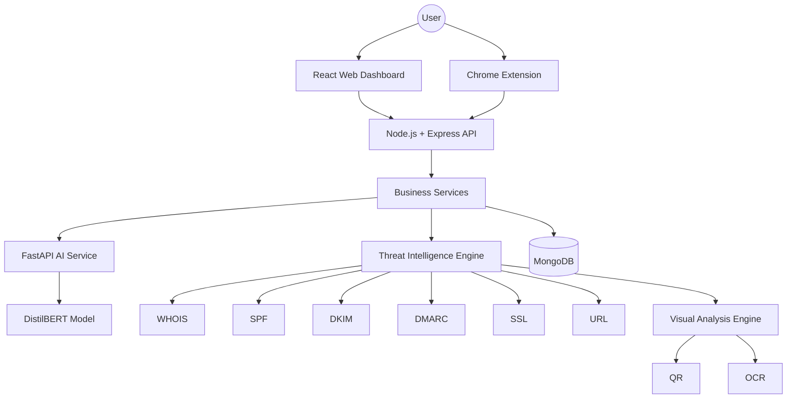

---

## 4.3 Architectural Layers

### Presentation Layer

The Presentation Layer provides all user-facing interfaces.

Components include:

- React Web Dashboard
- Chrome Extension
- Authentication Pages
- Dashboard
- Analytics
- Reports
- Settings
- AI Assistant Interface

Responsibilities:

- User interaction
- Data visualization
- Form validation
- API requests
- Session management
- Dashboard rendering

The Presentation Layer never communicates directly with the database or AI services.

---

### Application Layer

The Application Layer serves as the central communication hub of the platform.

Primary components include:

- Express Routes
- Controllers
- Middleware
- Authentication
- Authorization
- API Gateway
- Request Validation

Responsibilities:

- API routing
- Request validation
- Authentication
- Authorization
- Session verification
- Error handling
- Communication with Business Services

This layer contains no business logic.

---

### Business Layer

The Business Layer contains all core application logic.

Major services include:

- User Service
- Email Service
- Prediction Service
- Dashboard Service
- Report Service
- Notification Service
- AI Integration Service
- Threat Intelligence Service
- Analytics Service

Responsibilities:

- Business rules
- Workflow orchestration
- Decision making
- Service coordination
- Database interaction
- AI communication

---

### Artificial Intelligence Layer

The AI Layer operates independently from the backend.

Major components include:

- FastAPI
- DistilBERT
- Model Loader
- Tokenizer
- Prediction Engine
- Explainable AI Engine

Responsibilities:

- Email classification
- Confidence scoring
- NLP preprocessing
- Prediction generation
- Explainability

The AI service exposes REST endpoints consumed by the backend.

---

### Threat Intelligence Layer

The Threat Intelligence Layer performs technical security verification.

Major modules include:

- WHOIS Analysis
- SSL Analysis
- SPF Validation
- DKIM Validation
- DMARC Validation
- URL Reputation
- Domain Similarity
- Attachment Analysis

Responsibilities:

- Technical verification
- Reputation lookup
- Security scoring
- Domain analysis
- URL analysis

Results are forwarded to the Decision Engine.

---

### Persistence Layer

The Persistence Layer stores application data.

Primary technologies:

- MongoDB
- File Storage
- Threat Cache

Responsibilities:

- Persistent storage
- Historical scans
- User accounts
- Reports
- Configuration
- Threat cache
- Audit logs

Database access occurs exclusively through repository or service layers.

---

## 4.4 Architectural Characteristics

The architecture exhibits the following characteristics.

### Modular

Every subsystem is isolated into its own module.

Examples include:

- Authentication
- Dashboard
- Analytics
- AI
- Reports
- Threat Intelligence

---

### Scalable

Services can scale independently.

Examples:

- AI inference service
- Backend API
- MongoDB
- Chrome Extension API

---

### Secure

Security mechanisms are implemented across every architectural layer.

Examples include:

- JWT
- HTTPS
- Helmet
- Rate limiting
- Password hashing
- Input validation

---

### Extensible

New modules can be integrated without redesigning the architecture.

Examples:

- Outlook Integration
- Microsoft Defender Integration
- Malware Sandbox
- Mobile Application

---

### Fault Tolerant

Failure of one subsystem should minimize impact on remaining components.

Examples:

- Threat Intelligence failure should not crash the dashboard.
- AI timeout should return graceful fallback responses.
- Logging failures should not interrupt API execution.

---

## 4.5 Technology Mapping

| Architectural Layer | Primary Technology |
|---------------------|-------------------|
| Presentation Layer | React + Tailwind CSS |
| Browser Integration | Chrome Extension (Manifest V3) |
| Application Layer | Node.js + Express.js |
| Business Layer | Express Services |
| AI Layer | Python FastAPI |
| NLP Engine | DistilBERT |
| Visual Analysis | OpenCV + EasyOCR + pyzbar |
| Threat Intelligence | Internal Security Services |
| Database | MongoDB |
| Authentication | JWT + Bcrypt |
| Reporting | Chart.js / Recharts |
| Deployment | Docker (Future) |

---

# 5. Layered Architecture

## 5.1 Overview

The layered architecture organizes PhishGuard X into logical tiers, each responsible for a specific aspect of the system.

Each layer communicates only with adjacent layers, ensuring a clear separation of responsibilities and minimizing dependencies.

This approach simplifies maintenance, testing, debugging, and future expansion.

---

## 5.2 Layer Dependency Model

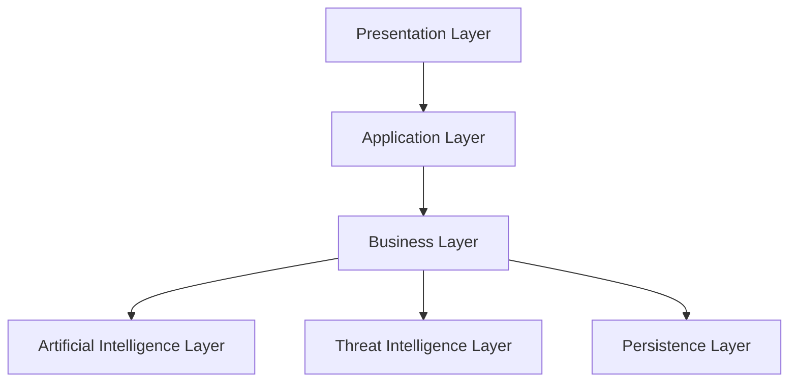

Each layer exposes well-defined interfaces while hiding internal implementation details.

---

## 5.3 Presentation Layer

### Purpose

Provides all user interaction.

### Components

- React Dashboard
- Chrome Extension
- Authentication Pages
- User Settings
- Reports
- Analytics
- Scan Pages

### Responsibilities

- User interface rendering
- API communication
- Form validation
- Dashboard updates
- Session management
- Notification display

### Allowed Communication

✅ Application Layer

### Forbidden Communication

❌ Database

❌ AI Service

❌ MongoDB

❌ Threat Intelligence

---

## 5.4 Application Layer

### Purpose

Acts as the gateway between the frontend and business logic.

### Components

- Routes
- Controllers
- Middleware
- Authentication
- Validation
- Authorization

### Responsibilities

- Receive requests
- Validate input
- Authenticate users
- Authorize requests
- Route business operations
- Generate responses

Controllers should remain lightweight and delegate processing to business services.

---

## 5.5 Business Layer

### Purpose

Implements all application logic.

### Components

- User Service
- Email Service
- Prediction Service
- Dashboard Service
- Analytics Service
- Notification Service
- Report Service

### Responsibilities

- Execute workflows
- Coordinate services
- Process scan requests
- Aggregate results
- Interact with repositories
- Invoke AI services

Business Services never contain UI code.

---

## 5.6 Artificial Intelligence Layer

### Purpose

Provides phishing prediction capabilities.

### Components

- FastAPI
- DistilBERT
- Tokenizer
- Prediction Engine
- Explainability Engine

### Responsibilities

- NLP preprocessing
- Text tokenization
- Model inference
- Confidence scoring
- Explainability generation

The AI service remains completely independent from frontend components.

---

## 5.7 Threat Intelligence Layer

### Purpose

Provides technical verification for emails, domains, and URLs.

### Components

- WHOIS Service
- SSL Service
- SPF Service
- DKIM Service
- DMARC Service
- URL Reputation Service
- Domain Similarity Service
- Attachment Service

### Responsibilities

- Technical analysis
- Security verification
- Reputation lookup
- Risk calculation
- Metadata extraction

The Threat Intelligence Layer complements AI predictions with technical evidence.

---

## 5.8 Persistence Layer

### Purpose

Provides durable storage for application data.

### Components

- MongoDB Collections
- Threat Cache
- Audit Logs
- Reports
- Scan History

### Responsibilities

- Data persistence
- Historical storage
- User management
- Report generation
- Configuration storage

No external layer should access MongoDB directly except through the Business Layer.

---

## 5.9 Benefits of Layered Architecture

The layered design provides several advantages:

- Clear separation of responsibilities
- Improved maintainability
- Independent testing of layers
- Simplified debugging
- Better scalability
- Easier onboarding for developers
- Stronger security boundaries
- Reduced coupling
- Greater flexibility for future enhancements

This architectural style forms the foundation upon which all remaining system components are implemented.

---
# 6. Component Architecture

## 6.1 Overview

The Component Architecture defines the major software components that collectively form the PhishGuard X platform.

Each component represents a logical subsystem responsible for a specific set of functionalities. Components communicate through well-defined interfaces and REST APIs while remaining independently maintainable and scalable.

The component-based approach enables:

- High modularity
- Independent development
- Simplified testing
- Reusability
- Easier deployment
- Future scalability

Each component exposes only the interfaces necessary for communication while encapsulating its internal implementation.

---

## 6.2 System Component Diagram

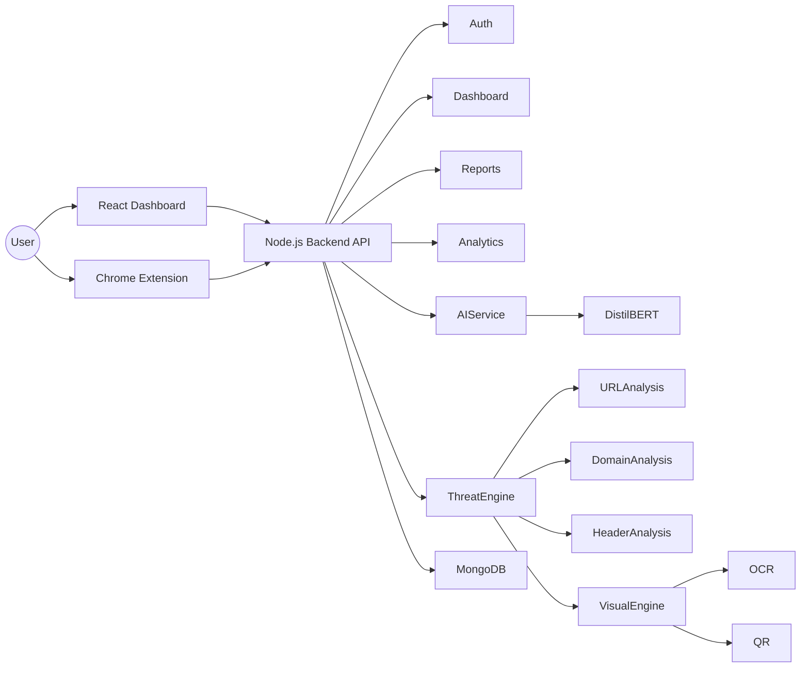

---

## 6.3 Core Components

The PhishGuard X platform is composed of the following primary components.

| Component | Primary Responsibility |
|------------|------------------------|
| React Dashboard | User Interface |
| Chrome Extension | Browser Integration |
| Backend API | Application Services |
| Authentication Module | User Authentication & Authorization |
| Dashboard Module | Analytics & Metrics |
| Email Scanner | Email Processing |
| URL Scanner | URL Analysis |
| Domain Scanner | Domain Intelligence |
| AI Service | Phishing Prediction |
| Threat Intelligence Engine | Technical Analysis |
| Visual Analysis Engine | Image Analysis |
| Reporting Module | Report Generation |
| Notification Module | User Notifications |
| MongoDB | Persistent Storage |

---

## 6.4 React Dashboard Component

### Description

The React Dashboard serves as the primary user interface for the platform.

It provides users with access to all major platform capabilities through an intuitive and responsive web application.

### Responsibilities

- User authentication
- Dashboard visualization
- Scan management
- Report viewing
- Analytics
- AI Assistant interface
- User settings
- Notification display

### Dependencies

- Backend REST API
- Authentication API

### Outputs

- API requests
- User interactions
- Dashboard rendering

---

## 6.5 Chrome Extension Component

### Description

The Chrome Extension provides browser-level phishing detection and Gmail integration.

It enables users to scan emails without leaving their browser.

### Responsibilities

- Gmail integration
- Email extraction
- URL extraction
- API communication
- Risk visualization

### Dependencies

- Backend API
- Authentication API

### Outputs

- Scan requests
- User notifications

---

## 6.6 Backend API Component

### Description

The Backend API acts as the central orchestration layer of the platform.

It coordinates communication between frontend clients, AI services, databases, and threat intelligence modules.

### Responsibilities

- REST API
- Authentication
- Authorization
- Business logic execution
- AI orchestration
- Database access
- Report generation

### Internal Modules

- Routes
- Controllers
- Services
- Middleware
- Repositories

---

## 6.7 AI Service Component

### Description

The AI Service performs phishing prediction using a dedicated machine learning pipeline.

This service operates independently from the backend and communicates through REST APIs.

### Responsibilities

- Email preprocessing
- Tokenization
- DistilBERT inference
- Confidence scoring
- Explainability

### Technologies

- FastAPI
- PyTorch
- Hugging Face Transformers

---

## 6.8 Threat Intelligence Engine

### Description

The Threat Intelligence Engine evaluates technical indicators associated with suspicious emails.

Unlike the AI model, this engine performs deterministic security verification.

### Responsibilities

- Domain verification
- URL analysis
- SSL validation
- WHOIS lookup
- SPF validation
- DKIM validation
- DMARC validation
- Domain similarity detection

Outputs are combined with AI predictions inside the Decision Engine.

---

## 6.9 Visual Analysis Engine

### Description

The Visual Analysis Engine inspects image-based phishing indicators.

It supplements textual analysis by identifying malicious visual content.

### Responsibilities

- QR detection
- OCR
- Screenshot analysis
- Image preprocessing

### Future Responsibilities

- Logo impersonation detection
- Fake login page detection
- Brand recognition

---

## 6.10 Database Component

### Description

MongoDB provides persistent storage for all platform data.

### Stored Information

- Users
- Scan history
- Reports
- Threat cache
- Notifications
- Feedback
- Audit logs
- AI predictions
- Settings

Database access is restricted to repository and service layers.

---

## 6.11 Component Interaction Principles

All components must comply with the following interaction rules.

| Rule | Description |
|-------|-------------|
| C-01 | Components communicate through APIs only. |
| C-02 | Frontend components never access MongoDB directly. |
| C-03 | AI Service never communicates with React directly. |
| C-04 | Database access occurs only through repositories. |
| C-05 | Authentication is required before accessing protected services. |
| C-06 | Services remain independent and loosely coupled. |
| C-07 | Components should be replaceable with minimal architectural impact. |

---

## 6.12 Benefits of Component-Based Design

The component architecture provides:

- Independent development
- Better code organization
- Easier testing
- Improved maintainability
- Higher scalability
- Reduced coupling
- Simplified deployment
- Future extensibility

This component-based design forms the structural backbone of the PhishGuard X platform.

---

# 7. Frontend Architecture

## 7.1 Overview

The frontend architecture of PhishGuard X is designed as a modern Single Page Application (SPA) built using **React**, **Vite**, and **Tailwind CSS**.

The frontend provides an enterprise-grade user experience while remaining modular, responsive, and highly maintainable.

It communicates exclusively with the backend through authenticated REST APIs.

No business logic, AI inference, or database operations are performed within the frontend application.

---

## 7.2 Frontend Technology Stack

| Technology | Purpose |
|------------|---------|
| React | User Interface Framework |
| Vite | Build Tool |
| Tailwind CSS | Styling |
| React Router | Navigation |
| Axios | API Communication |
| TanStack Query | Data Fetching & Caching |
| Framer Motion | Animations |
| Chart.js / Recharts | Analytics & Visualization |

---

## 7.3 Frontend Architecture Diagram

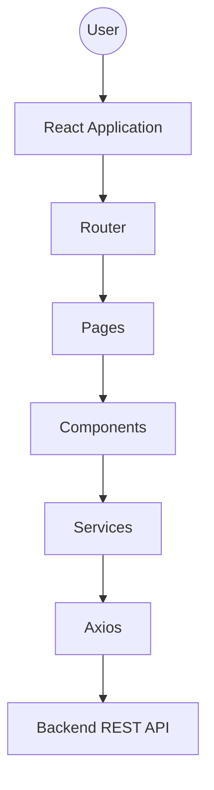

---

## 7.4 Directory Structure

The frontend follows a feature-oriented directory organization.

```text
src/
│
├── assets/
├── components/
├── layouts/
├── pages/
├── services/
├── hooks/
├── context/
├── utils/
├── routes/
├── styles/
├── constants/
├── types/
└── App.jsx
```

Each directory has a dedicated responsibility to maintain clean separation of concerns.

---

## 7.5 Frontend Layers

The frontend itself is divided into multiple logical layers.

### Presentation Layer

Responsible for rendering the user interface.

Includes:

- Pages
- Components
- Layouts

---

### State Management Layer

Responsible for managing application state.

Includes:

- React Context
- TanStack Query
- Local State

---

### Service Layer

Responsible for communication with backend APIs.

Includes:

- Axios
- API wrappers
- Authentication services

---

### Utility Layer

Contains reusable helper functions.

Examples:

- Date formatting
- Validation
- Constants
- Utility methods

---

## 7.6 Major Frontend Modules

The frontend consists of the following feature modules.

- Authentication
- Dashboard
- Email Scanner
- URL Scanner
- Domain Scanner
- Reports
- Analytics
- Threat Center
- AI Assistant
- Notification Center
- User Profile
- Settings
- Administration

Each module operates independently while sharing common UI components.

---

## 7.7 UI Component Hierarchy

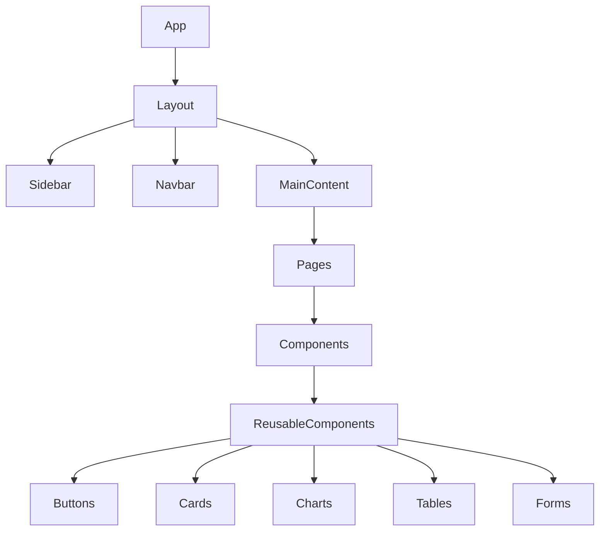

---

## 7.8 Frontend Responsibilities

The frontend is responsible for:

- Rendering dashboards
- Managing user interactions
- Sending authenticated API requests
- Displaying phishing analysis
- Visualizing reports
- Displaying analytics
- Managing navigation
- Handling user sessions
- Displaying notifications

The frontend does **not** perform:

- AI inference
- Threat analysis
- Database access
- Authentication verification
- Business logic execution

These responsibilities remain within backend services.

---

## 7.9 Frontend Design Principles

The frontend follows these engineering principles.

- Component reusability
- Responsive design
- Accessibility
- Separation of concerns
- Lazy loading
- Performance optimization
- Minimal state duplication
- API-driven rendering
- Consistent design language

---

## 7.10 Frontend Communication Rules

| Rule | Description |
|-------|-------------|
| F-01 | All requests use HTTPS. |
| F-02 | Authentication uses JWT tokens. |
| F-03 | Backend APIs are the only communication channel. |
| F-04 | UI components remain stateless whenever possible. |
| F-05 | Business logic never exists inside UI components. |
| F-06 | Sensitive data is never stored in local storage without encryption. |

---

## 7.11 Summary

The frontend architecture provides a scalable and maintainable foundation for user interaction within PhishGuard X.

Its modular design enables rapid feature development while ensuring consistent user experience, strong security boundaries, and seamless integration with backend services.

---
# 8. Backend Architecture

## 8.1 Overview

The Backend Architecture forms the central orchestration layer of the PhishGuard X platform. It is responsible for managing application logic, processing user requests, coordinating communication between services, enforcing security policies, interacting with the database, and integrating artificial intelligence capabilities.

The backend is implemented using **Node.js** with the **Express.js** framework following a layered architecture that separates routing, controllers, services, repositories, middleware, and data access into independent modules.

This design minimizes coupling while improving maintainability, scalability, and testability.

---

## 8.2 Backend Responsibilities

The backend is responsible for:

- User authentication and authorization
- Session management
- Email scan orchestration
- URL scan orchestration
- Domain analysis requests
- AI service communication
- Threat intelligence coordination
- Report generation
- Dashboard analytics
- Notification management
- Audit logging
- Database management
- API validation
- Error handling

---

## 8.3 Backend Architecture Diagram

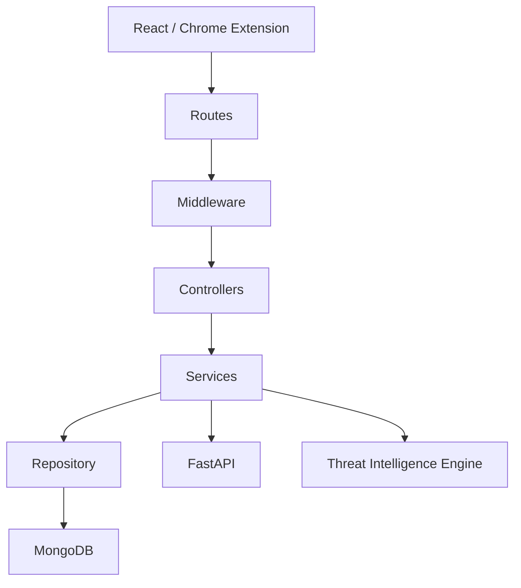

---

## 8.4 Backend Layers

### Routing Layer

The routing layer defines every REST endpoint exposed by the application.

Responsibilities:

- Route registration
- Endpoint grouping
- Version management
- API organization

Example:

```
POST /api/auth/login

POST /api/scan/email

POST /api/scan/url

GET /api/dashboard

GET /api/reports
```

---

### Middleware Layer

Middleware executes before requests reach controllers.

Responsibilities include:

- JWT verification
- Authentication
- Authorization
- Rate limiting
- Request logging
- File upload validation
- CORS configuration
- Helmet security
- Request sanitization

Middleware should remain lightweight and reusable.

---

### Controller Layer

Controllers act as request coordinators.

Responsibilities:

- Receive validated requests
- Invoke services
- Return standardized responses
- Handle exceptions

Controllers must never contain business logic.

Example:

```
Request

↓

Controller

↓

Service

↓

Controller

↓

Response
```

---

### Service Layer

The Service Layer contains all business logic.

Major services include:

- Authentication Service
- User Service
- Email Service
- Prediction Service
- Dashboard Service
- Analytics Service
- Report Service
- Notification Service
- Threat Service

Responsibilities:

- Execute workflows
- Coordinate multiple modules
- Invoke AI
- Access repositories
- Generate business responses

---

### Repository Layer

Repositories abstract MongoDB operations.

Responsibilities:

- CRUD operations
- Query optimization
- Data persistence
- Transaction handling

Repositories isolate the database from business logic.

---

## 8.5 Backend Module Organization

```
backend/

├── routes/
├── controllers/
├── services/
├── repositories/
├── middleware/
├── models/
├── validators/
├── utils/
├── config/
├── constants/
├── logs/
└── server.js
```

Each folder performs a dedicated architectural responsibility.

---

## 8.6 API Categories

The backend exposes several logical API groups.

### Authentication APIs

- Login
- Registration
- Logout
- Refresh Token
- Password Reset

---

### Dashboard APIs

- Dashboard Summary
- Statistics
- Charts
- Recent Scans

---

### Scan APIs

- Email Scan
- URL Scan
- Domain Scan
- Attachment Scan

---

### Report APIs

- Reports
- Export
- History

---

### User APIs

- Profile
- Settings
- Notifications

---

### Admin APIs

- User Management
- Analytics
- System Logs

---

## 8.7 Request Lifecycle

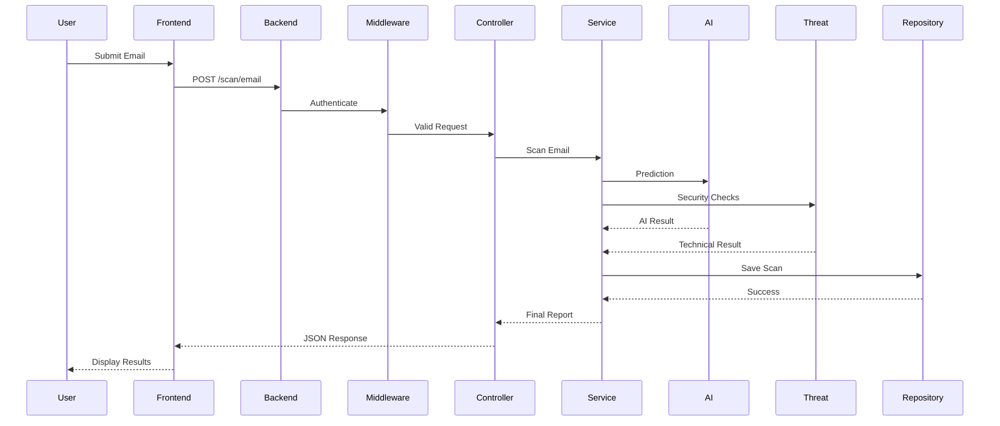

---

## 8.8 Backend Design Rules

| Rule | Description |
|------|-------------|
| B-01 | Controllers contain no business logic. |
| B-02 | Services never communicate directly with React. |
| B-03 | Database access occurs only through repositories. |
| B-04 | Every protected endpoint requires JWT authentication. |
| B-05 | API responses follow a standardized structure. |
| B-06 | All inputs are validated before processing. |
| B-07 | Services remain loosely coupled. |

---

## 8.9 Standard API Response Format

Successful Response

```json
{
  "success": true,
  "message": "Email scanned successfully",
  "data": {},
  "timestamp": "2026-07-19T10:30:00Z"
}
```

Error Response

```json
{
  "success": false,
  "message": "Authentication Failed",
  "error": {},
  "timestamp": "2026-07-19T10:30:00Z"
}
```

Maintaining a consistent response format simplifies frontend integration and improves API usability.

---

# 9. AI Service Architecture

## 9.1 Overview

The AI Service is the intelligence layer of PhishGuard X responsible for detecting phishing attempts using Natural Language Processing (NLP), machine learning, technical security indicators, and visual analysis.

Rather than embedding the AI model directly within the Node.js backend, PhishGuard X implements AI as an independent microservice using **Python FastAPI**.

This separation improves scalability, maintainability, and deployment flexibility.

---

## 9.2 AI Architecture Goals

The AI architecture is designed to:

- Deliver accurate phishing detection
- Support independent model deployment
- Minimize backend resource consumption
- Enable future model replacement
- Support explainable predictions
- Allow independent scaling
- Simplify model updates

---

## 9.3 AI Service Architecture

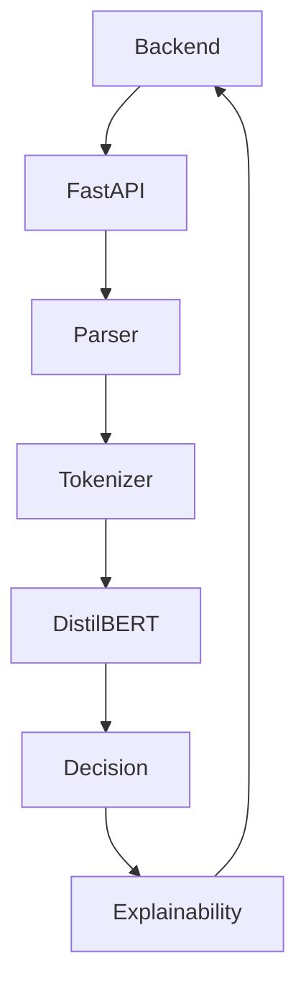

---

## 9.4 AI Processing Pipeline

Every email follows the same processing pipeline.

```mermaid
flowchart LR

Email

-->

Parser

-->

Cleaning

-->

Tokenizer

-->

DistilBERT

-->

Prediction

-->

Decision Engine

-->

Explanation

-->

Backend

```

---

## 9.5 AI Components

### Email Parser

Responsibilities:

- Extract subject
- Extract sender
- Extract body
- Remove unnecessary metadata
- Normalize text

---

### Text Preprocessor

Responsibilities:

- Lowercase conversion
- Character normalization
- Whitespace removal
- Encoding cleanup

---

### Tokenizer

Responsibilities:

- Token generation
- Attention masks
- Sequence padding
- Input formatting

Uses the Hugging Face tokenizer compatible with DistilBERT.

---

### DistilBERT Model

Responsibilities:

- Email understanding
- Context extraction
- Classification
- Confidence scoring

Outputs:

- Prediction
- Confidence
- Hidden representations

---

### Decision Engine

Combines:

- AI score
- Threat Intelligence
- Visual Analysis

Produces:

- Final Risk Score
- Threat Category
- Overall Confidence

---

### Explainable AI Engine

Generates human-readable explanations.

Example:

```
Prediction:

Phishing

Confidence:

97%

Reasons:

•

Urgent financial language

•

Suspicious domain

•

Failed SPF validation

Recommendation:

Do not interact with this email.
```

---

## 9.6 AI Request Flow

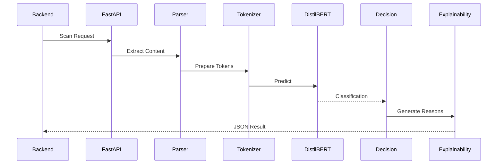

---

## 9.7 AI REST Endpoints

| Endpoint | Purpose |
|-----------|----------|
| POST /predict | Email prediction |
| POST /batch-predict | Multiple email prediction |
| GET /health | Health monitoring |
| GET /model/info | Model information |
| GET /metrics | Performance metrics |

---

## 9.8 AI Technologies

| Technology | Purpose |
|------------|---------|
| Python | AI Service |
| FastAPI | REST API |
| PyTorch | Deep Learning |
| Transformers | NLP Models |
| DistilBERT | Phishing Detection |
| Pandas | Data Processing |
| NumPy | Numerical Computing |
| Scikit-learn | Evaluation Metrics |

---

## 9.9 AI Service Principles

| Rule | Description |
|------|-------------|
| AI-01 | AI runs independently from the backend. |
| AI-02 | Models are loaded only once during startup. |
| AI-03 | Backend communicates using REST APIs only. |
| AI-04 | Every prediction includes explainability. |
| AI-05 | Models can be upgraded without backend modifications. |
| AI-06 | Prediction requests are stateless. |
| AI-07 | AI services support horizontal scaling. |

---

## 9.10 Future AI Enhancements

The architecture has been designed to support future expansion without major redesign.

Potential enhancements include:

- Multi-model ensemble learning
- Vision Transformers (ViT) for image phishing detection
- Llama-based AI security assistant
- Real-time adaptive threat scoring
- Federated learning
- Continuous model retraining
- Active learning using user feedback
- Multilingual phishing detection
- Behavioral anomaly detection

The modular AI architecture ensures that these capabilities can be integrated while preserving the existing service interfaces and backend communication model.

---
# 10. Database Architecture

## 10.1 Overview

The Database Architecture defines how persistent data is organized, stored, retrieved, and maintained throughout the PhishGuard X platform.

PhishGuard X utilizes **MongoDB**, a NoSQL document-oriented database, as its primary data storage solution. MongoDB was selected due to its flexible schema design, scalability, high performance, and native support for JSON-like documents.

The database serves as the central repository for user information, phishing scan history, AI predictions, reports, application settings, threat intelligence cache, notifications, and audit logs.

All database interactions are performed exclusively through the Repository Layer to maintain separation of concerns and ensure data integrity.

---

## 10.2 Database Objectives

The database architecture is designed to achieve the following objectives:

- Efficient storage of application data.
- High availability and scalability.
- Flexible schema evolution.
- Fast retrieval of historical scan records.
- Secure storage of user information.
- Efficient indexing for search operations.
- Support for future analytics and reporting.
- Reliable backup and recovery.

---

## 10.3 Database Architecture Diagram

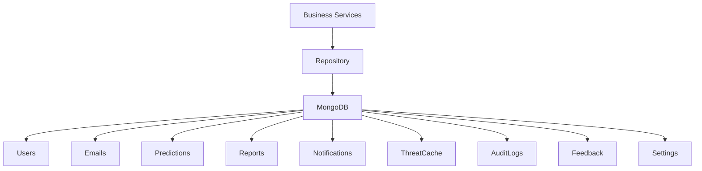

---

## 10.4 Database Collections

The primary MongoDB collections include:

| Collection | Purpose |
|------------|---------|
| users | User accounts and authentication data |
| emails | Scanned email records |
| predictions | AI prediction history |
| reports | Generated reports |
| notifications | User notifications |
| threat_cache | Cached threat intelligence |
| trusted_domains | Whitelisted domains |
| blocked_domains | Blacklisted domains |
| feedback | User feedback on AI predictions |
| audit_logs | Security and activity logs |
| settings | User preferences and application settings |
| refresh_tokens | Active refresh tokens |
| simulation_campaigns | Phishing simulation campaigns |
| simulation_results | Campaign results |
| conversations | AI Assistant conversation history |

---

## 10.5 Data Relationships

Although MongoDB is a NoSQL database, logical relationships exist between collections.

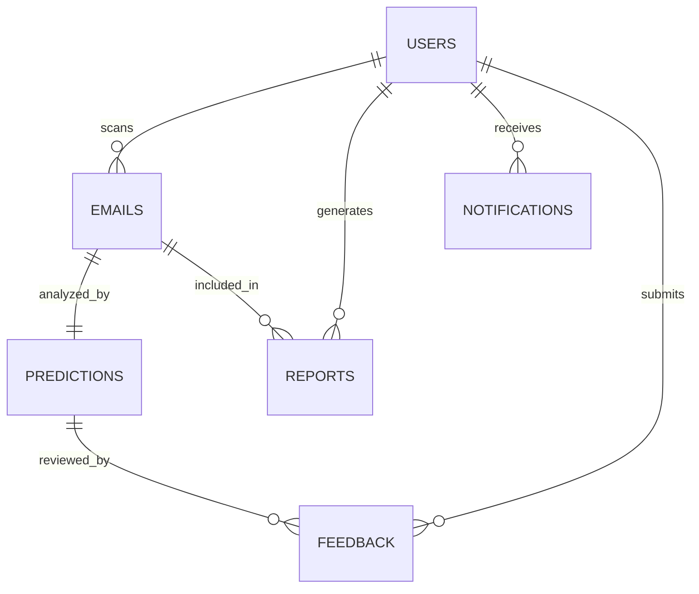

Relationships are maintained using document references where appropriate while avoiding unnecessary joins.

---

## 10.6 Indexing Strategy

Proper indexing is essential for maintaining application performance.

Recommended indexes include:

| Collection | Indexed Fields |
|------------|----------------|
| users | email |
| emails | userId, scanDate |
| predictions | emailId, riskScore |
| reports | userId, createdAt |
| notifications | userId, read |
| threat_cache | domain, url |
| audit_logs | userId, timestamp |

Indexes should be reviewed periodically as application usage grows.

---

## 10.7 Data Access Pattern

All database operations follow a standardized flow.

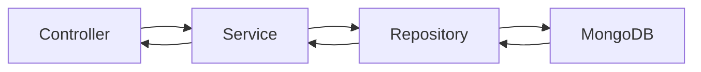

This approach ensures:

- Better maintainability.
- Easier testing.
- Improved abstraction.
- Centralized query optimization.
- Consistent error handling.

---

## 10.8 Data Security

Sensitive information stored within MongoDB must be protected using multiple security mechanisms.

Examples include:

- Password hashing using Bcrypt.
- JWT-based authentication.
- Environment-based database credentials.
- Principle of least privilege.
- HTTPS communication.
- Input validation.
- Access control through backend services.

Sensitive information such as passwords shall never be stored in plaintext.

---

## 10.9 Backup and Recovery

The database architecture supports disaster recovery through periodic backups.

Recommended strategies include:

- Daily automated backups.
- Incremental backups.
- Point-in-time recovery.
- Encrypted backup storage.
- Backup verification.
- Recovery testing.

Future cloud deployments should utilize managed MongoDB backup services.

---

## 10.10 Database Design Principles

The database implementation follows these engineering principles.

| Rule | Description |
|------|-------------|
| DB-01 | Business services are the only components allowed to access repositories. |
| DB-02 | Repository Layer handles all CRUD operations. |
| DB-03 | Passwords must always be hashed. |
| DB-04 | Database credentials are stored in environment variables. |
| DB-05 | Collections should remain loosely coupled. |
| DB-06 | Frequently queried fields should be indexed. |
| DB-07 | Data validation occurs before persistence. |

---

## 10.11 Summary

The MongoDB architecture provides a scalable and flexible persistence layer capable of supporting both current and future application requirements.

Its document-oriented design aligns well with the modular architecture of PhishGuard X while enabling efficient storage, rapid retrieval, and secure management of cybersecurity-related data.

---

# 11. Chrome Extension Architecture

## 11.1 Overview

The Chrome Extension Architecture enables PhishGuard X to integrate directly with the user's web browser, providing real-time phishing detection while browsing supported email platforms such as Gmail.

The extension acts as a lightweight client that communicates securely with the backend through authenticated REST APIs.

All phishing detection, threat analysis, and AI inference remain server-side. The extension is responsible only for collecting relevant information, displaying results, and interacting with the user.

This design minimizes resource consumption while maintaining a secure execution environment.

---

## 11.2 Objectives

The Chrome Extension has the following objectives:

- Integrate seamlessly with Gmail.
- Detect phishing attempts in real time.
- Provide one-click email scanning.
- Display phishing risk information.
- Minimize browser resource usage.
- Communicate securely with backend services.
- Operate using Manifest Version 3.

---

## 11.3 Extension Architecture

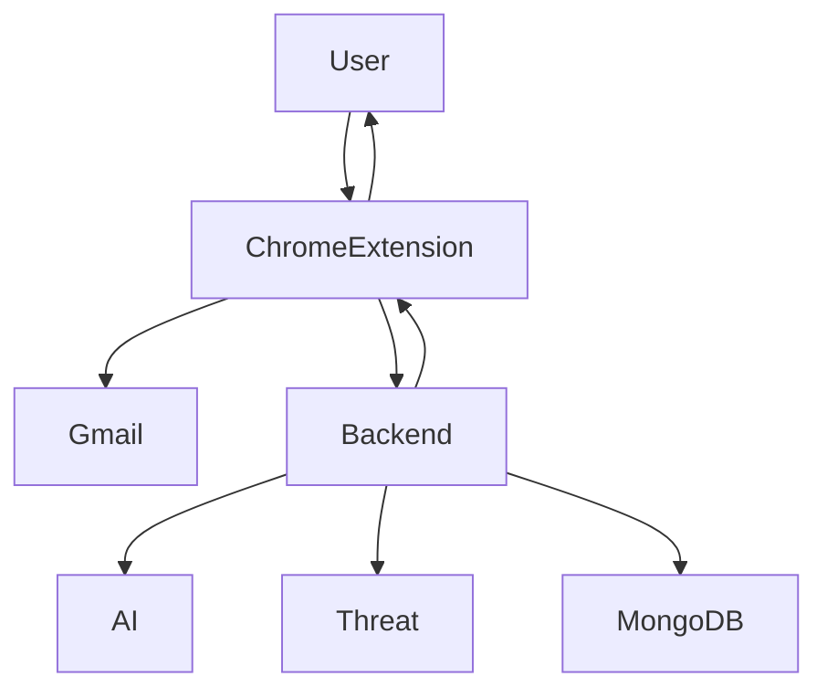

---

## 11.4 Extension Components

The extension consists of several independent modules.

### Background Service Worker

Responsibilities:

- API communication
- Authentication
- Token management
- Event handling

---

### Content Script

Responsibilities:

- Read Gmail content
- Extract email body
- Extract sender information
- Extract hyperlinks
- Inject phishing warnings

---

### Popup Interface

Responsibilities:

- Display scan results
- User authentication
- Manual scan controls
- Notification display

---

### Options Page

Responsibilities:

- User preferences
- API configuration
- Extension settings
- Notification settings

---

## 11.5 Extension Workflow

The following sequence illustrates a typical phishing scan.

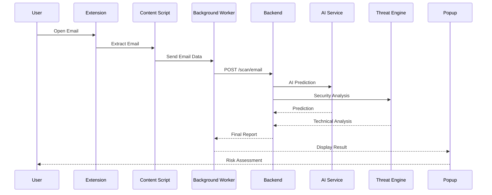

---

## 11.6 Data Captured

The extension may extract:

- Email subject
- Sender address
- Email body
- Hyperlinks
- Attachments metadata
- Embedded QR codes (future enhancement)

Only information required for phishing analysis is transmitted to backend services.

---

## 11.7 Permissions

The extension follows the Principle of Least Privilege.

Required permissions include:

- activeTab
- storage
- scripting
- identity
- host_permissions (Gmail)

Additional permissions should only be introduced when required by future functionality.

---

## 11.8 Security Considerations

Security measures include:

- JWT authentication.
- HTTPS communication.
- Secure token storage.
- Manifest Version 3 compliance.
- Content Security Policy (CSP).
- Input sanitization.
- Minimal permission model.

Sensitive information is never permanently stored within the browser.

---

## 11.9 Extension Communication

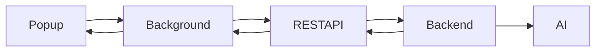

The extension never communicates directly with the AI service or the database.

---

## 11.10 Design Principles

| Rule | Description |
|------|-------------|
| EXT-01 | All communication uses HTTPS. |
| EXT-02 | Authentication uses JWT tokens. |
| EXT-03 | AI inference never occurs inside the extension. |
| EXT-04 | Tokens are securely managed by the background service worker. |
| EXT-05 | The extension follows Manifest Version 3 requirements. |
| EXT-06 | Only necessary browser permissions are requested. |
| EXT-07 | Browser resources should be used efficiently. |

---

## 11.11 Future Enhancements

Future versions of the extension may include:

- Microsoft Outlook integration.
- QR code scanning.
- Attachment malware detection.
- Real-time URL reputation.
- Logo impersonation detection.
- Visual phishing detection.
- Enterprise policy management.
- Offline caching.
- Multi-browser support.

---

## 11.12 Summary

The Chrome Extension Architecture provides a lightweight yet powerful browser integration that extends the capabilities of PhishGuard X beyond the web dashboard.

Its modular design, secure communication model, and minimal browser footprint ensure seamless user experience while maintaining enterprise-grade security standards.

---
# 12. Threat Intelligence Architecture

## 12.1 Overview

The Threat Intelligence Architecture is responsible for performing technical security analysis on emails, URLs, domains, attachments, and related metadata.

Unlike the Artificial Intelligence Layer, which performs probabilistic phishing detection using Natural Language Processing (NLP), the Threat Intelligence Layer performs deterministic security verification based on established cybersecurity techniques and external threat intelligence sources.

This layer enriches AI predictions with technical evidence, improving detection accuracy while reducing false positives and false negatives.

---

## 12.2 Objectives

The Threat Intelligence Engine has the following objectives:

- Verify sender authenticity.
- Analyze suspicious URLs.
- Validate domain reputation.
- Detect email spoofing.
- Analyze SSL certificates.
- Verify SPF records.
- Verify DKIM signatures.
- Verify DMARC policies.
- Detect domain impersonation.
- Generate technical threat scores.
- Provide evidence for Explainable AI.

---

## 12.3 Architecture Diagram

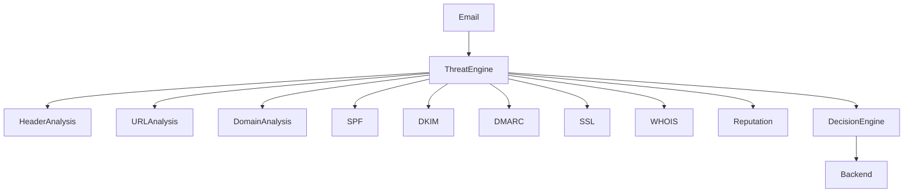

---

## 12.4 Threat Intelligence Modules

### Header Analysis Module

Responsibilities:

- Analyze email headers.
- Detect forged sender addresses.
- Extract routing information.
- Identify suspicious relay chains.
- Verify originating IP addresses.

---

### URL Analysis Module

Responsibilities:

- Extract hyperlinks.
- Normalize URLs.
- Detect URL obfuscation.
- Identify shortened links.
- Verify URL reputation.
- Calculate URL risk score.

---

### Domain Analysis Module

Responsibilities:

- Domain age analysis.
- Registrar verification.
- Registration country.
- DNS inspection.
- Domain similarity detection.
- Homograph attack detection.

---

### WHOIS Service

Responsibilities:

- Retrieve WHOIS information.
- Determine domain registration age.
- Identify registrar.
- Analyze expiration dates.

---

### SSL Verification Service

Responsibilities:

- Verify SSL certificates.
- Detect expired certificates.
- Validate certificate chains.
- Analyze certificate issuer.

---

### SPF Verification Service

Responsibilities:

- Retrieve SPF records.
- Verify sender authorization.
- Detect SPF failures.

---

### DKIM Verification Service

Responsibilities:

- Verify digital signatures.
- Validate email integrity.
- Detect tampered emails.

---

### DMARC Verification Service

Responsibilities:

- Retrieve DMARC policies.
- Validate authentication policies.
- Determine enforcement level.

---

### Reputation Service

Responsibilities:

- Domain reputation.
- URL reputation.
- Cached threat indicators.
- Blacklist verification.

---

## 12.5 Threat Analysis Workflow

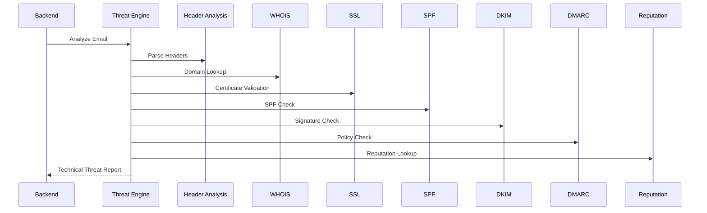

---

## 12.6 Threat Score Calculation

Each module contributes to an overall technical risk score.

| Module | Weight |
|----------|--------|
| URL Analysis | High |
| Domain Analysis | High |
| SPF | Medium |
| DKIM | Medium |
| DMARC | Medium |
| SSL | Medium |
| WHOIS | Medium |
| Reputation | High |

The Decision Engine combines these scores with AI predictions to determine the final phishing risk.

---

## 12.7 Design Principles

| Rule | Description |
|------|-------------|
| TI-01 | Every scan performs independent technical verification. |
| TI-02 | External services should be cached whenever possible. |
| TI-03 | Threat modules remain loosely coupled. |
| TI-04 | Threat intelligence complements AI predictions rather than replacing them. |
| TI-05 | Failed external services should not interrupt scan execution. |
| TI-06 | All technical indicators should contribute to Explainable AI. |

---

## 12.8 Summary

The Threat Intelligence Architecture provides deterministic cybersecurity analysis that strengthens AI predictions and improves overall phishing detection accuracy by validating technical indicators commonly used in email authentication and domain verification.

---

# 13. Visual Analysis Architecture

## 13.1 Overview

The Visual Analysis Architecture enables PhishGuard X to inspect image-based phishing indicators that cannot be detected through text analysis alone.

This subsystem analyzes embedded images, QR codes, screenshots, and graphical content using computer vision techniques.

The Visual Analysis Engine complements the NLP and Threat Intelligence engines by identifying visual attack vectors commonly used in modern phishing campaigns.

---

## 13.2 Objectives

The Visual Analysis Engine aims to:

- Detect QR codes.
- Decode embedded URLs.
- Extract text using OCR.
- Analyze screenshots.
- Support image preprocessing.
- Improve phishing detection accuracy.
- Provide additional evidence for Explainable AI.

---

## 13.3 Architecture Diagram

```mermaid
flowchart TD

Image

-->

Preprocessing

-->

QR Detection

-->

OCR

-->

URL Extraction

-->

Threat Intelligence

-->

Decision Engine

-->

Backend

```

---

## 13.4 Visual Analysis Modules

### Image Preprocessing

Responsibilities:

- Image resizing.
- Noise reduction.
- Contrast enhancement.
- Rotation correction.
- Format normalization.

---

### QR Detection Module

Responsibilities:

- Locate QR codes.
- Decode QR content.
- Validate extracted URLs.
- Forward URLs to Threat Intelligence.

Technology:

- OpenCV
- pyzbar

---

### OCR Module

Responsibilities:

- Extract visible text.
- Normalize text.
- Forward extracted content to the NLP engine.

Technology:

- EasyOCR

---

### URL Extraction Module

Responsibilities:

- Parse decoded QR URLs.
- Remove tracking parameters.
- Normalize URLs.
- Submit URLs for security analysis.

---

### Future Logo Detection Module

Future capabilities include:

- Brand recognition.
- Logo impersonation detection.
- Fake company identification.

---

### Future Login Detection Module

Future capabilities include:

- Login page recognition.
- Credential harvesting detection.
- Fake authentication page identification.

---

## 13.5 Visual Processing Workflow

```mermaid
flowchart LR

Image

-->

Preprocessing

-->

QR

-->

OCR

-->

URL Extraction

-->

Threat Intelligence

-->

Decision Engine

```

---

## 13.6 Technologies

| Technology | Purpose |
|------------|---------|
| OpenCV | Image Processing |
| pyzbar | QR Detection |
| EasyOCR | Optical Character Recognition |
| Pillow | Image Handling |

---

## 13.7 Design Principles

| Rule | Description |
|------|-------------|
| VA-01 | Visual analysis supplements AI predictions. |
| VA-02 | QR URLs are treated as normal URLs after extraction. |
| VA-03 | OCR text follows the standard NLP pipeline. |
| VA-04 | Image preprocessing occurs before analysis. |
| VA-05 | Future modules must remain independent. |

---

## 13.8 Summary

The Visual Analysis Architecture extends phishing detection beyond textual content by analyzing images, QR codes, and visual elements commonly exploited by attackers. Its modular design enables future integration of advanced computer vision capabilities.

---

# 14. Communication Architecture

## 14.1 Overview

The Communication Architecture defines how software components within PhishGuard X exchange information securely and efficiently.

All inter-component communication follows standardized REST APIs using HTTPS. Components remain independent and communicate through clearly defined interfaces.

This architecture minimizes coupling while improving scalability, maintainability, and fault isolation.

---

## 14.2 Communication Principles

The following principles govern system communication:

- Services communicate only through authenticated APIs.
- Components never access another component's internal implementation.
- Communication is stateless whenever possible.
- All data is exchanged using JSON.
- HTTPS is mandatory.
- Authentication is required for protected endpoints.

---

## 14.3 Communication Diagram

```mermaid
flowchart LR

React

-->

Backend

Backend

-->

AI Service

Backend

-->

Threat Engine

Backend

-->

MongoDB

Chrome Extension

-->

Backend

```

---

## 14.4 Communication Channels

### Frontend → Backend

Protocol:

- HTTPS

Format:

- REST API
- JSON

Authentication:

- JWT

---

### Backend → AI Service

Protocol:

- Internal HTTPS

Format:

- JSON

Purpose:

- Prediction requests
- Explainability
- Batch inference

---

### Backend → Threat Intelligence

Protocol:

- Internal Services

Purpose:

- URL verification.
- Domain analysis.
- Technical validation.

---

### Backend → MongoDB

Communication occurs exclusively through repository classes.

No external component may access MongoDB directly.

---

### Chrome Extension → Backend

The Chrome Extension communicates only with the backend API.

It never interacts directly with:

- AI Service
- MongoDB
- Threat Intelligence

---

## 14.5 Request Lifecycle

```mermaid
sequenceDiagram

User->>React: Submit Scan

React->>Backend: HTTPS Request

Backend->>AI: Prediction

Backend->>Threat Engine: Technical Analysis

AI-->>Backend: Prediction

Threat Engine-->>Backend: Technical Report

Backend->>MongoDB: Save Results

MongoDB-->>Backend: Success

Backend-->>React: JSON Response

React-->>User: Display Report

```

---

## 14.6 Communication Standards

| Rule | Description |
|------|-------------|
| COM-01 | All APIs use HTTPS. |
| COM-02 | JSON is the standard data format. |
| COM-03 | Authentication uses JWT. |
| COM-04 | Services remain stateless. |
| COM-05 | Components communicate only through documented interfaces. |
| COM-06 | API responses follow a consistent schema. |
| COM-07 | Communication failures are handled gracefully. |

---

## 14.7 Summary

The Communication Architecture establishes secure, standardized, and loosely coupled communication between all components of the PhishGuard X platform. By relying on authenticated REST APIs and clearly defined interfaces, the system remains scalable, maintainable, and resilient to future architectural changes.

---
# 15. Authentication Architecture

## 15.1 Overview

The Authentication Architecture is responsible for verifying user identity, controlling access to protected resources, and securing communication between users, the backend, and browser-based components.

PhishGuard X implements a stateless authentication model using **JSON Web Tokens (JWT)** combined with secure password hashing, refresh tokens, role-based authorization, and HTTPS communication.

Authentication is centralized within the backend to ensure consistent security enforcement across the web application and Chrome Extension.

---

## 15.2 Objectives

The Authentication Architecture is designed to:

- Verify user identity securely.
- Protect restricted API endpoints.
- Support stateless authentication.
- Enable secure session management.
- Prevent unauthorized access.
- Protect user credentials.
- Support role-based authorization.
- Enable secure browser extension authentication.

---

## 15.3 Authentication Components

The authentication subsystem consists of the following components:

| Component | Responsibility |
|------------|----------------|
| Login Service | User authentication |
| JWT Service | Token generation and verification |
| Refresh Token Service | Session renewal |
| Authorization Middleware | Access control |
| Password Service | Password hashing and verification |
| User Repository | User retrieval |
| Session Manager | Session lifecycle management |

---

## 15.4 Authentication Flow

```mermaid
sequenceDiagram

User->>Frontend: Login

Frontend->>Backend: Username + Password

Backend->>Database: Verify User

Database-->>Backend: User Record

Backend->>Password Service: Verify Password

Password Service-->>Backend: Valid

Backend->>JWT Service: Generate Access Token

JWT Service-->>Backend: JWT + Refresh Token

Backend-->>Frontend: Authentication Success

Frontend-->>User: Dashboard Access
```

---

## 15.5 JWT Authentication Flow

```mermaid
flowchart LR

Login

-->

JWT Generation

-->

Frontend

-->

API Request

-->

JWT Validation

-->

Authorized Request

-->

Response
```

Every protected request must include a valid JWT in the Authorization header.

---

## 15.6 Authorization

PhishGuard X implements **Role-Based Access Control (RBAC)**.

Supported roles include:

| Role | Permissions |
|------|-------------|
| User | Scan emails, view reports, manage profile |
| Administrator | Full platform administration |
| Future Analyst | Threat monitoring and investigation |
| Future Enterprise Admin | Organization management |

Authorization is enforced by middleware before protected resources are accessed.

---

## 15.7 Password Security

Passwords are protected using modern security practices.

Security measures include:

- Bcrypt hashing
- Salt generation
- Minimum password requirements
- Password confirmation
- Secure password reset workflow
- No plaintext password storage

---

## 15.8 Refresh Token Strategy

Access tokens remain short-lived.

Refresh tokens are stored securely and used to generate new access tokens without requiring users to log in repeatedly.

Benefits include:

- Improved security
- Reduced session hijacking risk
- Better user experience

---

## 15.9 Authentication Rules

| Rule | Description |
|------|-------------|
| AUTH-01 | Passwords must always be hashed. |
| AUTH-02 | JWT authentication is mandatory for protected APIs. |
| AUTH-03 | HTTPS is required for authentication requests. |
| AUTH-04 | Refresh tokens must be securely stored. |
| AUTH-05 | Unauthorized requests return HTTP 401. |
| AUTH-06 | Authorization middleware executes before controllers. |
| AUTH-07 | Authentication logic remains centralized. |

---

## 15.10 Summary

The Authentication Architecture provides secure, scalable, and stateless user authentication while protecting platform resources through JWT-based authorization and modern password security practices.

---

# 16. API Communication Flow

## 16.1 Overview

The API Communication Flow defines how clients interact with backend services and how internal services exchange information throughout the PhishGuard X platform.

All external communication follows REST architectural principles using JSON over HTTPS.

Internal services also communicate using authenticated REST endpoints, ensuring loose coupling between application components.

---

## 16.2 API Communication Architecture

```mermaid
flowchart TD

React

-->

REST API

REST API

-->

Controllers

Controllers

-->

Services

Services

-->

Repositories

Repositories

-->

MongoDB

Services

-->

AI Service

Services

-->

Threat Engine
```

---

## 16.3 Request Lifecycle

Every API request follows a standardized lifecycle.

```mermaid
flowchart LR

Request

-->

Validation

-->

Authentication

-->

Authorization

-->

Controller

-->

Service

-->

Repository

-->

Response
```

---

## 16.4 API Standards

All APIs follow common development standards.

### HTTP Methods

| Method | Purpose |
|---------|----------|
| GET | Retrieve resources |
| POST | Create resources |
| PUT | Update resources |
| PATCH | Partial updates |
| DELETE | Remove resources |

---

### Response Format

All responses follow a standardized JSON structure.

```json
{
    "success": true,
    "message": "Operation Successful",
    "data": {},
    "timestamp": ""
}
```

---

### Error Format

```json
{
    "success": false,
    "message": "Validation Failed",
    "errors": []
}
```

---

## 16.5 API Categories

The backend exposes multiple logical API groups.

### Authentication

- Login
- Register
- Logout
- Refresh Token

---

### Email Analysis

- Scan Email
- Batch Scan
- Scan History

---

### URL Analysis

- Scan URL
- Reputation Lookup

---

### Domain Analysis

- Domain Verification
- Domain Reputation

---

### Dashboard

- Statistics
- Analytics
- Reports

---

### Administration

- User Management
- Logs
- System Status

---

## 16.6 Internal API Communication

Internal services communicate independently.

```mermaid
flowchart LR

Backend

-->

AI

Backend

-->

Threat Intelligence

Backend

-->

Visual Analysis

Backend

-->

Database
```

No internal component communicates directly with frontend applications.

---

## 16.7 API Design Principles

| Rule | Description |
|------|-------------|
| API-01 | APIs follow REST principles. |
| API-02 | JSON is the standard payload format. |
| API-03 | All endpoints are versioned. |
| API-04 | Authentication is required for protected endpoints. |
| API-05 | Consistent response structures are mandatory. |
| API-06 | APIs remain stateless. |
| API-07 | Validation occurs before business logic. |

---

## 16.8 Summary

The API Communication Flow standardizes every interaction within the platform, ensuring secure, consistent, and maintainable communication between all system components.

---

# 17. Data Flow Architecture

## 17.1 Overview

The Data Flow Architecture describes how information moves throughout the PhishGuard X platform from the moment a user submits data until the final phishing analysis is returned.

Every scan request follows a controlled workflow that combines business logic, artificial intelligence, threat intelligence, visual analysis, and persistent storage.

---

## 17.2 Email Scan Data Flow

The following diagram illustrates the complete lifecycle of an email scan.

```mermaid
flowchart TD

User

-->

React Dashboard

-->

Backend API

-->

Email Service

Email Service

-->

AI Service

Email Service

-->

Threat Intelligence

Email Service

-->

Visual Analysis

AI Service

-->

Decision Engine

Threat Intelligence

-->

Decision Engine

Visual Analysis

-->

Decision Engine

Decision Engine

-->

MongoDB

MongoDB

-->

Backend

Backend

-->

Frontend

Frontend

-->

User
```

---

## 17.3 URL Scan Flow

```mermaid
flowchart LR

User

-->

URL Scanner

-->

Backend

-->

Threat Engine

-->

Decision Engine

-->

MongoDB

-->

Frontend

-->

User
```

---

## 17.4 Domain Scan Flow

```mermaid
flowchart LR

User

-->

Backend

-->

WHOIS

Backend

-->

SSL

Backend

-->

SPF

Backend

-->

DKIM

Backend

-->

DMARC

-->

Decision Engine

-->

Response
```

---

## 17.5 Report Generation Flow

```mermaid
flowchart TD

Historical Data

-->

Reports Service

-->

Analytics

-->

Charts

-->

Frontend

-->

User
```

---

## 17.6 AI Decision Flow

The Decision Engine combines multiple sources of evidence before determining the final phishing classification.

```mermaid
flowchart TD

DistilBERT Score

-->

Decision Engine

Threat Score

-->

Decision Engine

Visual Score

-->

Decision Engine

Decision Engine

-->

Risk Score

-->

Explanation

-->

Response
```

---

## 17.7 Data Flow Principles

| Rule | Description |
|------|-------------|
| DF-01 | Data flows through controlled architectural layers. |
| DF-02 | AI predictions are never returned directly without business validation. |
| DF-03 | Scan results are persisted before response delivery. |
| DF-04 | Every scan generates an audit record. |
| DF-05 | Sensitive data remains protected during transmission. |
| DF-06 | Explainable AI accompanies every prediction. |
| DF-07 | Data movement remains fully traceable. |

---

## 17.8 Summary

The Data Flow Architecture ensures that every scan follows a consistent, secure, and auditable processing pipeline. By combining AI inference, technical verification, visual analysis, and centralized decision-making, PhishGuard X delivers accurate and explainable phishing detection while maintaining a scalable and maintainable system architecture.

---
# 18. Sequence Diagrams

## 18.1 Overview

Sequence diagrams illustrate the chronological interaction between software components during various operational workflows within the PhishGuard X platform.

These diagrams describe how requests propagate through the system, how individual services collaborate, and how responses are returned to the user.

Understanding these interactions assists developers in implementing APIs, debugging request lifecycles, and validating service dependencies.

---

## 18.2 User Login Sequence

```mermaid
sequenceDiagram

participant User
participant Frontend
participant Backend
participant Database

User->>Frontend: Enter Credentials

Frontend->>Backend: POST /auth/login

Backend->>Database: Find User

Database-->>Backend: User Record

Backend->>Backend: Verify Password

Backend->>Backend: Generate JWT

Backend-->>Frontend: Access Token

Frontend-->>User: Login Successful
```

---

## 18.3 Email Scan Sequence

```mermaid
sequenceDiagram

participant User
participant React
participant Backend
participant AI
participant Threat
participant Database

User->>React: Submit Email

React->>Backend: Scan Request

Backend->>AI: AI Prediction

Backend->>Threat: Technical Analysis

AI-->>Backend: Prediction

Threat-->>Backend: Threat Score

Backend->>Database: Save Scan

Database-->>Backend: Success

Backend-->>React: Final Result

React-->>User: Display Analysis
```

---

## 18.4 URL Scan Sequence

```mermaid
sequenceDiagram

participant User
participant Frontend
participant Backend
participant ThreatEngine

User->>Frontend: Submit URL

Frontend->>Backend: URL Scan

Backend->>ThreatEngine: Analyze URL

ThreatEngine-->>Backend: Threat Report

Backend-->>Frontend: Risk Assessment

Frontend-->>User: Display Result
```

---

## 18.5 Chrome Extension Scan Sequence

```mermaid
sequenceDiagram

participant User
participant Extension
participant Backend
participant AI
participant Threat

User->>Extension: Open Email

Extension->>Backend: Email Content

Backend->>AI: Prediction

Backend->>Threat: Analysis

AI-->>Backend: Prediction

Threat-->>Backend: Technical Result

Backend-->>Extension: Risk Report

Extension-->>User: Warning Display
```

---

## 18.6 Report Generation Sequence

```mermaid
sequenceDiagram

participant User
participant Frontend
participant Backend
participant Database

User->>Frontend: Generate Report

Frontend->>Backend: Report Request

Backend->>Database: Retrieve History

Database-->>Backend: Scan Records

Backend->>Backend: Generate Report

Backend-->>Frontend: Report

Frontend-->>User: Display Report
```

---

## 18.7 Sequence Diagram Design Rules

| Rule | Description |
|------|-------------|
| SD-01 | Every workflow begins with a client request. |
| SD-02 | Controllers never contain business logic. |
| SD-03 | Services coordinate all processing. |
| SD-04 | Database access occurs only through repositories. |
| SD-05 | External services remain isolated from frontend components. |
| SD-06 | Every workflow returns standardized responses. |

---

## 18.8 Summary

The sequence diagrams presented in this section describe the operational behavior of major system workflows, providing developers with a clear understanding of service interactions and execution order.

---

# 19. Deployment Architecture

## 19.1 Overview

The Deployment Architecture defines how PhishGuard X components are deployed across development, testing, and production environments.

The architecture supports both local development and future cloud-native deployment using containerized services.

Each software component can be deployed independently, enabling horizontal scalability and simplified maintenance.

---

## 19.2 Deployment Objectives

The deployment architecture is designed to:

- Support local development.
- Enable independent service deployment.
- Simplify scaling.
- Improve fault isolation.
- Facilitate cloud migration.
- Enable CI/CD integration.
- Support containerization.

---

## 19.3 Local Development Architecture

```mermaid
flowchart TD

Developer

-->

React Dev Server

React Dev Server

-->

Node Backend

Node Backend

-->

FastAPI

Node Backend

-->

MongoDB

Chrome Extension

-->

Node Backend
```

---

## 19.4 Production Architecture

```mermaid
flowchart TD

Users

-->

Load Balancer

Load Balancer

-->

React Application

Load Balancer

-->

Backend API

Backend API

-->

FastAPI

Backend API

-->

MongoDB

Backend API

-->

Threat Intelligence
```

---

## 19.5 Deployment Components

### Frontend

Technology:

- React
- Vite

Deployment:

- Static Web Server

---

### Backend

Technology:

- Node.js
- Express.js

Deployment:

- Dedicated API Server

---

### AI Service

Technology:

- FastAPI

Deployment:

- Independent Python Service

---

### Database

Technology:

- MongoDB

Deployment:

- Dedicated Database Server

---

### Chrome Extension

Deployment:

- Chrome Web Store

---

## 19.6 Containerization Strategy

Future deployments will utilize Docker.

Each service will execute inside an independent container.

Example:

```
Frontend Container

Backend Container

FastAPI Container

MongoDB Container
```

Benefits include:

- Environment consistency.
- Simplified deployment.
- Improved scalability.
- Isolation.

---

## 19.7 CI/CD Integration

Future releases may include automated deployment pipelines.

Pipeline stages include:

- Build
- Testing
- Security Scanning
- Docker Build
- Deployment
- Health Verification

---

## 19.8 Deployment Principles

| Rule | Description |
|------|-------------|
| DEP-01 | Services remain independently deployable. |
| DEP-02 | Environment variables store configuration. |
| DEP-03 | Containers remain stateless whenever possible. |
| DEP-04 | Production communication uses HTTPS only. |
| DEP-05 | Secrets are never committed to source control. |
| DEP-06 | Health monitoring is mandatory. |

---

## 19.9 Summary

The deployment architecture enables flexible deployment across development and production environments while supporting future cloud-native expansion through containerized infrastructure.

---

# 20. Scalability Strategy

## 20.1 Overview

Scalability is a fundamental architectural objective of PhishGuard X.

The system is designed to support increasing numbers of users, larger AI workloads, and expanding datasets without requiring significant architectural redesign.

Independent service deployment and modular architecture enable efficient scaling of individual platform components.

---

## 20.2 Scalability Objectives

The architecture should support:

- Increased concurrent users.
- Higher email scanning volumes.
- Larger AI inference workloads.
- Growing historical datasets.
- Future enterprise deployments.
- Multi-organization support.

---

## 20.3 Horizontal Scaling

Whenever possible, services should scale horizontally.

Examples include:

- Backend API
- AI Service
- Threat Intelligence
- Reporting Service

Horizontal scaling improves fault tolerance and availability.

---

## 20.4 Vertical Scaling

Components such as MongoDB may initially scale vertically by increasing available hardware resources.

Future deployments may adopt distributed database clusters as application demand grows.

---

## 20.5 Independent Service Scaling

```mermaid
flowchart TD

Users

-->

Load Balancer

Load Balancer

-->

Backend Instance 1

Load Balancer

-->

Backend Instance 2

Backend Instance 1

-->

AI Service Cluster

Backend Instance 2

-->

AI Service Cluster

Backend Instance 1

-->

MongoDB

Backend Instance 2

-->

MongoDB
```

Each service can expand independently according to workload.

---

## 20.6 Performance Optimization

The platform incorporates multiple optimization strategies.

Examples include:

- Database indexing.
- Threat intelligence caching.
- API response compression.
- Lazy loading.
- Query optimization.
- Batch AI inference.
- Efficient tokenization.

---

## 20.7 Future Scalability Enhancements

Potential future improvements include:

- Kubernetes orchestration.
- Distributed MongoDB clusters.
- AI inference load balancing.
- CDN integration.
- Redis caching.
- Message queues.
- Event-driven architecture.
- Microservices migration.

---

## 20.8 Scalability Principles

| Rule | Description |
|------|-------------|
| SCALE-01 | Services scale independently. |
| SCALE-02 | Stateless services are preferred. |
| SCALE-03 | Caching should reduce repeated computation. |
| SCALE-04 | AI inference should support parallel execution. |
| SCALE-05 | Database performance should be continuously monitored. |
| SCALE-06 | Future architecture must remain cloud-ready. |

---

## 20.9 Summary

The scalability strategy ensures that PhishGuard X can evolve from an academic project into an enterprise-ready cybersecurity platform by supporting modular growth, efficient resource utilization, and independent scaling of critical system components.

---
# 21. Security Architecture

## 21.1 Overview

Security is a foundational aspect of the PhishGuard X architecture rather than an isolated feature. Every architectural layer incorporates security mechanisms designed to protect users, application services, artificial intelligence components, databases, and communication channels.

The platform follows a **Defense-in-Depth** strategy where multiple independent security controls work together to reduce the attack surface and minimize the impact of potential compromises.

---

## 21.2 Security Objectives

The Security Architecture is designed to achieve the following objectives:

- Protect user accounts and credentials.
- Secure communication between services.
- Prevent unauthorized access.
- Ensure confidentiality of sensitive information.
- Maintain data integrity.
- Provide auditability and traceability.
- Reduce application attack surface.
- Support secure future expansion.

---

## 21.3 Security Layers

```mermaid
flowchart TD

User

-->

Authentication

-->

Authorization

-->

API Security

-->

Business Logic

-->

Database Security

-->

Infrastructure Security
```

Each security layer provides independent protection while complementing the others.

---

## 21.4 Authentication Security

Authentication security mechanisms include:

- JWT Authentication
- Refresh Tokens
- Password Hashing (Bcrypt)
- Secure Session Management
- Login Validation
- Password Reset Workflow

Authentication is mandatory for all protected resources.

---

## 21.5 API Security

The backend API incorporates multiple protection mechanisms.

Security controls include:

- HTTPS enforcement
- JWT validation
- Request validation
- Rate limiting
- Helmet security headers
- CORS configuration
- Input sanitization
- File upload validation

---

## 21.6 Database Security

MongoDB security measures include:

- Environment-based credentials
- Least privilege access
- Password hashing
- Secure backups
- Input validation
- Restricted network access
- Audit logging

Database connections are established only through backend services.

---

## 21.7 AI Service Security

The AI service is protected using several architectural controls.

These include:

- Internal API communication
- Input validation
- Request size limitations
- Health monitoring
- Service isolation
- Independent deployment

The AI service is never exposed directly to client applications.

---

## 21.8 Browser Security

The Chrome Extension follows Manifest Version 3 security requirements.

Security mechanisms include:

- Content Security Policy (CSP)
- Minimal browser permissions
- Secure token storage
- HTTPS communication
- Background service worker isolation

---

## 21.9 Security Monitoring

Security events recorded by the platform include:

- Authentication attempts
- Failed logins
- Scan requests
- Administrative actions
- API failures
- Security exceptions
- Configuration changes

These events contribute to audit logging and future incident investigation.

---

## 21.10 Security Principles

| Rule | Description |
|------|-------------|
| SEC-01 | HTTPS is mandatory for all communication. |
| SEC-02 | JWT authentication protects every secured endpoint. |
| SEC-03 | Passwords must always be hashed. |
| SEC-04 | Least privilege access is enforced. |
| SEC-05 | Security logging is enabled across the platform. |
| SEC-06 | AI services remain isolated from clients. |
| SEC-07 | Sensitive information is never stored in plaintext. |
| SEC-08 | Security mechanisms should remain modular and extensible. |

---

## 21.11 Summary

The Security Architecture integrates multiple independent security mechanisms across every architectural layer, ensuring confidentiality, integrity, availability, and long-term maintainability of the PhishGuard X platform.

---

# 22. Logging & Monitoring

## 22.1 Overview

Logging and monitoring provide visibility into system behavior, application health, user activity, and security events.

A comprehensive logging strategy simplifies debugging, improves operational awareness, and supports security investigations.

Monitoring complements logging by continuously evaluating service availability and application performance.

---

## 22.2 Objectives

The logging subsystem aims to:

- Record application events.
- Capture security incidents.
- Monitor service health.
- Support debugging.
- Track API usage.
- Detect abnormal behavior.
- Improve operational reliability.

---

## 22.3 Logging Architecture

```mermaid
flowchart TD

Application

-->

Logger

Logger

-->

Log Files

Logger

-->

Audit Logs

Logger

-->

Monitoring Dashboard
```

---

## 22.4 Log Categories

The application maintains several categories of logs.

### Application Logs

Examples:

- Startup
- Shutdown
- Configuration
- Initialization

---

### API Logs

Examples:

- Incoming requests
- Response status
- Processing time
- Validation failures

---

### Security Logs

Examples:

- Login attempts
- Authentication failures
- Permission violations
- Token expiration
- Suspicious activity

---

### AI Logs

Examples:

- Prediction requests
- Model loading
- Inference latency
- Prediction failures

---

### Database Logs

Examples:

- Query execution
- Connection failures
- Slow queries
- Backup events

---

## 22.5 Monitoring Metrics

The platform monitors:

- API response time
- AI inference latency
- Database response time
- CPU utilization
- Memory utilization
- Error rates
- Active users
- Request throughput

These metrics assist administrators in maintaining platform stability.

---

## 22.6 Log Retention

Recommended log retention policies include:

| Log Type | Retention |
|----------|-----------|
| Application Logs | 30 Days |
| API Logs | 90 Days |
| Security Logs | 180 Days |
| Audit Logs | 365 Days |

Retention periods may be adjusted according to deployment requirements.

---

## 22.7 Logging Principles

| Rule | Description |
|------|-------------|
| LOG-01 | Every critical operation should be logged. |
| LOG-02 | Sensitive information must never appear in logs. |
| LOG-03 | Logs should include timestamps. |
| LOG-04 | Log levels should remain standardized. |
| LOG-05 | Security events require audit logging. |
| LOG-06 | Monitoring should remain independent of application logic. |

---

## 22.8 Summary

The Logging and Monitoring Architecture provides operational visibility across the platform while supporting debugging, performance optimization, and security auditing.

---

# 23. Error Handling Strategy

## 23.1 Overview

A standardized error handling strategy ensures that failures are managed consistently throughout the PhishGuard X platform.

Rather than exposing internal implementation details, the system provides meaningful error messages while preserving application stability and security.

---

## 23.2 Objectives

The error handling strategy aims to:

- Improve application reliability.
- Provide meaningful user feedback.
- Prevent application crashes.
- Simplify debugging.
- Standardize API responses.
- Protect sensitive implementation details.

---

## 23.3 Error Handling Flow

```mermaid
flowchart LR

Exception

-->

Middleware

-->

Logger

-->

Response Formatter

-->

Client
```

---

## 23.4 Error Categories

### Validation Errors

Examples:

- Missing fields
- Invalid email format
- Invalid file type

HTTP Status:

400 Bad Request

---

### Authentication Errors

Examples:

- Invalid credentials
- Expired token
- Missing token

HTTP Status:

401 Unauthorized

---

### Authorization Errors

Examples:

- Insufficient permissions
- Restricted resource

HTTP Status:

403 Forbidden

---

### Resource Errors

Examples:

- User not found
- Report not found

HTTP Status:

404 Not Found

---

### Server Errors

Examples:

- Database unavailable
- AI service failure
- Unexpected exceptions

HTTP Status:

500 Internal Server Error

---

## 23.5 Standard Error Response

```json
{
    "success": false,
    "status": 500,
    "message": "Internal Server Error",
    "errorCode": "SERVER_ERROR",
    "timestamp": "2026-07-19T12:00:00Z"
}
```

---

## 23.6 Exception Handling Strategy

The backend implements centralized exception handling using middleware.

Responsibilities include:

- Logging exceptions.
- Returning standardized responses.
- Preventing application crashes.
- Hiding internal implementation details.
- Supporting future alerting systems.

---

## 23.7 Error Handling Principles

| Rule | Description |
|------|-------------|
| ERR-01 | Errors must be handled centrally. |
| ERR-02 | Responses follow a standardized structure. |
| ERR-03 | Internal stack traces are never exposed to users. |
| ERR-04 | Every critical exception is logged. |
| ERR-05 | Unexpected failures should fail gracefully. |
| ERR-06 | Business services should throw meaningful exceptions. |

---

## 23.8 Summary

The Error Handling Strategy improves platform reliability by ensuring that failures are managed consistently, securely, and predictably across all application components.

---
# 24. Future Architectural Evolution

## 24.1 Overview

The architecture of PhishGuard X has been intentionally designed to support continuous evolution without requiring major architectural redesign. As cybersecurity threats continue to evolve, the platform must remain adaptable, scalable, and capable of integrating emerging technologies.

The modular and service-oriented architecture enables future enhancements to be incorporated as independent components while preserving existing functionality.

This approach minimizes technical debt and ensures long-term sustainability.

---

## 24.2 Evolution Objectives

The future architecture aims to support:

- Enterprise-scale deployments.
- Cloud-native infrastructure.
- Multi-tenant organizations.
- Advanced AI models.
- Additional browser integrations.
- Security automation.
- Threat intelligence expansion.
- Global scalability.

---

## 24.3 Planned Architectural Enhancements

### Enterprise Management Portal

Future releases may introduce a dedicated enterprise administration portal capable of managing multiple organizations, departments, users, and security policies.

Potential capabilities include:

- Organization management.
- Team administration.
- Role-based access control.
- Enterprise reporting.
- Centralized policy management.

---

### Multi-Tenant Architecture

The current architecture is designed to evolve into a multi-tenant platform.

Each organization will have:

- Independent users.
- Separate reports.
- Dedicated dashboards.
- Isolated security configurations.
- Organization-specific threat intelligence.

---

### Cloud-Native Deployment

Future deployments may utilize modern cloud infrastructure including:

- Kubernetes
- Docker Swarm
- Managed MongoDB
- Auto Scaling Groups
- Load Balancers
- Object Storage
- CDN Integration

This architecture enables improved reliability, availability, and operational efficiency.

---

### Event-Driven Architecture

Future versions may replace portions of synchronous communication with asynchronous messaging.

Potential technologies include:

- RabbitMQ
- Apache Kafka
- Redis Streams

Benefits include:

- Better scalability.
- Improved fault tolerance.
- Higher throughput.
- Reduced service coupling.

---

### AI Model Expansion

Future AI capabilities may include:

- Large Language Models (LLMs)
- Vision Transformers (ViT)
- Multimodal phishing detection
- Reinforcement learning
- Active learning
- Federated learning
- Continuous model retraining

The AI architecture has been intentionally isolated to simplify future model replacement.

---

### Advanced Visual Intelligence

Future Visual Analysis modules may include:

- Brand impersonation detection.
- Fake login page recognition.
- Image similarity detection.
- Deepfake detection.
- Malicious attachment classification.
- Optical logo verification.

---

### Security Automation

Potential security automation capabilities include:

- Automatic incident response.
- Threat hunting.
- IOC generation.
- Automated blocking.
- SIEM integration.
- SOAR integration.

---

### Mobile Platform Support

Future client applications may include:

- Android application.
- iOS application.
- Tablet interface.

The existing REST architecture supports these additions without backend modification.

---

### Browser Expansion

The Chrome Extension architecture may be extended to support:

- Microsoft Edge
- Mozilla Firefox
- Brave Browser
- Opera

---

### External Integrations

Potential third-party integrations include:

- Microsoft Defender
- Google Workspace
- Microsoft 365
- Slack
- Discord
- Jira
- ServiceNow
- Splunk
- IBM QRadar
- Elastic Security

---

## 24.4 Architectural Evolution Principles

Future architectural changes should comply with the following principles.

| Rule | Description |
|------|-------------|
| FUT-01 | Preserve modularity whenever possible. |
| FUT-02 | Minimize breaking API changes. |
| FUT-03 | Prefer extension over modification. |
| FUT-04 | Maintain backward compatibility whenever feasible. |
| FUT-05 | Continue documenting major architectural decisions using ADRs. |
| FUT-06 | Keep services loosely coupled. |
| FUT-07 | Design for cloud-native deployment. |

---

## 24.5 Long-Term Vision

The long-term architectural vision of PhishGuard X is to evolve from an academic AI phishing detection platform into a comprehensive cybersecurity ecosystem capable of protecting organizations against modern email-based threats.

Future versions should continue emphasizing:

- Artificial Intelligence
- Explainable AI
- Threat Intelligence
- Automation
- Scalability
- Enterprise Readiness
- Secure Software Engineering

This architecture establishes a strong technical foundation capable of supporting that long-term vision.

---

# 25. Conclusion

## 25.1 Summary

This document defines the complete software architecture of **PhishGuard X** and establishes the technical blueprint that guides the implementation of every subsystem within the platform.

The architecture adopts a modular, layered, and service-oriented approach that separates presentation, business logic, artificial intelligence, threat intelligence, visual analysis, and data persistence into independent architectural layers.

This separation promotes maintainability, scalability, security, and long-term extensibility.

---

## 25.2 Architectural Achievements

The architecture presented in this document provides:

- Clear separation of responsibilities.
- Enterprise-grade modularity.
- Independent AI deployment.
- Secure communication between services.
- Scalable backend architecture.
- Flexible MongoDB persistence.
- Browser integration through Chrome Extension.
- Explainable AI support.
- Comprehensive threat intelligence.
- Future-ready deployment strategy.

These architectural characteristics collectively establish a robust foundation for implementing the PhishGuard X platform.

---

## 25.3 Relationship with Future Volumes

This document introduces the overall architecture while subsequent volumes provide detailed specifications for individual subsystems.

The following volumes expand specific architectural components:

- **Volume 3** – Frontend Architecture
- **Volume 4** – Backend Architecture
- **Volume 5** – Database Design
- **Volume 6** – API Specification
- **Volume 7** – Authentication & Security
- **Volume 8** – AI Service Integration
- **Volume 9** – Threat Intelligence Engine
- **Volume 10** – Visual Analysis Engine
- **Volume 11** – Chrome Extension
- **Volume 12** – Reports & Analytics
- **Volume 13** – AI Assistant
- **Volume 14** – Phishing Simulator
- **Volume 15** – Deployment
- **Volume 16** – Coding Standards
- **Volume 17** – UI Design System
- **Volume 18** – Testing & QA
- **Volume 19** – Development Roadmap
- **Volume 20** – Developer Guide
- **Volume 21** – MLOps & Model Integration
- **Volume 22** – Future Roadmap

Together, these documents form the complete **PhishGuard X Development Bible**.

---

## 25.4 Final Remarks

A well-designed architecture is essential for the success of any large-scale software system. By documenting architectural decisions before implementation, PhishGuard X reduces development ambiguity, promotes consistency across modules, and establishes a shared understanding among developers, AI engineers, cybersecurity researchers, and future contributors.

This Software Architecture Document serves as the authoritative reference for implementing Version 1.0 of the platform.

Future architectural changes should be documented through Architecture Decision Records (ADRs) and reflected in subsequent revisions of this document to ensure that the architecture remains synchronized with the implementation.

---

## Document Status

**Volume:** 2 – System Architecture

**Version:** 1.0

**Status:** Complete

**Document Type:** Software Architecture Document (SAD)

**Next Document:** Volume 3 – Frontend Architecture

---

**End of Document**