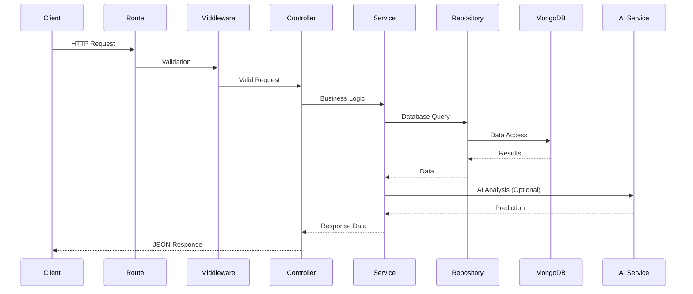
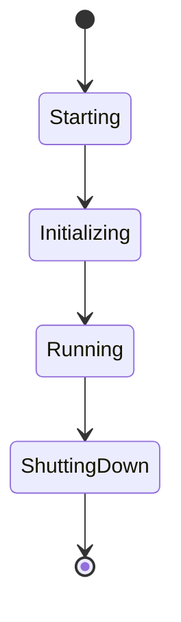
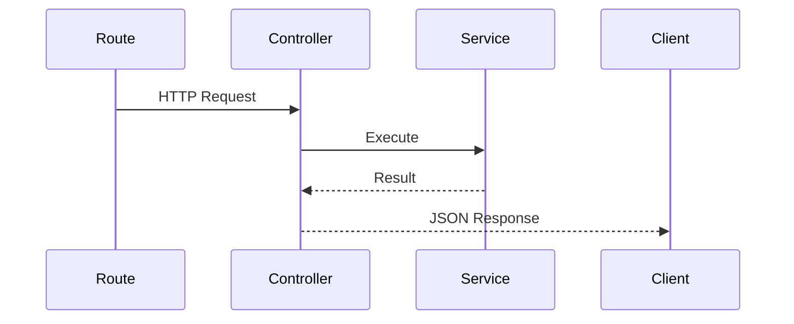
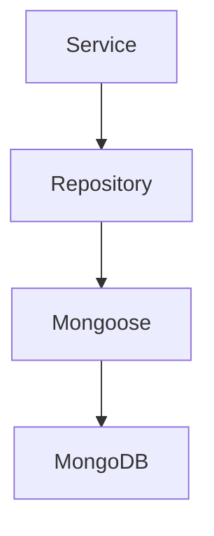
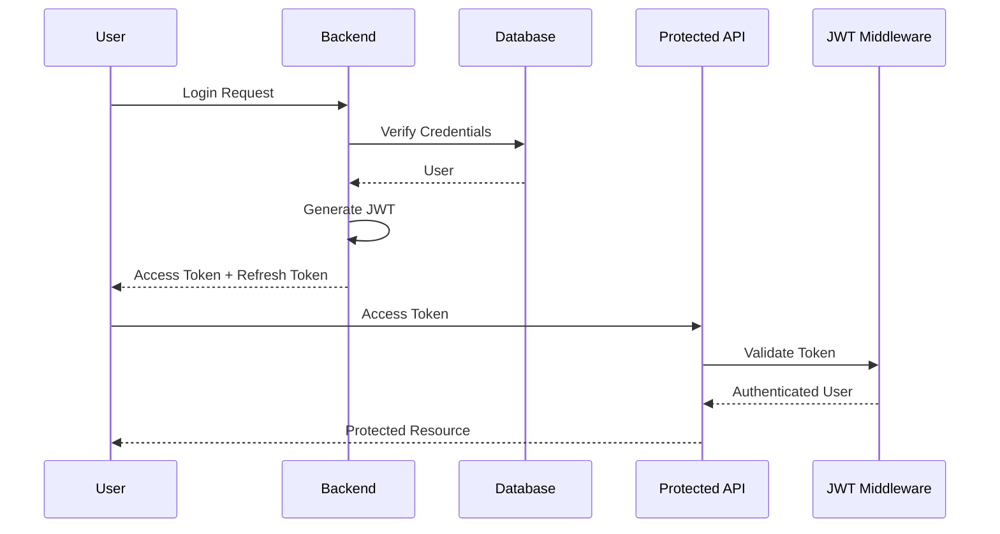
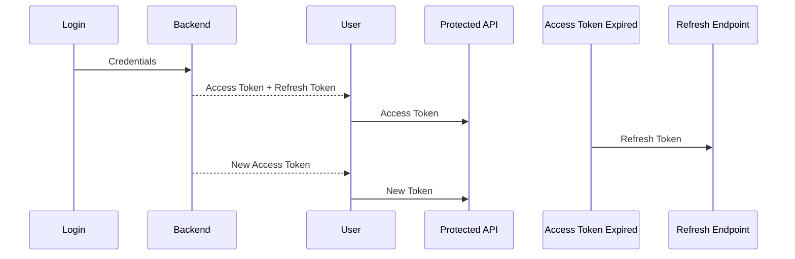

# PhishGuard X

# Volume 4

# Backend Architecture & Implementation

**Version:** 1.0  
**Status:** Draft  
**Document Type:** Backend Architecture & Implementation Document (BAID)  
**Project:** PhishGuard X – AI-Powered Email Security Platform  
**Prepared By:** Development Team  
**Last Updated:** July 2026

---

# Table of Contents

1. Introduction
2. Backend Philosophy
3. Backend Technology Stack
4. Backend Architecture
5. Project Directory Structure
6. Server Initialization
7. Configuration Management
8. Dependency Injection Strategy
9. Request Lifecycle
10. Routing Layer
11. Controller Layer
12. Service Layer
13. Repository Layer
14. Data Access Layer
15. Database Communication
16. Authentication Architecture
17. Authorization (RBAC)
18. JWT Lifecycle
19. Middleware Architecture
20. Validation Layer
21. Error Handling Strategy
22. Logging Architecture
23. Email Scanner Backend
24. URL Scanner Backend
25. Domain Scanner Backend
26. Dashboard Backend
27. Reports Backend
28. Analytics Backend
29. Notification Backend
30. AI Assistant Backend
31. Threat Intelligence Integration
32. AI Service Integration
33. File Upload Architecture
34. Background Jobs & Scheduling
35. Caching Strategy
36. Performance Optimization
37. Backend Security
38. Testing Strategy
39. Deployment Considerations
40. Future Backend Enhancements
41. Conclusion

---

# 1. Introduction

## 1.1 Purpose

This document defines the complete backend architecture and implementation strategy for **PhishGuard X**, an AI-powered phishing detection and email security platform.

It serves as the primary implementation guide for the Node.js backend, describing how requests are processed, how business logic is organized, how data flows between services, and how the backend integrates with the AI microservice, MongoDB database, and external threat intelligence providers.

Unlike the System Architecture Document (Volume 2), which focuses on the interaction between major system components, this document concentrates exclusively on the backend implementation.

Its purpose is to establish a maintainable, scalable, secure, and modular backend architecture that can support enterprise-grade cybersecurity workloads.

---

## 1.2 Objectives

The backend architecture has been designed to achieve the following objectives.

- Provide a modular Node.js backend architecture.
- Separate routing, controllers, services, and repositories.
- Centralize business logic.
- Simplify testing and maintenance.
- Support independent AI services.
- Integrate securely with MongoDB.
- Provide consistent REST APIs.
- Enforce authentication and authorization.
- Maintain high performance under concurrent workloads.
- Enable future feature expansion.

---

## 1.3 Scope

This document defines every major aspect of backend development, including:

- Express.js architecture.
- Routing.
- Controllers.
- Services.
- Repository layer.
- Database communication.
- Authentication.
- Authorization.
- Middleware.
- Validation.
- Logging.
- Error handling.
- AI integration.
- Threat Intelligence integration.
- Report generation.
- Notification services.
- Background processing.
- Performance optimization.
- Security.
- Deployment considerations.

Frontend implementation, database schema design, AI model implementation, and Chrome Extension architecture are documented separately within other Development Bible volumes.

---

## 1.4 Intended Audience

This document is intended for:

- Backend Developers
- Full Stack Developers
- Software Architects
- DevOps Engineers
- QA Engineers
- Security Engineers
- Future Contributors

Readers should possess a working knowledge of:

- Node.js
- Express.js
- REST APIs
- MongoDB
- JWT Authentication
- Backend software architecture
- JavaScript (ES6+)

---

## 1.5 Relationship with Other Volumes

This document builds upon previous architectural documents within the Development Bible.

| Volume | Relationship |
|---------|--------------|
| Volume 1 | Defines project vision and software requirements. |
| Volume 2 | Defines overall system architecture. |
| Volume 3 | Defines frontend architecture. |
| Volume 5 | Defines MongoDB database design. |
| Volume 6 | Defines REST API specifications. |
| Volume 8 | Defines AI Service Architecture. |

The backend serves as the central communication layer between the frontend application, AI services, databases, and external threat intelligence providers.

---

# 2. Backend Philosophy

## 2.1 Overview

The backend of PhishGuard X follows a layered, service-oriented architecture built with **Node.js** and **Express.js**.

Rather than placing business logic inside route handlers, responsibilities are distributed across specialized architectural layers, each with a clearly defined purpose.

This architecture promotes scalability, maintainability, and testability while supporting future enterprise expansion.

The backend is intentionally designed to act as the orchestration layer between the frontend, artificial intelligence services, MongoDB, and external cybersecurity intelligence providers.

---

## 2.2 Architectural Philosophy

The backend follows several guiding principles.

### Separation of Concerns

Every architectural layer has a single responsibility.

Examples include:

- Routes define endpoints.
- Controllers coordinate requests.
- Services implement business logic.
- Repositories access MongoDB.
- Middleware performs preprocessing.
- Validators verify incoming requests.

This separation minimizes coupling while improving maintainability.

---

### Thin Controllers

Controllers should remain lightweight.

Controllers are responsible only for:

- Receiving requests.
- Validating request flow.
- Invoking services.
- Returning responses.
- Handling exceptions.

Business logic must never reside inside controllers.

---

### Service-Oriented Business Logic

All business rules are centralized inside dedicated service classes.

Examples include:

- EmailScanService
- ReportService
- ThreatIntelligenceService
- NotificationService
- AnalyticsService

Services may collaborate with multiple repositories and external systems while remaining independent of HTTP-specific implementation details.

---

### Repository Pattern

Database operations are isolated inside repositories.

Repositories are responsible for:

- Query construction.
- CRUD operations.
- Aggregations.
- Transactions (where applicable).
- Database abstraction.

Services should never communicate directly with MongoDB collections.

---

### API-First Design

The backend exposes functionality exclusively through RESTful APIs.

Every feature is accessed through documented endpoints.

Benefits include:

- Frontend independence.
- Easier testing.
- Third-party integration.
- Future mobile application support.

---

### Security by Design

Security considerations are integrated into every layer.

Examples include:

- Authentication
- Authorization
- Input validation
- Rate limiting
- Secure headers
- Logging
- Audit trails

Security is treated as a foundational architectural requirement rather than an additional feature.

---

### Scalability

The backend architecture supports future expansion through:

- Modular services.
- Independent AI microservices.
- Horizontal scaling.
- Containerized deployment.
- Caching.
- Background workers.

Future enterprise deployments should require minimal architectural changes.

---

## 2.3 Backend Design Principles

The implementation follows established engineering principles.

| Rule | Description |
|------|-------------|
| BE-01 | Controllers remain thin and delegate business logic to services. |
| BE-02 | Services contain all business rules. |
| BE-03 | Repositories isolate database communication. |
| BE-04 | Middleware handles cross-cutting concerns. |
| BE-05 | APIs remain stateless wherever possible. |
| BE-06 | Business logic should never depend directly on Express.js. |
| BE-07 | Every backend module should remain independently testable. |
| BE-08 | Security is enforced at every architectural layer. |

---

## 2.4 Backend Goals

The backend architecture is designed to remain:

- Modular
- Secure
- Scalable
- Performant
- Maintainable
- Observable
- Testable
- Extensible

These principles guide every implementation decision described throughout this document.

---

# 3. Backend Technology Stack

## 3.1 Overview

The backend of PhishGuard X is built using a modern JavaScript server-side technology stack designed for high performance, scalability, and maintainability.

Each technology has been selected based on enterprise adoption, long-term support, community maturity, and compatibility with the project's modular architecture.

The backend communicates with the React frontend, MongoDB database, Python AI microservice, and external threat intelligence providers through secure APIs.

---
# 3. Backend Technology Stack

## 3.1 Overview

The backend of PhishGuard X is built using a modern, scalable, and enterprise-ready technology stack centered around **Node.js**, **Express.js**, and **MongoDB**.

The technology selection emphasizes:

- High performance
- Scalability
- Security
- Maintainability
- Independent AI integration
- Cloud readiness
- Modular architecture

The backend acts as the orchestration layer between the frontend, AI microservice, database, browser extension, and external cybersecurity intelligence providers.

---

## 3.2 Technology Stack

| Category | Technology | Purpose |
|-----------|------------|---------|
| Runtime | Node.js LTS | Server Runtime |
| Framework | Express.js | REST API Framework |
| Database | MongoDB | Primary Database |
| ODM | Mongoose | MongoDB Object Modeling |
| Authentication | JWT | Stateless Authentication |
| Password Hashing | bcrypt | Password Security |
| Validation | express-validator | Input Validation |
| Environment | dotenv | Configuration Management |
| HTTP Client | Axios | Internal & External API Communication |
| Logging | Morgan | HTTP Request Logging |
| Security Headers | Helmet | HTTP Security |
| File Uploads | Multer | File Handling |
| Scheduling | Node Cron | Scheduled Tasks |
| Testing | Jest + Supertest | Backend Testing |
| Documentation | Swagger (Future) | API Documentation |
| Containerization | Docker | Deployment |
| Cache (Future) | Redis | Performance Optimization |
| Message Queue (Future) | RabbitMQ / Kafka | Asynchronous Processing |

---

## 3.3 Technology Selection Rationale

### Node.js

Node.js is selected due to its event-driven architecture, asynchronous execution model, and excellent performance for I/O-intensive applications.

Benefits include:

- Non-blocking architecture
- Large ecosystem
- High concurrency
- JavaScript throughout the stack
- Excellent API performance

---

### Express.js

Express.js provides a lightweight and flexible framework for building modular REST APIs.

Responsibilities include:

- Routing
- Middleware execution
- Request handling
- Response formatting
- Error handling

---

### MongoDB

MongoDB stores all application data including:

- Users
- Scan History
- Reports
- Notifications
- Threat Intelligence Cache
- Analytics

Its document-oriented model naturally aligns with the project's evolving data structures.

---

### Mongoose

Mongoose provides:

- Schema validation
- Data modeling
- Middleware
- Relationships
- Query abstraction

It simplifies communication between Node.js and MongoDB.

---

### JWT Authentication

JWT enables stateless authentication while supporting:

- Access Tokens
- Refresh Tokens
- Role-Based Authorization
- API Authentication

---

### Axios

Axios allows the backend to communicate with:

- AI Service
- Threat Intelligence APIs
- WHOIS Services
- Reputation Services
- Future third-party integrations

---

### Multer

Multer handles:

- EML Uploads
- TXT Uploads
- Temporary Storage
- File Validation

Uploaded files are forwarded to backend services for processing.

---

## 3.4 Backend Dependencies

The backend communicates with several independent systems.

```mermaid
flowchart LR

Frontend

-->

Backend

Backend

-->

MongoDB

Backend

-->

AI Service

Backend

-->

Threat Intelligence

Backend

-->

Chrome Extension

Backend

-->

Notification Service
```

The backend serves as the single integration point for all application components.

---

## 3.5 Version Management

All backend dependencies follow Semantic Versioning.

```
Major.Minor.Patch

1.0.0

1.2.1

2.0.0
```

Dependencies should be reviewed regularly for:

- Security updates
- Bug fixes
- Performance improvements
- Long-term support

---

## 3.6 Backend Technology Principles

| Rule | Description |
|------|-------------|
| TECH-BE-01 | Use stable LTS versions of all major technologies. |
| TECH-BE-02 | Minimize unnecessary dependencies. |
| TECH-BE-03 | Prefer actively maintained open-source libraries. |
| TECH-BE-04 | Third-party libraries should undergo periodic security reviews. |
| TECH-BE-05 | Technology choices should prioritize maintainability over novelty. |

---

# 4. Backend Architecture

## 4.1 Overview

The backend architecture follows a **Layered Service-Oriented Architecture**, separating responsibilities into distinct layers that communicate through well-defined interfaces.

Each layer performs a single responsibility, enabling independent development, testing, maintenance, and future scalability.

Unlike monolithic controller-based implementations, PhishGuard X centralizes business logic within dedicated services while isolating infrastructure concerns such as routing, database access, logging, and middleware.

---

## 4.2 Architectural Layers

The backend consists of the following layers:

```mermaid
flowchart TD

Client

-->

Routes

Routes

-->

Controllers

Controllers

-->

Services

Services

-->

Repositories

Repositories

-->

MongoDB

Services

-->

AI Service

Services

-->

Threat Intelligence

Routes

-->

Middleware

Middleware

-->

Controllers
```

---

## 4.3 Layer Responsibilities

### Routing Layer

Responsibilities:

- Define REST endpoints.
- Register middleware.
- Forward requests to controllers.

Routes should never contain business logic.

---

### Controller Layer

Responsibilities:

- Receive HTTP requests.
- Parse request data.
- Invoke services.
- Handle response formatting.
- Handle exceptions.

Controllers coordinate requests but never implement business rules.

---

### Service Layer

The Service Layer is the heart of the backend.

Responsibilities include:

- Business logic
- Risk scoring
- AI orchestration
- Threat analysis
- Report generation
- Notification logic
- Analytics processing

Every major feature has a corresponding service module.

---

### Repository Layer

Repositories encapsulate all MongoDB operations.

Responsibilities include:

- CRUD operations
- Query optimization
- Aggregation pipelines
- Database abstraction

Repositories should never contain business logic.

---

### Database Layer

MongoDB serves as the persistence layer.

Responsibilities:

- Data storage
- Indexing
- Aggregations
- Transactions (where required)
- Backup support

---

### AI Integration Layer

Communicates with the FastAPI AI microservice.

Responsibilities:

- Email classification
- Confidence scoring
- Explainable AI
- Future AI model support

Communication occurs through internal REST APIs.

---

### Threat Intelligence Layer

Aggregates intelligence from multiple external providers.

Responsibilities:

- WHOIS
- SPF
- DKIM
- DMARC
- SSL
- Domain Reputation
- URL Reputation
- Blacklists

---

## 4.4 Backend Request Lifecycle



---

## 4.5 Backend Characteristics

The backend architecture demonstrates the following qualities.

### Modular

Every feature exists as an independent module with minimal coupling.

---

### Scalable

New services can be added without disrupting existing functionality.

---

### Maintainable

Clear separation of responsibilities improves readability and debugging.

---

### Testable

Each layer can be tested independently using mocks and integration tests.

---

### Secure

Security is enforced through middleware, authentication, authorization, validation, and secure coding practices.

---

### Observable

Comprehensive logging, metrics, and audit trails enable effective monitoring and troubleshooting.

---

## 4.6 Backend Design Principles

| Rule | Description |
|------|-------------|
| ARCH-BE-01 | Routes remain lightweight and delegate requests. |
| ARCH-BE-02 | Controllers coordinate requests without implementing business logic. |
| ARCH-BE-03 | Services encapsulate all business rules. |
| ARCH-BE-04 | Repositories isolate database interactions. |
| ARCH-BE-05 | External integrations occur only through dedicated service modules. |
| ARCH-BE-06 | Layers communicate only with adjacent layers. |
| ARCH-BE-07 | Every module should remain independently testable. |
| ARCH-BE-08 | Architectural consistency must be maintained across all backend features. |

---

## 4.7 Summary

The layered backend architecture provides a robust foundation for the PhishGuard X platform by clearly separating concerns, centralizing business logic, and supporting secure, scalable, and maintainable development practices. This architecture enables future expansion while ensuring that the backend remains adaptable to evolving cybersecurity requirements.

---
# 5. Project Directory Structure

## 5.1 Overview

A well-organized backend directory structure is fundamental to the maintainability, scalability, and long-term evolution of PhishGuard X.

The backend follows a **feature-oriented layered architecture**, where each directory has a clearly defined responsibility. Business logic, routing, controllers, middleware, and infrastructure concerns are separated to minimize coupling and maximize code reuse.

The directory structure is designed to support enterprise-scale development where multiple developers can work on independent modules without affecting unrelated components.

---

## 5.2 Backend Directory Structure

```text
backend/
│
├── src/
│
│   ├── config/
│   │
│   ├── routes/
│   │
│   ├── controllers/
│   │
│   ├── services/
│   │
│   ├── repositories/
│   │
│   ├── models/
│   │
│   ├── middleware/
│   │
│   ├── validators/
│   │
│   ├── ai/
│   │
│   ├── threat/
│   │
│   ├── analytics/
│   │
│   ├── notifications/
│   │
│   ├── reports/
│   │
│   ├── scheduler/
│   │
│   ├── uploads/
│   │
│   ├── utils/
│   │
│   ├── constants/
│   │
│   ├── helpers/
│   │
│   ├── logs/
│   │
│   ├── app.js
│   │
│   └── server.js
│
├── tests/
│
├── docs/
│
├── .env
│
├── package.json
│
└── README.md
```

---

## 5.3 Folder Responsibilities

### config/

Contains application configuration.

Examples:

- Database configuration
- JWT configuration
- Environment variables
- Axios clients
- Logging configuration

---

### routes/

Defines every REST endpoint.

Responsibilities:

- Route registration
- Middleware attachment
- Controller mapping

Routes should never contain business logic.

---

### controllers/

Controllers coordinate requests.

Responsibilities:

- Receive HTTP requests
- Invoke services
- Return responses
- Handle exceptions

Controllers remain intentionally lightweight.

---

### services/

Contains the application's business logic.

Examples:

- Authentication Service
- Email Scanner Service
- URL Scanner Service
- Report Service
- Analytics Service
- Notification Service

This is the most important directory in the backend.

---

### repositories/

Responsible for database interaction.

Examples:

- User Repository
- Report Repository
- Scan Repository

Responsibilities:

- CRUD
- Aggregation
- Database abstraction

---

### models/

Contains MongoDB schemas.

Examples:

- User Model
- Report Model
- Scan Model
- Notification Model

---

### middleware/

Reusable middleware.

Examples:

- Authentication
- Authorization
- Validation
- Logging
- Rate Limiting
- Error Handling

---

### validators/

Contains request validation logic.

Responsibilities:

- Request body validation
- Query validation
- Parameter validation
- File validation

---

### ai/

Responsible for AI integration.

Examples:

- FastAPI Client
- Prompt Builder
- Prediction Parser
- Confidence Calculator

---

### threat/

Threat Intelligence integration.

Responsibilities:

- WHOIS
- SSL
- SPF
- DKIM
- DMARC
- Reputation APIs

---

### analytics/

Business analytics logic.

Responsibilities:

- Dashboard statistics
- Trend generation
- Historical summaries

---

### reports/

Handles report generation.

Examples:

- PDF Builder
- JSON Export
- CSV Export
- Report Formatter

---

### notifications/

Notification services.

Examples:

- Email notifications
- In-app notifications
- Alert generation

---

### scheduler/

Scheduled jobs.

Examples:

- Threat feed updates
- Cleanup jobs
- Analytics aggregation
- Report scheduling

---

### uploads/

Temporary storage for uploaded files.

Examples:

- .eml
- .txt
- Attachments

Files are automatically processed and removed.

---

### utils/

General-purpose helper functions.

Examples:

- Date utilities
- Encryption helpers
- Formatters
- File helpers

---

### constants/

Application-wide constants.

Examples:

- Status codes
- Roles
- Risk levels
- Error codes

---

### helpers/

Small reusable helper modules.

Examples:

- JWT helper
- Password helper
- Cache helper

---

### logs/

Application log storage.

Contains:

- Application logs
- Error logs
- Security logs
- Audit logs

---

## 5.4 Feature Organization

Every major backend feature should maintain a predictable internal structure.

Example:

```text
email/

├── email.controller.js

├── email.service.js

├── email.repository.js

├── email.validator.js

├── email.routes.js

└── email.constants.js
```

This promotes consistency throughout the codebase.

---

## 5.5 Naming Conventions

| Item | Convention |
|------|------------|
| Controllers | PascalCase |
| Services | PascalCase |
| Repositories | PascalCase |
| Models | PascalCase |
| Utilities | camelCase |
| Constants | UPPER_SNAKE_CASE |
| Environment Variables | UPPER_SNAKE_CASE |

Examples:

```
UserController

EmailScanService

ScanRepository

JWT_SECRET

PASSWORD_SALT

generateToken()
```

---

## 5.6 Directory Principles

| Rule | Description |
|------|-------------|
| DIR-BE-01 | Every folder has a single responsibility. |
| DIR-BE-02 | Business logic belongs only inside services. |
| DIR-BE-03 | Database queries belong only inside repositories. |
| DIR-BE-04 | Routes remain lightweight. |
| DIR-BE-05 | Project organization should remain consistent across all modules. |

---

# 6. Server Initialization

## 6.1 Overview

Server Initialization defines how the backend application starts, loads configuration, establishes infrastructure connections, and begins accepting client requests.

The initialization sequence ensures that all required services—including configuration, database connectivity, middleware, routing, and external integrations—are successfully initialized before the server becomes available.

If any critical dependency fails during startup, the application should terminate gracefully rather than entering a partially functional state.

---

## 6.2 Initialization Objectives

The startup process aims to:

- Load configuration.
- Validate environment variables.
- Establish database connectivity.
- Register middleware.
- Register routes.
- Initialize logging.
- Verify external services.
- Start the HTTP server.

---

## 6.3 Startup Sequence

```mermaid
flowchart TD

Start

-->

Load Environment

-->

Validate Config

-->

Initialize Logger

-->

Connect MongoDB

-->

Register Middleware

-->

Register Routes

-->

Initialize AI Client

-->

Verify Threat Services

-->

Start Server

-->

Accept Requests
```

---

## 6.4 Startup Components

### Environment Loader

Responsibilities:

- Read `.env`
- Load application configuration
- Validate required variables
- Apply defaults

---

### Configuration Validator

Ensures required values exist.

Examples:

- Database URL
- JWT Secret
- AI Service URL
- API Keys
- Server Port

The server should fail fast if required configuration is missing.

---

### Logger Initialization

Creates logging infrastructure.

Responsibilities:

- Application logging
- Security logging
- Error logging
- Audit logging

---

### Database Connection

The backend establishes a connection with MongoDB.

Responsibilities:

- Connection retries
- Timeout handling
- Health verification
- Connection monitoring

The server should not begin accepting requests until the database is available.

---

### Middleware Registration

Global middleware is registered before routes.

Examples:

- Helmet
- CORS
- JSON Parser
- Rate Limiter
- Authentication
- Logging

---

### Route Registration

All feature modules register their routes.

Examples:

- Authentication
- Dashboard
- Email Scanner
- URL Scanner
- Domain Scanner
- Reports
- Analytics
- AI Assistant

---

### External Service Verification

Before startup completes, the backend verifies connectivity to:

- AI Service
- Threat Intelligence Providers
- Notification Providers

Unavailable services should be logged, with startup behavior determined by configuration (required vs optional dependencies).

---

## 6.5 Server Lifecycle



---

## 6.6 Graceful Shutdown

The backend supports graceful shutdown.

Shutdown operations include:

- Stop accepting requests.
- Complete active requests.
- Close database connections.
- Flush log buffers.
- Terminate scheduled jobs.
- Release external resources.

This prevents data corruption and incomplete transactions.

---

## 6.7 Initialization Principles

| Rule | Description |
|------|-------------|
| INIT-01 | Startup should fail if critical configuration is invalid. |
| INIT-02 | Database connectivity must be established before serving requests. |
| INIT-03 | Middleware is registered before routes. |
| INIT-04 | External dependencies should be verified during startup. |
| INIT-05 | Graceful shutdown should release all allocated resources. |

---

## 6.8 Summary

A structured initialization process ensures that the backend starts in a predictable, secure, and reliable manner. By validating configuration, verifying dependencies, and establishing core services before accepting requests, the application minimizes startup failures and provides a stable operational foundation for all backend functionality.

---
# 7. Configuration Management

## 7.1 Overview

Configuration Management defines how application settings, secrets, environment variables, feature flags, and runtime options are organized and managed throughout the backend.

PhishGuard X follows the **Configuration as Code** philosophy, where all configurable values are centralized, validated during startup, and accessed through dedicated configuration modules rather than hardcoded throughout the application.

This approach improves maintainability, security, portability, and deployment flexibility.

---

## 7.2 Objectives

The configuration management system aims to:

- Centralize application configuration.
- Separate configuration from source code.
- Protect sensitive credentials.
- Support multiple deployment environments.
- Validate configuration during startup.
- Simplify future infrastructure changes.

---

## 7.3 Configuration Sources

Configuration values originate from:

| Source | Purpose |
|----------|----------|
| .env | Environment-specific configuration |
| Default Configuration | Safe fallback values |
| Runtime Environment | Deployment overrides |
| Future Secret Manager | Production secret storage |

---

## 7.4 Environment Structure

Typical configuration includes:

### Server

- Server Port
- API Version
- Environment
- Base URL

---

### Database

- MongoDB URI
- Database Name
- Connection Timeout
- Pool Size

---

### Authentication

- JWT Secret
- Refresh Token Secret
- Access Token Expiry
- Refresh Token Expiry

---

### AI Service

- AI Service URL
- Request Timeout
- Retry Count
- Confidence Threshold

---

### Threat Intelligence

- VirusTotal API Key
- PhishTank API Key
- OpenPhish Endpoint
- WHOIS Endpoint

---

### Notifications

- SMTP Configuration
- Sender Address
- Email Templates

---

### Logging

- Log Level
- Log Directory
- Log Rotation
- Audit Logging

---

## 7.5 Environment Validation

Every required configuration value should be validated during application startup.

Validation includes:

- Missing values
- Invalid URLs
- Invalid ports
- Invalid expiration values
- Empty secrets
- Duplicate configuration

The application should terminate if critical configuration is invalid.

---

## 7.6 Environment Profiles

Supported environments include:

| Environment | Purpose |
|-------------|---------|
| Development | Local development |
| Testing | Automated testing |
| Staging | Pre-production validation |
| Production | Live deployment |

Each environment may override configuration while maintaining a common structure.

---

## 7.7 Secret Management

Sensitive values include:

- JWT secrets
- API keys
- Database credentials
- SMTP passwords
- Encryption keys

Secrets should never:

- Be committed to source control.
- Appear in application logs.
- Be exposed through API responses.

Future enterprise deployments may integrate with dedicated secret management platforms.

---

## 7.8 Configuration Principles

| Rule | Description |
|------|-------------|
| CONFIG-01 | Configuration remains external to application code. |
| CONFIG-02 | Secrets must never be hardcoded. |
| CONFIG-03 | Startup validates all required configuration. |
| CONFIG-04 | Production configuration should remain immutable during runtime. |
| CONFIG-05 | Every configuration option should be documented. |

---

# 8. Dependency Injection Strategy

## 8.1 Overview

Dependency Injection (DI) defines how backend components communicate while minimizing coupling between modules.

Although the initial implementation uses manual dependency management, the architecture is intentionally designed to support future migration to a full Inversion of Control (IoC) container if required.

Every service should depend on abstractions rather than implementation details whenever practical.

---

## 8.2 Objectives

The dependency strategy aims to:

- Reduce coupling.
- Improve testability.
- Simplify maintenance.
- Encourage modular development.
- Support future scalability.

---

## 8.3 Dependency Hierarchy

```mermaid
flowchart TD

Routes

-->

Controllers

Controllers

-->

Services

Services

-->

Repositories

Repositories

-->

MongoDB

Services

-->

AI Client

Services

-->

Threat Services
```

Dependencies always flow downward.

Lower layers never depend on upper layers.

---

## 8.4 Layer Dependencies

### Routes

Depend on:

- Controllers
- Middleware

---

### Controllers

Depend on:

- Services

Controllers should never communicate directly with MongoDB.

---

### Services

Depend on:

- Repositories
- AI Client
- Threat Intelligence Client
- Notification Services
- Utilities

---

### Repositories

Depend on:

- Mongoose Models

Repositories should remain independent of business logic.

---

## 8.5 Dependency Rules

Allowed dependency flow:

```
Routes

↓

Controllers

↓

Services

↓

Repositories

↓

MongoDB
```

Not allowed:

```
Repository

↓

Controller

×

```

Or

```
Service

↓

Route

×

```

Circular dependencies must never exist.

---

## 8.6 Dependency Lifetime

Most backend services are treated as application-wide singletons.

Examples include:

- UserService
- ReportService
- AnalyticsService
- ThreatService

Stateless services improve performance and simplify resource management.

---

## 8.7 Future IoC Support

Future enterprise versions may introduce dependency injection containers.

Potential frameworks:

- InversifyJS
- Awilix
- TSyringe (if TypeScript migration occurs)

Current architecture intentionally avoids implementation patterns that would complicate future adoption.

---

## 8.8 Dependency Principles

| Rule | Description |
|------|-------------|
| DI-01 | Dependencies should flow downward only. |
| DI-02 | Circular dependencies are prohibited. |
| DI-03 | Services should remain stateless where possible. |
| DI-04 | Business logic depends on abstractions, not infrastructure. |
| DI-05 | Dependencies should be easily mockable for testing. |

---

# 9. Request Lifecycle

## 9.1 Overview

The Request Lifecycle describes the complete journey of an HTTP request through the backend, beginning with its arrival at the Express server and ending with a structured JSON response.

Understanding this lifecycle is essential for maintaining consistency, debugging issues, optimizing performance, and enforcing security throughout the application.

Every incoming request follows a predictable processing pipeline regardless of the feature module being accessed.

---

## 9.2 Lifecycle Objectives

The request lifecycle aims to:

- Standardize request processing.
- Apply security consistently.
- Validate input early.
- Centralize business logic.
- Produce predictable responses.
- Improve observability.

---

## 9.3 High-Level Request Flow

```mermaid
flowchart LR

Client

-->

Express Server

-->

Middleware

-->

Route

-->

Controller

-->

Service

-->

Repository

-->

MongoDB

Repository

-->

Service

Service

-->

Controller

Controller

-->

JSON Response
```

For certain requests, additional interactions may occur with:

- AI Service
- Threat Intelligence Providers
- Notification Services
- Scheduler
- Cache Layer (Future)

---

## 9.4 Detailed Processing Pipeline

Every request passes through the following stages:

### Stage 1 — Request Reception

The Express server accepts the incoming HTTP request.

Responsibilities:

- Establish connection.
- Parse HTTP headers.
- Identify endpoint.
- Assign request identifier.

---

### Stage 2 — Global Middleware

Global middleware executes before routing.

Examples:

- Helmet
- CORS
- Body Parser
- Request Logger
- Compression
- Rate Limiter

---

### Stage 3 — Route Matching

Express matches the incoming request to a registered route.

If no route exists:

- Return HTTP 404.

---

### Stage 4 — Authentication

Protected routes verify:

- JWT
- Session
- Token expiration

Unauthenticated requests receive HTTP 401.

---

### Stage 5 — Authorization

Role-based permissions are verified.

Examples:

- Administrator
- Security Analyst
- Standard User

Unauthorized users receive HTTP 403.

---

### Stage 6 — Request Validation

Validators inspect:

- Request body
- Query parameters
- URL parameters
- Uploaded files

Invalid requests receive HTTP 400 or HTTP 422.

---

### Stage 7 — Controller Execution

Controllers:

- Extract request data.
- Invoke services.
- Coordinate workflow.

Controllers remain lightweight.

---

### Stage 8 — Service Execution

Business logic executes.

Examples:

- AI analysis
- Threat intelligence
- Report generation
- Risk scoring
- Analytics

This is the core processing stage.

---

### Stage 9 — Repository Access

Repositories perform:

- Database queries
- Updates
- Aggregations
- Persistence

---

### Stage 10 — Response Generation

The service returns processed data.

The controller formats the standardized API response.

---

## 9.5 Standard Response Format

Every successful response follows a consistent structure.

```json
{
  "success": true,
  "message": "Operation completed successfully.",
  "data": {},
  "timestamp": "",
  "requestId": ""
}
```

Error responses follow a similarly standardized format.

---

## 9.6 Request Lifecycle Principles

| Rule | Description |
|------|-------------|
| REQUEST-01 | Every request follows the same processing pipeline. |
| REQUEST-02 | Validation occurs before business logic execution. |
| REQUEST-03 | Controllers coordinate; services process. |
| REQUEST-04 | Responses follow a standardized JSON structure. |
| REQUEST-05 | Every request should be traceable through logs using a unique request identifier. |

---
# 10. Routing Layer

## 10.1 Overview

The Routing Layer is the entry point of every HTTP request received by the PhishGuard X backend.

It is responsible for defining REST API endpoints, applying route-specific middleware, validating incoming requests, and delegating processing to the appropriate controller.

The Routing Layer should remain lightweight and contain **no business logic**. Its primary purpose is request delegation and endpoint organization.

---

## 10.2 Objectives

The Routing Layer aims to:

- Expose RESTful APIs.
- Organize endpoints logically.
- Delegate requests to controllers.
- Apply middleware consistently.
- Support API versioning.
- Simplify future expansion.

---

## 10.3 Routing Architecture

```mermaid
flowchart LR

Client

-->

Express Router

-->

Authentication Middleware

-->

Validation Middleware

-->

Controller

Controller

-->

Service
```

Routes should never communicate directly with:

- MongoDB
- AI Service
- External APIs

All processing is delegated to controllers.

---

## 10.4 API Versioning

The backend follows URI-based API versioning.

Examples:

```text
/api/v1/auth

/api/v1/dashboard

/api/v1/email

/api/v1/url

/api/v1/domain

/api/v1/reports
```

Future releases may introduce:

```text
/api/v2/
```

without affecting existing clients.

---

## 10.5 Route Organization

Routes are grouped by feature modules.

```text
routes/

├── auth.routes.js

├── dashboard.routes.js

├── email.routes.js

├── url.routes.js

├── domain.routes.js

├── reports.routes.js

├── analytics.routes.js

├── assistant.routes.js

├── notifications.routes.js

├── profile.routes.js

├── settings.routes.js

├── admin.routes.js

└── index.js
```

Each route file contains only endpoints related to a single feature.

---

## 10.6 Route Categories

### Authentication

Handles:

- Login
- Registration
- Logout
- Refresh Token
- Password Reset

---

### Dashboard

Provides:

- Statistics
- Charts
- Activity
- Threat Feed
- AI Insights

---

### Email Scanner

Endpoints include:

- Scan Email
- Scan History
- Scan Details
- Delete Scan

---

### URL Scanner

Endpoints include:

- URL Scan
- URL History
- URL Report

---

### Domain Scanner

Endpoints include:

- Domain Analysis
- WHOIS
- SSL
- Reputation

---

### Reports

Endpoints include:

- Generate Report
- Export PDF
- Search Reports

---

### Analytics

Endpoints include:

- Dashboard Metrics
- Trends
- Statistics

---

### Administration

Endpoints include:

- Users
- Roles
- Logs
- Configuration

---

## 10.7 HTTP Method Usage

| Method | Purpose |
|----------|---------|
| GET | Retrieve resources |
| POST | Create resources |
| PUT | Replace resources |
| PATCH | Partial updates |
| DELETE | Remove resources |

REST principles should be followed consistently.

---

## 10.8 Route Registration

Routes are registered centrally.

```text
app.use("/api/v1/auth")

app.use("/api/v1/email")

app.use("/api/v1/url")

app.use("/api/v1/domain")

...
```

Feature modules remain independently maintainable.

---

## 10.9 Routing Principles

| Rule | Description |
|------|-------------|
| ROUTE-BE-01 | Routes contain no business logic. |
| ROUTE-BE-02 | Controllers handle request coordination. |
| ROUTE-BE-03 | Endpoints follow REST conventions. |
| ROUTE-BE-04 | Routes are grouped by feature. |
| ROUTE-BE-05 | API versioning is mandatory. |

---

# 11. Controller Layer

## 11.1 Overview

The Controller Layer acts as the coordination layer between HTTP requests and backend business services.

Controllers receive validated requests from the Routing Layer, invoke the appropriate service methods, and return standardized HTTP responses.

Controllers are intentionally lightweight. They should never contain complex business logic, database queries, or external service integrations.

---

## 11.2 Objectives

The Controller Layer aims to:

- Coordinate request processing.
- Invoke business services.
- Return standardized responses.
- Handle exceptions.
- Maintain separation of concerns.

---

## 11.3 Controller Architecture

```mermaid
flowchart LR

Route

-->

Controller

Controller

-->

Service

Service

-->

Repository

Service

-->

AI Service
```

---

## 11.4 Controller Responsibilities

Controllers perform the following tasks:

- Receive HTTP requests.
- Extract parameters.
- Access authenticated user.
- Invoke services.
- Return JSON responses.
- Forward errors to middleware.

Controllers do **not**:

- Query databases.
- Calculate risk scores.
- Generate reports.
- Perform AI analysis.

---

## 11.5 Controller Organization

```text
controllers/

├── AuthController.js

├── DashboardController.js

├── EmailController.js

├── URLController.js

├── DomainController.js

├── ReportController.js

├── AnalyticsController.js

├── AssistantController.js

├── NotificationController.js

├── AdminController.js
```

Each controller represents one backend feature.

---

## 11.6 Standard Controller Workflow



---

## 11.7 Standard Response Format

Successful responses:

```json
{
    "success": true,
    "message": "Scan completed successfully.",
    "data": {},
    "timestamp": "",
    "requestId": ""
}
```

Controllers should return consistent response structures.

---

## 11.8 Error Handling

Controllers should:

- Catch unexpected exceptions.
- Forward errors to centralized middleware.
- Avoid exposing internal details.

Business exceptions should originate from service classes.

---

## 11.9 Controller Principles

| Rule | Description |
|------|-------------|
| CONTROLLER-01 | Controllers remain thin. |
| CONTROLLER-02 | Business logic belongs inside services. |
| CONTROLLER-03 | Controllers never access MongoDB directly. |
| CONTROLLER-04 | Controllers return standardized responses. |
| CONTROLLER-05 | Exceptions are forwarded to centralized error handlers. |

---

# 12. Service Layer

## 12.1 Overview

The Service Layer is the **core of the PhishGuard X backend**.

Every business operation performed by the platform—including phishing detection, report generation, AI communication, threat intelligence aggregation, analytics, notifications, and user management—is implemented inside dedicated services.

Services encapsulate all business rules and remain independent of HTTP, Express.js, MongoDB, and frontend implementation details.

The Service Layer is intentionally designed to maximize reusability, maintainability, and testability.

---

## 12.2 Objectives

The Service Layer aims to:

- Centralize business logic.
- Coordinate multiple repositories.
- Communicate with AI services.
- Integrate threat intelligence.
- Generate reports.
- Manage notifications.
- Support future feature expansion.

---

## 12.3 Service Architecture

```mermaid
flowchart TD

Controller

-->

Business Service

Business Service

-->

Repositories

Business Service

-->

AI Client

Business Service

-->

Threat Intelligence

Business Service

-->

Notification Service

Repositories

-->

MongoDB
```

---

## 12.4 Core Services

The backend consists of multiple specialized services.

### Authentication Service

Responsibilities:

- Login
- Registration
- Password hashing
- JWT generation
- Refresh tokens

---

### Email Scan Service

Responsibilities:

- Email parsing
- AI submission
- Threat intelligence
- Risk scoring
- Result persistence

---

### URL Scan Service

Responsibilities:

- URL validation
- Reputation lookup
- AI analysis
- SSL inspection
- Report generation

---

### Domain Scan Service

Responsibilities:

- WHOIS lookup
- DNS analysis
- SSL verification
- Reputation analysis

---

### Dashboard Service

Responsibilities:

- Dashboard statistics
- Activity feed
- Chart generation
- KPI calculation

---

### Report Service

Responsibilities:

- Report generation
- PDF export
- JSON export
- Historical reports

---

### Analytics Service

Responsibilities:

- Trend calculations
- Risk metrics
- Performance summaries
- Historical aggregation

---

### AI Service Client

Responsibilities:

- FastAPI communication
- Request formatting
- Prediction parsing
- Confidence extraction
- Explainability integration

---

### Notification Service

Responsibilities:

- Alert creation
- Email notifications
- In-app notifications
- Future push notifications

---

## 12.5 Service Communication

Services may communicate with:

- Repositories
- AI Client
- Threat Intelligence
- Scheduler
- Cache
- Notification Services

Services should **never** communicate directly with:

- Routes
- Express Request Objects
- Express Response Objects

---

## 12.6 Service Principles

| Rule | Description |
|------|-------------|
| SERVICE-01 | Every business rule belongs inside services. |
| SERVICE-02 | Services remain independent of HTTP implementation. |
| SERVICE-03 | Services coordinate repositories and external integrations. |
| SERVICE-04 | Services should remain reusable across controllers. |
| SERVICE-05 | Services should be independently testable using mocked dependencies. |

---
# 13. Repository Layer

## 13.1 Overview

The Repository Layer abstracts all database interactions from the business logic.

Repositories act as the single point of communication between the Service Layer and MongoDB, encapsulating query construction, CRUD operations, aggregation pipelines, indexing strategies, and transaction handling.

This abstraction ensures that business services remain independent of database implementation details while improving maintainability, testability, and future portability.

---

## 13.2 Objectives

The Repository Layer aims to:

- Isolate database logic.
- Centralize data access.
- Improve maintainability.
- Simplify testing.
- Promote query reuse.
- Optimize database performance.

---

## 13.3 Repository Architecture

```mermaid
flowchart TD

Service

-->

Repository

Repository

-->

Mongoose Model

Mongoose Model

-->

MongoDB
```

Repositories never communicate directly with:

- Routes
- Controllers
- Frontend
- External APIs

---

## 13.4 Repository Organization

```text
repositories/

├── UserRepository.js

├── EmailScanRepository.js

├── URLScanRepository.js

├── DomainRepository.js

├── ReportRepository.js

├── AnalyticsRepository.js

├── NotificationRepository.js

├── SettingsRepository.js

└── AuditRepository.js
```

Each repository manages one primary collection.

---

## 13.5 Repository Responsibilities

Repositories perform:

- Create operations
- Read operations
- Update operations
- Delete operations
- Aggregation pipelines
- Pagination
- Sorting
- Filtering
- Index optimization

Business rules remain inside services.

---

## 13.6 Repository Design Standards

Every repository should expose predictable methods.

Examples:

```
create()

findById()

findAll()

update()

delete()

search()

paginate()

aggregate()

exists()
```

Method naming should remain consistent throughout the application.

---

## 13.7 Query Optimization

Repositories should:

- Use indexes.
- Limit returned fields.
- Support pagination.
- Avoid unnecessary joins.
- Use aggregation only when required.

Performance should be considered during every query implementation.

---

## 13.8 Repository Principles

| Rule | Description |
|------|-------------|
| REPO-01 | Repositories access MongoDB exclusively through Mongoose models. |
| REPO-02 | Business logic is prohibited inside repositories. |
| REPO-03 | Repository methods remain reusable. |
| REPO-04 | Queries should be optimized before production deployment. |
| REPO-05 | Aggregation pipelines should remain readable and documented. |

---

# 14. Data Access Layer

## 14.1 Overview

The Data Access Layer (DAL) provides a structured abstraction over persistent storage.

While repositories expose business-oriented methods, the DAL defines the overall strategy for accessing, validating, caching, and managing application data.

The DAL ensures consistency across all database operations while supporting future infrastructure changes with minimal impact on higher architectural layers.

---

## 14.2 Objectives

The Data Access Layer aims to:

- Standardize database access.
- Improve consistency.
- Simplify future migrations.
- Optimize performance.
- Support caching.
- Promote maintainability.

---

## 14.3 Data Access Flow



Future versions may include:

```
Repository

↓

Redis Cache

↓

MongoDB
```

---

## 14.4 Data Operations

Supported operations include:

### Create

Insert new records.

Examples:

- User Registration
- Scan Result
- Generated Report

---

### Read

Retrieve application data.

Examples:

- Dashboard
- Reports
- Notifications
- Analytics

---

### Update

Modify existing records.

Examples:

- User Profile
- Settings
- Notification Status

---

### Delete

Remove obsolete information.

Examples:

- Scan History
- Reports
- Expired Sessions

Soft deletion should be preferred where historical integrity is required.

---

## 14.5 Pagination Strategy

Collections expected to grow significantly should support pagination.

Examples:

- Scan History
- Reports
- Notifications
- Audit Logs

Recommended strategy:

- Page Number
- Page Size
- Total Count
- Total Pages

---

## 14.6 Filtering

Supported filtering methods include:

- Date Range
- Risk Level
- User
- Status
- Scan Type
- Threat Category

Filtering should execute within the database whenever possible.

---

## 14.7 Sorting

Supported sorting includes:

- Newest First
- Oldest First
- Highest Risk
- Lowest Risk
- Alphabetical

Indexes should support frequently used sorting operations.

---

## 14.8 Data Access Principles

| Rule | Description |
|------|-------------|
| DAL-01 | Data access remains centralized. |
| DAL-02 | Pagination is mandatory for large collections. |
| DAL-03 | Database filtering should occur server-side. |
| DAL-04 | Soft deletion is preferred where appropriate. |
| DAL-05 | Frequently executed queries should be indexed. |

---

# 15. Database Communication

## 15.1 Overview

Database Communication defines how the backend establishes, maintains, and manages communication with MongoDB.

Reliable database communication is essential for maintaining application availability, ensuring data integrity, and supporting concurrent workloads.

The backend uses **Mongoose** as the Object Data Modeling (ODM) library to simplify schema definition, validation, relationships, middleware, and query abstraction.

---

## 15.2 Objectives

Database communication aims to:

- Maintain reliable connections.
- Support concurrent users.
- Optimize query execution.
- Protect data integrity.
- Handle failures gracefully.
- Monitor database health.

---

## 15.3 Connection Architecture

```mermaid
flowchart LR

Backend

-->

Mongoose

-->

MongoDB

MongoDB

-->

Replica Set (Future)
```

---

## 15.4 Connection Lifecycle

The database lifecycle includes:

1. Load configuration.
2. Create connection.
3. Verify connectivity.
4. Monitor health.
5. Retry failed connections.
6. Close gracefully during shutdown.

---

## 15.5 Connection Pooling

Connection pooling improves performance by reusing established database connections.

Benefits include:

- Reduced latency.
- Improved scalability.
- Lower connection overhead.
- Better resource utilization.

---

## 15.6 Health Monitoring

The backend continuously monitors:

- Connection status.
- Latency.
- Failed operations.
- Reconnection attempts.

Critical failures should be logged immediately.

---

## 15.7 Transactions

Although MongoDB is document-oriented, multi-document transactions should be used where consistency is required.

Examples include:

- User registration with audit logging.
- Report generation.
- Administrative operations.

---

## 15.8 Failure Handling

Potential failures include:

- Database unavailable.
- Connection timeout.
- Authentication failure.
- Network interruption.

The backend should:

- Retry where appropriate.
- Log failures.
- Return meaningful error responses.
- Prevent data corruption.

---

## 15.9 Communication Principles

| Rule | Description |
|------|-------------|
| DB-01 | Database connections should be established during startup. |
| DB-02 | Connection pooling should be enabled. |
| DB-03 | Failed operations should be logged. |
| DB-04 | Graceful shutdown closes all database connections. |
| DB-05 | Transactions should be used only where consistency requires them. |

---

# 16. Authentication Architecture

## 16.1 Overview

Authentication is responsible for verifying user identity before granting access to protected resources.

PhishGuard X implements a **JWT-based authentication system** using short-lived access tokens and refresh tokens to provide secure, scalable, and stateless authentication.

Authentication is centralized within dedicated middleware and service layers to ensure consistent enforcement across the application.

---

## 16.2 Objectives

The authentication architecture aims to:

- Verify user identity.
- Secure protected endpoints.
- Maintain stateless authentication.
- Support token refresh.
- Protect user credentials.
- Prevent unauthorized access.

---

## 16.3 Authentication Workflow



---

## 16.4 Authentication Components

### Authentication Controller

Responsible for:

- Login
- Registration
- Logout
- Password reset
- Token refresh

---

### Authentication Service

Responsible for:

- Password verification
- Token generation
- Refresh logic
- User authentication
- Security validation

---

### JWT Middleware

Responsible for:

- Token validation
- User extraction
- Session verification
- Authentication context

---

### Password Service

Responsible for:

- Password hashing
- Password comparison
- Salt generation

Passwords are never stored in plaintext.

---

## 16.5 Authentication Principles

| Rule | Description |
|------|-------------|
| AUTH-BE-01 | Passwords must be hashed using bcrypt. |
| AUTH-BE-02 | JWTs should remain short-lived. |
| AUTH-BE-03 | Refresh tokens should be securely managed. |
| AUTH-BE-04 | Authentication logic remains centralized. |
| AUTH-BE-05 | Protected endpoints require successful authentication before business logic executes. |

---
# 17. Authorization (Role-Based Access Control)

## 17.1 Overview

Authorization determines **what an authenticated user is permitted to do** after their identity has been verified.

PhishGuard X implements **Role-Based Access Control (RBAC)** to ensure that every authenticated request is evaluated against the user's assigned permissions before any protected resource is accessed.

Authorization is enforced immediately after authentication middleware and before controller execution.

---

## 17.2 Objectives

The authorization architecture aims to:

- Restrict privileged operations.
- Protect administrative resources.
- Support multiple user roles.
- Enforce least-privilege access.
- Simplify permission management.
- Support future enterprise expansion.

---

## 17.3 Authorization Flow

```mermaid
flowchart TD

Request

-->

Authentication

Authentication

-->

Role Validation

Role Validation

-->

Permission Check

Permission Check

-- Allowed -->

Controller

Permission Check

-- Denied -->

403 Forbidden
```

---

## 17.4 Supported Roles

| Role | Description |
|------|-------------|
| Administrator | Full system access |
| Security Analyst | Scan, investigate, generate reports |
| Standard User | Personal scans and reports |
| Auditor | Read-only access to reports and logs |

Future enterprise deployments may introduce organization-specific custom roles.

---

## 17.5 Permission Categories

### User Permissions

Examples:

- Scan Email
- Scan URL
- Scan Domain
- View Reports
- Update Profile

---

### Analyst Permissions

Additional capabilities:

- Threat investigation
- Analytics
- AI explanations
- Threat intelligence

---

### Administrator Permissions

Includes:

- User Management
- System Configuration
- Audit Logs
- Security Policies
- Platform Monitoring

---

## 17.6 Authorization Middleware

Responsibilities include:

- Read authenticated user.
- Verify assigned role.
- Validate required permissions.
- Return HTTP 403 when access is denied.

Authorization middleware should remain reusable across all feature modules.

---

## 17.7 Authorization Principles

| Rule | Description |
|------|-------------|
| RBAC-01 | Authentication always precedes authorization. |
| RBAC-02 | Every protected endpoint declares required permissions. |
| RBAC-03 | Administrative operations require elevated privileges. |
| RBAC-04 | Permission checks remain centralized. |
| RBAC-05 | Default access should be denied unless explicitly granted. |

---

# 18. JWT Lifecycle

## 18.1 Overview

JSON Web Tokens (JWTs) provide stateless authentication for all protected backend resources.

PhishGuard X uses a dual-token strategy consisting of **Access Tokens** and **Refresh Tokens** to balance security, usability, and scalability.

This architecture minimizes repeated authentication requests while reducing the impact of token compromise.

---

## 18.2 Objectives

The JWT lifecycle aims to:

- Authenticate requests.
- Reduce server-side session storage.
- Minimize credential exposure.
- Support secure token renewal.
- Improve user experience.

---

## 18.3 Token Types

### Access Token

Purpose:

- Authenticate API requests.

Characteristics:

- Short-lived.
- Sent with every protected request.
- Digitally signed.

---

### Refresh Token

Purpose:

- Obtain new access tokens.

Characteristics:

- Longer expiration.
- Used only during refresh operations.
- Stored securely.

---

## 18.4 Token Lifecycle



---

## 18.5 Token Validation

Every protected request verifies:

- Signature.
- Expiration.
- User existence.
- Token integrity.

Invalid tokens immediately terminate request processing.

---

## 18.6 Logout

Logout performs:

- Refresh token invalidation.
- Session cleanup.
- Cache cleanup.
- Audit logging.

---

## 18.7 Token Security

Recommended practices include:

- HTTPS only.
- Short-lived access tokens.
- Strong signing secrets.
- Secure refresh handling.
- Automatic expiration.

---

## 18.8 JWT Principles

| Rule | Description |
|------|-------------|
| JWT-01 | Access tokens remain short-lived. |
| JWT-02 | Refresh tokens are never exposed unnecessarily. |
| JWT-03 | Every protected request validates JWT integrity. |
| JWT-04 | Expired tokens require refresh before reuse. |
| JWT-05 | Token revocation events should be logged. |

---

# 19. Middleware Architecture

## 19.1 Overview

Middleware provides reusable request-processing components that execute before controllers.

Rather than duplicating functionality across routes, common operations are centralized into middleware modules.

Middleware forms the backbone of request preprocessing by enforcing security, validation, logging, authentication, and performance monitoring.

---

## 19.2 Objectives

The middleware architecture aims to:

- Reuse cross-cutting functionality.
- Improve maintainability.
- Centralize preprocessing.
- Strengthen security.
- Simplify request handling.

---

## 19.3 Middleware Pipeline

```mermaid
flowchart LR

Incoming Request

-->

Helmet

-->

CORS

-->

Logger

-->

Rate Limiter

-->

Authentication

-->

Authorization

-->

Validation

-->

Controller
```

---

## 19.4 Global Middleware

Global middleware executes for every request.

Examples:

- Helmet
- CORS
- Morgan Logger
- JSON Parser
- Compression
- Request ID

---

## 19.5 Authentication Middleware

Responsibilities:

- Verify JWT.
- Load authenticated user.
- Reject invalid tokens.
- Attach user context.

---

## 19.6 Authorization Middleware

Responsibilities:

- Verify permissions.
- Validate roles.
- Restrict privileged endpoints.

---

## 19.7 Logging Middleware

Captures:

- Request ID
- HTTP Method
- URL
- User
- Response Time
- Status Code

---

## 19.8 Error Middleware

Centralizes exception handling.

Responsibilities:

- Standardize errors.
- Hide internal details.
- Log failures.
- Generate consistent responses.

---

## 19.9 Middleware Principles

| Rule | Description |
|------|-------------|
| MIDDLEWARE-01 | Middleware should remain reusable. |
| MIDDLEWARE-02 | Middleware performs one responsibility only. |
| MIDDLEWARE-03 | Authentication precedes authorization. |
| MIDDLEWARE-04 | Validation occurs before controllers execute. |
| MIDDLEWARE-05 | Middleware should never contain business logic. |

---

# 20. Validation Layer

## 20.1 Overview

The Validation Layer ensures that every incoming request satisfies predefined structural and business constraints before entering the Service Layer.

Validation occurs immediately after authentication and authorization, preventing malformed or malicious requests from reaching business logic.

Backend validation is mandatory even when frontend validation exists.

---

## 20.2 Objectives

The Validation Layer aims to:

- Prevent invalid input.
- Improve API reliability.
- Reduce runtime errors.
- Protect backend services.
- Enforce data integrity.

---

## 20.3 Validation Flow

```mermaid
flowchart TD

Incoming Request

-->

Authentication

-->

Authorization

-->

Validation

Validation

-- Valid -->

Controller

Validation

-- Invalid -->

400 / 422 Response
```

---

## 20.4 Validation Categories

### Body Validation

Examples:

- Login credentials
- Registration data
- Scan requests
- Settings updates

---

### Query Validation

Examples:

- Pagination
- Filters
- Sorting
- Date ranges

---

### Parameter Validation

Examples:

- User IDs
- Report IDs
- Scan IDs
- Notification IDs

---

### File Validation

Supported checks include:

- File extension.
- MIME type.
- File size.
- Upload limits.

---

## 20.5 Validation Rules

Examples include:

- Required fields.
- String length.
- Email format.
- URL format.
- Domain format.
- Password complexity.
- Numeric ranges.
- Enumeration values.

---

## 20.6 Validation Errors

Standard validation responses include:

- Missing field.
- Invalid value.
- Unsupported format.
- Invalid identifier.
- Unsupported file type.

All validation responses follow the standardized API error format.

---

## 20.7 Validation Principles

| Rule | Description |
|------|-------------|
| VALIDATION-01 | Backend validation is mandatory for every request. |
| VALIDATION-02 | Validation occurs before controller execution. |
| VALIDATION-03 | Validation errors use standardized responses. |
| VALIDATION-04 | File uploads require server-side validation. |
| VALIDATION-05 | Frontend validation complements but never replaces backend validation. |

---# 21. Error Handling Strategy

## 21.1 Overview

A consistent error handling strategy is essential for maintaining reliability, simplifying debugging, and improving the developer and user experience.

PhishGuard X centralizes error handling using a dedicated middleware layer that captures exceptions from every architectural layer and converts them into standardized API responses.

The application distinguishes between operational errors (expected runtime conditions) and programming errors (unexpected defects), allowing each category to be handled appropriately.

---

## 21.2 Objectives

The error handling strategy aims to:

- Standardize API error responses.
- Simplify debugging.
- Prevent information leakage.
- Improve observability.
- Support centralized logging.
- Maintain API consistency.

---

## 21.3 Error Processing Flow

```mermaid
flowchart TD

Request

-->

Controller

Controller

-->

Service

Service

-->

Repository

Repository

-- Error -->

Error Middleware

Service

-- Error -->

Error Middleware

Controller

-- Error -->

Error Middleware

Error Middleware

-->

JSON Response
```

---

## 21.4 Error Categories

### Validation Errors

Examples:

- Missing required field.
- Invalid email format.
- Invalid URL.
- Invalid file type.

Response:

```
HTTP 400 / HTTP 422
```

---

### Authentication Errors

Examples:

- Missing JWT.
- Expired JWT.
- Invalid JWT.

Response:

```
HTTP 401
```

---

### Authorization Errors

Examples:

- Insufficient permissions.
- Administrator privileges required.

Response:

```
HTTP 403
```

---

### Resource Errors

Examples:

- User not found.
- Report not found.
- Scan not found.

Response:

```
HTTP 404
```

---

### Business Logic Errors

Examples:

- Duplicate email.
- Unsupported scan request.
- AI service unavailable.

Response:

```
HTTP 409

or

HTTP 503
```

---

### Internal Errors

Unexpected exceptions.

Examples:

- Null reference.
- Database failure.
- Unexpected exception.

Response:

```
HTTP 500
```

---

## 21.5 Standard Error Format

Every API error follows a consistent response structure.

```json
{
    "success": false,
    "error": {
        "code": "VALIDATION_ERROR",
        "message": "The supplied request is invalid."
    },
    "timestamp": "",
    "requestId": ""
}
```

---

## 21.6 Error Handling Principles

| Rule | Description |
|------|-------------|
| ERROR-01 | Errors are handled centrally. |
| ERROR-02 | Internal details are never exposed. |
| ERROR-03 | Error responses remain consistent. |
| ERROR-04 | Every error receives a unique request identifier. |
| ERROR-05 | Unexpected exceptions are logged immediately. |

---

# 22. Logging Architecture

## 22.1 Overview

Logging provides visibility into application behavior, operational health, security events, and system performance.

PhishGuard X implements structured logging across every architectural layer, enabling efficient debugging, monitoring, auditing, and incident investigation.

Logs should be machine-readable while remaining understandable for developers and security analysts.

---

## 22.2 Objectives

The logging architecture aims to:

- Record operational events.
- Support troubleshooting.
- Improve observability.
- Maintain audit trails.
- Monitor security.
- Measure performance.

---

## 22.3 Logging Architecture

```mermaid
flowchart TD

Application

-->

Logger

Logger

-->

Application Log

Logger

-->

Security Log

Logger

-->

Audit Log

Logger

-->

Error Log
```

---

## 22.4 Log Categories

### Application Logs

Examples:

- Server startup.
- API requests.
- Background jobs.
- Service initialization.

---

### Security Logs

Examples:

- Login attempts.
- Failed authentication.
- Permission violations.
- Password changes.

---

### Audit Logs

Examples:

- Administrative actions.
- Configuration updates.
- User management.
- Report generation.

---

### Error Logs

Examples:

- Exceptions.
- Database failures.
- AI service failures.
- External API failures.

---

## 22.5 Logged Information

Typical log entries include:

- Timestamp.
- Request ID.
- User ID.
- Endpoint.
- Status Code.
- Response Time.
- Severity.
- Error Message.

Sensitive information should never appear in logs.

---

## 22.6 Log Retention

Recommended retention periods:

| Log Type | Retention |
|----------|-----------|
| Application | 30 Days |
| Error | 90 Days |
| Security | 180 Days |
| Audit | 365 Days |

Retention policies may vary depending on organizational compliance requirements.

---

## 22.7 Logging Principles

| Rule | Description |
|------|-------------|
| LOG-01 | Every request receives a unique request identifier. |
| LOG-02 | Sensitive information must never be logged. |
| LOG-03 | Security events require dedicated logging. |
| LOG-04 | Logs should support structured querying. |
| LOG-05 | Log retention follows organizational policy. |

---

# 23. Email Scanner Backend

## 23.1 Overview

The Email Scanner Backend is the primary business module of PhishGuard X.

It orchestrates the complete phishing detection workflow by combining email parsing, AI classification, technical validation, threat intelligence, visual analysis, risk scoring, and report generation.

This module coordinates multiple backend services while maintaining a modular and extensible architecture.

---

## 23.2 Objectives

The Email Scanner Backend aims to:

- Analyze suspicious emails.
- Detect phishing attempts.
- Coordinate AI services.
- Aggregate technical indicators.
- Generate explainable results.
- Store scan history.
- Produce downloadable reports.

---

## 23.3 Email Processing Pipeline

```mermaid
flowchart TD

Email Submission

-->

Validation

-->

Email Parser

-->

Threat Intelligence

-->

AI Service

-->

Visual Analysis

-->

Risk Engine

-->

Database

-->

Response
```

---

## 23.4 Module Components

The Email Scanner Backend consists of:

- Email Controller
- Email Service
- Email Repository
- Email Validator
- AI Client
- Threat Service
- Report Service

Each component has a clearly defined responsibility.

---

## 23.5 Processing Stages

### Stage 1 – Input Validation

Validates:

- Email content.
- Uploaded file.
- Request format.
- File size.

---

### Stage 2 – Email Parsing

Extracts:

- Sender.
- Recipient.
- Subject.
- Body.
- Headers.
- Attachments.
- URLs.

---

### Stage 3 – Technical Analysis

Analyzes:

- SPF
- DKIM
- DMARC
- Header anomalies
- Domain reputation

---

### Stage 4 – AI Classification

The parsed email is submitted to the FastAPI AI service for phishing classification.

The AI returns:

- Prediction
- Confidence Score
- Explainable AI
- Risk Indicators

---

### Stage 5 – Risk Scoring

The backend combines:

- AI Score
- Technical Score
- Threat Intelligence
- Visual Analysis

to calculate the final phishing risk score.

---

### Stage 6 – Persistence

Stores:

- Scan Result
- Metadata
- User
- Timestamp
- Report Reference

---

### Stage 7 – Response

Returns:

- Risk Score
- AI Prediction
- Technical Analysis
- Recommendations
- Report Identifier

---

## 23.6 Module Principles

| Rule | Description |
|------|-------------|
| EMAIL-BE-01 | Email parsing occurs before AI analysis. |
| EMAIL-BE-02 | AI predictions are combined with technical indicators. |
| EMAIL-BE-03 | Scan history is persisted after successful analysis. |
| EMAIL-BE-04 | Explainable AI accompanies every prediction. |
| EMAIL-BE-05 | Report generation remains optional and asynchronous where possible. |

---

# 24. URL Scanner Backend

## 24.1 Overview

The URL Scanner Backend evaluates potentially malicious URLs using technical inspection, AI classification, domain reputation analysis, SSL verification, and threat intelligence services.

Unlike the Email Scanner, which analyzes complete email messages, this module focuses specifically on web addresses and their associated infrastructure.

---

## 24.2 Objectives

The URL Scanner Backend aims to:

- Analyze submitted URLs.
- Detect malicious websites.
- Evaluate domain reputation.
- Verify SSL certificates.
- Identify phishing indicators.
- Store scan history.

---

## 24.3 URL Processing Pipeline

```mermaid
flowchart TD

URL Submission

-->

Validation

-->

URL Parser

-->

Threat Intelligence

-->

AI Classification

-->

Risk Scoring

-->

Persistence

-->

Response
```

---

## 24.4 Processing Stages

### URL Validation

Verifies:

- URL syntax.
- Protocol.
- Length.
- Supported schemes.

---

### URL Parsing

Extracts:

- Domain.
- Path.
- Query Parameters.
- Host.
- Port.

---

### Reputation Analysis

Retrieves:

- WHOIS.
- SSL.
- Domain Age.
- Blacklists.
- Reputation Score.

---

### AI Analysis

The AI service evaluates:

- URL characteristics.
- Suspicious patterns.
- Similarity attacks.
- Obfuscation.

---

### Risk Scoring

Final score combines:

- AI Prediction.
- Reputation.
- SSL.
- Domain Age.
- Threat Intelligence.

---

### Persistence

Stores:

- URL
- Risk Score
- AI Result
- User
- Timestamp

---

## 24.5 Module Principles

| Rule | Description |
|------|-------------|
| URL-BE-01 | URL validation precedes analysis. |
| URL-BE-02 | Reputation services enrich AI predictions. |
| URL-BE-03 | Every scan is stored in history. |
| URL-BE-04 | Final risk score combines multiple evidence sources. |
| URL-BE-05 | Results remain reproducible through stored metadata. |

---
# 25. Domain Scanner Backend

## 25.1 Overview

The Domain Scanner Backend evaluates domains to identify indicators of phishing, impersonation, malicious infrastructure, and configuration weaknesses. Unlike the URL Scanner, which analyzes individual URLs, the Domain Scanner focuses on the domain's identity, reputation, ownership, DNS configuration, SSL/TLS certificates, and historical metadata.

This module aggregates data from multiple intelligence sources to provide a comprehensive security assessment of a domain.

---

## 25.2 Objectives

The Domain Scanner Backend aims to:

- Assess domain trustworthiness.
- Verify domain ownership information.
- Analyze DNS configuration.
- Inspect SSL/TLS certificates.
- Evaluate domain reputation.
- Detect suspicious domain characteristics.
- Store scan history.

---

## 25.3 Domain Processing Pipeline

```mermaid
flowchart TD

Domain Submission

-->

Validation

-->

DNS Lookup

-->

WHOIS Analysis

-->

SSL Inspection

-->

Threat Intelligence

-->

Risk Scoring

-->

Persistence

-->

Response
```

---

## 25.4 Processing Stages

### Stage 1 – Domain Validation

Validates:

- Domain syntax.
- Top-Level Domain (TLD).
- Internationalized Domain Names (IDN).
- Supported protocols.

---

### Stage 2 – DNS Analysis

Retrieves:

- A Records
- AAAA Records
- MX Records
- TXT Records
- NS Records
- CNAME Records

Checks for:

- Misconfigurations
- Suspicious hosting
- Mail infrastructure

---

### Stage 3 – WHOIS Inspection

Collects:

- Registrar
- Registration Date
- Expiration Date
- Domain Age
- Registrant Information (when available)

Young domains receive additional scrutiny due to increased phishing risk.

---

### Stage 4 – SSL/TLS Inspection

Examines:

- Certificate validity.
- Issuer.
- Expiration.
- Subject Alternative Names (SANs).
- Encryption standards.

---

### Stage 5 – Threat Intelligence

Cross-references:

- VirusTotal
- OpenPhish
- PhishTank
- Internal reputation database

---

### Stage 6 – Risk Scoring

Final score combines:

- Domain Age
- DNS Health
- SSL Status
- Reputation
- AI Indicators
- Threat Intelligence

---

### Stage 7 – Persistence

Stores:

- Domain
- Metadata
- Risk Score
- Threat Indicators
- Timestamp
- User

---

## 25.5 Module Principles

| Rule | Description |
|------|-------------|
| DOMAIN-BE-01 | Domain validation precedes analysis. |
| DOMAIN-BE-02 | Reputation data supplements AI analysis. |
| DOMAIN-BE-03 | SSL inspection is mandatory. |
| DOMAIN-BE-04 | DNS anomalies contribute to risk scoring. |
| DOMAIN-BE-05 | Every completed scan is persisted for historical analysis. |

---

# 26. Dashboard Backend

## 26.1 Overview

The Dashboard Backend aggregates information from multiple backend modules and transforms raw data into actionable insights for the frontend dashboard.

Rather than exposing raw database records, this module provides optimized summary data, KPIs, charts, recent activity, and AI-generated insights.

The dashboard is designed for fast retrieval and should prioritize low-latency responses.

---

## 26.2 Objectives

The Dashboard Backend aims to:

- Aggregate platform metrics.
- Generate dashboard summaries.
- Provide recent activity.
- Deliver AI-powered insights.
- Support real-time visualization.
- Minimize response latency.

---

## 26.3 Dashboard Architecture

```mermaid
flowchart TD

Dashboard Request

-->

Dashboard Service

Dashboard Service

-->

Email Repository

Dashboard Service

-->

URL Repository

Dashboard Service

-->

Domain Repository

Dashboard Service

-->

Analytics Service

Dashboard Service

-->

Response
```

---

## 26.4 Dashboard Components

The Dashboard includes:

- Overview Cards
- Threat Summary
- Recent Scans
- Risk Distribution
- Top Threat Categories
- Weekly Trends
- AI Recommendations
- User Activity

---

## 26.5 Data Aggregation

Aggregated metrics include:

- Total Scans
- Phishing Emails Detected
- Malicious URLs
- Suspicious Domains
- High-Risk Reports
- Average Risk Score
- Daily Scan Volume

Aggregation should execute using optimized MongoDB pipelines.

---

## 26.6 Performance Strategy

To reduce latency:

- Frequently requested metrics may be cached.
- Expensive aggregations should execute asynchronously.
- Dashboard responses should avoid unnecessary database queries.
- Frequently accessed statistics may be precomputed.

---

## 26.7 Dashboard Principles

| Rule | Description |
|------|-------------|
| DASHBOARD-01 | Dashboard data is aggregated rather than queried individually. |
| DASHBOARD-02 | Expensive computations should be minimized. |
| DASHBOARD-03 | Dashboard APIs prioritize low response time. |
| DASHBOARD-04 | Frequently requested metrics may be cached. |
| DASHBOARD-05 | Dashboard services remain independent of frontend implementation. |

---

# 27. Reports Backend

## 27.1 Overview

The Reports Backend generates structured security reports based on completed phishing analyses. Reports consolidate AI predictions, technical findings, threat intelligence, and user metadata into a standardized format suitable for review, sharing, and archival.

The reporting module supports multiple export formats and is designed to produce reproducible, tamper-resistant records of every completed scan.

---

## 27.2 Objectives

The Reports Backend aims to:

- Generate comprehensive scan reports.
- Support multiple export formats.
- Preserve historical scan records.
- Enable report sharing.
- Support compliance and auditing.

---

## 27.3 Report Generation Workflow

```mermaid
flowchart TD

Completed Scan

-->

Report Service

Report Service

-->

Template Engine

Template Engine

-->

PDF / JSON

-->

Storage

-->

Download API
```

---

## 27.4 Report Contents

Each report contains:

- Scan Identifier
- User Information
- Scan Timestamp
- Scan Type
- AI Prediction
- Confidence Score
- Risk Score
- Technical Analysis
- Threat Intelligence Results
- Recommendations

---

## 27.5 Export Formats

Supported formats include:

- PDF
- JSON

Future versions may support:

- CSV
- DOCX
- HTML

---

## 27.6 Report Storage

Reports should include:

- Version Number
- Generation Timestamp
- Unique Identifier
- Report Status
- Download Metadata

Generated reports may be stored for future retrieval depending on organizational retention policies.

---

## 27.7 Report Principles

| Rule | Description |
|------|-------------|
| REPORT-01 | Reports represent immutable scan results. |
| REPORT-02 | Generated reports receive unique identifiers. |
| REPORT-03 | Report generation should be reproducible. |
| REPORT-04 | Export formats remain consistent across versions. |
| REPORT-05 | Historical reports remain searchable. |

---

# 28. Analytics Backend

## 28.1 Overview

The Analytics Backend transforms operational data into meaningful trends, statistics, and predictive insights that assist users and administrators in understanding platform performance and evolving phishing threats.

Unlike the Dashboard Backend, which focuses on current summaries, the Analytics Backend performs deeper historical analysis and statistical computation.

---

## 28.2 Objectives

The Analytics Backend aims to:

- Generate historical analytics.
- Identify security trends.
- Produce statistical summaries.
- Measure platform usage.
- Support predictive insights.
- Assist decision-making.

---

## 28.3 Analytics Architecture

```mermaid
flowchart TD

Historical Data

-->

Analytics Service

Analytics Service

-->

Aggregation Engine

Aggregation Engine

-->

Charts

Aggregation Engine

-->

Statistics

Aggregation Engine

-->

Trend Analysis
```

---

## 28.4 Analytics Categories

Supported analytics include:

### Scan Analytics

Examples:

- Total scans.
- Scan frequency.
- Scan success rate.

---

### Threat Analytics

Examples:

- Threat categories.
- Phishing trends.
- High-risk campaigns.

---

### User Analytics

Examples:

- Active users.
- Scan distribution.
- User engagement.

---

### Performance Analytics

Examples:

- API response times.
- AI inference latency.
- Database performance.
- Queue processing times.

---

## 28.5 Aggregation Strategy

Analytics rely heavily on MongoDB aggregation pipelines for:

- Grouping
- Counting
- Averaging
- Time-series analysis
- Trend detection

Long-running computations may be scheduled as background jobs to avoid impacting API performance.

---

## 28.6 Analytics Principles

| Rule | Description |
|------|-------------|
| ANALYTICS-01 | Analytics use aggregated historical data. |
| ANALYTICS-02 | Time-series analysis supports trend identification. |
| ANALYTICS-03 | Expensive analytics should execute asynchronously where practical. |
| ANALYTICS-04 | Frequently accessed analytics may be cached. |
| ANALYTICS-05 | Analytics remain reproducible using stored historical data. |

---
# 29. Notification Backend

## 29.1 Overview

The Notification Backend is responsible for generating, managing, and delivering system notifications across multiple communication channels. It ensures that users receive timely alerts regarding phishing detections, completed scans, report generation, security events, account activities, and administrative announcements.

The notification system is designed using an event-driven architecture, allowing future integration with additional delivery channels without affecting existing business logic.

---

## 29.2 Objectives

The Notification Backend aims to:

- Deliver real-time notifications.
- Support multiple notification channels.
- Track notification status.
- Prevent duplicate notifications.
- Improve user awareness.
- Support future delivery providers.

---

## 29.3 Notification Architecture

```mermaid
flowchart TD

Business Event

-->

Notification Service

Notification Service

-->

Email Channel

Notification Service

-->

In-App Notification

Notification Service

-->

Future Push Service

Notification Service

-->

Notification Repository
```

---

## 29.4 Notification Types

Supported notifications include:

### Security Alerts

Examples:

- High-risk phishing email detected.
- Malicious URL identified.
- Suspicious domain detected.

---

### Scan Events

Examples:

- Scan completed.
- Scan failed.
- Report generated.

---

### Account Events

Examples:

- Successful login.
- Password changed.
- Profile updated.
- New device login.

---

### Administrative Events

Examples:

- Maintenance announcements.
- Policy updates.
- System notifications.

---

## 29.5 Notification Lifecycle

1. Business event occurs.
2. Notification event is generated.
3. Notification template is selected.
4. User preferences are evaluated.
5. Notification is delivered.
6. Delivery status is recorded.
7. Read status is tracked.

---

## 29.6 Delivery Channels

Current channels:

- In-App Notifications
- Email Notifications

Future channels:

- Push Notifications
- SMS
- Microsoft Teams
- Slack
- Webhooks

---

## 29.7 Notification Principles

| Rule | Description |
|------|-------------|
| NOTIFY-01 | Notifications originate from business events. |
| NOTIFY-02 | Delivery channels remain independent of business logic. |
| NOTIFY-03 | Notification templates remain reusable. |
| NOTIFY-04 | Delivery failures are logged. |
| NOTIFY-05 | User notification preferences are respected. |

---

# 30. AI Assistant Backend

## 30.1 Overview

The AI Assistant Backend provides conversational assistance to users by leveraging the platform's AI capabilities and internal security knowledge. It enables users to ask questions, request explanations of phishing detections, understand scan results, and receive actionable cybersecurity guidance.

The assistant functions independently of the phishing detection model while integrating with platform data to provide contextual responses.

---

## 30.2 Objectives

The AI Assistant Backend aims to:

- Answer cybersecurity questions.
- Explain phishing detections.
- Interpret scan reports.
- Provide contextual recommendations.
- Support future Retrieval-Augmented Generation (RAG).
- Maintain secure conversational sessions.

---

## 30.3 Assistant Architecture

```mermaid
flowchart TD

User Question

-->

Assistant Controller

-->

Assistant Service

Assistant Service

-->

Knowledge Base

Assistant Service

-->

AI Model

Assistant Service

-->

Scan History

Assistant Service

-->

Response
```

---

## 30.4 Assistant Capabilities

Supported capabilities include:

- Explain phishing indicators.
- Interpret confidence scores.
- Summarize reports.
- Recommend mitigation steps.
- Provide cybersecurity awareness guidance.
- Answer platform usage questions.

---

## 30.5 Conversation Context

The assistant may use:

- Current scan result.
- User scan history.
- Threat intelligence summaries.
- Internal documentation.
- AI explanations.

Future versions may support persistent conversational memory and organization-specific knowledge bases.

---

## 30.6 Safety Considerations

The assistant should:

- Avoid exposing confidential system details.
- Distinguish factual findings from AI-generated recommendations.
- Prevent prompt injection where applicable.
- Sanitize retrieved content before response generation.

---

## 30.7 Assistant Principles

| Rule | Description |
|------|-------------|
| ASSISTANT-01 | Responses should be context-aware. |
| ASSISTANT-02 | AI-generated explanations complement, not replace, technical findings. |
| ASSISTANT-03 | Conversation history is handled securely. |
| ASSISTANT-04 | Sensitive internal data is never exposed. |
| ASSISTANT-05 | Future RAG integration should remain modular. |

---

# 31. Threat Intelligence Integration

## 31.1 Overview

Threat Intelligence Integration enriches AI predictions with external and internal intelligence sources. Rather than relying solely on machine learning, PhishGuard X correlates scan results with known malicious indicators collected from trusted threat intelligence providers.

This layered approach improves detection accuracy, reduces false positives, and provides explainable evidence supporting each security decision.

---

## 31.2 Objectives

The Threat Intelligence Integration aims to:

- Enrich AI analysis.
- Verify known malicious indicators.
- Improve phishing detection accuracy.
- Aggregate multiple intelligence sources.
- Provide explainable evidence.
- Support future intelligence providers.

---

## 31.3 Integration Architecture

```mermaid
flowchart TD

Scan Request

-->

Threat Service

Threat Service

-->

VirusTotal

Threat Service

-->

OpenPhish

Threat Service

-->

PhishTank

Threat Service

-->

WHOIS

Threat Service

-->

Internal Threat Database

Threat Service

-->

Aggregated Intelligence
```

---

## 31.4 Supported Intelligence Sources

### VirusTotal

Provides:

- URL reputation.
- Domain reputation.
- File reputation.
- Community detections.

---

### OpenPhish

Provides:

- Known phishing URLs.
- Active phishing campaigns.

---

### PhishTank

Provides:

- Verified phishing websites.
- Community-reported threats.

---

### WHOIS Services

Provides:

- Domain ownership.
- Domain age.
- Registrar.
- Expiration dates.

---

### Internal Threat Database

Stores:

- Previously detected threats.
- Organization-specific indicators.
- Historical scan intelligence.
- Cached reputation data.

---

## 31.5 Intelligence Aggregation

Each provider contributes evidence that is normalized into a unified threat model.

Aggregation includes:

- Reputation scores.
- Detection confidence.
- Blacklist matches.
- Historical observations.
- Source reliability.

Conflicting intelligence should be resolved using weighted scoring and confidence evaluation.

---

## 31.6 Caching Strategy

To reduce external API usage:

- Frequently requested lookups may be cached.
- Cached entries include expiration timestamps.
- Cache invalidation policies should account for rapidly changing threat data.

Future implementations may use Redis as a distributed cache.

---

## 31.7 Failure Handling

If an intelligence provider is unavailable:

- Continue processing with remaining providers.
- Log the failure.
- Mark unavailable data sources in the scan result.
- Avoid blocking the entire scan unless all critical providers fail.

---

## 31.8 Threat Intelligence Principles

| Rule | Description |
|------|-------------|
| THREAT-01 | Intelligence supplements AI predictions. |
| THREAT-02 | Provider failures should degrade gracefully. |
| THREAT-03 | Intelligence responses should be normalized. |
| THREAT-04 | Cached intelligence must expire appropriately. |
| THREAT-05 | Every intelligence source should remain independently replaceable. |

---

# 32. AI Service Integration

## 32.1 Overview

The AI Service Integration module manages communication between the Node.js backend and the dedicated Python FastAPI inference service responsible for phishing detection.

The backend treats the AI service as an independent microservice, allowing machine learning models to evolve independently from the core application.

This separation improves scalability, maintainability, deployment flexibility, and model lifecycle management.

---

## 32.2 Objectives

The AI Service Integration aims to:

- Submit scan requests to the AI service.
- Receive phishing predictions.
- Handle inference failures gracefully.
- Support model versioning.
- Enable Explainable AI.
- Maintain service independence.

---

## 32.3 Integration Architecture

```mermaid
flowchart LR

Node.js Backend

-->

FastAPI Gateway

-->

ML Model

ML Model

-->

Prediction

Prediction

-->

Node.js Backend
```

---

## 32.4 AI Request Workflow

1. Backend prepares scan payload.
2. Payload is validated.
3. Request is sent to the FastAPI service.
4. Model performs inference.
5. Prediction is returned.
6. Backend validates the response.
7. Prediction is merged with technical analysis.
8. Final response is generated.

---

## 32.5 AI Request Payload

Typical payload elements include:

- Email content.
- Parsed headers.
- URLs.
- Domain metadata.
- Attachment metadata.
- Scan identifier.

Only the information required for inference should be transmitted.

---

## 32.6 AI Response

The AI service returns:

- Prediction
- Confidence Score
- Probability Distribution
- Model Version
- Explainability Data
- Processing Time

The backend validates all responses before continuing processing.

---

## 32.7 Reliability Strategy

The integration layer should support:

- Request timeouts.
- Automatic retries.
- Circuit breaker patterns (future).
- Health checks.
- Fallback responses when AI inference is temporarily unavailable.

---

## 32.8 Model Versioning

Every prediction should record:

- Model version.
- Inference timestamp.
- Confidence score.
- Feature set version (if applicable).

This supports reproducibility, auditing, and future model comparisons.

---

## 32.9 AI Service Principles

| Rule | Description |
|------|-------------|
| AI-01 | The AI service remains an independent microservice. |
| AI-02 | Backend validates every AI response. |
| AI-03 | AI predictions are combined with technical analysis. |
| AI-04 | Model versions are recorded with every inference. |
| AI-05 | AI service failures should not compromise overall platform stability. |

---
# 33. File Upload Architecture

## 33.1 Overview

The File Upload Architecture defines how the backend securely receives, validates, processes, stores, and manages user-uploaded files.

Within PhishGuard X, uploaded files primarily include email files (`.eml`), attachments for phishing analysis, generated reports, and future evidence packages. The architecture prioritizes security, integrity, and scalability while minimizing the risks associated with handling untrusted content.

---

## 33.2 Objectives

The File Upload Architecture aims to:

- Securely receive uploaded files.
- Validate uploaded content.
- Prevent malicious file uploads.
- Support large file processing.
- Maintain upload integrity.
- Enable future cloud storage integration.

---

## 33.3 Upload Workflow

```mermaid
flowchart TD

Client

-->

Upload Endpoint

-->

Validation

-->

Virus Scan (Future)

-->

Temporary Storage

-->

Business Processing

-->

Permanent Storage

-->

Response
```

---

## 33.4 Supported File Types

### Email Files

Examples:

- `.eml`

Future support:

- `.msg`

---

### Report Files

Examples:

- `.pdf`
- `.json`

---

### Future Evidence Files

Examples:

- Images
- Screenshots
- Archive Files
- Threat Samples

All supported file types must be explicitly whitelisted.

---

## 33.5 Upload Validation

Each uploaded file undergoes validation for:

### File Extension

Allowed extensions only.

---

### MIME Type

Verify actual MIME type against declared extension.

---

### File Size

Reject files exceeding configured limits.

---

### File Name

Sanitize filenames to prevent:

- Path traversal
- Special character abuse
- Filename collisions

---

### File Content

Future versions may inspect:

- Malware signatures
- Embedded scripts
- Corrupted files

---

## 33.6 Storage Strategy

Uploads progress through three stages:

### Temporary Storage

Used during processing.

Characteristics:

- Short-lived.
- Automatically cleaned.
- Isolated from public access.

---

### Permanent Storage

Stores:

- Generated reports.
- Scan artifacts.
- Evidence files.

Future deployments may integrate:

- AWS S3
- Azure Blob Storage
- Google Cloud Storage

---

## 33.7 Upload Security

Security measures include:

- File type validation.
- Upload size limits.
- Filename sanitization.
- Directory isolation.
- Access control.
- Antivirus integration (future).

---

## 33.8 File Upload Principles

| Rule | Description |
|------|-------------|
| FILE-01 | Only approved file types may be uploaded. |
| FILE-02 | Uploaded files must be validated before processing. |
| FILE-03 | Temporary files should be cleaned automatically. |
| FILE-04 | Uploaded files must never be publicly accessible by default. |
| FILE-05 | Future antivirus scanning should occur before permanent storage. |

---

# 34. Background Jobs & Scheduling

## 34.1 Overview

Certain backend operations are computationally expensive or time-consuming and should not block user-facing API requests.

The Background Jobs & Scheduling module offloads these operations to asynchronous workers and scheduled tasks, improving responsiveness and scalability.

The architecture supports immediate asynchronous execution as well as recurring scheduled tasks.

---

## 34.2 Objectives

The scheduling architecture aims to:

- Improve API responsiveness.
- Execute recurring maintenance.
- Automate housekeeping.
- Reduce user wait times.
- Support future distributed job queues.

---

## 34.3 Job Architecture

```mermaid
flowchart TD

API Request

-->

Scheduler

Scheduler

-->

Job Queue

Job Queue

-->

Worker

Worker

-->

Database

Worker

-->

Notification Service

Worker

-->

Report Service
```

---

## 34.4 Background Tasks

Supported asynchronous tasks include:

### Report Generation

Generate downloadable reports without delaying API responses.

---

### Email Notifications

Send notification emails asynchronously.

---

### Threat Intelligence Refresh

Refresh cached intelligence from external providers.

---

### Dashboard Precomputation

Generate dashboard summaries in advance.

---

### Analytics Aggregation

Compute historical analytics periodically.

---

### Cleanup Tasks

Automatically remove:

- Expired sessions.
- Temporary uploads.
- Old cache entries.
- Obsolete logs.

---

## 34.5 Scheduling Strategy

Scheduled operations may execute:

- Hourly
- Daily
- Weekly
- Monthly

Examples:

| Task | Frequency |
|------|-----------|
| Cache Cleanup | Hourly |
| Dashboard Aggregation | Hourly |
| Threat Feed Refresh | Every 30 Minutes |
| Report Cleanup | Daily |
| Audit Log Rotation | Weekly |

---

## 34.6 Failure Handling

Failed jobs should:

- Retry automatically.
- Record failure details.
- Notify administrators if repeatedly unsuccessful.
- Avoid duplicate execution where possible.

---

## 34.7 Future Queue Systems

Future enterprise deployments may integrate:

- BullMQ
- RabbitMQ
- Apache Kafka
- Redis Streams

The current architecture should remain compatible with these technologies.

---

## 34.8 Background Processing Principles

| Rule | Description |
|------|-------------|
| JOB-01 | Long-running operations execute asynchronously. |
| JOB-02 | Scheduled jobs should be idempotent whenever possible. |
| JOB-03 | Failed jobs support retry mechanisms. |
| JOB-04 | Maintenance tasks execute automatically. |
| JOB-05 | Future distributed queues should integrate without architectural changes. |

---

# 35. Caching Strategy

## 35.1 Overview

Caching improves backend performance by reducing repeated computation and minimizing unnecessary database and external API requests.

The caching strategy is designed to balance performance improvements with data freshness, ensuring that users receive timely information while avoiding excessive resource consumption.

Initially, caching may be implemented in-memory where appropriate, with future support for distributed caching using Redis.

---

## 35.2 Objectives

The caching strategy aims to:

- Reduce response times.
- Minimize database load.
- Limit external API requests.
- Improve scalability.
- Support distributed deployments.

---

## 35.3 Cache Architecture

```mermaid
flowchart LR

Client

-->

Backend

Backend

-->

Cache

Cache

-- Hit -->

Response

Cache

-- Miss -->

Database

Database

-->

Cache

Cache

-->

Response
```

---

## 35.4 Cache Categories

### Dashboard Cache

Stores:

- Dashboard summaries.
- KPI metrics.
- Recent statistics.

---

### Threat Intelligence Cache

Stores:

- Domain reputation.
- URL reputation.
- WHOIS information.
- External intelligence responses.

---

### Analytics Cache

Stores:

- Frequently requested reports.
- Historical summaries.
- Trend calculations.

---

### User Session Cache (Future)

May store:

- Active sessions.
- Refresh token metadata.
- Permission lookups.

---

## 35.5 Cache Invalidation

Cache invalidation occurs when:

- Source data changes.
- Entries expire.
- Administrative refresh is requested.
- Scheduled cleanup executes.

Appropriate Time-To-Live (TTL) values should be defined for each cache category.

---

## 35.6 Future Redis Integration

Future enterprise deployments may use Redis to provide:

- Distributed caching.
- Shared session storage.
- Queue backend.
- Rate limiting support.

This enables consistent behavior across multiple backend instances.

---

## 35.7 Caching Principles

| Rule | Description |
|------|-------------|
| CACHE-01 | Frequently requested data should be cached. |
| CACHE-02 | Cache entries require defined expiration policies. |
| CACHE-03 | Cached data should never compromise consistency. |
| CACHE-04 | External API responses may be cached to reduce costs. |
| CACHE-05 | Distributed caching should remain optional and modular. |

---
# 36. Performance Optimization

## 36.1 Overview

Performance optimization ensures that the PhishGuard X backend delivers fast, reliable, and scalable services under varying workloads. As the platform processes AI inference requests, database operations, and external threat intelligence lookups, optimizing resource utilization and response times is critical to maintaining a responsive user experience.

Performance improvements should be driven by measurable metrics and continuous monitoring rather than assumptions.

---

## 36.2 Objectives

The Performance Optimization strategy aims to:

- Minimize API response times.
- Improve throughput.
- Reduce resource consumption.
- Optimize database performance.
- Scale efficiently under load.
- Maintain consistent user experience.

---

## 36.3 Performance Architecture

```mermaid
flowchart TD

Client Request

-->

Load Balancer

-->

Backend API

Backend API

-->

Cache

Backend API

-->

Database

Backend API

-->

AI Service

Backend API

-->

Threat Intelligence

Backend API

-->

Response
```

---

## 36.4 Optimization Areas

### API Performance

Strategies include:

- Response compression.
- Pagination.
- Efficient serialization.
- Asynchronous processing.
- Request batching where appropriate.

---

### Database Performance

Optimization techniques include:

- Proper indexing.
- Aggregation optimization.
- Query profiling.
- Connection pooling.
- Selective field projection.

---

### AI Performance

Optimization includes:

- Request batching.
- Efficient payload construction.
- Timeout management.
- Model warm-up.
- Asynchronous inference where applicable.

---

### External API Performance

Reduce latency by:

- Caching responses.
- Parallel API requests.
- Retry with exponential backoff.
- Timeout enforcement.

---

## 36.5 Monitoring Metrics

Key performance indicators include:

- Average response time.
- 95th percentile latency (P95).
- 99th percentile latency (P99).
- Requests per second (RPS).
- Database query duration.
- AI inference time.
- Cache hit ratio.
- Error rate.

---

## 36.6 Scalability Considerations

The backend should support:

- Horizontal scaling.
- Stateless API instances.
- Distributed caching.
- Container orchestration.
- Independent AI service scaling.

---

## 36.7 Performance Principles

| Rule | Description |
|------|-------------|
| PERF-01 | Performance decisions should be data-driven. |
| PERF-02 | Expensive operations should execute asynchronously where possible. |
| PERF-03 | Database queries should be continuously optimized. |
| PERF-04 | Frequently accessed data should be cached. |
| PERF-05 | Performance metrics should be monitored continuously. |

---

# 37. Backend Security

## 37.1 Overview

Security is a foundational architectural principle of PhishGuard X. Every backend component is designed with a defense-in-depth approach, combining multiple protective layers to reduce the likelihood and impact of security incidents.

Rather than relying on a single control, the backend applies authentication, authorization, input validation, secure communication, monitoring, and auditing throughout the request lifecycle.

The security architecture aligns with widely accepted secure development practices and incorporates recommendations from industry standards such as the OWASP Top 10.

---

## 37.2 Objectives

The Backend Security architecture aims to:

- Protect user data.
- Prevent unauthorized access.
- Reduce attack surface.
- Detect malicious activity.
- Ensure secure communication.
- Support regulatory compliance.

---

## 37.3 Security Layers

```mermaid
flowchart TD

Internet

-->

HTTPS

-->

Rate Limiter

-->

Authentication

-->

Authorization

-->

Validation

-->

Business Logic

-->

Database

Database

-->

Encryption
```

---

## 37.4 Authentication Security

Security controls include:

- bcrypt password hashing.
- Strong password policy.
- JWT authentication.
- Short-lived access tokens.
- Secure refresh tokens.
- Login attempt monitoring.

---

## 37.5 Authorization Security

Authorization protects privileged operations through:

- Role-Based Access Control (RBAC).
- Permission validation.
- Least-privilege access.
- Administrative separation.

---

## 37.6 Input Security

Every incoming request should undergo:

- Input validation.
- Data sanitization.
- File validation.
- Parameter validation.
- Payload size verification.

Input should never be trusted by default.

---

## 37.7 API Security

API protection includes:

- HTTPS enforcement.
- Rate limiting.
- Request size limits.
- Secure HTTP headers.
- CORS configuration.
- Content-Type validation.

---

## 37.8 Database Security

Database protections include:

- Authentication.
- Principle of least privilege.
- Parameterized queries.
- Connection encryption.
- Regular backups.
- Audit logging.

---

## 37.9 File Upload Security

Uploaded files require:

- Extension validation.
- MIME validation.
- Filename sanitization.
- Storage isolation.
- Future antivirus scanning.

---

## 37.10 AI Service Security

Communication with the AI service should include:

- Internal network isolation.
- Request authentication.
- Response validation.
- Timeout protection.
- Input sanitization.
- Model version verification.

---

## 37.11 Threat Intelligence Security

External integrations should implement:

- Secure API keys.
- Request rate limiting.
- Provider validation.
- Response verification.
- Failure isolation.

---

## 37.12 Logging & Audit Security

Security-relevant events include:

- Login attempts.
- Permission failures.
- Administrative actions.
- Configuration changes.
- Report downloads.
- AI inference failures.

Audit records should be immutable where feasible.

---

## 37.13 Incident Response Support

The backend should facilitate incident response through:

- Structured logging.
- Request tracing.
- Audit history.
- Security alerts.
- Error correlation.

---

## 37.14 Backend Security Principles

| Rule | Description |
|------|-------------|
| SECURITY-01 | Security is enforced at every architectural layer. |
| SECURITY-02 | User input is never trusted. |
| SECURITY-03 | All communication uses secure transport. |
| SECURITY-04 | Sensitive data is protected in transit and at rest where appropriate. |
| SECURITY-05 | Authentication precedes authorization. |
| SECURITY-06 | Audit logging supports forensic investigations. |
| SECURITY-07 | External services are treated as untrusted until responses are validated. |

---

# 38. Testing Strategy

## 38.1 Overview

Testing ensures the reliability, security, and maintainability of the backend throughout its development lifecycle.

PhishGuard X adopts a layered testing strategy in which every architectural component—from individual utility functions to complete API workflows—is validated through automated and manual testing.

Testing is integrated into the development process to detect regressions early and improve deployment confidence.

---

## 38.2 Objectives

The testing strategy aims to:

- Validate business logic.
- Detect regressions.
- Improve code quality.
- Verify security controls.
- Ensure API reliability.
- Support continuous integration.

---

## 38.3 Testing Pyramid

```mermaid
flowchart TD

End-to-End Tests

-->

Integration Tests

-->

Unit Tests
```

Unit tests provide broad coverage, while integration and end-to-end tests verify complete workflows.

---

## 38.4 Unit Testing

Unit tests validate:

- Utility functions.
- Service methods.
- Validators.
- Repository methods (mocked).
- Risk scoring logic.

Mock dependencies should isolate the unit under test.

---

## 38.5 Integration Testing

Integration tests verify interactions between:

- Routes and controllers.
- Controllers and services.
- Services and repositories.
- Database operations.
- AI service communication.

A dedicated testing database should be used.

---

## 38.6 End-to-End Testing

End-to-end tests simulate complete user workflows.

Examples:

- User registration.
- User login.
- Email scan.
- URL scan.
- Report generation.
- Dashboard retrieval.

---

## 38.7 Security Testing

Security validation includes:

- Authentication testing.
- Authorization testing.
- Input validation testing.
- File upload testing.
- Rate limiting verification.
- JWT validation.

---

## 38.8 Performance Testing

Performance tests evaluate:

- Response times.
- Concurrent users.
- AI latency.
- Database throughput.
- Resource utilization.

---

## 38.9 Testing Principles

| Rule | Description |
|------|-------------|
| TEST-01 | Every critical business service should be tested. |
| TEST-02 | Automated tests should execute during continuous integration. |
| TEST-03 | Mock external dependencies where appropriate. |
| TEST-04 | Security testing is part of every release cycle. |
| TEST-05 | Regression tests protect existing functionality. |

---

# 39. Deployment Considerations

## 39.1 Overview

The deployment architecture defines how the backend is packaged, configured, and deployed across development, staging, and production environments.

Deployments should be repeatable, automated, and environment-independent to reduce operational risk and improve release consistency.

---

## 39.2 Objectives

The deployment strategy aims to:

- Standardize deployments.
- Improve reliability.
- Support scalability.
- Enable rollback.
- Simplify operations.
- Support cloud-native infrastructure.

---

## 39.3 Deployment Architecture

```mermaid
flowchart LR

Developer

-->

GitHub

-->

CI/CD Pipeline

-->

Docker Image

-->

Production Server

Production Server

-->

MongoDB

Production Server

-->

FastAPI AI Service
```

---

## 39.4 Deployment Environments

Supported environments include:

| Environment | Purpose |
|-------------|---------|
| Development | Local development |
| Testing | Automated validation |
| Staging | Pre-production verification |
| Production | Live system |

Each environment maintains isolated configuration and infrastructure.

---

## 39.5 Containerization

The backend should be containerized using Docker.

Benefits include:

- Consistent runtime.
- Simplified deployment.
- Environment isolation.
- Horizontal scalability.

---

## 39.6 CI/CD Pipeline

A typical deployment pipeline includes:

1. Source code checkout.
2. Dependency installation.
3. Static analysis.
4. Automated testing.
5. Build.
6. Container creation.
7. Deployment.
8. Post-deployment health verification.

---

## 39.7 Deployment Principles

| Rule | Description |
|------|-------------|
| DEPLOY-01 | Deployments should be automated. |
| DEPLOY-02 | Production configuration remains external. |
| DEPLOY-03 | Every release should be test-verified. |
| DEPLOY-04 | Health checks validate successful deployments. |
| DEPLOY-05 | Rollback procedures should be documented and tested. |

---
# 40. Future Backend Enhancements

## 40.1 Overview

The backend architecture of PhishGuard X has been designed with extensibility as a core principle. While the current implementation provides a robust foundation for AI-powered phishing detection, the modular architecture allows future capabilities to be integrated with minimal disruption.

Future enhancements should prioritize scalability, maintainability, operational excellence, and emerging cybersecurity requirements.

---

## 40.2 Architectural Evolution

The current backend follows a modular monolithic architecture.

As platform adoption grows, selected modules may evolve into independent microservices.

Potential candidates include:

- AI Inference Service
- Threat Intelligence Service
- Notification Service
- Analytics Service
- Report Generation Service

This evolution should be gradual and driven by operational requirements rather than architectural trends.

---

## 40.3 Event-Driven Architecture

Future versions may introduce an event-driven communication model.

Example events include:

- ScanCompleted
- ReportGenerated
- UserRegistered
- ThreatDetected
- NotificationSent
- AIInferenceCompleted

Benefits include:

- Loose coupling.
- Improved scalability.
- Better fault isolation.
- Easier asynchronous processing.

---

## 40.4 Distributed Messaging

Future messaging platforms may include:

- RabbitMQ
- Apache Kafka
- Redis Streams
- Google Pub/Sub
- AWS SNS/SQS

Messaging enables:

- Background processing.
- Event distribution.
- Service communication.
- Workflow orchestration.

---

## 40.5 Distributed Caching

Future caching enhancements include:

- Redis Cluster
- Multi-region cache replication
- Cache warming
- Intelligent cache invalidation
- Distributed session management

---

## 40.6 Kubernetes Deployment

Enterprise deployments may adopt Kubernetes for:

- Automatic scaling.
- Self-healing workloads.
- Rolling updates.
- Service discovery.
- Configuration management.
- Secret management.

---

## 40.7 Observability

Future observability improvements include:

### Distributed Tracing

Possible technologies:

- OpenTelemetry
- Jaeger
- Zipkin

---

### Metrics

Potential monitoring platforms:

- Prometheus
- Grafana

---

### Centralized Logging

Possible solutions:

- ELK Stack
- OpenSearch
- Loki

---

## 40.8 API Evolution

Future API enhancements may include:

- GraphQL support.
- API Gateway integration.
- Version negotiation.
- API analytics.
- SDK generation.

REST APIs should remain fully supported for backward compatibility.

---

## 40.9 AI Enhancements

Future AI capabilities may include:

- Larger language models for phishing explanation.
- Retrieval-Augmented Generation (RAG).
- Continual model retraining.
- Multi-model ensemble inference.
- Vision-language models for screenshot analysis.
- Real-time phishing campaign detection.
- Personalized risk recommendations.

---

## 40.10 Threat Intelligence Evolution

Future intelligence enhancements include:

- Commercial threat feeds.
- STIX/TAXII integration.
- Malware sandbox integration.
- Threat hunting capabilities.
- IOC correlation engine.
- Automated intelligence enrichment.

---

## 40.11 Security Enhancements

Potential future improvements:

- Multi-Factor Authentication (MFA).
- Single Sign-On (SSO).
- OAuth2/OpenID Connect.
- Hardware Security Module (HSM) integration.
- Zero Trust architecture.
- Runtime Application Self-Protection (RASP).

---

## 40.12 Infrastructure Improvements

Future infrastructure enhancements include:

- Multi-region deployment.
- CDN integration.
- Global load balancing.
- Auto-scaling.
- Disaster recovery automation.
- Infrastructure as Code (Terraform).

---

## 40.13 Compliance & Governance

Future enterprise features may support:

- SOC 2 compliance.
- ISO/IEC 27001 alignment.
- GDPR compliance.
- HIPAA support (where applicable).
- Audit policy management.
- Data retention automation.

---

## 40.14 Enhancement Priorities

| Priority | Enhancement |
|----------|-------------|
| High | Redis Caching |
| High | Background Job Queue |
| High | Kubernetes Deployment |
| High | Distributed Monitoring |
| Medium | GraphQL API |
| Medium | WebSocket Notifications |
| Medium | Multi-Region Deployment |
| Medium | Distributed Tracing |
| Low | Plugin Marketplace |
| Low | Multi-Tenant SaaS Support |

---

## 40.15 Future Enhancement Principles

| Rule | Description |
|------|-------------|
| FUTURE-01 | Architectural evolution should preserve modularity. |
| FUTURE-02 | New features should maintain backward compatibility whenever practical. |
| FUTURE-03 | Scalability improvements should be driven by measurable needs. |
| FUTURE-04 | Security remains a primary consideration for every enhancement. |
| FUTURE-05 | Emerging AI and cybersecurity technologies should be evaluated continuously. |

---

# 41. Conclusion

## 41.1 Overview

This document has presented the complete backend architecture and implementation strategy for **PhishGuard X**, defining the structural, functional, and operational blueprint required to build a secure, scalable, and maintainable AI-powered phishing detection platform.

Rather than serving as source code documentation, this volume acts as an engineering specification that establishes the standards, conventions, and architectural principles governing backend development.

---

## 41.2 Architectural Summary

The backend architecture is founded upon the following principles:

- Layered Architecture
- Modular Design
- Separation of Concerns
- Service-Oriented Business Logic
- Repository Pattern
- API-First Development
- Security by Design
- Scalability
- Maintainability
- Testability

These principles provide a consistent foundation for future development and long-term platform evolution.

---

## 41.3 Core Components

The backend consists of the following major architectural layers:

- Routing Layer
- Controller Layer
- Service Layer
- Repository Layer
- Data Access Layer
- Authentication & Authorization
- Middleware Layer
- Validation Layer
- Error Handling
- Logging Infrastructure
- AI Integration Layer
- Threat Intelligence Layer
- Analytics Engine
- Notification System
- Report Generation
- Background Processing
- Caching Infrastructure

Each layer has a clearly defined responsibility, minimizing coupling while maximizing maintainability and extensibility.

---

## 41.4 Operational Readiness

The architecture incorporates production-ready considerations including:

- Secure authentication and authorization.
- Structured logging.
- Centralized error handling.
- Performance optimization.
- Background processing.
- Caching strategy.
- Automated testing.
- Deployment automation.
- Scalability planning.

These capabilities establish a solid foundation for enterprise-grade deployment.

---

## 41.5 Relationship with Other Volumes

This Backend Architecture & Implementation document complements the broader PhishGuard X Development Bible.

Together with the other volumes, it defines:

- Business requirements.
- System architecture.
- Frontend architecture.
- Backend implementation.
- AI architecture.
- Deployment strategy.
- Operational procedures.

Each volume should be maintained independently while remaining architecturally aligned.

---

## 41.6 Development Guidance

All backend contributors should:

- Follow the architectural principles defined in this document.
- Preserve layer separation.
- Maintain coding consistency.
- Write comprehensive tests.
- Document significant architectural changes.
- Prioritize security and performance throughout development.

Architectural deviations should be reviewed and documented before implementation.

---

## 41.7 Expected Outcomes

Successful implementation of this architecture will provide:

- Reliable phishing detection.
- Modular backend services.
- Explainable AI integration.
- Efficient threat intelligence processing.
- Scalable infrastructure.
- Secure API ecosystem.
- High maintainability.
- Future-ready extensibility.

These outcomes support the long-term vision of PhishGuard X as a modern AI-driven cybersecurity platform.

---

## 41.8 Final Remarks

The Backend Architecture & Implementation volume establishes a comprehensive engineering reference for the development of PhishGuard X.

By adhering to the standards and principles described throughout this document, development teams can build a backend that is resilient, secure, scalable, and adaptable to future technological advances.

As the platform evolves, this document should be reviewed and updated to reflect architectural improvements, newly adopted technologies, operational experience, and changing cybersecurity requirements.

---

## Document Status

| Property | Value |
|----------|-------|
| Document Title | Backend Architecture & Implementation |
| Project | PhishGuard X |
| Version | 1.0 |
| Status | Complete |
| Total Sections | 41 |
| Intended Audience | Backend Developers, AI Engineers, Security Engineers, DevOps Engineers, Architects |
| Companion Documents | SRS, System Architecture, Frontend Architecture, AI Architecture, Deployment Guide |

---

**End of Volume 4 – Backend Architecture & Implementation**

---